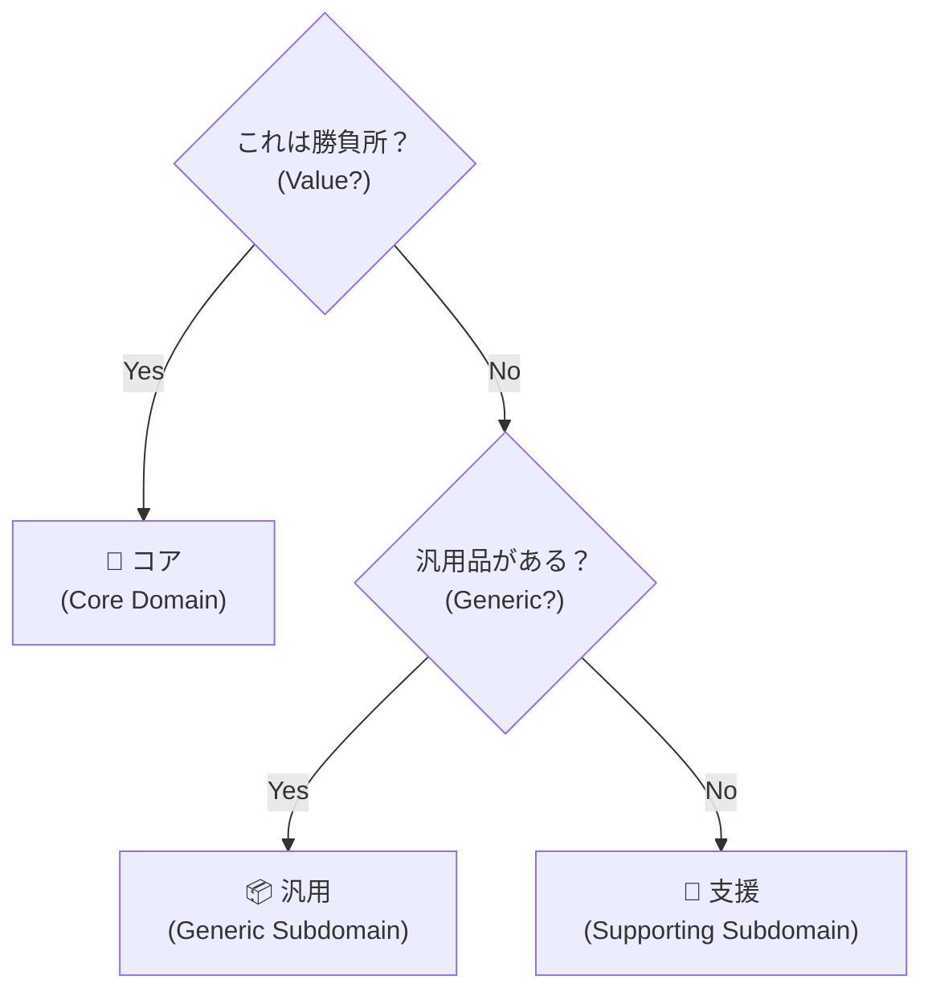

# 第26章：サブドメインの分類 🎯


### コア（勝負所）・支援（補助）・汎用（外部任せ）を分けるコツ✨

---

## 0. はじめに：なんで「分類」なんてするの？🤔💭

1人開発って、時間も体力も有限だよね…！🥹⏳
だからこそ **「どこに全力を出すか」** を先に決めないと、全部が中途半端になって詰みます💥

サブドメイン分類は、ざっくり言うとこう👇

* **コア（勝負所）**：あなたのアプリの“強み”そのもの💎（ここが売り！）
* **支援（補助）**：必要だけど“売り”ではない🧰（運用に必要）
* **汎用（外部任せ）**：世の中に良いのがある📦（買う・使う・任せる）

AI時代は特に、ここが超大事！🤖✨
AIはコードを量産できるけど、**「何に力を入れるべきか」** を間違えると、量産した分だけ遠回りになります🌀

---

## 1. 今日のゴール🎓✨

この章が終わったら、あなたはこうなります👇

✅ 機能や業務を「3種類」に分類できる
✅ **“勝負所”** に時間を集中できる
✅ 「外部に任せてOKな場所」を自信を持って切り捨てられる✂️
✅ AIに頼むときの指示がめちゃ短くなる📉✨

---

## 2. サブドメインって何？🌍

アプリの中の「仕事のまとまり」だと思ってOKです🙆‍♀️

たとえば「予約システム」なら、仕事はいろいろあるよね👇

* 予約を受け付ける
* 空き枠を管理する
* 決済する
* メール通知する
* 管理画面で見られるようにする

この“仕事のまとまり”を、**重要度と個性**で3つに分けます✨

---

## 3. 3分類の見分け方👀✨（一番大事！）

### 3.1 コア（勝負所）💎🔥

**「ここが他と違う！」** が詰まってる場所。

判断基準はこれ👇

* それがあるからユーザーが選ぶ？😍
* 競合と差が出る？⚔️
* ここが雑だと価値が落ちる？📉
* ここに“あなたの工夫”が入る？🧠✨

例：

* 予約の「最適な割り当て」ロジック
* ゲームの「戦闘計算・バランス」
* 会計の「独自の請求ルール」

---

### 3.2 支援（補助）🧰🌿

必要だけど、勝負所ではない場所。

判断基準👇

* ないと困るけど、別に差別化にならない😅
* “普通にちゃんとしてればOK”👍
* 一度作れば安定して動く🚃

例：

* 管理画面のCRUD（登録・更新・削除）
* ログ出力
* 権限管理（シンプルな範囲）
* バッチ処理（定期実行）

---

### 3.3 汎用（外部任せ）📦🤝

世の中に「強い既製品」があるところ。

判断基準👇

* 自作しても価値が増えない🙅‍♀️
* 既製品の方が安全・早い・強い🛡️⚡
* 法務/セキュリティが絡む（特に危険）🚨

例：

* 決済（Stripeなど）💳
* 認証（Azure AD B2C / Auth0 / 外部ID連携）🔐
* メール送信（SendGrid等）📧
* 地図（Google Maps等）🗺️



---

## 4. 1人開発での超実用ルール✋🙂

ここ、めっちゃ現実的にいこうね！

### ルールA：迷ったら「支援」に落とす🧰

コアって、増やすほど重くなるの…🥲
「コアかも？」程度なら支援でOK。
**本当に強みだと確信できたらコアに昇格**で大丈夫✨

### ルールB：汎用は“勝たない”📦

決済や認証を自作して勝つのはほぼ無理ゲーです🎮💥
勝負しないで、**皮をかぶせて使う**（次章のACLにもつながるよ！）🐟✨

### ルールC：コアは「説明できる」必要がある🗣️

「うちの価値はここです！」って
1〜2文で言えないなら、たぶんコアじゃないです😇

---

## 5. 具体例でやってみよう📚✨（予約アプリ編）

「美容室の予約アプリ」を想像してね💇‍♀️📅

### 機能一覧（例）

* 予約枠管理
* 指名（スタッフ）予約
* 事前決済
* 予約リマインド通知
* 管理者の売上集計

### 分類するとこうなりやすい👇

* **コア💎**：指名と空き枠の調整ロジック（ここが使いやすさに直結！）
* **支援🧰**：管理画面、売上集計、リマインド通知
* **汎用📦**：決済、メール送信、ログ基盤

ポイントはこれ！✨
「決済ができる」だけで差別化になりにくいよね。
でも「指名がしやすい・空き枠が見つかる」は体験の価値になりやすい😍

---

## 6. AIに分類を手伝わせるプロンプト🪄🤖

Copilot Chat や ChatGPT に、そのまま投げてOKな形にするね！

```text
あなたはプロダクトマネージャー兼ドメインエキスパートです。
以下のアプリの機能一覧を「コア」「支援」「汎用」に分類してください。

【アプリ概要】
- 対象ユーザー：
- ユーザーが達成したいこと：
- 競合や代替手段：
- このアプリの強み（仮）：

【機能一覧】
1.
2.
3.
...

【出力形式】
- コア：
- 支援：
- 汎用：
そして各分類の理由を1行ずつ添えてください。
最後に「迷う項目」と「質問すべきこと」も出してください。
```

さらに強くしたい場合👇（コアの見極めが鋭くなる⚔️✨）

```text
追加条件：
「コア」は最大2つまでにしてください。
それ以外は支援か汎用に必ず振り分けてください。
```

---

## 7. ミニ演習✍️😊：あなたのアプリで分類してみよう

### ステップ1：機能を10個書く📝

“画面”じゃなくて“仕事”で書くのがコツだよ✨
（例：ユーザー登録、通知、検索、決済、レコメンド…）

### ステップ2：3分類してみる🎯

* コアは **1〜2個まで** を目標に！💎
* 迷うのは普通！迷ったら支援でOK🧰

### ステップ3：AIに突っ込ませる👿🤖

```text
この分類に反論してください。
「それはコアではない」と言えるものがあれば理由も添えてください。
代わりにコアにすべき候補があれば提案してください。
```

---

## 8. ありがちなミス集⚠️😵‍💫（先に回避！）

### ミス1：全部コアにする💎💎💎💎

→ コアは重い！テストも設計も必要！1人だと崩壊しがち🥲

### ミス2：汎用を自作して沼る🕳️

→ 決済・認証・メールは、外のプロが何万人分の地雷を踏んでくれてます🙏✨
そこは借りよう！

### ミス3：コアが「説明できない」🤔

→ “なんか重要そう” はコアじゃないことが多いよ😇
**「なぜ勝てるの？」** を言語化できたらコア！

---

## 9. まとめ🍀✨

* サブドメイン分類は「力の入れどころ」を決める作業🎯
* **コア💎**＝差別化、価値の中心（少なく！）
* **支援🧰**＝必要な裏方（普通に堅実に）
* **汎用📦**＝外部任せ（勝負しない）

---

## 次章へのつながり➡️（第27章：腐敗防止層 ACL）🐟🛡️

「汎用は外部任せでいい」と言ったけど、
**外部の都合がそのまま侵入するとアプリが壊れる**ことがあるのね🥲

そこで次は、外部サービスに“薄い皮”をかぶせて守る
**ACL（腐敗防止層）** に進みます✨🛡️

---


