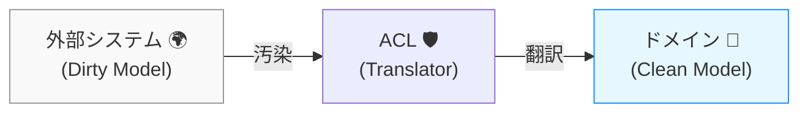

# 第27章：腐敗防止層 (ACL) 〜外の世界のクセから、ドメインを守るバリア🛡️✨


外部API・外部ライブラリ・他サービスって便利なんだけど、**そのままドメインに混ぜると“汚染”**します😱
この章は、その汚染を防ぐための超大事テクニック **ACL（Anti-Corruption Layer）** の話だよ〜！🥳💕

---

### この章でできるようになること✅

* 外部API/ライブラリの仕様に、ドメインが引っ張られないようにできる🧼✨
* 「変換（翻訳）」を1か所にまとめて、将来の変更をラクにできる🔧
* AIにコード生成させても、境界線が崩れにくい設計にできる🤖🧠

---

## 1. まずイメージ🍰：外部の“クセ”が侵入してくる


たとえば決済サービスがこう言ってくるとするね👇

* `amount` は **int（円じゃなくて“最小通貨単位”）**
* `status` は `"succeeded"`, `"requires_payment_method"` とか英語固定
* エラーは `code` が `"card_declined"` とか謎の文字列

これをドメイン側でそのまま扱い始めると…

* ドメインの中に `"succeeded"` が散らばる😵‍💫
* 金額が「円なの？最小単位なの？」って混乱する😵
* 外部仕様変更でドメインが壊れる💥

そこで登場するのが **ACL**！🛡️✨

---

## 2. ACL（腐敗防止層）ってなに？🧃


ひとことで言うと…

**「外部の言葉」⇔「自分のドメインの言葉」を翻訳する“通訳レイヤー”** だよ📘💬

* 外部：英語のステータス、謎コード、独自の型、癖のあるデータ
* ドメイン：あなたが決めた用語・型・ルール（ユビキタス言語）✨

ACLが間に入って、**外部のクセをドメインに持ち込ませない**のが目的！💪😊



---

## 3. “腐敗”って何が起きるの？😇（よくある事故）


### 事故①：ドメインが外部SDKに依存する📦💔

* ドメイン層で外部SDKの型を使い始める
* 結果：SDK更新・変更でドメインが巻き込まれる

### 事故②：外部の用語がドメインの言葉になる🌀

* `status = "succeeded"` みたいな文字列がドメイン中に拡散
* 結果：仕様変更や別サービス切替で地獄🥲

### 事故③：外部都合の“例外”がビジネスルールを破壊する⚡

* 外部が投げる例外がそのまま上に伝播
* 結果：アプリの都合と業務の都合がぐちゃぐちゃ🤯

---

## 4. ACLを置く場所の感覚📍（1人開発で迷わない）


だいたいこの考えでOK👌✨

* **ドメイン層**：純粋なビジネスルール（外部を知らない）🧠
* **アプリケーション層**：ユースケース（手順）📋
* **インフラ層**：外部API/DB/SDKと会話する場所📡
* ✅ **ACLは“外部と会話する側”に置く**（＝インフラ寄り）

ポイントはこれ👇
**「ドメインから見たら、外部は“知らない世界”」**にすること🌍🚫

---

## 5. ミニ例：決済APIをACLで包む💳🛡️

ここでは「決済サービス」を例に、**ドメインに優しい形**へ翻訳するよ🍀

### 5.1 ドメイン側：欲しい“言葉”を先に決める🧠✨

* 金額は `Money`
* 結果は `PaymentResult`（成功/失敗をドメイン語で）
* 外部の `"card_declined"` はドメインの `PaymentError` に変換

```csharp
// Domain

public readonly record struct Money(decimal Amount, string Currency)
{
    public static Money Jpy(decimal amount) => new(amount, "JPY");
}

public enum PaymentError
{
    None,
    Declined,
    NetworkFailure,
    Unknown
}

public readonly record struct PaymentResult(
    bool IsSuccess,
    string? PaymentId,
    PaymentError Error
)
{
    public static PaymentResult Success(string paymentId)
        => new(true, paymentId, PaymentError.None);

    public static PaymentResult Fail(PaymentError error)
        => new(false, null, error);
}

// 外部を知らない「入口」だけ定義する
public interface IPaymentGateway
{
    Task<PaymentResult> ChargeAsync(Money amount, CancellationToken ct);
}
```

ここが超大事💡
**ドメインは“外部の型”を1ミリも知らない** ✅🥰

---

### 5.2 インフラ側：外部SDKを使って翻訳する（ACL本体）🛠️


外部SDK（例：Stripeっぽいもの）を使うのはここだけ！

```csharp
// Infrastructure (ACL)

// 外部SDKの戻り値イメージ（例）
public sealed class ExternalChargeResponse
{
    public required string Status { get; init; }           // "succeeded" 等
    public string? Id { get; init; }                       // 決済ID
    public string? ErrorCode { get; init; }                // "card_declined" 等
}

public interface IExternalPaymentClient
{
    Task<ExternalChargeResponse> CreateChargeAsync(int amountMinorUnit, string currency, CancellationToken ct);
}

// ACL：外部のクセを吸収して、ドメイン語に翻訳する
public sealed class PaymentGatewayAcl(IExternalPaymentClient client) : IPaymentGateway
{
    public async Task<PaymentResult> ChargeAsync(Money amount, CancellationToken ct)
    {
        try
        {
            // 外部が「最小単位(int)」しか受けないなら、ここで変換！
            var minor = ToMinorUnit(amount);

            var res = await client.CreateChargeAsync(minor, amount.Currency, ct);

            // 外部ステータスをドメイン語へ翻訳！
            if (res.Status == "succeeded" && res.Id is not null)
                return PaymentResult.Success(res.Id);

            return PaymentResult.Fail(MapError(res.ErrorCode));
        }
        catch (OperationCanceledException)
        {
            throw; // キャンセルは素直に上へ（これは“外部都合”ではなくアプリ都合）
        }
        catch
        {
            // 外部例外はここで握りつぶして、ドメイン語へ
            return PaymentResult.Fail(PaymentError.NetworkFailure);
        }
    }

    private static int ToMinorUnit(Money money)
    {
        // 例：JPYは小数なし。通貨別ルールがあるならここに閉じ込める
        return checked((int)money.Amount);
    }

    private static PaymentError MapError(string? externalErrorCode)
        => externalErrorCode switch
        {
            "card_declined" => PaymentError.Declined,
            null => PaymentError.Unknown,
            _ => PaymentError.Unknown
        };
}
```

この形にしておくと最高にうれしい🎉

* 外部が変わっても、直す場所は **ACLだけ** 🔧✨
* ドメインはずっとキレイなまま🧼💖
* AIが実装を増やしても、混ざりにくい🤖🛡️

---

## 6. 1人開発向け：ACLの“ちょうどいい粒度”📏😊

ACLを作りすぎると大変なので、目安はこれ👇

* ✅ **外部が変わりそう**（API/SDKの更新頻度高い）
* ✅ **外部の言葉がキモい**（謎コード、文字列ステータス地獄）
* ✅ **ドメインの言葉とズレる**（「ユーザー」って言ってるけど意味違う等）

このどれかなら、ACLを挟む価値めちゃ高いよ💎✨

---

## 7. AI活用：ACLを崩さないプロンプト例🤖📝


AIにお願いするときは、**境界線を明確に言う**のがコツ！🪄

### プロンプト例①（設計）

* 「外部決済APIのレスポンスを、ドメインの `PaymentResult` に変換するACL設計を提案して。
  ドメイン層は外部型を参照しない。変換はACLに閉じ込める。」

### プロンプト例②（コード生成）

* 「`IPaymentGateway` を実装する `PaymentGatewayAcl` を作って。
  外部SDK例外は握りつぶして `PaymentError.NetworkFailure` にする。
  外部の status 文字列はドメインの結果に変換する。」

### プロンプト例③（レビュー）

* 「この実装で、ドメイン層が外部SDKに依存している箇所がないかチェックして。
  もしあれば、ACLに押し戻して修正案を出して。」

---

## 8. よくある落とし穴3つ⚠️😵

1. **ACLが薄すぎて、ただの“丸投げ”になる**
   　→ 変換がないならACLの意味が薄いよ〜🥲（翻訳が仕事！）

2. **ドメイン層が外部の enum / status を知ってしまう**
   　→ その瞬間、汚染スタート😇

3. **例外がそのまま上へ漏れる**
   　→ “外部の事情”を“業務の事情”にしないでね🙏💦

---

## 9. 【ミニ演習】あなたのACLを作ろう🎓✨

次のどっちか好きな方でOK！💕

### 演習A：配送会社API📦

* 外部：`"DELIVERED"`, `"IN_TRANSIT"`, `"LOST"`
* ドメイン：`配送完了`, `配送中`, `配送事故` みたいにしたい
  ✅ どこで翻訳する？（答え：ACL！）

### 演習B：認証プロバイダ🔐

* 外部：JWTのクレーム、外部のユーザーID
* ドメイン：`UserId` と `ログイン状態` をキレイに持ちたい
  ✅ 外部IDをそのまま `string` で扱わない工夫を考えてみてね🧠✨

---

## まとめ🎀

* ACLは **外部のクセを吸収する通訳レイヤー** 🛡️💬
* ドメインをキレイに保つと、変更にもAIにも強くなる🤖✨
* 「外部の言葉」をドメインに持ち込まない！これだけ覚えれば勝ち🏆😊

ちなみに、2025年の最新環境だと **.NET 10 / C# 14** が前提にできるよ（C# 14は .NET 10 以降でサポート）。([Microsoft Learn][1])

[1]: https://learn.microsoft.com/en-us/dotnet/core/whats-new/dotnet-10/overview?utm_source=chatgpt.com "What's new in .NET 10"
