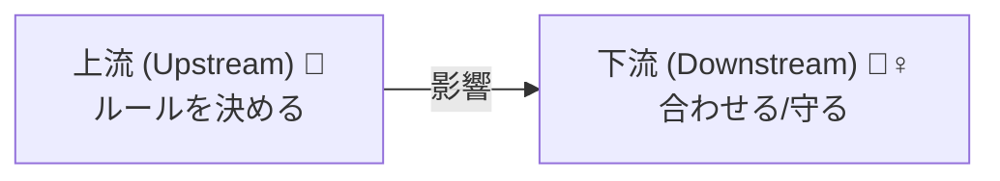
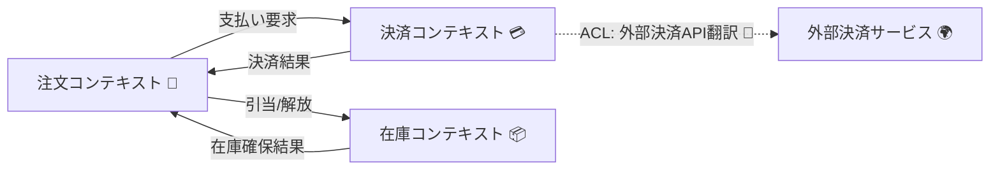

# 第28章：コンテキストマップ 〜1人で作るアプリの“全体図”を描こう🗺️✨


DDDの戦略パートでいちばん気持ちよく効くのが、この **コンテキストマップ** です😊
これがあると、1人開発でも **「どこを直せばいいんだっけ？」が激減** します👏✨
さらにAIにお願いするときも、指示がブレにくくなります🤖🧠

---

### 1. コンテキストマップってなに？🤔


一言でいうと…

**「境界づけられたコンテキスト（小さな独立国🏰）」同士が、どうつながっているかの地図** です🗺️✨

* どのコンテキストが、どのコンテキストに情報を渡す？📦
* どっちが主導権（上流/下流）を持つ？👑
* 直結する？変換する？別々で生きる？🔌🧼

…みたいなことを、**“線で”見える化** します👀✨

---

### 2. なぜ必要？（1人開発ほど効く💥）🧑‍💻


#### ✅ 未来の自分が迷子にならない🧭

「支払いの仕様って、会員の文脈？注文の文脈？」みたいな迷いが減ります😌

#### ✅ 変更が来たとき、影響範囲が読める🔍

境界を超えて波及する変更は危険⚠️
逆に「ここだけ直せばOK」が増えます✨

#### ✅ AIが“勝手につなげる”事故を防げる🛑🤖

AIは便利だけど、全体の境界を無視して混ぜがちです😵
コンテキストマップがあると「混ぜないで」って言いやすい！

---

### 3. コンテキストマップで見るべき3つ🧩

#### (1) コンテキスト一覧（国の名前）🏷️

例：

* 注文（Ordering）🛒
* 決済（Payment）💳
* 在庫（Inventory）📦
* 配送（Shipping）🚚

#### (2) 関係の向き（上流/下流）➡️⬅️

* **上流（Upstream）**：ルールを持ってる側（仕様の主）👑
* **下流（Downstream）**：それに合わせる側（利用者）🧎‍♀️

#### (3) つなぎ方のパターン（どう接続する？）🔌


ここがコンテキストマップの“おいしいところ”です😋✨
代表パターンだけ、超やさしく紹介します👇



---

### 4. 代表的な関係パターン（まずはこれだけでOK）🌸


#### A. 腐敗防止層（ACL）🧼🛡️

外部や別コンテキストの“クセ”を、そのまま自分のドメインに入れないための薄い変換層です✨
「向こうの都合」を「こっちの言葉」に翻訳するイメージ📘➡️📗

* 外部決済APIのレスポンスを、そのままドメインに直入れしない💳❌
* DTO/変換クラスで“翻訳”してから使う🧼✅

#### B. Conformist（従属）🙇‍♀️

「相手が強いから、こっちが合わせるしかない」パターン😇
外部SaaSや決済サービスに合わせる時によくあります。

#### C. Customer/Supplier（顧客/供給者）🧑‍🤝‍🧑

下流が「こうしてほしい！」と言えて、上流が「じゃあ提供するね」と調整できる関係🤝
1人開発だと “あなたの頭の中で” 交渉が起きます😂

#### D. Separate Ways（別々の道）🚶‍♀️🚶


**無理に連携しない** という強い選択💪
「CSVで渡すだけ」「手動でOK」も立派な設計です✨（特に1人開発は正義👑）

---

### 5. ミニ例：ネットショップのコンテキストマップ🛍️🗺️


「注文」と「決済」と「在庫」があるとして…

* 注文：ユーザーが買う・キャンセルするなどの中心🛒
* 決済：支払いの世界💳（外部サービス連携が多い）
* 在庫：在庫数・引当の世界📦（別のルールがある）

イメージ図（Mermaid）👇
（あとでAIにこのまま貼って生成してもらうと楽です😊）



ここでのポイント💡

* **注文が中心だけど、決済・在庫は別の“国”**
* 決済は外部とつながるので **ACLを置きたくなる** 🧼
* 連携の矢印を描くだけで、「どこで翻訳が必要？」が見えてきます👀✨

---

### 6. 1人開発での“ちょうどいい”粒度📏✨

最初は、コンテキストを増やしすぎると疲れます😵‍💫
なのでおすすめはこれ👇

* **最初は 3〜5個くらい** のコンテキストでOK🙆‍♀️
* 「言葉がぶつかる場所」から分ける（第29章につながるよ）💥🗣️
* 迷ったら「Separate Ways」で逃げてもOK🚶‍♀️✨

---

### 7. AIにコンテキストマップを出させる“勝ちテンプレ”🤖🏆

AIにお願いするときは、**材料を渡すほど精度が上がります**✨
以下をコピって使ってOKです😊

#### ✅ テンプレ1：まず地図を作る（全体図）

```text
あなたはDDDの設計者です。
次のアプリの要件から、境界づけられたコンテキスト候補を3〜6個に整理し、
コンテキストマップ（関係の向き、連携方式の候補：ACL/Conformist/Customer-Supplier/Separate Ways）を提案してください。

アプリ概要：
- （ここにあなたのアプリ概要）

主要ユースケース：
- （例：ユーザー登録、注文、支払い、キャンセル…）

難しいルール：
- （例：キャンセル料、割引、在庫引当、返金ルール…）

出力形式：
1) コンテキスト一覧（役割つき）
2) コンテキスト間の関係（上流/下流）
3) Mermaidの図
4) 境界で注意すべき“言葉の衝突”候補
```

#### ✅ テンプレ2：境界が正しいか“意地悪チェック”する😈🔍

```text
以下のコンテキスト分割とマップ案の「危険な点」を指摘してください。
特に、境界をまたぐトランザクション、用語の衝突、責務の混ざりを探してください。
改善案もください。

（ここにAIが出した案を貼る）
```

---

### 8. C#実装に落とすとどうなる？（超ざっくりでOK）🧱

コンテキストマップは「図」だけじゃなく、実装の分割にもつながります✨

1人開発の現実ラインだと、こんな感じがやりやすいです👇

* まずは **1つのソリューション** の中で、コンテキストごとにフォルダ/プロジェクトを分ける📁
* 連携部分に **ACL用の変換クラス** を置く🧼
* “注文のドメイン”に“決済の型”を入れない（混ぜない！）🙅‍♀️

（ここ、次の章や後半のアーキテクチャ章でどんどん気持ちよくなります😆✨）

---

### 9. よくある失敗あるある😵（先に踏み抜きを防ぐ）

* **全部1コンテキスト**：最初は楽だけど、後で地獄🔥
* **全部分ける**：最初からマイクロサービスごっこで疲れる🥺
* **矢印がない**：地図なのに道が描いてない🗺️❓
* **外部APIの型がドメインに侵入**：腐る🧟‍♀️（ACLで守ろう🧼）

---

## 【演習】あなたのアプリでコンテキストマップを作ろう✍️🗺️✨

### Step 1️⃣：題材を決める

あなたが作りたいアプリを1つ選ぶ（小さくてOK）😊

### Step 2️⃣：AIにテンプレ1で地図を描かせる🤖

出てきたMermaid図をそのまま貼って整える✨

### Step 3️⃣：チェックリスト✅

* コンテキストは3〜6個くらい？
* それぞれ「役割」が言える？（一文で）🗣️
* 矢印の向きに納得できる？➡️
* 外部連携にACLが必要そう？🧼
* 「Separate Ways」で済むところ、無理に繋げてない？🚶‍♀️

### Step 4️⃣：最後に一言メモ📝

「この境界は、どんな変更から自分を守る？」
これを書けたら勝ちです🏆✨

---

次の第29章は、この地図で必ず出てくる **“言葉の衝突”** を解決していきます🗣️💥
「同じ“ユーザー”なのに意味が違う問題」みたいなやつです😆
