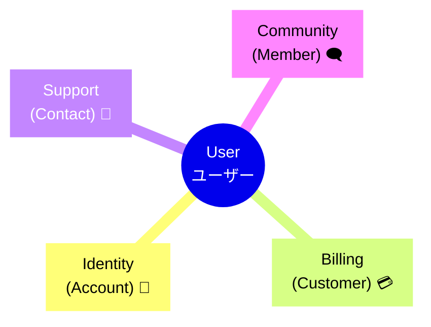

# 第29章：「言葉」の衝突を解決する✨


〜同じ「ユーザー」でも、場面が違うと意味が違う問題〜🙃💥

## この章でできるようになること ✅😊

* 「同じ単語なのに意味が違う」モヤモヤを、**キレイに言語化**できるようになる✨
* コンテキスト（小さな独立国🏰）ごとに、**単語の定義を分ける**やり方がわかる🧠
* AI（Copilot / Codex系）に仕様を聞くとき、**ブレない単語帳**を作れる📒🤖

---

## あるある： “ユーザー” が3人いる世界 🌍😇😇😇


たとえば、あなたが「サブスク動画アプリ」を作ってるとするね📺✨
すると仕様書に「ユーザー」って単語がいっぱい出てくるんだけど……

* ログインの「ユーザー」＝ **アカウントを持ってる人** 🔐
* 請求の「ユーザー」＝ **お金を払う契約者** 💳
* 問い合わせの「ユーザー」＝ **連絡してきた人（代理人かも）** 📩

全部「ユーザー」って書いてあるのに、**同じ人とは限らない**😵‍💫
ここで放置するとどうなるかというと……

* コードの `User` が何者かわからなくなる😇
* 仕様変更で「え？このUserどのUser？」地獄が始まる🔥
* AIに「User作って」って頼むと、**全部混ぜた謎クラス**が生まれる👶💥

---

## まず結論：言葉の衝突は “悪” じゃない 🙆‍♀️✨


言葉が衝突するのは、あなたが悪いんじゃなくて、**現実の業務が複雑**だからだよ〜😊
DDDの発想はこう👇

> 「単語はコンテキスト（国🏰）の中で意味が決まる」
> 国が違えば、同じ単語でも意味が違ってOK👍

だからやることはシンプル！

### ✅ 解決策の基本セット（超重要）🔥

1. **どのコンテキストの話？** を最初に決める🏷️
2. コンテキストごとに **単語を定義** する📒
3. 衝突する単語は、**名前を分ける / 翻訳する / 変換点を作る**🔁

---

## 例：4つの国（コンテキスト）に分けてみよう🏰🏰🏰🏰


サブスク動画アプリを、ざっくり4国に分けるとするね😊

1. **Identity（認証）**：ログイン・アカウント・パスワード🔐
2. **Billing（請求）**：支払い・契約・請求先💳
3. **Support（サポート）**：問い合わせ・チケット・対応履歴📩
4. **Community（コミュニティ）**：投稿・コメント・フォロー🗨️



ここで「ユーザー」を国ごとに“翻訳”すると…✨

| 国（コンテキスト） | 「ユーザー」の意味 | いい名前例                     |
| --------- | --------- | ------------------------- |
| Identity  | ログイン主体    | `Account` / `AuthUser`    |
| Billing   | 支払い主体     | `Customer` / `Subscriber` |
| Support   | 問い合わせ主体   | `Contact` / `Requester`   |
| Community | 投稿主体      | `Member` / `Profile`      |

ポイントはこれ👇
**“同じ英単語にしない”** だけで、未来の自分が助かる率が爆上がりするよ🥹✨

---

## 衝突を解決する「3つの技」🛠️✨

### 技①：同じ単語を “国名つき” にする 🏷️

「User」じゃなくて、最初からこう考える：

* `Identity.User`（認証国のUser）
* `Billing.User`（請求国のUser）
* `Support.User`（サポート国のUser）

ただ、実務だと **`User` を残すより、名前を変える方が強い**よ😊
（読む人が毎回 “国名” を脳内補完しなくて済むから🧠💤）

---

### 技②：ID型を分ける（これめっちゃ効く）🧩✨


同じ「ユーザーID」でも国が違えば別物、って割り切っちゃう作戦👍

```csharp
namespace Identity;

public readonly record struct AccountId(Guid Value);

public sealed class Account(AccountId id, string email)
{
    public AccountId Id { get; } = id;
    public string Email { get; } = email;
}
```

```csharp
namespace Billing;

public readonly record struct CustomerId(Guid Value);

public sealed class Customer(CustomerId id)
{
    public CustomerId Id { get; } = id;
}
```

こうしておくと、間違って混ぜたときに **コンパイルで止まる**🥹🛑
（未来の自分のミスを、型が守ってくれる✨）

---

### 技③：国をまたぐところに “翻訳所” を置く 🔁🏢


国をまたぐときは、直接つなげずに「翻訳」するのが安全👍
これがDDDでいう **腐敗防止層（ACL）** 的な発想にもつながるよ✨

例：Identityの `AccountId` → Billingの `CustomerId` に変換する場所を作る

```csharp
public interface IAccountToCustomerMap
{
    Billing.CustomerId GetCustomerId(Identity.AccountId accountId);
}
```

ここに “変換の事情” を閉じ込めると、変更に強くなる💪✨
「外の都合が変わっても、この翻訳所だけ直せばOK」にできるからね😊

---

## AIに強い：単語帳（ユビキタス言語）を “国ごと” に作る📒🤖✨


AIに設計相談するとき、**単語が混ざると一瞬で事故る**💥
なので、AIにはこうやって渡すのがおすすめ👇

### プロンプト例①：コンテキスト別の単語帳を作らせる📒

```text
あなたはDDDのドメインエキスパートです。
サブスク動画アプリを以下の4コンテキストに分けます：
Identity / Billing / Support / Community

「ユーザー」「契約」「問い合わせ」「投稿」など紛らわしい単語について、
各コンテキストでの意味・別名候補・禁止表現（混ざりやすい言い方）を
表形式で作ってください。
```

### プロンプト例②：衝突してる単語を検出させる🔎

```text
以下の仕様文を読んで、「同じ単語が別の意味で使われている可能性」を指摘して。
その単語は、どのコンテキストでどう命名すべきかも提案して。

（ここに仕様を貼る）
```

### プロンプト例③：AIに“混ぜるな危険”ルールを作らせる🧯

```text
このプロジェクトではコンテキストを混ぜたくありません。
混ぜやすい例（やってはいけない依存）と、代わりにどう繋ぐべきか（DTO/イベント/ACLなど）を
初心者にもわかるチェックリストにしてください。
```

こういう“国ごとの単語帳”があると、Copilotにもコメントで渡しやすいし、設計がブレにくいよ😊✨

---

## ミニ演習🎯：あなたのアプリの「危ない単語」5つ出そう😆📝

次のどれかでOK！自分の作りたいアプリでやってみてね✨

### 手順✅

1. 仕様（または頭の中の要件）から、紛らわしい単語を5つ抜く
   例：ユーザー、注文、権限、ステータス、公開、削除、アカウント、顧客…
2. それぞれについて

   * 「どの国の話？」
   * 「そこでの意味は？」
   * 「別名にするとしたら？」
     を書く📒
3. AIに投げて、命名案を増やす🤖✨
4. 最終的に **“採用する名前” を決める**（ここが一番大事！）✅

### 完成イメージ（超ミニ単語帳）📒

* Identity：User → `Account`（ログイン主体）
* Billing：User → `Customer`（支払い主体）
* Support：User → `Requester`（問い合わせ主体）

これだけでも、後々めちゃくちゃ効くよ🥹✨

---

## よくある失敗パターン集😇💥（先に潰そう）

* **全部 User のまま進める** → 1ヶ月後に爆発💣
* **共有の Domain プロジェクトに “共通User” を作る** → 国が滅びる🏰🔥
* **AIに「User作って」で任せる** → 混合キメラが誕生👶🧟
* **単語帳を作ったのに運用しない** → ただの飾り📒🫠

---

## まとめ✨🎉

* 言葉の衝突は自然現象🌪️（複雑さのサイン！）
* 解決のコツは **「国（コンテキスト）を決める → 国ごとに定義する → 国境で翻訳する」**🏰🔁
* AI時代は特に、**単語帳（ユビキタス言語）を国ごとに**作ると最強📒🤖✨

次の章（第30章）のイベントストーミングに進むと、
この「単語の国分け」がさらに気持ちよく整理できるようになるよ〜😊✨
