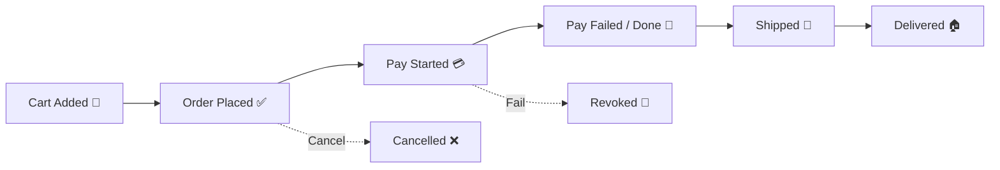

# 第30章：イベントストーミングを1人で🌩️ 付箋の代わりにAIで流れを可視化しよう🗺️✨


イベントストーミングは、**「この機能って、現実では何が起きてるの？」**を時系列で並べて、仕様をスッキリさせる方法だよ😊
1人開発だと「相談相手がいない…」ってなりがちだけど、ここでAIがめちゃくちゃ頼れる相棒になる🤝💕

---

## 1. イベントストーミングって何するの？👀


一言でいうと…

✅ **“起きた出来事（イベント）”を、時系列に並べるだけ** 📌
そして、だんだん次が見えてくる👇

* 誰が？🙋‍♀️
* 何をした？🖱️
* 何が起きた？💥
* その結果、状態はどうなった？📦
* 例外（キャンセル/失敗）は？😵‍💫
* ルール（制約）は？📏

ここで大事なのは、イベントは**過去形**で書くこと！
「注文する」じゃなくて **「注文された」** みたいにね🧠✨

---

## 2. 今回の題材：オンライン書店📚（注文〜発送まで）

想像しやすいからこれでいくね😊
やりたいことはざっくり：

* ユーザーが本をカートに入れて注文する
* 支払いする
* 発送する
* キャンセルもある

---

## 3. まずは“イベント”だけ並べよう🟧（超重要）


ここは最初、**イベントだけ**でOK！
AIにこう頼むとラクだよ😺✨

### AIへのお願いテンプレ（コピペOK）🧩

```text
あなたはオンライン書店の業務担当者です。
「注文〜発送」までの流れをイベントストーミングしたいです。

次の条件で、ドメインイベントを「時系列」で箇条書きしてください。
- イベントは必ず過去形（〜された / 〜完了した）で書く
- まずは成功ルート（ハッピーパス）だけ
- できるだけ業務っぽい言葉で（技術用語なし）
```

### 例：AIが出してくるイベント（こんな感じ）🟧

* カートに商品が追加された 🛒
* 注文が確定された ✅
* 支払いが開始された 💳
* 支払いが完了した 🎉
* 出荷指示が作成された 📦
* 商品が発送された 🚚
* 配送が完了した 🏠

これだけでもう、「アプリの流れ」が見えるよね！？😍

---

## 4. 次に“コマンド（やった操作）”を足そう🟦


イベントは「起きたこと」
コマンドは「起こす操作」だよ🖱️✨

AIにこう追加で頼む👇

```text
今のイベント一覧に対して、
それぞれのイベントを引き起こす「コマンド（ユーザーやシステムの操作）」を対応付けてください。

フォーマット：
- コマンド → イベント
```

### 例（コマンド→イベント）🟦

* 商品をカートに追加する → カートに商品が追加された
* 注文を確定する → 注文が確定された
* 支払いを実行する → 支払いが開始された / 支払いが完了した
* 出荷処理を行う → 出荷指示が作成された
* 発送処理を行う → 商品が発送された
* 配送完了を反映する → 配送が完了した

ここで気づけることがあるよ💡
「発送処理」って誰がやるの？店員？自動？倉庫システム？🤔
こういう疑問が出たら、イベントストーミング成功🎊

---

## 5. 例外ルート（失敗・キャンセル）を足す😵‍💫


現実のシステムは「うまくいく時だけ」じゃないよね💦
ここから一気に仕様が強くなる🔥

AIにはこう頼む👇

```text
さっきの「注文〜発送」に対して、
よくある例外（失敗・キャンセル・在庫なし・支払い失敗）を洗い出し、
追加のイベントを時系列で提案してください。
```

### 例：例外イベント😵‍💫

* 在庫不足が検知された
* 注文が却下された
* 支払いが失敗した
* 注文がキャンセルされた
* 返金が完了した

このへんが出てくると、一気に「業務っぽいアプリ」になってくるよ😆📈

---

## 6. “ルール（制約）”をメモする📏✨（ここがDDDの入り口！）


イベントを見てると、「これ守らないとダメ」ってルールが出てくるよね。

たとえば👇

* 支払いが完了していない注文は発送できない 🚫
* 注文確定後に在庫が足りない場合は注文を却下する（or 分割配送する）📦
* 発送後はキャンセルできない（返金ではなく返品）🔁

こういうのを、イベントの近くに **📌ルール** として置くのがコツ😊

AIに聞くならこう👇

```text
イベント一覧から「ビジネスルール（〜してはいけない / 〜の場合は〜する）」を抽出して、
ルールとして箇条書きにしてください。
```



---

## 7. 1人イベントストーミングの完成形（テキストでOK）🗺️✨


付箋ツールがなくても、最初はこれで十分だよ🙆‍♀️
（あとで図にしてもOK！）

```text
【オンライン書店：注文〜発送】

🟧イベント（時系列）
1) カートに商品が追加された
2) 注文が確定された
3) 支払いが開始された
4) 支払いが完了した
5) 出荷指示が作成された
6) 商品が発送された
7) 配送が完了した

🟦コマンド
- 商品をカートに追加する → 1
- 注文を確定する → 2
- 支払いを実行する → 3,4
- 出荷処理を行う → 5
- 発送処理を行う → 6
- 配送完了を反映する → 7

📏ルール
- 支払い完了前は発送できない
- 発送後はキャンセルできない（返品になる）
- 在庫不足なら注文は却下される可能性がある

❓質問（曖昧なところ）
- 出荷処理は人がやる？自動？
- 在庫不足時は「注文却下」？「入荷待ち」？
- 支払い失敗後は注文をどう扱う？
```

この **❓質問** が出た時点で、未来の自分がめちゃ助かるやつ！😭✨
「どこが未確定か」が残るから、あとで迷子になりにくいの🎯

---

## 8. ワーク✍️（10〜20分でOK）🌟

次のどれかで、同じ流れを作ってみてね😊💕

* 🎟️ イベント予約（予約→支払い→確定→キャンセル）
* 🏨 宿予約（予約→前払い→チェックイン→チェックアウト）
* 🍰 ケーキ注文（注文→受注→製造→受け渡し）

やり方は同じ👇

1. 🟧イベントだけ並べる
2. 🟦コマンドを紐づける
3. 😵‍💫例外を足す
4. 📏ルールを抜き出す
5. ❓質問を残す

---

## 9. ここまでできたら勝ち🏆✨（次につながる！）

イベントストーミングができると、次がめっちゃラクになるよ😆

* 「この変更、どのイベントに影響する？」がすぐ分かる🔍
* 言葉が揃う（ユビキタス言語が育つ）📚
* 仕様の穴が早めに見つかる🕳️
* AIに指示するときの“設計の芯”になる🧠✨

---

次の章（第31章）では、このイベントの流れを使って
**「変更が1つのコンテキストで閉じる境界線」**の引き方に入っていくよ〜😊🧱✨
