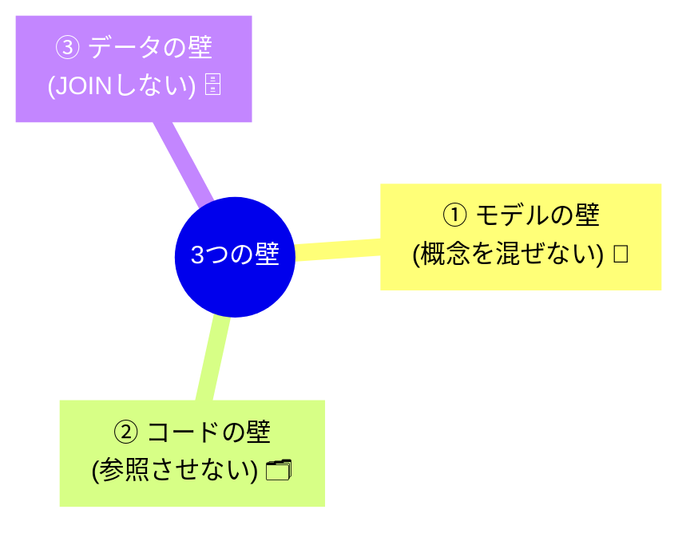

# 第31章：仕様変更に強い境界線 🧱✨


## 〜「1つの変更が1つのコンテキストで閉じる」ようにするコツ〜🧠💡

想像してみてね👇
ある日、こんな変更が来ます。

> 「送料のルール、来月から変えるね！📦」
> 「ポイント付与、学割だけ2倍にして！🎓」
> 「返金の条件、細かくしたい！💸」

このとき理想は、**変更する場所が“だいたい1か所”に収まる**ことです😊
それがこの章のテーマ **「仕様変更に強い境界線」** だよ〜！🧱✨

---

## 1. 「境界線が強い」と何が嬉しいの？🥰


境界線が強い = **変更の影響が広がらない** ということ。

* ✅ 直す場所がすぐ見つかる 🔍
* ✅ AIに頼んでも「ここだけ直して！」が通る 🤖✨
* ✅ バグが別エリアに飛び火しにくい 🔥➡️🧯
* ✅ 未来の自分が泣かない 😭➡️😊

逆に境界線が弱いと、こうなる…👇

* ❌ 送料を変えたら決済が壊れた
* ❌ “ユーザー”の定義が機能ごとに違って大混乱
* ❌ 変更のたびに全体のコードを読まされる

…やだよね😇💦

---

## 2. たとえ話：アプリの中の「小さな国」🌍🏰


DDDの **境界づけられたコンテキスト** は、アプリの中にある **小さな独立国** みたいなもの🏰

* 🍔「注文の国」：注文ルールが中心
* 💳「決済の国」：支払い・返金ルールが中心
* 🎁「ポイントの国」：付与・失効・ランクが中心

**国が違えば、法律（ルール）も言葉も違う**んだよね📘✨
だから「同じ言葉が別の意味を持つ」ことが普通に起きるの。

例👇

* 注文の国の「ユーザー」= 注文した人
* ポイントの国の「ユーザー」= 会員登録した人（退会・復活もある）

同じ `User` を共有すると、だいたい事故ります🚑💥

---

## 3. 「1つの変更が1つの国で閉じる」ための3つの壁 🧱🧱🧱


境界線を強くするコツは、ざっくりこの **3つの壁** を意識することだよ😊

### 壁①：モデルの壁（概念を混ぜない）🧠🚧

* 「注文のCustomer」と「ポイントのMember」は別物、と割り切る✨
* 片方の都合で、もう片方のモデルが歪まないようにする

### 壁②：コードの壁（参照を簡単に跨がせない）🗂️🚧

* プロジェクト（またはフォルダ）を分ける
* 参照方向を固定する（片方向）➡️

### 壁③：データの壁（DBを“共有しすぎない”）🗄️🚧

* 同じDBでも「テーブルを分ける」「スキーマを分ける」などで分離する発想
* 他コンテキストのテーブルを当然のようにJOINしない🙅‍♀️💦



---

## 4. いちばん効くチェック：変更が来たら「どこが変わる？」📝🔍


境界線が強いかどうかは、これでだいたい分かるよ👇

### ✅ 変更テスト（超大事）✨

**「この仕様変更、直すのはどのコンテキスト？」**

* 1つに決まる 👉 境界線いい感じ🥳
* 2つ以上が自然 👉 境界線が漏れてるかも😵‍💫

例：送料ルール変更📦

* 注文の国で完結する（理想）
* 決済の国のコードもいじる必要がある…（境界線が弱いサイン）

---

## 5. ありがちな「境界線が崩れる原因」あるある😭🌀


### あるある①：共有 `Common` プロジェクトにドメインモデルを入れる📦😇

最初は便利！…でも後からこうなる👇
「全部ここに入れとけばいいじゃん」➡️ 何でも混ざる地獄へ☠️

✅ 対策：
共有するなら **“契約（Contract）”だけ** にする（後で説明するよ💡）

---

### あるある②：他コンテキストのEntityをそのまま参照する🔗💥

「ポイントのMemberを注文側でも使っちゃお〜」
➡️ 仕様変更で両方が同時に壊れるやつ😇

✅ 対策：
他国の人を直接連れてこないで、**IDやイベント**でやり取りする✨

---

### あるある③：DBで全部つながってる（JOINで境界線を破壊）🧨🗄️

SQLが強すぎて、境界線が意味なくなるパターン🥲

✅ 対策：
「必要なデータだけ渡す」方向へ（イベント/DTO/読み取り専用モデル）📨

---

## 6. “契約（Contract）”でつなぐと境界線が強くなる📜🤝


コンテキスト同士が会話するときは、
**「共通モデル」じゃなくて「共通の伝言（契約）」** にするのが強いよ💪✨

たとえば「注文が確定したよ！」という事実だけ渡す。

```
namespace Cafeteria.Contracts;

// 「注文が確定した」という“伝言”だけ共有する
public sealed record OrderPlaced(
    Guid OrderId,
    Guid CustomerId,
    DateTimeOffset PlacedAt,
    IReadOnlyList<OrderLine> Lines);

public sealed record OrderLine(Guid MenuItemId, int Quantity);
```

ポイントの国は、注文の内部事情（集約がどうとか）を知らなくていい😊
「OrderPlacedが来た」だけで動ける✨

これが **“1つの変更が1つの国で閉じる”** に効くんだ〜！🧱💖

> ※C# 14 は .NET 10 SDK で試せて、Visual Studio 2026 系で利用できるよ（最新版の流れとして覚えておけばOK）😊 ([Microsoft Learn][1])

---

## 7. AIを使うと境界線チェックが爆速になる🤖⚡

境界線って、自分だけで考えると迷いがち🥺
なのでAIに **“意地悪なレビュアー”** をやらせよう😈✨

### 💬プロンプト例①：変更の閉じ方チェック

```
あなたはDDDの設計レビュー担当です。
要件変更：「学割ユーザーはポイント付与2倍」
この変更はどの境界づけられたコンテキストに閉じるべき？
修正ファイルが複数コンテキストにまたがるなら、境界線の漏れを疑って理由を説明して。
```

### 💬プロンプト例②：言葉の衝突チェック

```
「ユーザー」という言葉が、注文/ポイント/決済で意味が違う可能性を列挙して。
衝突が起きるなら、別モデルに分ける案を出して。
```

### 💬プロンプト例③：コンテキスト間の通信設計

```
注文コンテキストからポイントコンテキストへ渡すべき情報を、
「契約(Contract)」として設計して。イベント名、フィールド、注意点も。
```

AIが出した答えがブレてたら、そこが**境界線の弱点ポイント**かもだよ👀✨

---

## 8. ミニ演習：境界線を強くする“仕切り”を作ろう🧪🧱

### お題🎯

「注文」と「ポイント」を別コンテキストにしたい！

#### (1) “共有していいもの/ダメなもの”を仕分けしてみよう📦

* ✅ 共有していい：`OrderPlaced` みたいな契約イベント
* ❌ 共有しない：`Order` エンティティ、`PointRule` みたいな内部ルール

#### (2) 変更テストしてみよう📝

次の変更はどっちの国で閉じる？（直感でOK）✨

* 「ポイント失効の期限を90日→60日に」🎁
* 「注文のキャンセル条件を変更」🧾
* 「学割なら注文金額の端数切り上げ」🎓

#### (3) AIに答え合わせして、ズレたら“言葉”を直す🧠📘

ズレたところが、境界線を引き直すヒントだよ😊✨

---

## まとめ 🎀✨

* 境界線が強いと、**変更が“1つの国で閉じる”** 🧱
* 強くするコツは **モデル・コード・データの3つの壁** 🧱🧱🧱
* 共有するのは **共通モデルじゃなくて契約（Contract）** 📜
* AIに「変更がどこに閉じるか」をレビューさせると爆速🤖⚡

---

次の第32章では、この境界線をAIに覚え込ませる **プロンプト術** に入るよ〜📣🤖💖

[1]: https://learn.microsoft.com/en-us/dotnet/csharp/whats-new/csharp-14?utm_source=chatgpt.com "What's new in C# 14"
