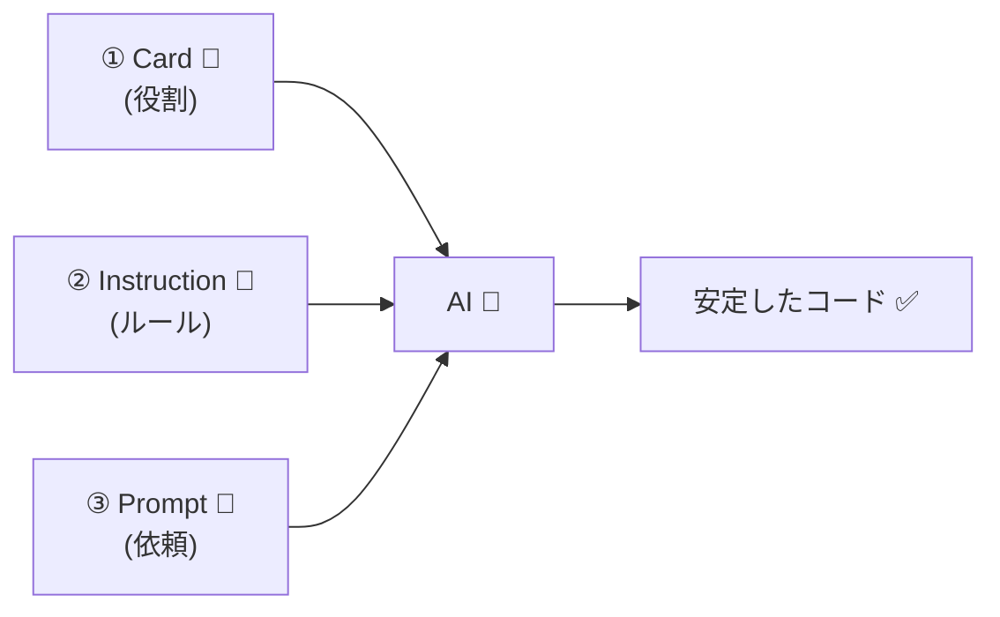

# 第32章：AIに「このコンテキストの役割」を覚え込ませるプロンプト術 🧠✨


この章でやりたいのは超シンプル👇
**「AIが境界線をまたいで暴走しないように、コンテキストの“担当範囲”を記憶させる」**ことです 🧯🔥

DDDって、最初は用語よりも **“境界線を守る”** のがいちばん大事なんだよね🙂
AIは賢いけど、放っておくとすぐ「全部やっちゃう」ので、**あなたが“担当表”を渡してあげる**のがコツです📝✨

---

## 1. まず「役割」ってなに？（超やさしく）🧸

**境界づけられたコンテキスト**は、アプリの中の“小さな独立国”でしたよね🏰
で、第32章はその独立国に対して、

* この国は何をする？（責務）✅
* 何をしない？（禁止）🛑
* どんな言葉を使う？（単語帳）📒
* どこまでが国境？（触っていいデータ）🧱

…を **AIに覚えさせる**話です😊

---

## 2. AIが迷う（＝壊す）典型パターン 😵‍💫💥

AIがやりがちな事故👇

* 予約機能を作ってって言ったら、**決済まで勝手に実装**し始める💳
* 注文の話をしてるのに、**ユーザー認証の仕様を勝手に増やす**🔐
* “ユーザー”という言葉を、文脈によって勝手に解釈して**別の意味で使う**👤↔️👥

これ、AIが悪いというより **「担当範囲の説明書がない」**のが原因です📄🥺

---

## 3. いちばん効く考え方：「3枚セット」で固定する 🧩✨


AIに覚え込ませるときは、次の **3枚セット**が最強です💪

1. **コンテキストカード（短い役割カード）** 🪪
2. **指示ファイル（IDEが毎回読み込む“常設メモ”）** 📌
3. **その場の依頼プロンプト（今日やる仕事）** 💬



---特に②が強い！
VS Code や Visual Studio は、リポジトリ内の `.github/copilot-instructions.md` を “共通の指示書” として読み込ませられます。([Visual Studio Code][1])
さらに、ファイル範囲ごとに適用できる `*.instructions.md` も使えます。([Visual Studio Code][1])

---

## 4. まず作ろう：コンテキストカード（テンプレ）🪪📝


コンテキストごとに、これを1枚作ります（**短いほど強い**✨）

```text
【コンテキスト名】：
【目的】（この国が守る価値）：
【責務】（やっていいこと）：
- 
- 
【禁止】（やらないこと）：
- 
- 
【用語】（この国での言葉の意味）：
- 〇〇 = 
- △△ = 
【主要な入出力】：
- 入力（コマンド）：
- 出力（イベント/結果）：
【データ境界】（触っていいもの/ダメなもの）：
- OK:
- NG:
【設計スタイル】：
- 例）集約ルート経由でのみ更新、例外よりResult、など
```

---

## 5. 例でやろう：カフェ予約アプリ ☕📅


ここではコンテキストを2つに分けます👇

* **予約コンテキスト**：席を押さえる、変更、キャンセル📅
* **決済コンテキスト**：支払い、返金、支払い状態💳

「予約」担当に、決済を触らせないのがポイント🧱✨

### 予約コンテキストのコンテキストカード例 ☕📅🪪

```text
【コンテキスト名】：Reservation（予約）
【目的】：予約のライフサイクル（作成/変更/キャンセル）を正しく管理する
【責務】：
- 予約を作る/変更する/キャンセルする
- 予約可能かどうかを判断する（営業時間、席数など“予約のルール”）
【禁止】：
- 決済処理（支払い/返金/カード情報）には触れない
- ユーザー認証の詳細仕様を増やさない（認証は別コンテキスト）
【用語】：
- Reservation = “席を確保する約束”
- CustomerId = 予約者の識別子（個人情報ではない）
- TimeSlot = 予約枠（開始・終了）
【主要な入出力】：
- 入力（コマンド）：CreateReservation, ChangeReservation, CancelReservation
- 出力（イベント/結果）：ReservationCreated, ReservationChanged, ReservationCanceled
【データ境界】：
- OK: Reservation, TimeSlot, SeatCount
- NG: Payment, Refund, CardInfo
【設計スタイル】：
- 予約の更新はReservation集約ルートからのみ行う
- 予約が不正なら「作らない」（コンストラクタ/Factoryで弾く）
```

---

## 6. “覚え込ませる”プロンプトの型（そのまま使える）📌💬✨


ここが本題！
AIに渡す文章は、だいたいこの順が安定です👇

### ✅ 型A：チャットに貼る「役割固定プロンプト」🧠

```text
あなたは「Reservation（予約）コンテキスト」専属の設計・実装アシスタントです。

【絶対ルール】
- 予約コンテキストの責務だけを扱ってください
- 決済・返金・カード情報などは実装しません（必要ならイベント連携案のみ）
- 予約コンテキストの用語定義を守ってください

【コンテキストカード】
（ここにコンテキストカードを貼る）

【今回の依頼】
ChangeReservation（予約変更）ユースケースを、Application層とDomain層に分けて設計案→C#コード案の順で出してください。
最後に「この案が境界を越えていないか」自己チェックも付けてください。
```

**コツ**：最後の「自己チェック」がめちゃ効きます✅✨
AIが自分でブレーキ踏むようになります🚗💨

---

## 7. IDEに“常設メモ”として持たせる（超おすすめ）📌📁


### 7.1 `.github/copilot-instructions.md`（全体の共通ルール）📌

VS Code は `.github/copilot-instructions.md` をワークスペースの全チャットに自動適用できます。([Visual Studio Code][1])
Visual Studio でも同ファイルを参照する設定があり、レスポンスの参照情報に出ることも書かれています。([Microsoft Learn][2])

中身は例えばこんな感じ👇

```text
# Copilot Instructions（このリポジトリの共通ルール）

- このプロジェクトはDDDの境界づけられたコンテキストで分割している
- コンテキストをまたぐ実装は禁止。連携は「イベント」か「ACL案」で提案する
- “ユーザー”など曖昧語は必ずこのリポジトリの用語定義に合わせる
- 出力は「結論→理由→コード→境界チェック」の順にする
```

### 7.2 `.github/instructions/*.instructions.md`（フォルダごとの役割固定）🧱

Visual Studio では `applyTo` を持つ `*.instructions.md` を作って、特定範囲にだけ適用できます。([Microsoft Learn][2])
VS Code も複数の指示ファイルをサポートしていて、組み合わせてコンテキストに入れます（順番は保証されないよ、という注意もあります）。([Visual Studio Code][1])

例：予約コンテキスト用👇

```text
---
description: Reservation context rules
applyTo: "src/Reservation/**"
---

# Reservation（予約）コンテキストのルール

- 決済の概念（Payment/Refund/CardInfo）をDomainに入れない
- 予約の変更はReservation集約ルート経由のみ
- 用語：Reservation = 席を確保する約束、TimeSlot = 予約枠
- 迷ったら「どのコンテキストの責務か」を先に質問する
```

---

## 8. さらに安定する小ワザ3つ 🪄✨

### ① “禁止事項”は強めの言葉で書く🛑

「やらない」じゃなくて、
**「実装しない（提案のみ）」**みたいに具体化すると効くよ🙂

### ② “触っていいデータ/ダメなデータ”を列挙する📦

AIは概念だけだと混ぜがち。
**クラス名レベル**でNGを書くと止まります🧱✨

### ③ “出力フォーマット”を固定する🧾

毎回の会話が整うので、理解が爆速になります⚡
おすすめ：**結論→理由→コード→境界チェック**✅

---

## 9. ちょい注意：Codex拡張を使うなら🧪

OpenAIの Codex IDE extension は VS Code で使えるよ、って公式に書かれてます。([OpenAI Developers][3])
ただし **Windowsは実験的**で、より良い体験には WSL ワークスペース推奨…という注意もあります。([OpenAI Developers][3])
（使うならこの点だけ頭の片隅に🙂）

---

## 10. 【ミニ演習】あなたのアプリでやってみよう🎀🧪

1. あなたのアプリのコンテキストを2つだけ決める（例：AとB）✂️
2. Aの**コンテキストカード**を作る🪪
3. AIにこのプロンプトで頼む👇

```text
あなたはAコンテキスト専属です。
（Aのコンテキストカードを貼る）
次の機能をAの責務だけで設計してください：
「〇〇を変更する」
最後に「境界逸脱チェック」を必ず付けてください。
```

4. 出てきた答えに対して、自分でこの3問だけ確認✅

* その処理、Bのデータ触ってない？🧱
* その用語、単語帳どおり？📒
* その責務、Aっぽい？それともBっぽい？🤔

---

## まとめ：この章の合言葉 🧠✨

**AIに任せる前に、AIに“担当表”を渡す📋**
それだけで、DDDの境界線が一気に守られるようになります😊💖

次の章（第33章）は、この戦略的設計をサボるとどうなるか…のホラー回です👻（でも超大事！）

[1]: https://code.visualstudio.com/docs/copilot/customization/custom-instructions "Use custom instructions in VS Code"
[2]: https://learn.microsoft.com/en-us/visualstudio/ide/copilot-chat-context?view=visualstudio "Customize chat responses - Visual Studio (Windows) | Microsoft Learn"
[3]: https://developers.openai.com/codex/ide/ "Codex IDE extension"
