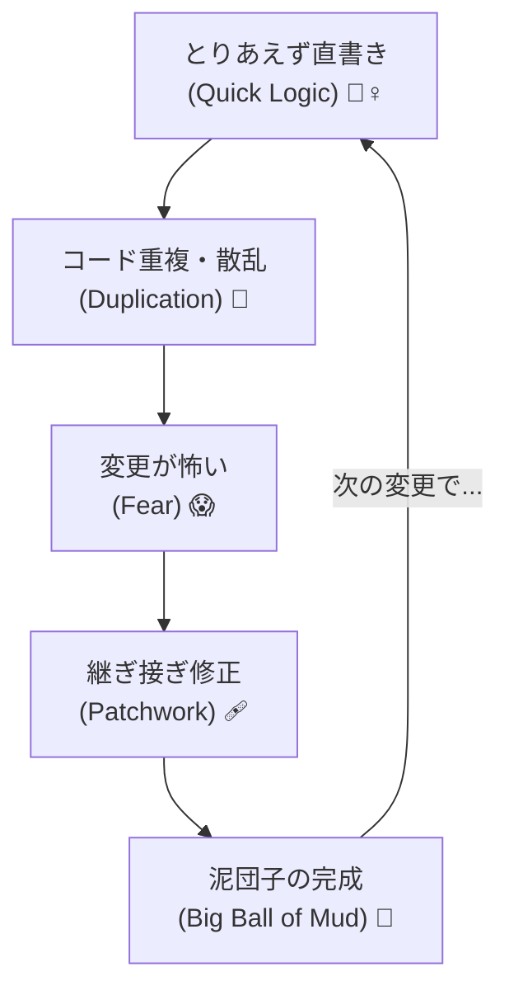
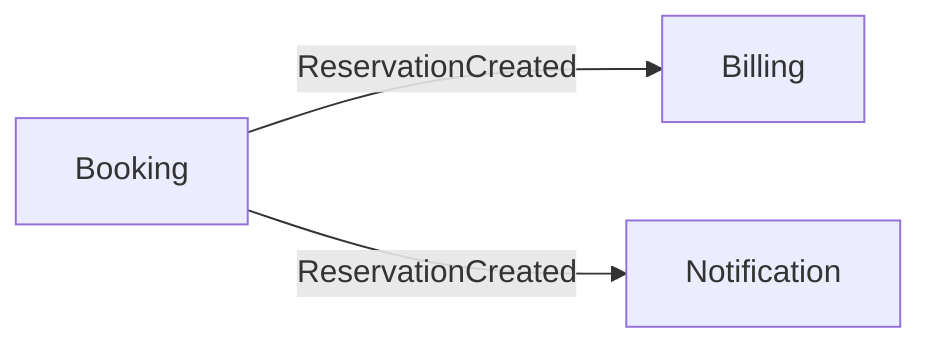

# 第33章：戦略的設計をサボるとどうなるか 💣🧱


〜巨大な1つの塊（ビッグボールオブマッド）の誕生〜😱

「とりあえず動けばOK！」で走り出すと、ある日突然こうなります👇
**“どこを直せばいいか分からない”**
**“直したら別の場所が壊れる”**
**“AIに頼んでも毎回ちがう答えが出る”**
はい、これが **ビッグボールオブマッド（巨大な泥団子）** です🫠🌀

---

## 今日のゴール 🎯✨

この章では、戦略的設計（第3部のやつ）をサボると起きる「悲劇」を、**めちゃ現実的に**理解します😇
そして、**最小コストで回避する方法**もセットで持ち帰ります👜💡

---

## ビッグボールオブマッドって何？ 🥔🧱


ざっくり言うと、

* 1つのプロジェクト（または1つの層）に全部が混ざる
* どの機能もどの機能にも依存してる
* ルールが散らばってて、同じ意味のコードが何回も出てくる
* 変更が「怖い」から、触らない文化が生まれる

つまり **“整理されてない巨大コード”** です😵‍💫

---

## どうしてこうなるの？（1人開発ほど危ない）🧠⚡


1人開発って、最初は超スピード出ますよね🚀
でも戦略的設計を飛ばすと、スピードの代償があとで来ます…💸💥

よくある流れ👇



1. コントローラや画面にロジックを足す（最速）🏃‍♀️
2. 似た条件分岐があちこちに増える🧩
3. 「仕様変更」が入る
4. 直す場所が10個になる
5. 1個直し忘れてバグる
6. AIに聞いても「全体の前提」がないからブレる🤖💫
7. **泥団子完成**🎉（うれしくない）

---

## もう手遅れ？のサイン10個 🚨😇


当てはまるほど泥団子が育ってます🌱🪨

* 「User」って言葉が3種類の意味で使われてる👤👥👮
* `if` が長すぎてスクロール地獄📜
* Controller が肥大化してる🍔
* どこでもDbContext触ってる🧪
* 仕様のルールがコメントでしか分からない📝
* 例外メッセージが仕様の代わりになってる😵
* 似たDTOが大量にある📦📦📦
* “仮”の名前が半年残ってる（Temp, Test, New）🧟‍♀️
* 新機能のたびに「既存が壊れないか祈る」🙏
* AIに投げても「え、前提なに？」ってなる🤖❓

---

## ミニ地獄サンプル：全部混ざるとこうなる 😭🧱


たとえば「予約」を作ってるつもりなのに、気付いたら **請求**や**クーポン**や**通知**が全部ここに…みたいなやつです。

```csharp
// ReservationsController.cs（地獄の入口）
public async Task<IActionResult> Create(CreateReservationRequest req)
{
    // 予約作成
    var user = await _db.Users.FindAsync(req.UserId);
    var room = await _db.Rooms.FindAsync(req.RoomId);

    if (user == null) return NotFound("User not found");
    if (room == null) return NotFound("Room not found");

    // 予約ルール（いつの間にかここに増える）
    if (req.Date < DateOnly.FromDateTime(DateTime.Now)) return BadRequest("過去日は不可");
    if (room.IsClosed) return BadRequest("休館日");

    // 料金計算（なぜかここ）
    var price = room.BasePrice;
    if (req.IsStudent) price *= 0.8m;
    if (!string.IsNullOrEmpty(req.CouponCode))
    {
        var coupon = await _db.Coupons.SingleOrDefaultAsync(x => x.Code == req.CouponCode);
        if (coupon != null) price -= coupon.DiscountAmount;
    }

    // 請求（なぜかここ）
    var invoice = new Invoice { UserId = user.Id, Amount = price, CreatedAt = DateTime.UtcNow };
    _db.Invoices.Add(invoice);

    // 通知（なぜかここ）
    _email.Send(user.Email, "予約完了", $"料金は {price} 円です");

    // 保存
    _db.Reservations.Add(new Reservation { UserId = user.Id, RoomId = room.Id, Date = req.Date });
    await _db.SaveChangesAsync();

    return Ok();
}
```

これ、最初は便利なんです😇
でも次の変更で死にます👇

* 学割ルールが変わった
* クーポン仕様が変わった
* 通知をLINEにもしたい
* 請求を「仮押さえ→確定」にしたい
* 予約と請求を別タイミングにしたい

全部この1つに刺さってるので、**全部ここをいじる**ことになります😱🔧

---

## 戦略的設計をサボると「AIが弱くなる」🤖📉


AIって、局所的にコード書くのは得意です✍️✨
でも、泥団子状態だと…

* どこが「予約の責務」か分からない
* 「請求」なのか「料金表示」なのか境界がない
* 用語がブレてるから生成物もブレる

結果：**AIが毎回ちがう正解を出す** 🫠

戦略的設計って、AIに渡す **“地図”🗺️** なんです。

---

## 回避のキモ：境界線を引くだけで勝てる ✂️🏆


ここでの勝ち筋はシンプルです😊
**「どこまでが予約で、どこからが請求？」**みたいな **線引き** を先にします。

### 1) “言葉”を固定する（ユビキタス言語）📘✨

例：

* 「予約(Reservation)」＝部屋を押さえること
* 「請求(Invoice)」＝支払いの請求情報
* 「決済(Payment)」＝実際のお金のやり取り

これが揃うと、AIへの指示もブレません👌🤖

### 2) “独立国”を作る（境界づけられたコンテキスト）🏰🌍

最低限でOKです🙆‍♀️

* Booking（予約）
* Billing（請求）
* Notification（通知）

「予約が決まった」→「請求が作られる」みたいに、**境界をまたぐときだけ**つなぐ🔌✨

### 3) “つなぎ方”を決める（コンテキストマップ）🗺️

超ミニでいいです👇



これだけで、未来のあなたが迷子になりにくくなります🥹💕

---

## じゃあ実装はどう変わるの？（超ざっくり完成形イメージ）✨

Controllerは「入口」だけにして、あとは **ユースケース（Application）** に渡す感じ💡

```csharp
// ReservationsController.cs（スッキリ）
public async Task<IActionResult> Create(CreateReservationRequest req)
{
    var result = await _reservationAppService.CreateAsync(req);
    return result.IsSuccess ? Ok(result.Value) : BadRequest(result.Error);
}
```

で、予約はBookingの中で完結し、境界を越える通知は「イベント」っぽく渡す（詳細は後の章でOK）📩✨

---

## Copilot / AIに投げるときの“良い指示”テンプレ 🧠🧾🤖

泥団子を避けるプロンプトは「境界線ありき」です✂️✨

**テンプレ（そのまま使ってOK）👇**

```text
あなたはDDDの設計補助です。
今から「Booking（予約）コンテキスト」だけを実装します。
Billing（請求）やNotification（通知）の詳細は実装しません。

用語定義：
- Reservation = 予約（部屋を押さえる）
- Invoice = 請求（支払い情報）
- ReservationCreated = 予約が確定した事実

依頼：
1) Booking内のユースケース（CreateReservation）をC#で作って
2) Bookingの責務だけにして
3) Billingへの連携は「ReservationCreatedイベントを発行する」形にして
4) コードの配置（フォルダ案）も提案して
```

この“縛り”があると、AIが暴走しにくいです🥳🧯

---

## ミニ演習（15分）⏱️🎓✨

あなたの作りたいアプリ（または今のプロジェクト）で、次をやってみてください😊

### STEP1：用語を3つだけ決める📘

* このアプリで一番大事な名詞を3つ（例：注文、支払い、配送）📦💳🚚

### STEP2：それぞれ「意味」を一言で書く✍️

* 注文＝商品を確保すること
* 支払い＝お金の処理
* 配送＝届ける処理

### STEP3：境界線を引く✂️

* 注文は「注文」だけで完結？
* 支払いは「注文」から見える？見えない？
* どこを跨ぐときに連携が必要？

### STEP4：AIに“境界線つき”で聞く🤖✨

上のテンプレに当てはめて、フォルダ構成案を出させてみましょう📁🎀

---

## まとめ 🧁✨

戦略的設計をサボると…

* 変更が怖くなる😱
* 修正箇所が増える🧨
* AIの出力がブレる🤖💫
* 結果、1人開発のスピードが落ちる🐢💦

でも逆に言うと、**境界線（コンテキスト）と用語**だけ決めれば、かなり防げます✂️🗺️✨

---

次の章（第34章）では、プロトタイプから本番へ「境界線を固めていく」やり方を、もっと現実的な手順でやっていきますよ〜🥰🚀
