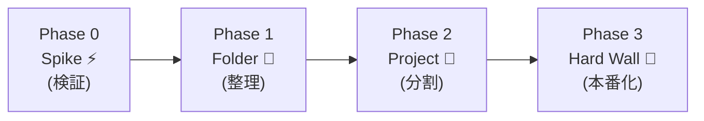

# 第34章：プロトタイプから本番へ✨ 境界線を“じわじわ固める”進め方🧱🛠️


プロトタイプって、めちゃくちゃ大事です😊
でも同時に、**プロトタイプのコードをそのまま本番にすると、あとで自分が泣く**ことが多いんだよね😂💦

この章では、

* 最初は速く動かす🏃‍♀️💨
* 途中から“境界線”を少しずつ強くする🧱
* 最後は本番品質に仕上げる🏁✨

…っていう **「段階的にDDDを育てる」**やり方を、やさしく解説するよ〜😊🌸

---

## 1. まず結論：境界線は「最初から完成」しない🙅‍♀️➡️🙆‍♀️

DDDの境界（境界づけられたコンテキスト）は、最初はほぼ必ず「仮説」です🤔💭
作ってみると、

* 思ったよりルールが複雑だった😵‍💫
* 言葉の意味がズレてた😅
* ここ分ける必要なかったな…🙃

が起きるからね。

だからおすすめはこれ👇

✅ **最初：境界線は“薄い線”でOK（ゆるく）**
✅ **中盤：困り始めたところから線を太くする（強く）**
✅ **最後：本番用に“越境できない壁”にする（ガチ）**

---

## 2. 「境界線を固める」とは何をすること？🧱✨

ざっくり言うと、こういうのを増やしていくことだよ😊

* 📁 **フォルダ / 名前空間で分ける**（ゆるい境界）
* 🧩 **プロジェクト分割**（参照関係で守る）
* 🔒 **依存方向を固定**（ドメイン中心）
* 🧪 **テストで境界を守る**（破ったら即バレ）
* 🧼 **外部サービスをACLで隔離**（汚れを入れない）

「線を引く」だけじゃなくて、**破れないように強化する**イメージ💪✨

---

## 3. 進め方：境界線を育てる“4フェーズ”🌱➡️🌳

ここからが本編だよ〜！😊🎉
おすすめの進行を **4段階** で紹介するね✨



---

### フェーズ0：スパイク（超プロトタイプ）⚡🧪

目的はただ1つ👇
✅ **“価値があるか”を最速で確認する**

この段階のルール：

* ✅ 速さ優先🏃‍♀️💨
* ✅ 多少ぐちゃぐちゃOK😂
* ✅ DBは後回しでもOK（メモリ保存でOK）
* ✅ でも「言葉」と「ルール」だけはメモする📝✨

ここでやるべきメモは2つだけ👇

* 📘 **単語帳（ユビキタス言語）**
* 📏 **ルール（禁止・条件・計算）**

> コードは捨ててもいいけど、言葉とルールは捨てない😎✨

AIにはここをやらせると強いよ👇

* 仕様の矛盾探し🔍
* 例外ケース洗い出し🧯
* ルールの文章化📝

---

### フェーズ1：薄い境界線（フォルダで分ける）📁🧃

次にやるのは、**“分ける練習”**😊
まだプロジェクト分割はしなくてOK。まずはこんな感じ👇

* 📁 Domain
* 📁 Application
* 📁 Infrastructure
* 📁 Web（UI）

ポイントはこれ👇

✅ **Domainに「ルール」を寄せる**
✅ **Webにルールを書かない**（書くと地獄😇）

この時点で「境界線がある雰囲気」になれば勝ち🎉

---

### フェーズ2：境界線を強くする（プロジェクト分割）🧱🔗

「このままだとごちゃるな…」が見えたら、ここで本気出す💪✨

典型構成はこれ👇

* 🧠 Domain（ルール・モデル）
* 🧭 Application（ユースケース）
* 🧰 Infrastructure（DB/外部API）
* 🌐 Web（画面/API）

そして依存方向はこう固定👇

**Web → Application → Domain**
**Infrastructure → Application / Domain（実装で支える）**

Domainが誰にも依存しないのが大事🥰✨

---

### フェーズ3：本番化（“越境できない壁”を作る）🏰🔒

最後にやるのは、**「境界を破れない仕組み」**を入れること😊

例：

* 🔒 Domainプロジェクトは、Infrastructure参照禁止
* 🧪 アーキテクチャテストで「参照ルール違反」をビルドで落とす
* 🧼 外部APIはACLで包む（ドメインにSDKの型を入れない）

この段階になると、AIがコードを増やしても壊れにくいよ👍✨
（AIって、油断すると平気で越境してくるからね😂💦）

---

## 4. ミニ例：プロトタイプ→本番への“差し替え”🧩✨

例として「予約」を考えてみよ😊☕📅
プロトタイプではまず **インメモリ** でOK！

### ① Domain：リポジトリの“口”だけ作る👄

```csharp
public interface IReservationRepository
{
    Task AddAsync(Reservation reservation, CancellationToken ct);
    Task<Reservation?> FindByIdAsync(ReservationId id, CancellationToken ct);
}
```

### ② Prototype：最初はインメモリ実装で走る🏃‍♀️💨

```csharp
public sealed class InMemoryReservationRepository : IReservationRepository
{
    private readonly Dictionary<Guid, Reservation> _store = new();

    public Task AddAsync(Reservation reservation, CancellationToken ct)
    {
        _store[reservation.Id.Value] = reservation;
        return Task.CompletedTask;
    }

    public Task<Reservation?> FindByIdAsync(ReservationId id, CancellationToken ct)
    {
        _store.TryGetValue(id.Value, out var found);
        return Task.FromResult(found);
    }
}
```

### ③ 本番：あとからEF Core実装に差し替える🔁✨

ポイントはこれ👇
✅ Domainは何も変えなくていい
✅ Applicationもほぼ変えなくていい
✅ Infrastructureだけ差し替えればOK

この「差し替え可能」こそ、境界線が効いてる証拠だよ😊🎉

---

## 5. 境界線を固める“タイミング”の見分け方⏰🔍

「いつ固めるのが正解？」って迷いがちだから、合図を置いとくね😊

### ✅ 固めどきサイン（1つでも出たら検討！）🚨

* 😵 「同じ単語なのに意味が違う」が増えた
  （例：「ユーザー」が “予約する人” と “管理者” で別物）
* 🧨 変更すると別機能が壊れるようになった
* 🧩 AIに頼むほどコードが散らかりやすい
* 🤯 “ここ直すだけのはず”が大工事になる
* 🧼 外部APIやDB都合がドメインを汚し始めた

---

## 6. AIに頼むときの「境界線を守る」プロンプト例🤖🧱

そのままコピペで使える形にするね😊

```text
あなたはDDDの設計補助です。
次の制約を絶対に守ってください：

- Domain層は Infrastructure / Web に依存しない
- 外部APIやEF Coreの型を Domain に持ち込まない
- 変更対象のコンテキスト外のコードは触らない
- もし境界を越える必要があるなら、ACL(腐敗防止層)案を提案する

この前提で、○○機能を追加するための差分設計とコード案をください。
```

AIは優秀だけど、**境界を守るルールを先に言っておく**のが超大事だよ😊✨

---

## 7. まとめ：プロトタイプは“仮”、本番は“壁”🏗️🏰

* ⚡ 最初は速く作る（でも言葉とルールは残す）
* 📁 フォルダ分けで薄い境界を作る
* 🧱 プロジェクト分割で境界を強くする
* 🔒 テストや参照ルールで「破れない壁」にする
* 🔁 本番化は“差し替え”で進める（Domainはなるべく不変）

この流れで進めると、**迷いが減るし、AIも暴走しにくい**よ😊💕

---

## ちょい演習（5〜15分）✍️🌸

あなたの作りたいアプリ（または過去作）を1つ思い出して👇

1. そのアプリの「大事な場所（コア）」はどこ？💎
2. “同じ言葉だけど意味が違う”単語ある？🌀
3. フェーズ0〜3で、今どこにいる？📍
4. 次に太くする境界線はどこ？🧱

これをAIに投げて、返答を見ながら単語帳を更新してみてね😊📝✨

---

次の章（35章）が「単語帳づくりワーク」だから、ここで出てきた言葉のズレを拾っておくとめちゃくちゃ楽になるよ〜😊🎉
