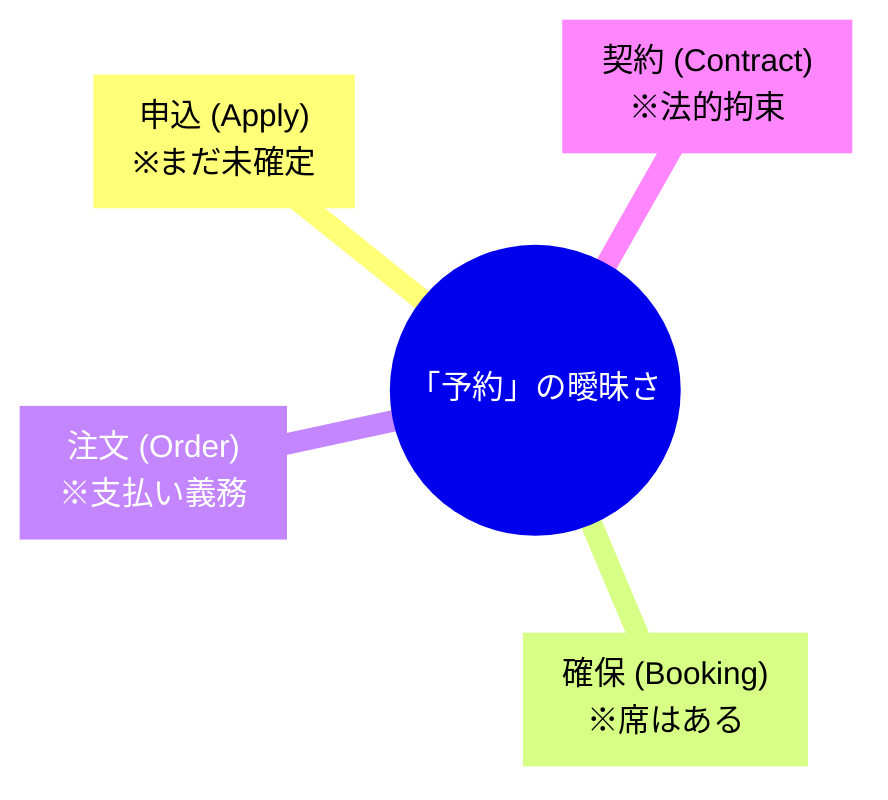

# 第35章：【ワーク】作りたい機能の「単語帳」をAIと一緒に作り、不整合を直す 📚🤖✨


この章は“コードを書く前の準備運動”です💪
DDDでめちゃ大事な **ユビキタス言語（共通言語）** を、AIと一緒に「単語帳」にして、**言葉のズレ（＝バグ予備軍）** を先に潰します🧯🔥

---

# 今日のゴール 🎯


* 作りたい機能について **用語（単語）を定義**できる
* 同じ単語の意味がブレる問題を **AIで発見**できる
* その単語を **画面・仕様・コードの命名に反映**できる（迷いが減る！）🧭✨

---

# 成果物（これができたら勝ち🏆）

* `docs/glossary.md`（単語帳）
* `docs/feature-spec.md`（短い仕様：1〜2ページでOK）
* そして最後に Git にコミット！✅（未来の自分が助かる🫶）

---

# 0. 題材を1つだけ選ぼう 🍙

アプリ全体じゃなくてOK！**機能1つ**でいきます😊

例：

* 「ユーザー登録」
* 「予約をキャンセルする」
* 「ポイントを使って購入する」
* 「月額課金を停止する」
* 「在庫を引き当てる」

ここでは例として、**「イベント予約をキャンセルする」**で進めます🎫❌

---

# 1. まず“日本語で”流れを書く（10行でOK）📝

難しく考えず、箇条書きでOKです😄

例：

* ユーザーは予約一覧を見る
* 予約を選ぶ
* キャンセル理由を選ぶ（任意）
* キャンセルする
* 返金が必要なら返金される
* キャンセル完了通知が届く

ここで大事なのは、**言葉が自然なこと**です🌱
コードっぽい単語（DTOとかRepositoryとか）は今は不要🙅‍♀️

---

# 2. AIに「単語を全部抜き出して」って頼む 🤖🔍

Copilot Chat（またはAI拡張）のチャットで、次を投げます👇

```text
あなたはドメインエキスパート兼DDDコーチです。
以下の機能説明から「ドメイン用語」を全て抜き出し、候補の単語リストを作ってください。
技術用語（DTO、DB、APIなど）は除外し、業務の言葉だけにしてください。

--- 機能説明 ---
（ここにあなたの箇条書きを貼る）
--- ここまで ---
```

✅ 返ってきた「単語リスト」を `docs/glossary.md` の下書きに貼ります📎

---

# 3. 危険な“あいまい単語”をAIに炙り出させる 🔥🧠


次がこの章の本題です！
**同じ単語が場面によって意味が変わる**と、設計がグラつきます😵‍💫

```text
次の用語リストについて、
1) 意味が曖昧になりやすい単語
2) 人によって解釈が割れそうな単語
3) 似た単語（同義語・近い概念）が混ざっていそうな単語
を指摘して、理由も添えてください。

用語リスト:
（AIが出した単語リストを貼る）
```



よく燃える単語たち（例）🔥

* 「予約」：申し込み？確定？支払い済み？
* 「キャンセル」：取り消し？返金？ペナルティ？
* 「返金」：全額？一部？ポイント返し？
* 「通知」：メール？アプリ内？即時？

---

# 4. 単語帳テンプレを作る（ここからが整える時間✨）🧹


`docs/glossary.md` に、最低限これを書きます👇
表にすると見やすいです😊

| 用語    | 定義（1〜2文）                        | 例文（自然な日本語）   | 似てる言葉/禁止ワード | メモ     |
| ----- | ------------------------------- | ------------ | ----------- | ------ |
| 予約    | イベント参加枠を確保した状態。支払い完了で「確定予約」になる。 | 「予約を確定する」    | 申込（混同注意）    | 状態がある  |
| 申込    | 参加希望を出した状態。支払い前でも成立する。          | 「申込を取り消す」    | 予約（禁止）      | 支払い前   |
| キャンセル | 確定した予約を無効にする行為。必要なら返金処理を伴う。     | 「予約をキャンセルする」 | 取消（できれば統一）  | 返金条件あり |
| 返金    | 支払い済み金額を返す処理。手数料が引かれる場合がある。     | 「返金額を計算する」   | 払い戻し（統一）    | ルール重要  |

この時点で「予約」と「申込」を分けたので、**設計も勝手にスッキリ**します🥳✨

---

# 5. 不整合をAIに“レビュー”させる（超強い💥）🕵️‍♀️🤖


単語帳ができたら、AIに意地悪レビューをさせます😈

```text
あなたは仕様の矛盾を見つけるプロのレビュアーです。
以下の単語帳の定義に矛盾や穴がないかチェックしてください。

観点:
- 用語の重複/同義語が混ざってないか
- 状態の前後関係が破綻してないか（例：申込→予約→確定 など）
- 「このケースではどの単語を使う？」が迷う箇所がないか
- UI文言にした時に混乱しそうな部分

--- 単語帳 ---
（glossary.md を貼る）
--- ここまで ---
```

🔧 指摘が出たら、単語帳を直します。
ここ、地味だけど**最強に効く**ところです💊✨

---

# 6. 単語をコード命名に“変換”する（迷いゼロへ🧭）🧩


最後に、AIに「命名ルール案」を出させます。
これで **AIにコード生成させる時もブレにくい**です👍

```text
次の単語帳をもとに、C#の命名案を提案してください。
- Entity / ValueObject / Enum / メソッド名の候補
- 「申込」と「予約」を混同しないための命名ルール
- 禁止したい命名（例: Order を乱用しないなど）

--- 単語帳 ---
（glossary.md を貼る）
--- ここまで ---
```

たとえばこんなふうに固まります👇（例）

* Entity: `Booking`（予約） / `Application`（申込）※名前は好みでOK
* 状態: `BookingStatus`（`Applied`, `Confirmed`, `Cancelled`…）
* メソッド: `Confirm()`, `Cancel(reason)`
* 禁止：申込なのに `Booking` と呼ぶ、予約なのに `Apply` と呼ぶ など🙅‍♀️

---

# 仕上げ：AIに渡す“固定プロンプト”を作る 🧠🧷

今後その機能をAIに作らせる時、毎回これを最初に貼ると強いです💪

```text
この機能では用語を次のように定義する：
- 申込: （定義）
- 予約: （定義）
- 確定予約: （定義）
- キャンセル: （定義）
禁止: 申込の状態を予約と呼ばない。返金とキャンセルを同義にしない。
この用語に従って、命名・コメント・UI文言を統一すること。
```

---

# チェックリスト（できた？✅）🌟

* [ ] 単語帳に **定義が書いてある**（“なんとなく”禁止）
* [ ] 似た言葉が **1つに統一**されてる（ブレない）
* [ ] 例文を読んで **違和感がない**（日本語が自然）
* [ ] UIにした時の文言でも **迷いにくい**
* [ ] コード命名が単語帳と **一致**してる

---

# よくある落とし穴（先に避けよう🥲）🪤

* 「予約」「注文」「取引」みたいな **万能ワードを乱用**する😵
* AIがそれっぽく作った単語を、ノリで採用してしまう（あとで地獄）🔥
* 単語帳が“説明書”じゃなく“辞書”になってない（定義が短いのが正義）📗✨

---

# ミニ課題（提出物みたいにやろう📮）😆

次の3つを作ってください👇

1. `docs/glossary.md`（10語以上）
2. “燃えやすい単語”を3つ挙げて、どう直したかメモ📝
3. 「AIに貼る固定プロンプト」1個作る🤖🧷


