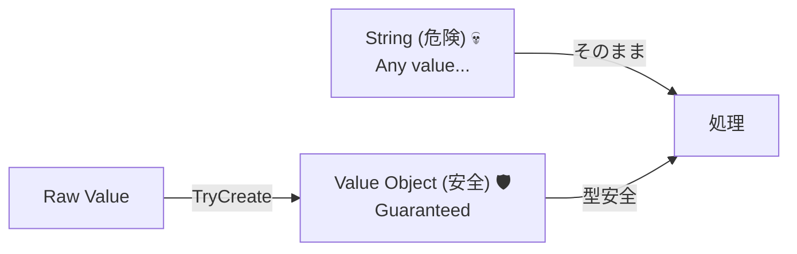

# 第36章：値オブジェクト（Value Object）― `string` や `int` を信じない 😼🧩


## この章でできるようになること ✅✨

* 「ただの `string` / `int`」が引き起こす事故パターンを知る 💥
* **値オブジェクト**の考え方（DDDの超重要パーツ）をつかむ 🧠
* “意味のある型” を作って、**迷いにくいコード**にする ✍️🔒

---

## 1) まず、`string` は “なんでも入る箱” 📦😇→😱

たとえば、こういう引数のメソッドがあるとします。

```csharp
void RegisterUser(string name, string email)
{
    // ...
}
```

これ、**呼び出し側で順番を間違えてもコンパイル通っちゃう**んだよね…😇💀

```csharp
RegisterUser("aki@example.com", "Aki"); // 😱 逆に入れても通る
```

さらに `string` は、

* 空文字 `""` も入る
* 変な形式 `"not an email"` も入る
* 前後スペース `"  aki@example.com  "` も入る

つまり **「不正な値が自然に生まれる」** 🧟‍♀️🧟‍♂️

---

## 2) `int` も同じ。意味がない数字はバグの温床 🔢💣

```csharp
int price = -100;      // 😇 通る（でも値段でマイナスって…？）
int age = 999;         // 😇 通る
int percent = 200;     // 😇 通る（割引率200%!?）
```

`int` は「整数」ってことしか表現できないから、
**“この数字が何を意味して、どんな範囲が正しいか”** を守れないの🥲

---

## 3) 値オブジェクトってなに？🌸（超ざっくりでOK）

**値オブジェクト**は、こういう子です👇✨

* **「値そのもの」が意味**（IDで区別しない）🪄
* **同じ値なら同じもの扱い**（比較は“中身”）🔁
* **基本は不変（Immutable）**（作ったら変えない）🧊
* **必ず正しい状態で生まれる**（不正な値を誕生させない）👶🚫

イメージは、`string` に**「身分証明書」**をつける感じ！🪪✨
「これはメールです」「これは金額です」って**型で宣言**できるようになるよ。

---

## 4) 例：Email を `string` のままにすると起きる悲劇 📧😭

### ありがちな実装（危ない）

```csharp
public class User
{
    public string Email { get; set; } = "";  // 空も入る😇
}
```

* いつでも書き換え可能（変な値が途中で入る）🌀
* バリデーションを忘れがち（あちこちに散らばる）🧨
* “Emailっぽい文字列” でしかない（意味が弱い）🫠

---

## 5) 値オブジェクトにすると、世界が急に平和になる 🕊️✨

この章では、まず「雰囲気」をつかむために、シンプルな形でいくね（最強実装は次章で！）😺📘

```csharp
public sealed class EmailAddress
{
    public string Value { get; }

    private EmailAddress(string value)
    {
        Value = value;
    }

    public static bool TryCreate(string? input, out EmailAddress? email)
    {
        email = null;

        if (string.IsNullOrWhiteSpace(input)) return false;

        var trimmed = input.Trim();

        // 超ざっくりチェック（本格化は後でOK）
        if (!trimmed.Contains('@')) return false;

        email = new EmailAddress(trimmed);
        return true;
    }

    public override string ToString() => Value;
}
```



### これの嬉しさポイント 🎉

* `EmailAddress` 型になった瞬間、**「これはメール」**って伝わる 🧠✨
* `TryCreate` を通らないと作れない → **不正なEmailが生まれにくい** 👶🚫
* 引数の順番ミスも減る（型が違えばコンパイルで止まる）🛑✅

```csharp
void RegisterUser(string name, EmailAddress email) { }

RegisterUser("Aki", new EmailAddress("x")); // ❌ private だから作れない
```

---

## 6) 値オブジェクトは「ルールを閉じ込めるカプセル」💊✨

値オブジェクトに入れたいのは、こういう “現実のルール” だよ👇

* 文字列の前後スペースを許さない（Trimする）✂️
* 空はダメ 🙅‍♀️
* フォーマットがある（メール、URL、郵便番号など）📮
* 範囲がある（年齢、割合、数量など）📏
* 単位がある（円、ポイント、秒…）⏱️💴

「ルールを散らす」と、あとで絶対迷子になるからね…🥺🧭

---

## 7) エンティティとの違い（1分でわかる）⏳👀

* **値オブジェクト**：同じ値なら同じもの扱い（例：`EmailAddress("a@b.com")`）📧
* **エンティティ**：IDで同一性を持つ（例：`UserId(123)` のユーザー）🪪

ざっくり言うと、

* 値オブジェクト＝**中身が同じなら同じ**
* エンティティ＝**IDが同じなら同じ**

ここは今は「ふーん」でOK🙆‍♀️ 次の章以降で定着するよ🌱

---

## 8) 1人開発でのコツ：値オブジェクトは “作りすぎ注意” ⚠️😅

最初から全部を値オブジェクトにすると、逆に疲れることもあるよ🥹

おすすめはこれ👇✨
**バグりやすい・意味が強い・ルールがある**ものから作る！

✅ 作る価値が高い候補

* Money（金額）💴
* Email（メール）📧
* UserId（識別子）🆔
* Percentage（割合）📉
* DateRange（日付範囲）📅
* Quantity（数量）🔢

---

## 9) AIに手伝ってもらうと爆速になる 🤖⚡（でも主導権は人間）

AIにお願いするときは、こう聞くといいよ💡

* 「この概念の “不正な状態” を列挙して」🧠
* 「入力の正規化（Trim, 全角半角など）どうする？」🔧
* 「値オブジェクトに閉じ込めるべきルールは？」📌

例プロンプト（コピペOK）👇

```text
C#でEmailAddressの値オブジェクトを作りたいです。
不正な状態の例を10個出して、どのルールを値オブジェクトに入れるべきか提案して。
TryCreateパターンで、最小の実装案もください。
```

AIは “案出し” が得意だけど、**アプリにとって本当に必要なルールか**はあなたが決めるのがコツだよ😺👑

---

## 10) ミニ演習 🎓✍️（5〜15分）

### 演習A：あなたのアプリの `string` を探せ！🔍

次を3つ見つけてメモ📝

* 「メールっぽいstring」
* 「金額っぽいdecimal/int」
* 「割合っぽいint」

### 演習B：1個だけ値オブジェクト化してみよう 🌱

まずは `EmailAddress` みたいに、
`TryCreate` で **不正な値を誕生させない**形にするのが目標🙆‍♀️✨

---

## 今日のまとめ 🧁✨

* `string` / `int` は便利だけど、**意味もルールも表せない** 😇💥
* 値オブジェクトは **「意味＋ルール」を型に閉じ込める** 🧩🔒
* 1人開発では、値オブジェクトがあると **未来の自分が助かる** 🥹🫶

次章（第37章）で、C#の `record` を使って **もっと強くてキレイな値オブジェクト**に進化させるよ〜！😺🚀
