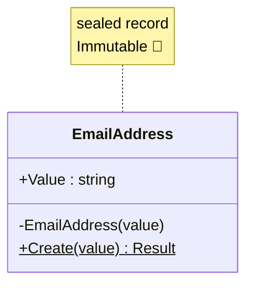

# 第37章：C# `record` を使った最強の値オブジェクト実装法 ✨🧱


第36章で「値オブジェクト（Value Object）」＝ **値そのものが主役**って話をしたよね😊
今回は、その値オブジェクトを **C#の `record` で“強く・楽に・安全に”作る方法**をやっていくよ〜！💪😺

---

## 1. `record`ってなに？（超ざっくり）📌


`record` は一言でいうと、

> **「中身（値）が同じなら、同じもの扱い」になりやすい型** 🎁

普通の `class` だと、同じ値でも「別のインスタンス」なら別物判定になりがちだけど、
`record` は **値ベースの等価性**（Value-based equality）が標準で強いのがポイント✨

---

## 2. 値オブジェクトに `record` が“最強”な理由 🏆

値オブジェクトでほしい性質って、だいたいこれ👇

* ✅ 値が同じなら同一扱い（等価性）
* ✅ 変更されない（不変 / Immutable）
* ✅ 作る時点で不正値を弾く（バリデーション）
* ✅ `string` や `int` を生で使わない（型で表現）

`record` は、これをかなり自然に満たしてくれるよ😊✨

---

## 3. まず結論：おすすめの「最強テンプレ」🧩🔥


値オブジェクトは **“作れた時点で正しい”** が理想だから、

* コンストラクタを隠す（`private`）
* `Create` みたいな工場メソッドで作る
* そこでバリデーションする

これが安定だよ🙆‍♀️



---

## 4. 例：EmailAddress を `record` で作る 💌✨

「メールアドレスって文字列じゃん？」って思うけど、
文字列のままだと **どこでも適当な文字が入っちゃう**😇
だから “EmailAddress型” にしちゃう！

```csharp
using System.Text.RegularExpressions;

public sealed record EmailAddress
{
    public string Value { get; }

    private EmailAddress(string value) => Value = value;

    // ✅ 失敗理由が欲しいので、簡易Resultを自作して使うよ
    public static Result<EmailAddress> Create(string? value)
    {
        if (string.IsNullOrWhiteSpace(value))
            return Result<EmailAddress>.Fail("メールアドレスが空だよ😢");

        value = value.Trim();

        // ※ 超厳密なRFCはややこしいので、まずは「現実的に使える」チェックでOK🙆‍♀️
        if (!Regex.IsMatch(value, @"^[^@\s]+@[^@\s]+\.[^@\s]+$"))
            return Result<EmailAddress>.Fail("メールアドレスの形が変だよ😢");

        return Result<EmailAddress>.Ok(new EmailAddress(value));
    }

    public override string ToString() => Value;
}

public sealed record Result<T>(bool IsSuccess, T? Value, string? Error)
{
    public static Result<T> Ok(T value) => new(true, value, null);
    public static Result<T> Fail(string error) => new(false, default, error);
}
```

### 使い方（例）🌸

```csharp
var emailResult = EmailAddress.Create("test@example.com");

if (!emailResult.IsSuccess)
{
    Console.WriteLine(emailResult.Error);
    return;
}

EmailAddress email = emailResult.Value!;
Console.WriteLine(email); // test@example.com
```

---

## 5. `record`の「等価性」が気持ちよすぎる件 😭✨

```csharp
var a = EmailAddress.Create("test@example.com").Value!;
var b = EmailAddress.Create("test@example.com").Value!;

Console.WriteLine(a == b); // True ✅
```

同じ値なら True！
これが値オブジェクトの世界の正義〜！⚖️✨

---

## 6. 例：Money（お金）を `record` で作る 💰🪙


お金も `decimal` をそのまま使うと、
「通貨がない」「マイナス許していいの？」「小数の桁どうするの？」が混乱しがち😵‍💫

まずは最小で「金額＋通貨」の値オブジェクトにするよ！

```csharp
public sealed record Money
{
    public decimal Amount { get; }
    public string Currency { get; }

    private Money(decimal amount, string currency)
    {
        Amount = amount;
        Currency = currency;
    }

    public static Result<Money> Create(decimal amount, string? currency)
    {
        if (amount < 0)
            return Result<Money>.Fail("金額がマイナスだよ😢");

        if (string.IsNullOrWhiteSpace(currency))
            return Result<Money>.Fail("通貨が空だよ😢");

        currency = currency.Trim().ToUpperInvariant();

        if (currency.Length != 3)
            return Result<Money>.Fail("通貨コードは3文字（例: JPY, USD）だよ😢");

        return Result<Money>.Ok(new Money(amount, currency));
    }

    // ✅ 変更じゃなくて「新しい値」を返す（不変✨）
    public Result<Money> Add(Money other)
    {
        if (Currency != other.Currency)
            return Result<Money>.Fail("通貨が違うお金は足せないよ😢");

        return Create(Amount + other.Amount, Currency);
    }

    public override string ToString() => $"{Amount} {Currency}";
}
```

### 使い方（例）🧾✨

```csharp
var m1 = Money.Create(1000m, "JPY").Value!;
var m2 = Money.Create(500m, "JPY").Value!;

var sum = m1.Add(m2);
Console.WriteLine(sum.IsSuccess ? sum.Value : sum.Error); // 1500 JPY ✅
```

---

## 7. `with` は便利だけど、値オブジェクトでは注意⚠️😺


`record` の `with` は「コピーして一部だけ変更」ができて便利！

でも値オブジェクトは、**勝手に中身を差し替えると不正を作りやすい**んだよね💦

なのでおすすめは👇

* ✅ `with` は乱用しない
* ✅ 代わりに `Add` / `ChangeCurrency` みたいな **ドメイン意図のあるメソッド**を用意する

「変更っぽいこと」も、**ルールを通して安全に**ね🛡️✨

---

## 8. `record struct` は使うべき？🤔

2025のC#だと `record struct` も普通に強い！✨
ただし値オブジェクト用途では、初心者はまず **`record class` 推し**です🙆‍♀️

理由はこれ👇

* `struct` は **デフォルト値（全部0とかnull相当）を作れてしまう** 😇
  → 不正値が「存在できちゃう」可能性がある
* 慣れてないと落とし穴にハマりやすい

なのでまずは
**`sealed record` + private ctor + Create**
この型で固めるのが安定だよ💖

---

## 9. ちょいテスト（xUnit）で安心を増やす 🧪✨


値オブジェクトはテストが楽しいタイプ！🎉

```csharp
using Xunit;

public class EmailAddressTests
{
    [Fact]
    public void SameValue_ShouldBeEqual()
    {
        var a = EmailAddress.Create("a@b.com").Value!;
        var b = EmailAddress.Create("a@b.com").Value!;

        Assert.Equal(a, b);
        Assert.True(a == b);
    }

    [Fact]
    public void InvalidEmail_ShouldFail()
    {
        var r = EmailAddress.Create("not-email");

        Assert.False(r.IsSuccess);
        Assert.NotNull(r.Error);
    }
}
```

---

## 10. AI（Copilot/Codex）に頼むときのコツ 🤖💡

値オブジェクトはテンプレが強いから、AIに向いてるよ〜！✨
おすすめ指示はこんな感じ👇

* 「`sealed record` で値オブジェクトを作って。private ctor + Create + Resultで」
* 「不変で、バリデーションはCreateに集めて」
* 「`ToString` とテスト（xUnit）も作って」

例プロンプト（そのまま投げてOK）💬✨

```text
C#で値オブジェクトを sealed record で実装してください。
条件:
- private constructor
- static Create(...) でバリデーション
- Result<T> を返す（成功/失敗とエラーメッセージ）
- 不変（プロパティは get のみ）
- xUnitテストも付ける
題材: EmailAddress
```

AIが出したコードは、最後にここだけチェックしてね✅

* 「Create以外で不正値が作れない？」
* 「public setter / init で抜け道ない？」
* 「ルールが散らばってない？」

---

## まとめ 🎀

* `record` は **値オブジェクトと相性抜群**✨
* 最強の型はだいたいこれ👇
  ✅ `sealed record`
  ✅ `private` コンストラクタ
  ✅ `Create` でバリデーション
  ✅ 失敗は `Result` で返す
* `with` は便利だけど、値オブジェクトでは乱用注意⚠️

次の第38章は「不変（Immutable）の魔法」🪄✨
今日作った `record` たちが、さらに“強くなる理由”がわかるよ〜！😊💖