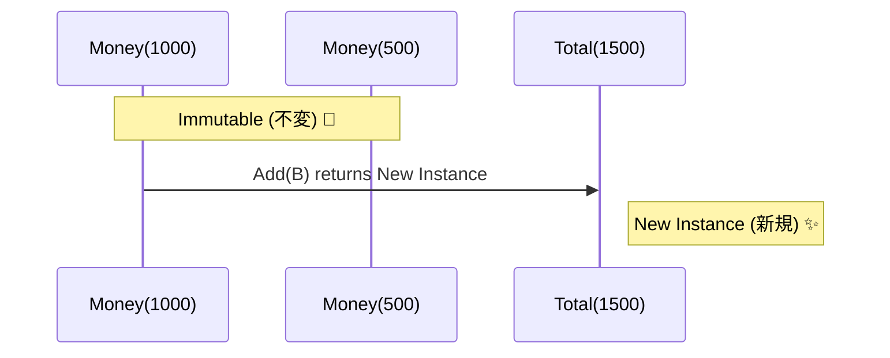

# 第38章 不変の魔法 イミュータブルで迷いを減らす🪄✨


この章でやりたいことはシンプルです👇
**「一度できた値は、あとから誰にも勝手に変えさせない」**を体に覚えます😊💪

DDDでは特に、**値オブジェクト**（お金・メールアドレス・期間・数量など）は「変わらない」が超強い武器になります🛡️✨
（エンティティは“状態が変わる”前提なので、そこは分けて考えるよ！）

---

## 1 まずは怖い話 変更できる値はバグ製造機😱💥

「え、setterあるのって普通じゃない？」って思うよね😳
でも、こういうのが地味に地獄を呼びます…🥶

```csharp
public class Money
{
    public decimal Amount { get; set; }   // 変更できちゃう
    public string Currency { get; set; } = "JPY";
}
```

### 何が困るの？🤔

たとえば「注文合計」を計算して、あとでどこかが `Amount` を変えたら…
**“過去に計算したはずの合計”が、いつの間にかズレる**ことが起きます😵‍💫💦

* 「合計が合わない」
* 「いつ変わったのか追えない」
* 「AIに聞いても原因が点でしか見えない」

こういう “謎” が増えるほど、1人開発はキツくなるの😭🌀

---

## 2 不変だと何がうれしいの？😊🌟

不変（Immutable）の良さは、ざっくりこれ👇

* **考える量が激減**🧠➡️🫧
  「この値は変わらない」って決め打ちできる
* **バグの原因が減る**🐛❌
  途中で書き換わらないから、追跡が簡単
* **AIに指示が通りやすい**🤖📣
  「値オブジェクトは不変で」って言うだけで、生成コードが安定する
* **同値比較がラク**✅
  値が同じなら同じもの、が自然にできる（recordが強い）

---

## 3 C#で不変を作る最短ルート record を使う🎯✨

C#の今どきだと、**record**が「値オブジェクトの相棒」になりやすいです😊
（C# 13 の流れでも record 前提で書かれることが多いよ〜）([Microsoft Learn][1])

### 例 不変の Money 値オブジェクト💴✨

```csharp
public readonly record struct Money(decimal Amount, string Currency)
{
    public static Money Jpy(decimal amount) => new(amount, "JPY");

    public Money Add(Money other)
    {
        if (Currency != other.Currency)
            throw new InvalidOperationException("通貨が違うお金は足せないよ😵");

        return new Money(Amount + other.Amount, Currency);
    }
}
```

ポイントはこれ👇✨

* **readonly record struct** → いじれない感が強い🧊
* 足し算したいなら **自分を変えずに新しい値を返す**🆕
* ルールもこの中に置ける（次章でバリデーション深掘りするよ😉）

使うとこう👇

```csharp
var a = Money.Jpy(1000);
var b = Money.Jpy(500);

var total = a.Add(b);   // aは変わらない😊
Console.WriteLine(total); // 1500
```



---

## 4 with 式は「コピーして一部だけ変更」🧪✨

record の便利技！🌟
「元はそのまま、別の新しいやつを作る」が自然に書けます😊

```csharp
public record Email(string Value);

var e1 = new Email("a@example.com");
var e2 = e1 with { Value = "b@example.com" }; // e1はそのまま✨
```

この “安心感” が不変の魔法🪄✨

---

## 5 でもコレクションが入ると一気に事故る😱📦

値オブジェクト自体が不変でも、**中に List が入ってると実は不変じゃない**ことがあるよ⚠️

```csharp
public record OrderDraft(List<string> Items); // これ危険😱
```

`Items.Add(...)` できちゃうので、**外から中身が変わる**🌀

### 対策1 Immutable コレクションを使う🧊✨

`System.Collections.Immutable` を使うと、追加しても「新しいコレクション」が返る仕組みです😊
（.NET向けに提供されているイミュータブルコレクションだよ）([Microsoft Learn][2])

```csharp
using System.Collections.Immutable;

public readonly record struct Tags(ImmutableArray<string> Values)
{
    public Tags Add(string tag) => new(Values.Add(tag));
}
```

### 対策2 IReadOnlyList で外に渡すときだけ守る🛡️

```csharp
public class Order
{
    private readonly List<string> _items = new();

    public IReadOnlyList<string> Items => _items; // 追加は外からできない😊

    public void AddItem(string item) => _items.Add(item);
}
```

これは「エンティティは変化OK」の考え方と相性がいいです👍✨

---

## 6 ありがちな落とし穴 ここだけ注意ね😉⚠️

* **public set を生やすと終了**🧟‍♀️
  「不変」の前提が崩れる
* **record に List を入れるのは罠**🪤
  中身が変わる
* **エンティティまで全部不変にしようとして苦しくなる**😵‍💫
  まずは「値オブジェクト中心」でOK！

---

## 7 AIを味方にするコツ プロンプト例🤖💡

Copilot / AI拡張に、こう投げると強いです👇✨

* 「このクラスを**値オブジェクト**として **immutable** にして。`record` を使って、setter禁止。中にコレクションがあるなら `System.Collections.Immutable` を使って」
* 「この値オブジェクトの**不変条件**（破ってはいけないルール）を箇条書きにして、そのルールが守られる実装に直して」
* 「変更できないことを前提に、ユニットテストを3本作って（正常系2、異常系1）」

AIに“設計の型”を渡すと、暴走しにくくなるよ😊🧯✨

---

## 8 ミニ演習 今日の手を動かすやつ✍️🎀

### 演習1 Money を不変にしてみよう💴

1. `Money` を `readonly record struct` にする
2. `Add` を実装（通貨が違ったらエラー）

### 演習2 Email を不変にしてみよう📧

* `record Email(string Value)` にして
* `Normalize()`（小文字化して新しい Email を返す）を作る

### 演習3 コレクション不変チャレンジ📦🧊

* `Tags` を作る（タグ文字列の集合）
* 内部を `ImmutableArray<string>` にして
* `Add` で新しい `Tags` を返す

---

## まとめ 今日の合言葉😊✨

**「変えたいなら、新しいものを作ろう」**🆕🪄
不変を入れると、未来の自分が迷わなくなります🥰🎉

次の章（第39章）は、さらに強くするやつ！
**「不正な値を誕生させない」バリデーションの置き場所**へ進もうね😉🔥

[1]: https://learn.microsoft.com/en-us/dotnet/csharp/whats-new/csharp-13?utm_source=chatgpt.com "What's new in C# 13"
[2]: https://learn.microsoft.com/en-us/dotnet/api/system.collections.immutable?view=net-10.0&utm_source=chatgpt.com "System.Collections.Immutable Namespace"
