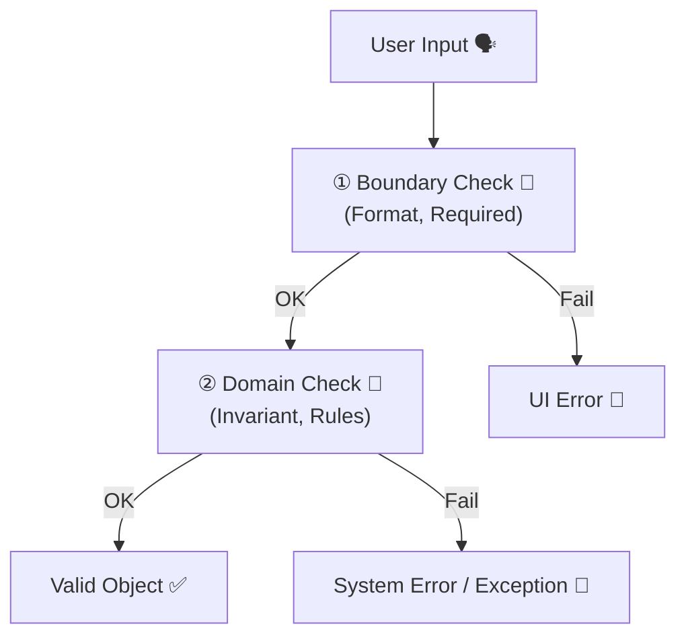

# 第39章：バリデーションの置き場所 😵‍💫➡️😌✨


**不正な値を持つオブジェクトは、この世に誕生させない**💪👶🚫

---

## ねらい 🎯

この章を読み終えると…

* 「どこでチェックするのが正解？」が迷わなくなる😌✨
* **“不正な状態のまま生きているオブジェクト”**を作らなくなる🧟‍♂️🚫
* AI（Copilot等）にお願いするときも、指示がブレなくなる🤖🧠✨

---

## まず結論：バリデーションは「境界」と「ドメイン」に置く 🧱🚪💎


バリデーション（検証）って、実は種類が混ざりやすいんです😵‍💫
だから、置き場所を **2つに分けて考える** のがコツです👇

### ① 境界（入力の入り口）でやるもの 🚪📝

* 文字数、必須、形式（メールっぽい？）
* “ユーザー入力として不自然” なものを弾く
  例：空欄、長すぎ、数字だけ、など

👉 ここは **UI / API / Application層** 側でOK👌✨
（DTOの検証、FluentValidation、DataAnnotations など）

### ② ドメイン（ルールの中核）でやるもの 💎📜

* ビジネスルール（仕様）として絶対に守りたいこと
* 破ったらシステムが壊れるレベルの「不変条件（invariant）」

👉 ここは **Domain層のコンストラクタ / Factory / メソッド内** に置きます🔥



---

## 重要フレーズ：**「不正な状態を作れない」設計** 🛡️✨


DDDのノリだとこうです👇

* ❌ 作ってから `Validate()` して「エラーでした」
* ✅ **作る時点で弾いて、そもそも生まれない** 👶🚫

これができると、コードが一気に安心になります😌🌸
「どこかでチェックしたはず…」が消えます🫥🧨

---

## ありがちな事故パターン 😱💥

### パターンA：DTOでチェックしたからOKだと思った


「APIで弾いたし！」→ **別ルートから入って破滅**😇
（バッチ処理、管理画面、将来の追加機能、テストコード…）

✅ **ドメインでも守る**：最終防衛ラインはドメイン💎🛡️

---

### パターンB：Entityが「後から設定」で無限に壊れる

プロパティ `set;` が生きてると…
いつでも不正な状態にできます😱🔓

✅ **不変にしたり、変更はメソッド経由にする**✨

---

## C#での王道：Value Objectは「作る時に検証」🥇📦


例：Email（値オブジェクト）📧
**不正なEmailは生成できない**ようにします🔥

#### ✅ Resultパターン版（例外を投げない派）🙂

```csharp
using System.Text.RegularExpressions;

public readonly record struct Email
{
    private static readonly Regex EmailRegex =
        new(@"^[^@\s]+@[^@\s]+\.[^@\s]+$", RegexOptions.Compiled);

    public string Value { get; }

    private Email(string value) => Value = value;

    public static Result<Email> Create(string? value)
    {
        if (string.IsNullOrWhiteSpace(value))
            return Result.Fail<Email>("メールアドレスは必須です📧");

        value = value.Trim();

        if (value.Length > 254)
            return Result.Fail<Email>("メールアドレスが長すぎます😵");

        if (!EmailRegex.IsMatch(value))
            return Result.Fail<Email>("メールアドレスの形式が不正です🙅‍♀️");

        return Result.Ok(new Email(value));
    }

    public override string ToString() => Value;
}

public sealed record Result(bool IsSuccess, string? Error)
{
    public static Result Ok() => new(true, null);
    public static Result Fail(string error) => new(false, error);
}

public sealed record Result<T>(bool IsSuccess, T? Value, string? Error)
{
    public static Result<T> Ok(T value) => new(true, value, null);
    public static Result<T> Fail(string error) => new(false, default, error);
}
```

ポイントはここ👇😍

* `private` コンストラクタで **勝手にnewできない**🔒
* `Create()` が唯一の入口🚪
* 失敗時は `Result.Fail`（UIにそのまま出せるメッセージもOK）📝✨

---

## Entity/集約では「不変条件」を守る 🧑‍⚖️🔥


たとえば「ユーザー名は空にできない」みたいなルールは、
**Entityのメソッドで守る**のが定番です🙂

```csharp
public sealed class User
{
    public Guid Id { get; }
    public string Name { get; private set; }
    public Email Email { get; private set; }

    private User(Guid id, string name, Email email)
    {
        Id = id;
        Name = name;
        Email = email;
    }

    public static Result<User> Create(string? name, Email email)
    {
        if (string.IsNullOrWhiteSpace(name))
            return Result.Fail<User>("ユーザー名は必須です🙂");

        name = name.Trim();

        if (name.Length > 50)
            return Result.Fail<User>("ユーザー名が長すぎます😵");

        return Result.Ok(new User(Guid.NewGuid(), name, email));
    }

    public Result ChangeName(string? newName)
    {
        if (string.IsNullOrWhiteSpace(newName))
            return Result.Fail("ユーザー名は空にできません🙅‍♀️");

        newName = newName.Trim();

        if (newName.Length > 50)
            return Result.Fail("ユーザー名が長すぎます😵");

        Name = newName;
        return Result.Ok();
    }
}
```

✅ “どのルートから呼ばれても壊れない” のが強いです💪✨
UIで弾いてても、ドメインが最後に守ります🛡️💎

---

## どこまでがドメインの責務？迷ったらこれで決める 🧭✨

### ✅ ドメインに置く（絶対守る）💎

* それが破られると「その概念が成立しない」
  例：Moneyがマイナス禁止、予約終了日が開始日より前はダメ、など

### ✅ 境界に置く（ユーザー入力の都合）🚪

* “入力として変” だけど、概念としては成立するかも
  例：住所の入力が空欄、郵便番号のハイフン、など（仕様次第）

📌 ただし…
**境界でやった検証を理由に、ドメインの検証を省略しない**🙅‍♀️🔥
（事故るので…😇💥）

---

## AIに頼むときの「良い指示」テンプレ 🤖✨

Copilot等に投げるときは、こう言うと安定します👇

* 「この型は **不正な値が生成できない** ようにして」🛡️
* 「コンストラクタは private、生成は Create() のみ」🔒🚪
* 「失敗は Result で返して」📦
* 「守るべき不変条件（invariant）は〇〇」📜

例：
「Email値オブジェクトを作って。空/形式/長さをCreateで検証。newできないように。Resultで返して」📧🤖✨

---

## ミニ演習 ✍️🧪（手を動かすと定着します！）

次のどれか1つを、**“不正に生成できない”**で作ってみてね😊✨

1. `Money` 💰

* 金額は0以上
* 通貨コードは `"JPY"` など3文字固定

2. `UserName` 🙋‍♀️

* 空白禁止
* 1〜50文字

3. `DateRange` 📅

* End >= Start
* 期間最大 365日まで

できたら最後に👇も追加すると超よいです🌟

* 「失敗ケース」のユニットテストを2つ以上🧪✨

---

## まとめ 🥰📌

* バリデーションは「境界」と「ドメイン」に分ける🚪💎
* ドメインは **不正な状態を作れない** ようにする🛡️✨
* 生成時（Create/Factory/コンストラクタ）＆変更時（メソッド）で守る🔥
* AIに頼むときも「不正が誕生しない」を合言葉にすると強い🤖💪

---

次の章（第40章）は **Entity** に入っていくよ〜！🧍‍♀️🆔✨
値オブジェクトと何が違うか、ここまでの話が効いてきます😆🎉
