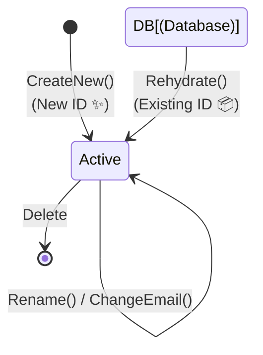

# 第40章：エンティティ（Entity）🏷️✨


**名前が変わっても「同一人物」と認識する仕組み**👩‍🎓➡️👩‍💻

---

## 1. 今日のゴール 🎯😊

この章が終わるころには、次がスッと説明できるようになります👇

* エンティティって何？🤔
* 値オブジェクト（Value Object）と何が違うの？🆚
* **「同一性（Identity）」**ってどう実装するの？🧩
* 変更しても壊れにくいエンティティの作り方は？🛠️✨

---

## 2. たとえばこんな話 📚💡

大学の履修登録アプリを作ってるとします🏫🧑‍💻

* ユーザーが「田中 花子」→「田中 花子（結婚して姓が変わった）」になる💍


* メールアドレスが変わる📧
* 住所も変わる🏠

でも…
**「別人」になったわけじゃない**ですよね？😳

ここで必要なのが👇
✅ **変わっても同一人物として扱う“印（しるし）”**
それが **エンティティのID** です🏷️✨

---

## 3. エンティティの正体 🧠✨

エンティティ（Entity）は一言でいうと…

> **「中身（属性）が変わっても、IDで同一だと判断するオブジェクト」** 🏷️

* 名前が変わっても同じ人🙆‍♀️
* 住所が変わっても同じ人🙆‍♀️
* でも **IDが違うなら別人** 🙅‍♀️

ここが超重要です‼️🔥

---

## 4. 値オブジェクトとの違い（復習つき）🆚✨


ここ、DDD初心者が一番混乱します😵‍💫
なので、超やさしく整理します📦💕

### ✅ 値オブジェクト（Value Object）

* **同一性は「中身」**で決まる
* 例：お金 `Money(1000, JPY)` 💰、メールアドレス `Email("a@b.com")` 📧
* 中身が同じなら同じもの扱い🙆‍♀️
* だいたい **不変（Immutable）** にすることが多い🧊✨

### ✅ エンティティ（Entity）

* **同一性は「ID」**で決まる
* 例：ユーザー `UserId=123` 👤、注文 `OrderId=999` 🧾
* 中身が変わっても同じもの扱い🙆‍♀️
* **ライフサイクル（作成→更新→削除）**がある🌱➡️🌿➡️🍂


---

## 5. 「同一性」をコードにするコツ 🧩🔧

エンティティを作るときの基本ルールはこれ👇

### ルール①：IDは必ず持つ🏷️

IDがないエンティティは、だいたい迷子になります🥺💦

### ルール②：Equalsは「ID」で比べる⚖️


「名前が同じだから同じ人」とかは事故ります🚑💥
同姓同名、あるあるです😭

### ルール③：状態はむやみに外から変えさせない🔒


public setter 開放すると、どこからでも改造されて地獄です😇🔥
**変更はメソッド経由**にして「ルールの門番」を置きましょう🚪🛡️

---

## 6. まずは最小のエンティティを作ってみよう 👤✨

### 例：User（ユーザー）エンティティ

ポイントは👇

* `Id` がある🏷️
* `Rename()` みたいな **意味のある操作**を用意する🧠
* `Equals()` は `Id` 比較にする⚖️

```csharp
public sealed class User
{
    public Guid Id { get; }
    public string Name { get; private set; }
    public string Email { get; private set; }

    // 新規作成用（IDはここで発行する）
    public static User CreateNew(string name, string email)
    {
        ValidateName(name);
        ValidateEmail(email);

        return new User(Guid.NewGuid(), name, email);
    }

    // DBなどから復元用（IDは外から渡す）
    public static User Rehydrate(Guid id, string name, string email)
    {
        if (id == Guid.Empty) throw new ArgumentException("id is empty");
        ValidateName(name);
        ValidateEmail(email);

        return new User(id, name, email);
    }

    private User(Guid id, string name, string email)
    {
        Id = id;
        Name = name;
        Email = email;
    }

    public void Rename(string newName)
    {
        ValidateName(newName);
        Name = newName;
    }

    public void ChangeEmail(string newEmail)
    {
        ValidateEmail(newEmail);
        Email = newEmail;
    }

    // エンティティの同一性はIDで判断する
    public override bool Equals(object? obj)
        => obj is User other && Id == other.Id;

    public override int GetHashCode()
        => Id.GetHashCode();

    private static void ValidateName(string name)
    {
        if (string.IsNullOrWhiteSpace(name)) throw new ArgumentException("name is empty");
        if (name.Length > 50) throw new ArgumentException("name is too long");
    }

    private static void ValidateEmail(string email)
    {
        if (string.IsNullOrWhiteSpace(email)) throw new ArgumentException("email is empty");
        if (!email.Contains('@')) throw new ArgumentException("email is invalid");
    }
}
```



### ここが「いい感じ」ポイント🌟


* `CreateNew()` と `Rehydrate()` を分けたの、地味に大事です🙌

  * **新規作成**：IDを作る✨
  * **復元**：DBから読み出したIDを使う📦
* `Name` や `Email` は `private set` にして、勝手に変えられない🔒
* `Rename()` は「ただの代入」じゃなくて、ルールを通る🚦

---

## 7. 初心者がやりがちな事故あるある 🚑💥（超重要）

### ❌ 事故①：毎回 new Guid しちゃう

更新のたびにIDを作り直すと、別人になります😇

### ❌ 事故②：プロパティ全部 public set

どこからでも好き勝手に壊されます🫠
「ルールの置き場所」が消えてDDD崩壊…🧨

### ❌ 事故③：recordでエンティティを作る

recordは基本が「値で比較」なので、初心者のうちは混乱しやすいです😵‍💫
（できなくはないけど、今は **class推奨** 🙆‍♀️）

### ❌ 事故④：「名前が同じだから同じユーザー」

同姓同名で終わります😭
**IDで比べよう**🏷️✨

---

## 8. AI（Copilot等）を使うときの「良い頼み方」🤖📝✨

AIは便利だけど、放置すると「それっぽいDTO」を作りがちです😇
なので、**最初にルールを言い切る**のがコツです🙌

### そのまま使える指示テンプレ 🧾✨

```text
C#でDDDのEntityを作りたいです。
要件:
- 同一性はId(Guid)で判断する（Equals/GetHashCodeはId基準）
- プロパティは外から勝手に変えられない（private set）
- 状態変更はメソッド経由（Rename, ChangeEmail）
- 新規作成(CreateNew)と復元(Rehydrate)を分ける
- 簡単なバリデーションも入れる
Userエンティティの例をコードでください。
```

AIに作らせた後は、必ずここをチェック✅

* Equalsが中身比較になってない？👀
* public set になってない？👀
* IDの発行タイミングが変じゃない？👀

---

## 9. ミニ演習（手を動かす！）✍️💪😆

### 演習A：ユーザーの仕様追加✨

さっきの `User` に次を追加してみてください👇

* `Deactivate()`（退会）を追加して、`IsActive` を切り替える🚫➡️✅
* 退会後は `ChangeEmail()` を禁止する（例外でOK）🛑

ヒント：状態による禁止ルールは、メソッド内に書くのが基本です🧠✨

---

## 10. 確認クイズ ✅🤔

Q1. エンティティの同一性は何で決まる？

* A: ID🏷️ / B: 名前📛 / C: 全プロパティ

Q2. エンティティのプロパティを `public set` にすると何が起きやすい？

* A: 安全 / B: ルールが崩れる🧨 / C: 高速化

Q3. `CreateNew` と `Rehydrate` を分ける理由は？

* A: 趣味 / B: IDの扱いが違うから🏷️ / C: なんとなく

（答え：Q1=A、Q2=B、Q3=B 🎉）

---

## まとめ 🎁✨

* **エンティティは「IDで同一性を判断する」オブジェクト**🏷️
* 中身が変わっても同じ存在として追いかけられる👣
* 実装のコツは

  * `Id` を持つ
  * `Equals/GetHashCode` は `Id` 基準
  * 状態変更はメソッドで管理（勝手に変更させない）🔒
* AIに書かせるなら、最初にルールを強く指定する🤖✨

---

次の章（第41章）は **「識別子の設計」** です🏷️✨
ここで `Guid` だけじゃなく「UserId型」みたいな世界に入って、さらに迷いにくくなりますよ〜😊💖
