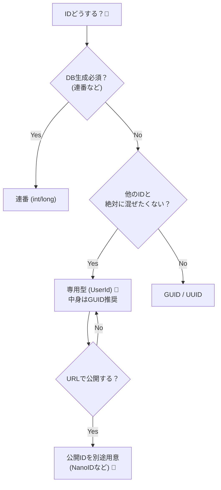

# 第41章：識別子の設計（GUID？連番？それとも UserId 型？）🪪✨


DDDでエンティティ（Entity）を扱うとき、**「IDをどうするか」**は地味だけど超重要です🥹
ここを雑にすると、あとで **バグの温床**になったり、**DBが遅くなったり**、**仕様変更が怖くなったり**します💥

---

## 1. そもそも「識別子（ID）」ってなに？🤔

エンティティは「同一性（identity）」が命です✨
たとえばユーザーは、名前が変わっても「同じ人」ですよね。

* ✅ 名前：変わるかも
* ✅ メール：変わるかも
* ✅ 住所：変わるかも
* ✅ **ID：変わらない（変わっちゃダメ）** 👈ここ！

DDD的には、**IDは“その人そのもの”を指すピン留め📌**みたいなものです。


---

## 2. ID設計でよくある事故😇💣

### 事故①：全部 `Guid` で、型が同じだから混ざる😇


「User の ID」も「Order の ID」も、両方 `Guid` だと…？

* `GetUser(Guid id)` に **OrderId** を渡してもコンパイル通っちゃう 😱
* しかもバグって気づきにくい😇

### 事故②：連番IDをURLに出して “総当たり閲覧” される🔓


`/users/123` → `/users/124` → `/users/125` …みたいに見られちゃうやつです😱

---

## 3. 候補はだいたいこの3つ！🧩

### A) 連番（int / long）🔢

**いいところ**

* DBのインデックスが扱いやすい（基本的に増えていく）📈
* 見やすい（デバッグで楽）👀

**つらいところ**

* 分散・オフライン生成が難しい（DBに行かないと番号が出ない）😵
* URLで公開すると推測されやすい🔓
* “いつIDが確定するか”が保存タイミングになりやすく、DDDでは扱いが面倒になりがち😇

---

### B) GUID / UUID（よく見るやつ）🌀

**いいところ**

* どこでも生成できる（DBに頼らない）✨
* ほぼ衝突しない（ユニーク）🔒

**つらいところ**

* ランダムだとDBのインデックスが散らかりやすい（書き込みが多いと辛いことがある）😵

> ここで登場するのが **UUID v7（時系列っぽいGUID）** です✨


---

### C) 専用の型（UserId 型 / OrderId 型）🧠✨


これがDDD的にめちゃ強いです💪

* `UserId` と `OrderId` を **別の型**にする
* 混ぜたら **コンパイルエラー**で止まる🚫（最高！）

そして中身は `Guid` でも `long` でもOK👍
大事なのは「ドメイン上の意味」を型に持たせることです。

---

## 4. 2025のおすすめ：**「UUID v7 + 専用型」** がバランス最強🥇✨

### UUID v7 ってなに？🕒

UUID v7 は、先頭にタイムスタンプ要素を持つので **“だいたい生成順に並ぶ”**性質があります。
.NET では `Guid.CreateVersion7` が用意されています。 ([Microsoft Learn][1])

この「並びやすさ」で、DBのインデックスが散らかりにくくなるのが嬉しいポイントです😊
（時系列順・断片化の軽減・キャッシュ効率などのメリットが語られています） ([Neon][2])

> ただし！v7 は時間情報を含むので「IDを外部に露出したくない」用途では注意⚠️
> 外部公開用には別の “公開ID” を作る判断もアリです🔐

---

## 5. 実装してみよう：`UserId` 型を作る🛠️✨

C#の `readonly record struct` を使うと、**軽くて・不変っぽくて・比較も強い** ID型が作れます💖
`record struct` / `readonly record struct` は言語機能として用意されています。 ([Microsoft Learn][3])

```csharp
public readonly record struct UserId(Guid Value)
{
    public static UserId New() => new(Guid.CreateVersion7()); // UUID v7 🎉

    public static UserId From(Guid value)
        => value == Guid.Empty
            ? throw new ArgumentException("UserId must not be empty.", nameof(value))
            : new UserId(value);

    public override string ToString() => Value.ToString();
}
```

### 使い方😊

```csharp
var userId = UserId.New();          // 生成✨
var userId2 = UserId.From(someGuid); // 復元✨
```

---

## 6. エンティティ側はこうなる👤✨

```csharp
public sealed class User
{
    public UserId Id { get; }
    public string Name { get; private set; }

    public User(UserId id, string name)
    {
        Id = id;
        Name = name;
    }
}
```

ここで大事なのは…

* ✅ `Id` が `Guid` じゃなくて **UserId**
* ✅ `OrderId` と混ざらない（混ぜたらコンパイルエラー）🎉

---

## 7. EF Core に保存するには？（Value Converter）🧊➡️🧠


EF Core はそのままだと `UserId` をDBに保存できないので、
**「DBでは Guid として保存して、読み書きで変換する」**を設定します✨

EF Core の **Value Converter（値変換）** は公式機能です。 ([Microsoft Learn][4])

```csharp
using Microsoft.EntityFrameworkCore;
using Microsoft.EntityFrameworkCore.Metadata.Builders;

public sealed class UserEntityTypeConfiguration : IEntityTypeConfiguration<User>
{
    public void Configure(EntityTypeBuilder<User> b)
    {
        b.HasKey(x => x.Id);

        b.Property(x => x.Id)
         .HasConversion(
             id => id.Value,
             value => UserId.From(value)
         );

        b.Property(x => x.Name)
         .HasMaxLength(100)
         .IsRequired();
    }
}
```

---

## 8. 連番 vs GUID vs 専用型：迷わない選び方チャート🧭✨

* **「DBに行かずにIDを作りたい？」**
  → YES ✅：GUID / UUID（おすすめは v7）
  → NO：連番でもOK🔢

* **「UserId と OrderId を絶対に混ぜたくない？」**
  → YES ✅：専用型（強い型）を作ろう🧠✨

* **「URLにそのまま出す予定？」**
  → 連番は危険度高め⚠️
  → GUIDでも “推測はされにくい” けど、v7は時間情報に注意🕒
  → 迷ったら **公開用ID（別トークン）** を作るのが安全🔐



---

## 9. AIに頼むと爆速になるポイント🤖💨

### そのまま投げてOKなお願い例📩✨

* 「`UserId` / `OrderId` / `ProductId` を `readonly record struct` で作って。中身は `Guid.CreateVersion7` で生成。`Empty` は禁止。」
* 「EF Core の `HasConversion` 設定を各エンティティに追加して」
* 「DTO では `Guid` に戻して返すマッピングも作って」

AIはこういう**定型作業が超得意**です✌️😆
（あなたは「このIDは公開する？内部だけ？」みたいな判断に集中！🧠✨）

---

## 10. ミニ演習📝✨（15分でOK）

1. `OrderId` を作ろう📦

* `readonly record struct OrderId(Guid Value)`
* `New()` は `Guid.CreateVersion7()`

2. `Order` エンティティに `OrderId Id` を持たせよう🧱

3. EF Core の `HasConversion` を追加しよう🧊➡️🧠

できたら、わざと `UserId` を `Order` の検索に渡してみてください😏
**コンパイルエラー**になったら勝ちです🏆✨

---

## まとめ🎀✨

* IDは「同一性」そのもの📌
* 2025の実装なら **UUID v7** がかなり使いやすい（`Guid.CreateVersion7`） ([Microsoft Learn][1])
* でも最強は **“専用型（UserId 型）”で混ぜさせない**こと🧠✨
* EF Core では **Value Converter** で自然に保存できる ([Microsoft Learn][4])

---

次の章（第42章）では、**「オブジェクトに持たせると不自然な計算」**の置き場所としての **ドメインサービス**に進みますよ〜😊✨

[1]: https://learn.microsoft.com/en-us/dotnet/api/system.guid.createversion7?view=net-10.0&utm_source=chatgpt.com "Guid.CreateVersion7 Method (System)"
[2]: https://neon.com/postgresql/postgresql-18/uuidv7-support?utm_source=chatgpt.com "PostgreSQL 18 UUIDv7 Support - Generate Timestamp- ..."
[3]: https://learn.microsoft.com/en-us/dotnet/csharp/language-reference/builtin-types/struct?utm_source=chatgpt.com "Structure types - C# reference"
[4]: https://learn.microsoft.com/en-us/ef/core/modeling/value-conversions?utm_source=chatgpt.com "Value Conversions - EF Core"
