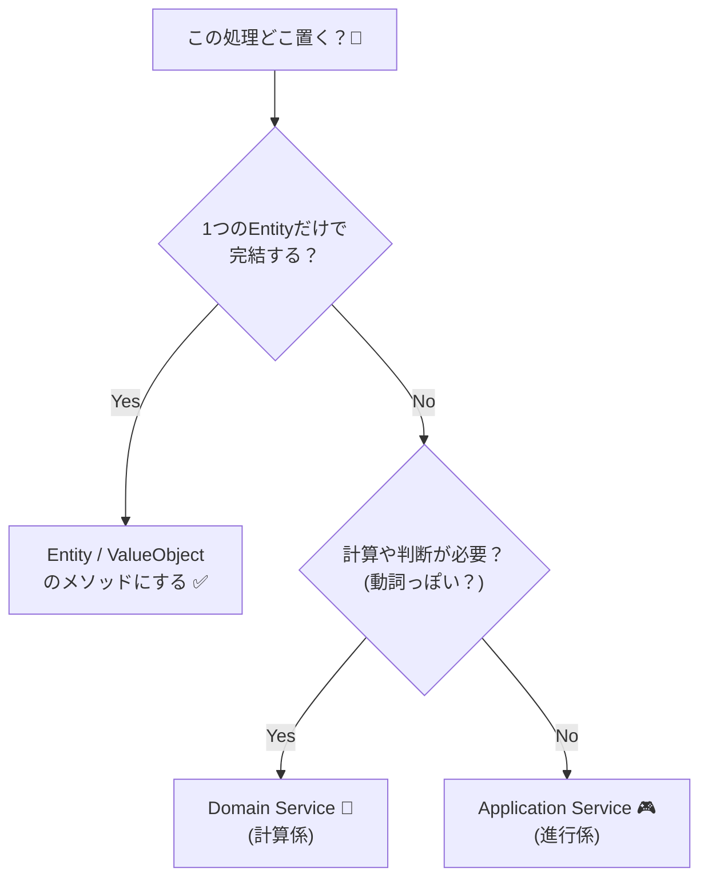

# 第42章：ドメインサービス✨


**〜オブジェクトに持たせると不自然な計算の“置き場所”〜** 🧠💡

---

## 1. まず結論：ドメインサービスってなに？🤔

**「このルール、エンティティ（例：Order）に入れると変…」**って時に使う、**ドメイン層の“計算係”**です💪✨

* エンティティや値オブジェクトに入れると **役割が不自然**になる
* でも、ビジネス的には **超重要なルール**
* だから「サービス」という“形”で **ドメイン層に置く** 🧺

> ざっくり言うと：
> **「主役（エンティティ）じゃないけど、物語のルールを握ってる人」**です📚✨

---

## 2. “サービス”って聞くと混乱しがちポイント😵‍💫

DDDには “サービス” が3種類くらい出てきます。まず整理しよ〜！🧹✨

* **ドメインサービス**：ビジネスルールそのもの ✅（今回）
* **アプリケーションサービス**：ユースケースの手順係（登録→保存→通知…）🧑‍🍳
* **インフラサービス**：DB、メール送信、外部APIなどの技術係 🛠️

この章の主役は **ドメインサービス**なので、
**「DBアクセスしない（させない）」**方向で覚えると迷いにくいよ🙆‍♀️✨

---

## 3. いつドメインサービスを使うの？🧭✨

判断はこれだけでOK！👇

### ✅ ドメインサービスに向いてるケース

* **複数のオブジェクトにまたがるルール**（Orderだけの責任にしにくい）
* **“動詞”っぽい処理**（Calculate / Decide / Judge / Allocate…）
* エンティティに入れると
  「え、Orderさんそれ知ってるの気持ち悪くない？」ってなるやつ😇

### ❌ やりがちな罠

* なんでもかんでもサービスに入れて **“神クラス”化** 👿
  → 結局スパゲッティの親玉になります🍝💥



---

## 4. 例で理解しよう：割引計算💸✨（ドメインサービス向き！）

### 🎀状況

ネットショップで、合計金額を出したい！🛒
ただし割引ルールがややこしい：

* 会員ランクで割引率が違う 🎓
* クーポンがあるとさらに割引 🎟️
* セール期間中は追加割引 🎉

これ、`Order` に全部入れると…

* `Order` が **会員ランク**を知ってる？
* `Order` が **クーポン**や**セール期間**を知ってる？
* なんか **世界観が崩れる** 😵‍💫

なので、**価格計算の専門家**としてドメインサービスを作る！💪✨

---

## 5. 実装してみよう（最小構成）👩‍💻✨

### 5-1. 値オブジェクト：Money（超ざっくり版）💰

```csharp
public readonly record struct Money(decimal Amount)
{
    public Money
    {
        if (Amount < 0) throw new ArgumentOutOfRangeException(nameof(Amount));
    }

    public static Money operator +(Money a, Money b) => new(a.Amount + b.Amount);
    public static Money operator -(Money a, Money b) => new(a.Amount - b.Amount);
    public Money Multiply(decimal rate) => new(Amount * rate);
}
```

### 5-2. エンティティ：Order（合計“前”の材料だけ持つ）🧾

```csharp
public sealed class Order
{
    private readonly List<OrderLine> _lines = new();
    public IReadOnlyList<OrderLine> Lines => _lines;

    public void AddLine(string productName, Money unitPrice, int quantity)
    {
        if (quantity <= 0) throw new ArgumentOutOfRangeException(nameof(quantity));
        _lines.Add(new OrderLine(productName, unitPrice, quantity));
    }

    public Money Subtotal()
    {
        Money total = new(0);
        foreach (var line in _lines)
        {
            total += line.UnitPrice.Multiply(line.Quantity);
        }
        return total;
    }
}

public sealed record OrderLine(string ProductName, Money UnitPrice, int Quantity);
```

### 5-3. “ルール担当”のドメインサービス：PricingService 🧠✨

```csharp
public enum MemberRank { Normal, Student, Premium }

public sealed record Coupon(decimal DiscountRate); // 例: 0.10m で10%OFF

public sealed class PricingService
{
    public Money CalculateTotal(Order order, MemberRank rank, Coupon? coupon, DateOnly today)
    {
        var subtotal = order.Subtotal();

        var rankRate = rank switch
        {
            MemberRank.Normal  => 1.00m,
            MemberRank.Student => 0.95m, // 5%OFF
            MemberRank.Premium => 0.90m, // 10%OFF
            _ => 1.00m
        };

        var afterRank = subtotal.Multiply(rankRate);

        // セール期間（例：12/20〜12/31 はさらに 5%OFF）
        var isSale = today is { Month: 12 } && today.Day >= 20 && today.Day <= 31;
        var saleRate = isSale ? 0.95m : 1.00m;

        var afterSale = afterRank.Multiply(saleRate);

        // クーポン（さらに割引）
        var couponRate = coupon is null ? 1.00m : (1.00m - coupon.DiscountRate);
        var total = afterSale.Multiply(couponRate);

        // 念のため負にならないように（ルール次第）
        if (total.Amount < 0) total = new Money(0);

        return total;
    }
}
```

🎉ポイント！

* `Order` は **“注文の中身”**に集中
* 価格計算のルールは **PricingService** に集中
* ルール変更が来ても「ここ直せばOK」になりやすい✨

---

## 6. じゃあ `Order` に入れちゃダメなの？🙅‍♀️

ダメじゃないよ！☺️
**自然なら入れてOK**です✅

### ✅ `Order` に入れて自然な例

* `AddLine()`（注文の中身を増やす）
* `Subtotal()`（注文自身の情報だけで出せる）

### ✅ ドメインサービスが自然な例

* 会員ランク・クーポン・期間など **注文以外の世界の情報**が必要
* “価格計算”という **専門職**っぽい責務

---

## 7. 迷わないためのチェックリスト✅✨

次の質問に「うん…」となったら、ドメインサービス候補だよ💡

* その処理、**複数のオブジェクト**に関係してる？🤝
* エンティティに入れると、**なんか不自然**？😇
* その処理、名前が **動詞（Calculate / Decide）**っぽい？🏃‍♀️
* 変更されそうな **重要ルール**？🔁

---

## 8. AIに手伝わせると爆速⚡🤖✨

ドメインサービスは、AIに“ルール整理”を頼むとめちゃ楽！💕

### 使えるプロンプト例（コピペOK）📝

```text
あなたはDDDの設計者です。
「合計金額の計算ルール」をドメインサービスとして設計したいです。

条件：
- Orderは注文行（商品名、単価、数量）だけを持つ
- 会員ランク割引、セール期間割引、クーポン割引がある
- DBアクセスや外部I/Oはドメイン層に入れない

お願い：
1) ドメインサービスの責務を1文で
2) メソッドシグネチャ案（引数と戻り値）
3) 境界条件（割引が重なりすぎる、0円未満など）
4) xUnitのテストケースを5つ
```

AIが出した案を見て、あなたは
**「境界条件」だけ最終判断**すればOKになりやすいよ✨🧠

---

## 9. ミニ演習🎯✨

PricingServiceにルールを1個足してみよう！

### お題：送料無料🚚💨

* **小計が 5,000円以上なら送料 0円**
* それ未満なら送料 500円

ヒント：

* 送料も `Money` にしちゃうのが気持ちいいよ💰✨
* 「送料の計算」もドメインサービスに入れてOK（PricingServiceに統合でも分離でもOK）🙆‍♀️

---

## まとめ🎉

ドメインサービスは、**“置き場所に困る重要ルール”の避難先**です🏠✨
エンティティをスッキリ保ちながら、ルールを強く守れるようになるよ💪😊

次の章では、いよいよ **集約（Aggregate）** に入っていくから、
この章の「責務の置き方」が効いてくるよ〜！🔥😆
