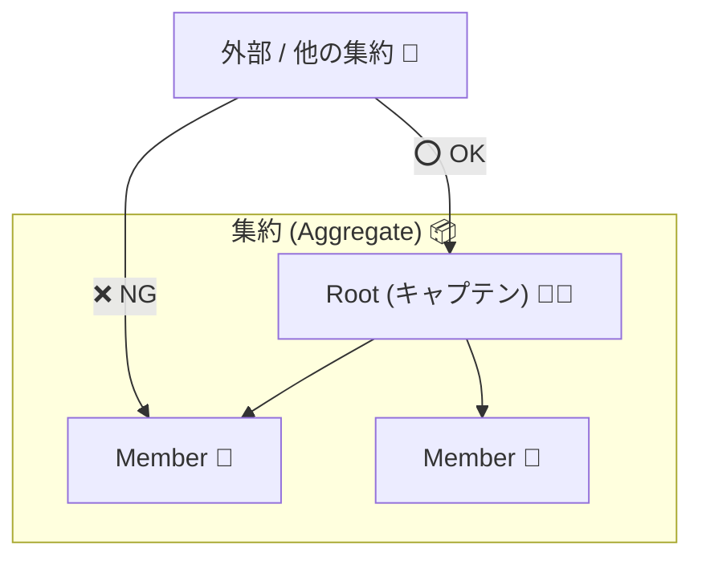

# 第43章：集約（Aggregate）入門 〜関連オブジェクトを1つの「チーム」にする〜 🧩🏀✨


ここからDDDっぽさが一気に出てくるよ〜！😊
**集約（Aggregate）**はひとことで言うと、

> ✅ 「一緒に守りたいルールがあるもの同士」を、1つの“チーム”としてまとめる考え方 📦


です！

---

## この章でできるようになること 🎯✨

* 「どこまでを1セットにまとめるべき？」を考えられるようになる 🧠
* **“守るべきルール（不変条件）”**を壊さない設計の土台が作れる 🔒
* AIにコード生成させても、勝手に境界線を壊されにくくなる 🤖🚧

（ちなみに今の最新C#は **C# 14（.NET 10）**だよ〜 💡） ([Microsoft Learn][1])

---

## まず「集約」ってなに？🤔💭

DDDでは、オブジェクトが増えてくるとこうなるのが自然👇

* 注文（Order）
* 注文明細（OrderLine）
* 価格（Money）
* 商品ID（ProductId）
* 注文状態（Draft / Confirmed）

これらって、バラバラに触っていいと事故るのね😵‍💫💥

### 🚨事故の例（やりがち）

* 注文が確定済みなのに明細が変更できちゃう
* 数量が0や-1になっちゃう
* 明細が勝手に増減して「合計金額」がズレる

こういうのを防ぐために、

✅ **「注文チーム（Aggregate）」**を作って
✅ **チームのルールはチーム内で守る**
✅ **外部からの命令は“キャプテン”経由にする**

…ってやるのが集約だよ😊🏀

---

## 集約の超重要ポイント3つ ⭐⭐⭐

### ① 集約 = “整合性を守る単位” 🔒

**「このルールは絶対守る！」**っていう範囲を決めるのが集約✨
この“絶対守るルール”をDDDではよく **不変条件（Invariant）**って呼ぶよ🧠

### ② 外から触っていいのは「集約ルート」だけ 🚪


チームの中の人（OrderLineなど）を外から直接いじるの禁止🙅‍♀️
必ずキャプテン（Order）を通す！

### ③ 集約の外は「ID参照」が基本 🪪


他の集約（例：Customer集約）を、オブジェクトとして丸ごと持ち始めると
境界線が溶けて地獄になりがち😇🔥
基本は **CustomerId** みたいにIDで持つ！



---

## 例：注文（Order）集約を作ってみよう 🛒✨

今回はこういうチーム構成👇

* 🧑‍✈️ 集約ルート：Order（キャプテン）
* 👩‍🎓 メンバー：OrderLine（明細）
* 🧱 値：Money / ProductId / OrderId

### 1) 値オブジェクト（IDとお金）🪙🪪

```csharp
using System;

public readonly record struct OrderId(Guid Value)
{
    public static OrderId New() => new(Guid.NewGuid());
    public override string ToString() => Value.ToString();
}

public readonly record struct ProductId(Guid Value)
{
    public static ProductId New() => new(Guid.NewGuid());
    public override string ToString() => Value.ToString();
}

public readonly record struct Money(decimal Amount)
{
    public static Money Zero => new(0m);

    public static Money operator +(Money a, Money b) => new(a.Amount + b.Amount);
    public static Money operator *(Money a, int n) => new(a.Amount * n);

    public override string ToString() => $"{Amount:N0}円";
}
```

---

### 2) ドメイン例外（ルール違反をはっきりさせる）🚫⚠️

```csharp
using System;

public sealed class DomainException : Exception
{
    public DomainException(string message) : base(message) { }
}
```

---

### 3) 明細（OrderLine）※外から勝手にいじれないようにする 🧱🔒

```csharp
public sealed class OrderLine
{
    public ProductId ProductId { get; }
    public Money UnitPrice { get; }
    public int Quantity { get; private set; }

    public Money Subtotal => UnitPrice * Quantity;

    public OrderLine(ProductId productId, Money unitPrice, int quantity)
    {
        if (quantity <= 0) throw new DomainException("数量は1以上だよ🥺");
        ProductId = productId;
        UnitPrice = unitPrice;
        Quantity = quantity;
    }

    public void Increase(int quantity)
    {
        if (quantity <= 0) throw new DomainException("増やす数量は1以上だよ🥺");
        Quantity += quantity;
    }

    public void ChangeQuantity(int quantity)
    {
        if (quantity <= 0) throw new DomainException("数量は1以上だよ🥺");
        Quantity = quantity;
    }
}
```

---

### 4) 集約ルート（Order）= キャプテン 🧑‍✈️🏀


ここが主役！✨
**外部はOrderに命令するだけ**。中の人に直接命令しない🙅‍♀️

```csharp
using System.Collections.Generic;
using System.Linq;

public enum OrderStatus
{
    Draft,
    Confirmed
}

public sealed class Order
{
    private readonly List<OrderLine> _lines = new();

    public OrderId Id { get; }
    public OrderStatus Status { get; private set; } = OrderStatus.Draft;

    public IReadOnlyList<OrderLine> Lines => _lines;
    public Money Total => _lines.Aggregate(Money.Zero, (acc, line) => acc + line.Subtotal);

    public Order(OrderId id)
    {
        Id = id;
    }

    public void AddItem(ProductId productId, Money unitPrice, int quantity)
    {
        EnsureDraft();

        var existing = _lines.SingleOrDefault(x => x.ProductId == productId);
        if (existing is null)
        {
            _lines.Add(new OrderLine(productId, unitPrice, quantity));
        }
        else
        {
            existing.Increase(quantity);
        }
    }

    public void ChangeQuantity(ProductId productId, int quantity)
    {
        EnsureDraft();

        var line = _lines.SingleOrDefault(x => x.ProductId == productId)
                   ?? throw new DomainException("その商品は明細にないよ🥺");
        line.ChangeQuantity(quantity);
    }

    public void RemoveItem(ProductId productId)
    {
        EnsureDraft();

        var removed = _lines.RemoveAll(x => x.ProductId == productId);
        if (removed == 0) throw new DomainException("その商品は明細にないよ🥺");
    }

    public void Confirm()
    {
        EnsureDraft();

        if (_lines.Count == 0) throw new DomainException("空の注文は確定できないよ🥺");
        Status = OrderStatus.Confirmed;
    }

    private void EnsureDraft()
    {
        if (Status != OrderStatus.Draft)
            throw new DomainException("確定後の注文は変更できないよ🙅‍♀️");
    }
}
```

---

## 使い方イメージ（外部はキャプテンに命令するだけ）📣✨

```csharp
var order = new Order(OrderId.New());

var apple = ProductId.New();
order.AddItem(apple, new Money(120m), 2);

order.ChangeQuantity(apple, 5);

order.Confirm();

// order.AddItem(apple, new Money(120m), 1); // ← ここは例外になるよ🙅‍♀️
```

---

## ここが「集約」っぽい！ポイント解説 🧠✨

### ✅ 1つのルールを守る場所が「1つ」になる

* 「確定後は変更禁止」
* 「数量は1以上」
* 「空の注文は確定できない」

全部、Order（集約ルート）が責任を持って守ってるよ🔒


### ✅ AIが雑にコード足しても、壊れにくくなる 🤖🚧

AIって、うっかりこういうのやりがち👇

* `order.Lines.Add(...)` みたいに直接いじる
* `Quantity = -1;` みたいな代入を作る

でも、**外から触れる入口を絞る**と、AIの暴走も止めやすいの😊🧯

---

## 集約サイズの考え方（超入門）📏✨

迷ったらこの3つでOK👇

* ✅ **一緒に更新される？**（同時に変わる運命？）
* ✅ **一緒に守りたいルールがある？**（不変条件が共有されてる？）
* ✅ **ライフサイクルが一緒？**（生まれて消えるタイミングが近い？）

YESが多いほど「同じ集約」になりやすいよ😊

---

## AI活用コーナー 🤖💡（コピペで使えるよ）

### ① 不変条件（絶対守るルール）を洗い出すプロンプト 🔒

「注文(Order)と注文明細(OrderLine)がある。
集約の不変条件（壊れたら困るルール）を10個列挙して。
それぞれ“どこで守るべきか（OrderかOrderLineか）”も書いて。」

### ② 集約境界を決めるプロンプト 🧱

「このドメインで集約を分けたい。
“同時更新が必要な範囲”と“不変条件”の観点で、集約案を3パターン提案して。
それぞれのメリット/デメリットも。」

### ③ テスト生成プロンプト 🧪

「上のOrder集約に対して、
“確定後は変更できない” “空の注文は確定できない” “数量1以上” を保証するユニットテストを作って。」

---

## ミニ演習（手を動かすと一気に理解できるよ）✍️😊

次のうち、どれを「同じ集約」にするか考えてみてね👇（理由もセットで！）

### お題A：ToDoアプリ ✅

* TaskList（一覧）
* TaskItem（1件）
* Tag（ラベル）

👉 どれが同時更新される？ どのルールを一緒に守る？

### お題B：予約システム 📅

* Reservation（予約）
* TimeSlot（時間枠）
* Room（部屋）

👉 予約と時間枠は同じ集約？それとも別？どうして？🤔

---

## まとめ 🎁✨

* 集約は **「関連するものをチーム化して、ルールを守る単位」**📦
* 外から触っていいのは **集約ルート（キャプテン）だけ**🧑‍✈️
* ルール（不変条件）を1か所に集めると、**自分もAIも迷いにくい**😊🤖

次の第44章は、いよいよ **「集約ルート」**をもっとハッキリ理解していくよ〜！🏀✨

[1]: https://learn.microsoft.com/en-us/dotnet/csharp/whats-new/csharp-14?utm_source=chatgpt.com "What's new in C# 14"
