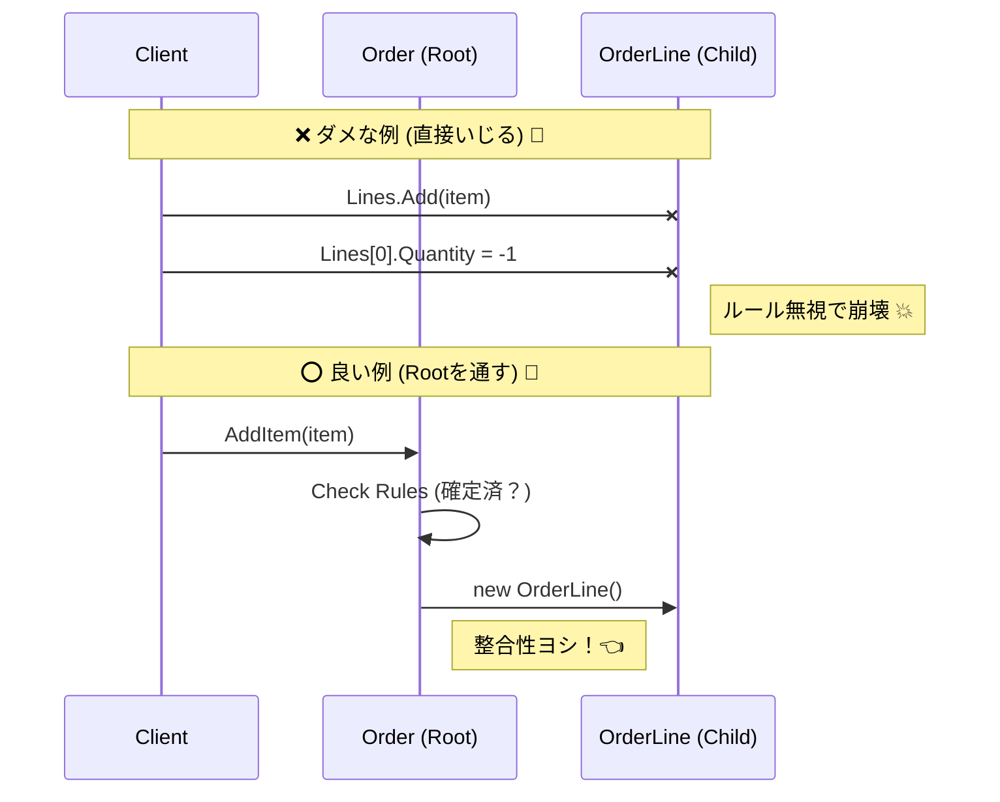

# 第44章：集約ルート 👑✨ 〜チームへの命令はキャプテンを通す！〜


この章では、DDDでめちゃ大事なルール👇を、C#の例つきでスッと理解します😊

**「集約の中の変更は、必ず“集約ルート”から行う」**
つまり…
🧑‍✈️ **チーム（集約）に指示を出すときは、キャプテン（ルート）を通す！** 🏴‍☠️💨

---

## 1) 集約ルートってなに？🤔

集約（Aggregate）＝関係が強いオブジェクトの“ひとまとまり”👥📦
集約ルート（Aggregate Root）＝その集約の**代表（入口）** 👑🚪

外から見たら、集約は「1つの箱」みたいなもの📦


箱の中にはメンバー（子エンティティ、値オブジェクト）がいるけど、**外部は箱の中を直接いじらない**のがルールです🔒

---

## 2) なぜ「ルートを通す」必要があるの？⚠️🧯

理由はシンプル！

### ✅ ルール（整合性）を守るため 🛡️

集約の中には「ビジネスルール」がありますよね？

例：注文（Order）なら…

* 注文が確定したら、明細を変更できない 🙅‍♀️
* 明細の数量は1以上 ✅
* 同じ商品は行をまとめる（重複行を作らない）🧾✨

こういうルールを守るには、**勝手に明細リストをいじられると破綻**します💥

---

## 3) まずは“ダメな例”😇（よくある事故）

「Order の Lines を外から触れちゃう」パターン👇

* どこかの画面で `order.Lines.Add(...)`
* 別の画面で `order.Lines[0].Quantity = -10` 😱
* 「確定済みなのに明細が変わった」😱😱😱


こういう事故を防ぐのが、集約ルートの仕事です👑🛡️




---

## 4) 集約ルートの3つの基本ルール 📏✨


### ルール①：集約の外から、子を直接変更しない 🚫

外部は **ルートのメソッド** だけを呼ぶ📣

### ルール②：集約の整合性（ルール）は、ルートが守る 🛡️

「不正な状態」をこの世に出さない！🔥

### ルール③：保存・復元の単位は “集約ルート” 🗃️

Repository も基本は **ルート単位**（※次章以降で詳しくやるよ😊）

---

## 5) C#で例：Order（集約ルート）を作ってみよう 💻🍰

ここでは

* **Order**：集約ルート 👑
* **OrderLine**：子エンティティ 🧾
* **OrderId / ProductId**：IDの専用型 🏷️
  …みたいな構成にします✨

```csharp
namespace Sample.Domain.Orders;

public readonly record struct OrderId(Guid Value);
public readonly record struct ProductId(Guid Value);

public sealed class DomainException : Exception
{
    public DomainException(string message) : base(message) { }
}

public sealed class Order
{
    private readonly List<OrderLine> _lines = new();

    public OrderId Id { get; }
    public bool IsConfirmed { get; private set; }

    // 外に見せるのは「読み取り専用」だけ 👀🔒
    public IReadOnlyList<OrderLine> Lines => _lines.AsReadOnly();

    public Order(OrderId id)
    {
        Id = id;
    }

    public void AddItem(ProductId productId, int quantity)
    {
        EnsureNotConfirmed();
        if (quantity <= 0) throw new DomainException("数量は1以上にしてね😊");

        // 同じ商品は行をまとめる ✨
        var existing = _lines.FirstOrDefault(x => x.ProductId == productId);
        if (existing is not null)
        {
            existing.Increase(quantity);
            return;
        }

        _lines.Add(new OrderLine(productId, quantity));
    }

    public void ChangeQuantity(ProductId productId, int newQuantity)
    {
        EnsureNotConfirmed();
        if (newQuantity <= 0) throw new DomainException("数量は1以上にしてね😊");

        var line = FindLine(productId);
        line.SetQuantity(newQuantity);
    }

    public void RemoveItem(ProductId productId)
    {
        EnsureNotConfirmed();

        var line = FindLine(productId);
        _lines.Remove(line);
    }

    public void Confirm()
    {
        if (_lines.Count == 0) throw new DomainException("明細が空の注文は確定できないよ😢");
        IsConfirmed = true;
    }

    private OrderLine FindLine(ProductId productId)
        => _lines.FirstOrDefault(x => x.ProductId == productId)
           ?? throw new DomainException("その商品は注文に入ってないよ😗");

    private void EnsureNotConfirmed()
    {
        if (IsConfirmed) throw new DomainException("確定済みの注文は変更できないよ🙅‍♀️");
    }
}

public sealed class OrderLine
{
    public ProductId ProductId { get; }
    public int Quantity { get; private set; }

    internal OrderLine(ProductId productId, int quantity)
    {
        ProductId = productId;
        Quantity = quantity;
    }

    internal void Increase(int add)
    {
        if (add <= 0) throw new DomainException("増やす数量は1以上だよ😊");
        Quantity += add;
    }

    internal void SetQuantity(int newQuantity)
    {
        if (newQuantity <= 0) throw new DomainException("数量は1以上にしてね😊");
        Quantity = newQuantity;
    }
}
```

### ここがポイントだよ〜！🎯✨

* `Lines` を `IReadOnlyList` にして、外から `Add/Remove` できないようにした🔒


* `OrderLine` の変更メソッドを `internal` にして、基本は **Order 経由**にした👑
* 「確定後は変更不可」みたいなルールを、**Order が守ってる**🛡️

---

## 6) 使う側（アプリ層）はこうなる 😊📣

「明細リストを直接いじらない」ってこういうこと👇

```csharp
// OK ✅ ルートに命令する
order.AddItem(productId, 2);
order.ChangeQuantity(productId, 5);
order.Confirm();

// NG ❌ ルートを通さず勝手に触る（できない設計にする！）
/*
order.Lines.Add(new OrderLine(productId, 1)); // できない
order.Lines[0].SetQuantity(-10);              // できない（internal）
*/
```

---

## 7) 集約ルートを決めるコツ 🧠🔍

迷ったらこの質問してね👇

### ✅ 「一緒に同時に守りたいルールはどれ？」🛡️

* “同じタイミングで整合性を守りたいもの” は同じ集約に入れやすい
* 逆に、別々に更新してOKなら、無理に1つにしない🙆‍♀️

### ✅ 「この変更は1つの“箱”の中だけで完結する？」📦

* 1つの操作で、別集約まで巻き込むなら設計を見直すサイン🚦
  （※次の章以降で「集約サイズ」の話が出てくるよ！）

---

## 8) よくある質問 💬😊

### Q1. じゃあ子エンティティを外に返しちゃダメ？

返すのはOK！ただし **外部が勝手に変更できない**ようにするのが大事🔒
（読み取り専用ビュー、DTO、internal、private set などでガード✨）

### Q2. 集約ルートがデカくなりそう…😵

その不安、めっちゃ正しい！👏
「ルートが何でも屋」になりそうなら、集約の切り分けを疑おう🚦
（次章「集約サイズ」で整理しやすくなるよ😊）

### Q3. 別集約を参照したいときは？

基本は **オブジェクト参照じゃなくID参照** が安全🏷️
（例：Order が Customer を持つなら、CustomerId を持つ感じ）

---

## 9) AIに手伝ってもらうプロンプト例 🤖💡

コピペでOKだよ〜📝✨（自分の題材に置き換えてね）

### ✅ 集約ルートの設計をAIに作らせる

* 「◯◯（ドメイン名）の集約ルート候補を提案して。守るべき不変条件（ルール）も箇条書きで。外部から子を直接変更できないC#設計にして」

### ✅ “穴”がないかAIに意地悪チェックさせる😈🔍

* 「このOrder集約で、外部から不正状態を作れる経路がないかレビューして。特にコレクションの公開、setter、例外条件をチェックして」

### ✅ 単体テストも作ってもらう🧪✨

* 「Order集約の不変条件（確定後は変更不可、数量1以上、空注文は確定不可）を検証するユニットテストを作って」

C# 13など最近のC#は、こういう“型でルールを表す”設計がしやすいよ〜😊✨ ([Microsoft Learn][1])

---

## 10) ミニ演習 ✍️💖（今日の一歩）

次のどれか1つでOK！✨

### 演習A：カート（ShoppingCart）🛒

* ルール例：同じ商品は1行にまとめる、数量は1以上、空ならCheckout不可

### 演習B：サークルの出欠（EventAttendance）🎉

* ルール例：締切後は出欠変更不可、同じ人の重複登録禁止

### 演習C：ゲームのパーティ（Party）🧙‍♀️⚔️

* ルール例：最大4人、同キャラ重複不可、リーダーしか編成変更できない（とか！）

**必ず「ルートだけが変更できる」形にしてね👑🔒**

---

## まとめ 🥳✨

* 集約は「箱」📦、集約ルートは「入口＆守護者」👑🛡️
* **外部は子を直接いじらない**（命令はルート経由）🚫
* ルートが **ビジネスルール（不変条件）** を守る✨
* これができると、変更が怖くなくなる＆AIに指示もしやすくなるよ🤖💖

次は **第45章「集約サイズ」**！
「箱をどれくらいの大きさにするのがちょうどいいの？」って話に進むよ〜😊📦✨

[1]: https://learn.microsoft.com/en-us/dotnet/csharp/whats-new/csharp-13?utm_source=chatgpt.com "What's new in C# 13"
