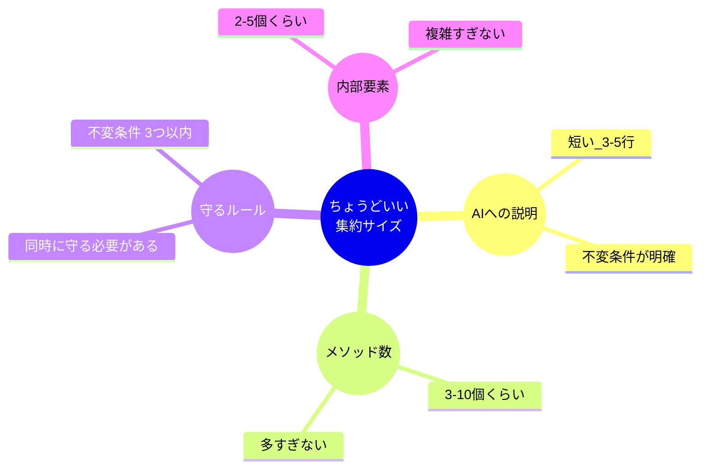

# 第45章：1人開発での集約サイズ 🧩✨


**AIが一度に理解できる「適切な大きさ」って、どう決めるの？🤔💭**

---

## まず結論：集約サイズは「関連してるから」じゃなくて「一緒に守る約束があるから」📌💡

集約（Aggregate）って、つい「関係あるもの全部まとめよ〜」ってやりがちなんだけど…それをすると👇

* クラスが巨大化して読むのがしんどい 😵‍💫
* AIにお願いしたら、勝手に別の責務まで足される 🤖💥
* 1か所直したら別のところが壊れる（未来の自分が泣く）😭

だから集約はこう考えるのがコツだよ👇

✅ **「同時に（1回の更新で）絶対に守りたいルール（不変条件）がある範囲」＝集約**
✅ **そのルールを守る責任を持つのが集約ルート（キャプテン）** 🧑‍✈️✨

---

## 「適切な集約サイズ」を決める3つの質問 🥰🔍

### Q1：そのルール、**“同時”に守らないと事故る？** 🚨

例）イベントのチケット在庫

* 「在庫以上は予約できない」→ これは事故るよね 😱
* だから在庫カウントを守る“責任の塊”が必要！

👉 **“同時に守る必要がある” なら、同じ集約に寄せる価値が高い**

---

### Q2：その更新、**いつも一緒に変更される？** 🔄

「Aを変える時、Bも毎回セットで変える」なら同じ集約候補。
逆に「たまにしか一緒に変えない」なら分けてOK寄り ✂️✨

---

### Q3：それ、AIに説明できる？（3〜5行で）🤖📝

集約の役割をAIに投げるとき、

> 「この集約は〇〇だけを守る。ルールはこれ。公開メソッドはこれだけ。」

これがスッと言えない（長文になる）なら、だいたい **大きすぎ** です 😇

---

## 1人開発×AI視点の「ちょうどいいサイズ」目安 🎯✨

DDDの正統派ルールだけじゃなく、**AIと一緒に作る現実**も入れると、目安はこんな感じ👇

### ✅ 集約ルートは “小さめ” が勝ち 🏆

* だいたい **公開メソッド 3〜10個くらい**
* 「この集約で守る約束（不変条件）」が **最大3つくらい**
* 触る子要素（内部のEntity/ValueObject）は **2〜5種類くらい**（増えたら要注意⚠️）

### ✅ “巨大集約” になりやすい危険サイン 🚧

* `〇〇Service` みたいな名前のメソッドが集約に増えだす（責務混ざり）🥲
* 集約が **他集約の中身**を直接参照しだす（オブジェクト参照が蜘蛛の巣🕸️）
* 1ファイルが長い → AIが “途中の約束” を忘れて別物を生成し始める 🤖💨



---

## 例で掴もう：推し活イベントのチケット予約 🎫💖

ここでは “ありがちな事故” を避けるために、集約をこう分ける案を見てみよう！

### ありがちな巨大集約（やりがち）😵‍💫

`Event` の中に全部入れる：

* イベント情報
* 在庫
* 予約一覧
* 支払い
* 通知ログ
* クーポン適用
* 返金

👉 これ、AIに投げたら「なんでも屋クラス」になって崩壊しやすい💥

---

## 分割案：在庫を守る集約と、予約を表す集約に分ける 🧩✨

### 集約A：Event（在庫を守るキャプテン）🧑‍✈️

* 守る約束：**在庫以上に確保しない**
* やること：席（枚数）を「確保/解放」する

```csharp
public readonly record struct EventId(Guid Value);

public readonly record struct SeatCount(int Value)
{
    public SeatCount(int value) : this()
    {
        if (value <= 0) throw new ArgumentOutOfRangeException(nameof(value), "1以上にしてね🥺");
        Value = value;
    }
}

public sealed class Event
{
    public EventId Id { get; }
    public int Capacity { get; private set; }
    public int Reserved { get; private set; }

    public Event(EventId id, int capacity)
    {
        if (capacity <= 0) throw new ArgumentOutOfRangeException(nameof(capacity));
        Id = id;
        Capacity = capacity;
        Reserved = 0;
    }

    public bool TryReserve(SeatCount count, out string error)
    {
        if (Reserved + count.Value > Capacity)
        {
            error = "満席です😭";
            return false;
        }

        Reserved += count.Value;
        error = "";
        return true;
    }

    public void Release(SeatCount count)
    {
        Reserved -= count.Value;
        if (Reserved < 0) Reserved = 0; // ここは好みで厳密に例外でもOK👌
    }
}
```

> ポイント👉 **“予約そのもの” は持たない**（持つと巨大化しやすい）
> Eventは「在庫の守護神」だけやる 🛡️✨

---

### 集約B：Reservation（予約という事実を守るキャプテン）📝✨

* 守る約束：**予約の状態遷移がおかしくならない**
* やること：予約作成・確定・キャンセル

```csharp
public readonly record struct ReservationId(Guid Value);

public enum ReservationStatus
{
    Pending,   // 仮予約
    Confirmed, // 確定
    Canceled   // キャンセル
}

public sealed class Reservation
{
    public ReservationId Id { get; }
    public EventId EventId { get; }
    public SeatCount Seats { get; }
    public ReservationStatus Status { get; private set; }

    public Reservation(ReservationId id, EventId eventId, SeatCount seats)
    {
        Id = id;
        EventId = eventId;
        Seats = seats;
        Status = ReservationStatus.Pending;
    }

    public void Confirm()
    {
        if (Status != ReservationStatus.Pending) throw new InvalidOperationException("状態が変です😵‍💫");
        Status = ReservationStatus.Confirmed;
    }

    public void Cancel()
    {
        if (Status == ReservationStatus.Canceled) return;
        Status = ReservationStatus.Canceled;
    }
}
```

> ポイント👉 Reservationは **Eventの中身に触らない**（IDだけ持つ）🧷✨
> これで境界がきれいになるよ〜！

---

## 「でも、予約作る時はEventもReservationも更新だよね？」🤔💭

そう！ここで登場するのが **アプリケーション層（ユースケース側）** だよ🛠️✨

* Eventで在庫確保
* 予約作成
* 保存
* もし途中で失敗したら在庫解放（または後で戻す）

この「調整役」を集約に入れると巨大化しやすいので、**集約の外（ユースケース）**に置くのがスッキリ😍

---

## 1人開発で迷わないための「集約サイズチェックリスト」✅✨

### ✅ これを満たすほど “ちょうどいい” 🥳

* [ ] 集約の目的を1文で言える（「在庫を守る」みたいに）
* [ ] 不変条件（絶対守る約束）が最大3つくらい
* [ ] 他集約は **中身じゃなくID参照**だけ
* [ ] 集約ルートのメソッド名だけで、できることが想像できる
* [ ] AIに渡す説明が短い（箇条書きで済む）

### ⚠️ 逆に、分けた方がいいサイン

* [ ] 「通知」「支払い」「認証」「外部API」が集約に入り始めた
* [ ] 集約が肥大化してAIが“勝手に便利機能”を足し始める
* [ ] 変更理由がバラバラ（在庫修正・UI都合・支払い都合…）

---

## AIに“暴走させない”指示テンプレ 🤖🧠✨

Copilot / Codex に投げるときは、こういう **縛り** が効くよ💪😆

### テンプレ1：集約の責務固定📌

* 集約名：`Event`
* 責務：在庫（Reserved/Capacity）を守るだけ
* 不変条件：

  1. Reserved は Capacity を超えない
  2. Reserved は 0未満にならない
* 公開メソッド：`TryReserve`, `Release` のみ
* 禁止：支払い、通知、ユーザー情報、DB、HTTP、ログ

### テンプレ2：サイズ制限📏

* 1ファイル 200行以内
* 1メソッド 20行以内
* privateメソッドOK、ただし責務追加は禁止

---

## 【ミニ演習】あなたがAIの上司です👩‍🏫✨

次の要件で、集約をどう分ける？🧩

### お題：学園祭の「模擬店モバイル注文」🍟🥤

* 注文はキャンセルできる
* 在庫がなくなったら注文できない
* 支払いは外部サービス（失敗することがある）
* 注文確定後に通知を飛ばしたい

✅ やること（おすすめ手順）

1. 「絶対守りたい約束」を3つ書く ✍️
2. それを守る責任を持つ集約を2〜3個に分ける ✂️
3. AIに「集約ごとの責務」をテンプレで渡して、クラス案を作らせる 🤖✨

---

## 今日のまとめ 🥰🎉

* 集約は「関係があるから」じゃなくて **“同時に守る約束”の範囲** 🧠✨
* 1人開発では **小さめ集約**がデバッグもAI運用も強い 💪🤖
* 迷ったら

  * 不変条件（約束）
  * 一緒に更新される頻度
  * AIに短く説明できるか
    で決めるのが安定😍

ちなみに、C#は .NET 9 と一緒に **C# 13** が提供されてて、最新Visual Studioで試せるよ（2025の範囲での“今どき”基準として）😌✨ ([Microsoft Learn][1])
Visual Studio 2022 も継続的に更新されてるから、AI拡張と相性よく進められるよ〜🧠🛠️ ([Microsoft Learn][2])

---

次の章（第46章：リポジトリ）に進む前に、もしよければこの章の演習のお題をベースに、**「集約分割案を3パターン」**こっちで作って見せるよ😊🎯

[1]: https://learn.microsoft.com/en-us/dotnet/csharp/whats-new/csharp-13?utm_source=chatgpt.com "What's new in C# 13"
[2]: https://learn.microsoft.com/en-us/visualstudio/releases/2022/release-history?utm_source=chatgpt.com "Visual Studio 2022 Release History"
