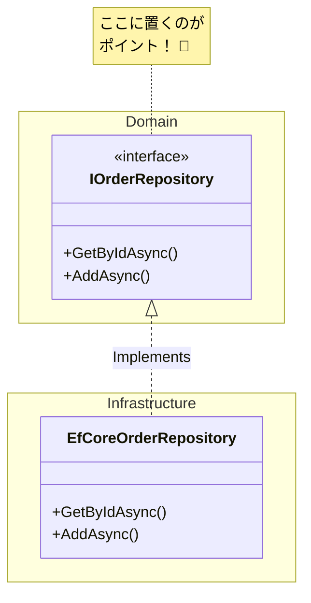

# 第46章：リポジトリ（Repository）🧰✨


〜データの保存・復元を「魔法の箱」に隠すやつ〜🪄📦

---

## 今日のゴール🎯

この章を終えると…

* リポジトリが **何をするもの** か説明できる😊
* 「ドメイン（業務ルール）」と「DB（保存）」を **きれいに分離** できる🌈
* C#で **リポジトリのインターフェース** と **実装（EF Core / InMemory）** を書ける✍️💪
* AI（Copilot等）に “迷わない指示” を出せる📣🤖✨

---

## 1. リポジトリって何？📚

一言でいうと…

**「集約（Aggregate）を、出し入れできる“保管庫”」** だよ🏦📦

ドメインから見ると、リポジトリはこんなイメージ👇

* 取り出す：`Order をIDで取ってくる`
* しまう：`Order を保存する`

しかも重要なのはここ👇

✅ **ドメインは “DBの事情” を知らなくていい** 🙆‍♀️
✅ **リポジトリが “保存のややこしさ” を全部引き受ける** 💪🧠

---

## 2. なんで必要なの？（直でDB触っちゃダメ？）😵‍💫

もしドメインのコードがSQLやEF Coreにベッタリだと…

* ルールを変えたいのに、DB都合に引きずられる😇
* テストでDBが必要になって、遅い＆面倒🐢💥
* 「業務の正しさ」を書く場所が散らかる🧹💦

だから、リポジトリでこう分けるよ👇

* **Domain**：業務ルール（正しさ）👑
* **Infrastructure**：DB保存（現実の面倒）🛠️

---

## 3. リポジトリの“やること / やらないこと”✅❌

### ✅ やること

* **集約ルートを取得する**（例：`GetById`）🔎
* **集約ルートを追加・保存する**（例：`Add` / `SaveChanges`）💾
* **必要なら業務っぽい検索を用意する**（例：`FindByCustomerId`）🧾

### ❌ やらないこと（やりがち注意⚠️）

* `IQueryable` を外に返して「好きにSQL作ってね」しない❌（境界が溶ける🫠）
* なんでも `GetAll()` しない❌（大規模化した瞬間に爆死💣）
* 集約の“中の部品”を単独で保存しない❌（基本は **集約ルート経由**）🧩➡️👑

---

## 4. まずは例：注文（Order）集約で作ってみよう📦🛒

### 4-1. 値オブジェクト：OrderId 🪪✨

```csharp
public readonly record struct OrderId(Guid Value)
{
    public static OrderId New() => new(Guid.NewGuid());

    public static OrderId From(Guid value)
        => value == Guid.Empty
            ? throw new ArgumentException("OrderId must not be empty.", nameof(value))
            : new OrderId(value);
}
```

### 4-2. 集約ルート：Order 👑

```csharp
public sealed class Order
{
    private readonly List<OrderItem> _items = new();

    public OrderId Id { get; }
    public DateTimeOffset CreatedAt { get; }
    public IReadOnlyList<OrderItem> Items => _items;

    private Order(OrderId id, DateTimeOffset createdAt)
    {
        Id = id;
        CreatedAt = createdAt;
    }

    public static Order CreateNew()
        => new(OrderId.New(), DateTimeOffset.UtcNow);

    public void AddItem(string productName, int quantity)
    {
        if (string.IsNullOrWhiteSpace(productName)) throw new ArgumentException("productName is required.");
        if (quantity <= 0) throw new ArgumentOutOfRangeException(nameof(quantity));

        _items.Add(new OrderItem(productName, quantity));
    }
}

public sealed record OrderItem(string ProductName, int Quantity);
```

---

## 5. リポジトリの「理想の置き方」🏗️

ポイントはこれ👇✨

* **Domain に “インターフェース”**（どう使いたいか）📜
* **Infrastructure に “実装”**（どう保存するか）🧰

---

## 6. Domain：IOrderRepository（欲しい動作だけ定義）📜✨

```csharp
public interface IOrderRepository
{
    Task<Order?> GetByIdAsync(OrderId id, CancellationToken ct = default);
    Task AddAsync(Order order, CancellationToken ct = default);

    // 最小構成ならこれでOK（Unit of Workは後で学んでもOKだよ😊）
    Task SaveChangesAsync(CancellationToken ct = default);
}
```

> コツ💡：メソッド名は **業務の言葉** に寄せると迷いにくいよ📘✨
> 例：`FindUnshippedOrdersAsync()` とか🚚📦



---

## 7. Infrastructure：EF Coreで実装してみる🛠️✨

### 7-1. DbContext（OrderIdの変換だけサクッと）🔧

```csharp
using Microsoft.EntityFrameworkCore;

public sealed class AppDbContext : DbContext
{
    public DbSet<Order> Orders => Set<Order>();

    public AppDbContext(DbContextOptions<AppDbContext> options) : base(options) { }

    protected override void OnModelCreating(ModelBuilder modelBuilder)
    {
        var b = modelBuilder.Entity<Order>();

        b.HasKey(x => x.Id);

        // OrderId(Guid) をDBの Guid として保存する変換
        b.Property(x => x.Id)
         .HasConversion(
             id => id.Value,
             value => OrderId.From(value));

        // Items は本章の主役じゃないので、ここでは深追いしないよ😊（後でOK）
    }
}
```

### 7-2. リポジトリ実装（EfCoreOrderRepository）📦🪄

```csharp
using Microsoft.EntityFrameworkCore;

public sealed class EfCoreOrderRepository : IOrderRepository
{
    private readonly AppDbContext _db;

    public EfCoreOrderRepository(AppDbContext db)
        => _db = db;

    public Task<Order?> GetByIdAsync(OrderId id, CancellationToken ct = default)
        => _db.Orders.FirstOrDefaultAsync(x => x.Id == id, ct);

    public Task AddAsync(Order order, CancellationToken ct = default)
        => _db.Orders.AddAsync(order, ct).AsTask();

    public Task SaveChangesAsync(CancellationToken ct = default)
        => _db.SaveChangesAsync(ct);
}
```

### 7-3. DI登録（ASP.NET Core）🧩✨

```csharp
services.AddScoped<IOrderRepository, EfCoreOrderRepository>();
```

---

## 8. テスト最強：InMemoryリポジトリ🧪⚡（DBいらない！）

DDD初心者にめちゃくちゃ効くやつです🙏✨
「ドメインの正しさ」を高速で確認できるよ💨

```csharp
public sealed class InMemoryOrderRepository : IOrderRepository
{
    private readonly Dictionary<Guid, Order> _store = new();

    public Task<Order?> GetByIdAsync(OrderId id, CancellationToken ct = default)
    {
        _store.TryGetValue(id.Value, out var order);
        return Task.FromResult(order);
    }

    public Task AddAsync(Order order, CancellationToken ct = default)
    {
        _store[order.Id.Value] = order;
        return Task.CompletedTask;
    }

    public Task SaveChangesAsync(CancellationToken ct = default)
        => Task.CompletedTask;
}
```

---

## 9. ありがちな落とし穴💥（ここ踏むと迷子）

* **リポジトリが巨大化**：検索メソッド増やしすぎ😵
  → まずは “本当に使う” ものだけでOK👌
* **なんでもRepositoryに突っ込む**：ビジネスルールが消える😇
  → ルールは `Order` などドメインへ🏠
* **ドメインがEF Core属性だらけ**：汚染される🧪
  → できるだけInfrastructure側で頑張る💪

---

## 10. AI（Copilot等）に頼むときの“勝ちプロンプト”🤖🏆

AIは「境界線」を伝えるとめっちゃ優秀になるよ✨

### 10-1. インターフェース作成を頼む📜

```text
C#でDDDのRepositoryインターフェースを作って。
対象はOrder集約ルート。Domain層に置く想定で、EF Coreなどの永続化詳細は一切出さないで。
必要な操作は GetByIdAsync / AddAsync / SaveChangesAsync の最小にして。
CancellationTokenも付けて。
```

### 10-2. EF Core実装を頼む🛠️

```text
IOrderRepository を EF Coreで実装して。
実装はInfrastructure層。DbContextは AppDbContext。
Domain層にはEF Core依存を持ち込まない。
GetByIdAsyncは FirstOrDefaultAsync を使って。
```

### 10-3. レビュー役をやらせる🕵️‍♀️

```text
このRepository設計、DDD的に変なところがあったら指摘して。
特に「IQueryableを返してないか」「集約ルート以外を触ろうとしてないか」を重点的に見て。
```

---

## 11. ミニ演習（手を動かすと一気に理解進むよ）✍️✨

### 演習A：User集約でリポジトリを作ろう👤📦

1. `UserId` を `record struct` で作る🪪
2. `User` 集約ルートを作る👑
3. `IUserRepository` を Domain に作る📜
4. `InMemoryUserRepository` を作る🧪

### 演習B：アプリ層から使ってみよう🎮

`RegisterUser` みたいなユースケース（アプリケーションサービス）で…

* `repo.AddAsync(user)`
* `repo.SaveChangesAsync()`

が呼べたら勝ち🏅✨

---

## まとめ🧡

* リポジトリは **集約ルートの出し入れ係** 📦
* ドメインを **DBのゴチャゴチャから守る壁** 🧱✨
* **Domainにインターフェース / Infrastructureに実装** が基本形🏗️
* InMemoryリポジトリで **テストが爆速** 🧪⚡
* AIには **境界線（Domainを汚さない）** を強く伝えると成功する🤖✅

---

次の第47章で、さらに気持ちよくなります😌✨
「リポジトリはDBの事を知らない」ってどういう意味？を、ちゃんと腹落ちさせようね〜！🚀📘
