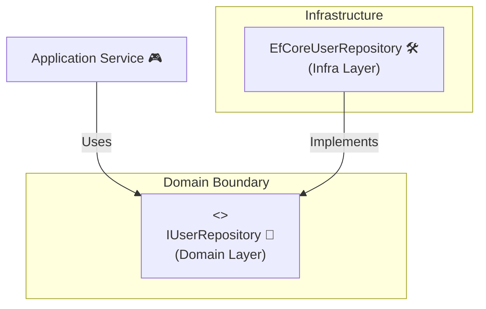

# 第47章：リポジトリはDBの事を知らない 🧺🧠


### 〜SQLをドメイン層に持ち込まない〜 🧹✨

この章のゴールはシンプルです👇
**「ビジネスルールの世界（ドメイン）」と「保存の世界（DB/SQL）」を、ちゃんと別居させる**こと！🏠🏠


---

## 1) まず結論：SQLがドメインに入った瞬間、負けが始まる 😵‍💫💥

ドメイン層って「このアプリのルール」を表現する場所です。
たとえば「会員登録」「注文」「残高」「予約のキャンセル規約」みたいな話ね💡

そこにこんなのが混ざると…👇

* `SELECT ...` とか 🧾
* `DbContext` とか 🧪
* `IQueryable` とか 🧫
* テーブル名・カラム名とか 🧱

**ドメインが“現実の仕事の言葉”じゃなくて、“DBの都合”で歪みます**😇💦


DBを変えたくなった瞬間、ビジネスルールまで巻き添えになります。

そしてAIも混乱します🤖🌀
ドメインにSQLが見えると、AIは「じゃあ全部DB前提で書けばよくない？」って寄っていきがちなんです…。

---

## 2) ありがちなNG例：ドメインがSQLを直に触る 🙅‍♀️🧨

たとえば、ドメインサービスやエンティティの中でDBを触り始めるケース👇

```csharp
// ❌ ドメイン層に置かれてる想定（やっちゃダメ例）
public class UserRegistrationService
{
    private readonly AppDbContext _db;

    public UserRegistrationService(AppDbContext db)
    {
        _db = db;
    }

    public async Task RegisterAsync(string email)
    {
        // SQL/DB都合がドメインに侵入してる😇
        var exists = await _db.Users.AnyAsync(u => u.Email == email);
        if (exists) throw new Exception("すでに登録済みです");

        _db.Users.Add(new User { Email = email });
        await _db.SaveChangesAsync();
    }
}
```

何が困るの？😵‍💫

* 「登録済み判定」という**ルール**が、EF Coreやテーブルの事情と絡みます
* ドメインのテストが、DBなしでやりにくくなります 🧪💦
* 仕様変更じゃなく「DBの都合」でドメインコードが変わります 😭

---

## 3) OK例：ドメインは「保存の方法」を知らない ✅🧠✨

### ポイントはこれ👇

* **ドメイン層：`IUserRepository` という“お願い窓口”だけ知ってる**📮
* **Infrastructure層：EF CoreやSQLで“実際に保存する係”**🛠️
* **Application層：ユースケースを進行する司会**🎤




---

## 4) 具体例：Userリポジトリを「ドメイン言語」で作る 🧸📚

### Domain層：値オブジェクト & エンティティ（超ミニ）

```csharp
public readonly record struct UserId(Guid Value);

public sealed record Email
{
    public string Value { get; }

    public Email(string value)
    {
        if (string.IsNullOrWhiteSpace(value)) throw new ArgumentException("Emailが空です");
        if (!value.Contains('@')) throw new ArgumentException("Emailの形式が変です");
        Value = value;
    }

    public override string ToString() => Value;
}

public sealed class User
{
    public UserId Id { get; }
    public Email Email { get; }

    public User(UserId id, Email email)
    {
        Id = id;
        Email = email;
    }
}
```

### Domain層：Repository “インターフェース”だけ置く 📮✨

> ここ重要：**SQLもDbContextも一切出てこない**🎉

```csharp
public interface IUserRepository
{
    Task<User?> FindByIdAsync(UserId id, CancellationToken ct = default);
    Task<User?> FindByEmailAsync(Email email, CancellationToken ct = default);

    Task AddAsync(User user, CancellationToken ct = default);
}
```

---

## 5) Application層：ユースケースを書く（DBの話はしない）🎮✨

```csharp
public sealed class RegisterUserUseCase
{
    private readonly IUserRepository _users;

    public RegisterUserUseCase(IUserRepository users)
    {
        _users = users;
    }

    public async Task ExecuteAsync(string rawEmail, CancellationToken ct = default)
    {
        var email = new Email(rawEmail);

        var exists = await _users.FindByEmailAsync(email, ct);
        if (exists is not null)
            throw new InvalidOperationException("すでに登録済みです");

        var user = new User(new UserId(Guid.NewGuid()), email);
        await _users.AddAsync(user, ct);

        // SaveChanges をどこで呼ぶかは方針次第（今回は簡略）
    }
}
```

ここまで、**ドメインとアプリはDBが何か知らない**😎✨
「保存してね」ってお願いしてるだけ！

---

## 6) Infrastructure層：EF Coreで“実装”する 🛠️🧪

ここで初めてEF CoreやDbContextが出ます。
**出ていい場所だからね**😉

```csharp
using Microsoft.EntityFrameworkCore;

public sealed class AppDbContext : DbContext
{
    public DbSet<UserRow> Users => Set<UserRow>();

    public AppDbContext(DbContextOptions<AppDbContext> options) : base(options) { }
}

public sealed class UserRow
{
    public Guid Id { get; set; }
    public string Email { get; set; } = "";
}
```

Repository実装（Domainのインターフェースを実現する）👇

```csharp
using Microsoft.EntityFrameworkCore;

public sealed class EfCoreUserRepository : IUserRepository
{
    private readonly AppDbContext _db;

    public EfCoreUserRepository(AppDbContext db)
    {
        _db = db;
    }

    public async Task<User?> FindByIdAsync(UserId id, CancellationToken ct = default)
    {
        var row = await _db.Users.SingleOrDefaultAsync(x => x.Id == id.Value, ct);
        return row is null ? null : new User(new UserId(row.Id), new Email(row.Email));
    }

    public async Task<User?> FindByEmailAsync(Email email, CancellationToken ct = default)
    {
        var row = await _db.Users.SingleOrDefaultAsync(x => x.Email == email.Value, ct);
        return row is null ? null : new User(new UserId(row.Id), new Email(row.Email));
    }

    public async Task AddAsync(User user, CancellationToken ct = default)
    {
        _db.Users.Add(new UserRow { Id = user.Id.Value, Email = user.Email.Value });
        await _db.SaveChangesAsync(ct);
    }
}
```

✅ **SQLでもEFでも好きにしてOK**（Infrastructureの自由）
✅ でも **Domain側の形（インターフェース）は崩さない**
これが「DBの事を知らない」って意味だよ〜！🥳

ちなみに最新世代だと、.NET 10 と EF Core 10 がLTSとして提供されています。([Microsoft Learn][1])
（C# 14 も .NET 10 でサポートされてます）([Microsoft Learn][2])

---

## 7) 超大事：Repositoryから `IQueryable` を返さないで〜！😱🧯

よくある事故👇

```csharp
// ❌ これやると EF Core が上に漏れる（＝DB都合が侵入）
public interface IUserRepository
{
    IQueryable<UserRow> Query(); 
}
```

これをやると、Application層が `.Where(...)` とか始めて、
**DBの都合のコードがドメイン寄りに侵食**します…🧟‍♀️


代わりに👇

* 「何が欲しいか」を**メソッド名で言う**（ドメイン言語で）
* もしくは「検索条件オブジェクト」みたいにする（次の章以降でやると最高）✨

---

## 8) 「でも複雑な一覧検索したい…」問題 🤔📄

ぜんぜんOK！ただし置き場所を分けようね👇

* **更新（書き込み）系**：Repository中心（ドメイン守る）🛡️


* **参照（読み取り）系**：DTOで高速に（必要ならSQLもOK）🚀

読み取りだけの “QueryService” を作るのも定番です☺️
（このへんは第66章のCQRSがめっちゃ効いてくるよ〜📚✨）

---

## 9) AIに頼むときの「事故防止プロンプト」🤖🧷

Copilot / Codex にこう言うと安全度アップ💖

* 「Domain層のコードには `DbContext`, `EntityFramework`, `SQL` を一切出さないで」
* 「Repositoryは `IQueryable` を返さないで」
* 「Repositoryのメソッド名は “テーブル都合” じゃなく “業務の言葉” にして」
* 「Infrastructure層にEF Core実装を作って、Domainのインターフェースを実装して」

プロンプト例👇

```text
Domain層に置く IUserRepository を作ってください。
条件：
- Domain層に DbContext / EF Core / SQL は出さない
- IQueryable を返さない
- メソッド名はドメイン言語（例: FindByEmail）
次に Infrastructure層で EF Core を使って実装してください（EfCoreUserRepository）。
```

---

## 10) ミニ演習（15〜30分）📝✨

### お題：NGコードを「Repository分離」に直そう💪😊

1. どこかの処理で `DbContext` を直接触ってる場所を探す 👀
2. そこがやってることを日本語にする（例：メールでユーザー取得）🗣️
3. Domainに `IUserRepository.FindByEmailAsync(Email)` を作る 📮
4. InfrastructureにEF Core実装を書く 🛠️
5. Applicationからは repository だけ呼ぶ 🎮

できたら勝ち！🏆✨

---

## まとめ 🎀✨

* リポジトリは「保存のお願い窓口」📮
* ドメイン層にSQL/DbContextを入れない（入ったら地獄👻）
* Repositoryのインターフェースは **業務の言葉**で書く 🗣️
* `IQueryable` を返すと漏れるので避ける 🧯
* 読み取りはDTO＆QueryServiceで割り切りもOK 🚀

次の章（第48章）では、**「共通リポジトリをGenericsで作りすぎる罠」**に突入するよ〜！😈📦

[1]: https://learn.microsoft.com/en-us/ef/core/what-is-new/ef-core-10.0/whatsnew?utm_source=chatgpt.com "What's New in EF Core 10"
[2]: https://learn.microsoft.com/ja-jp/dotnet/csharp/whats-new/csharp-14?utm_source=chatgpt.com "C# 14 の新機能"
