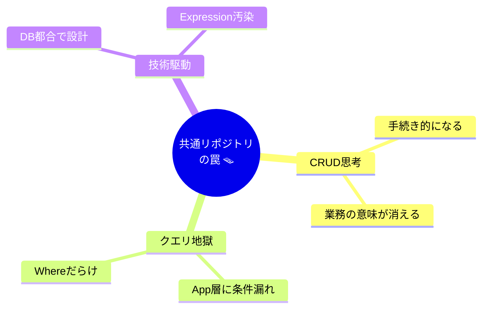

# 第48章：C# Generics を活用した共通リポジトリの罠😇「やりすぎ注意」⚠️


リポジトリを作っていると、だいたい一度はこう思います👇

> 「`Repository<T>` で全部まとめたら、超ラクじゃない？🤩」
> 「AIにも `GenericRepository` 作らせたら、一瞬で終わるじゃん✨」

うん、気持ちはめっちゃ分かる〜！😂
でもDDDでは、**この“ラク”があとで地味に効いてくる罠**になりやすいんです🕳️💥

---

# 1. なにが「罠」なの？🪤

DDDのリポジトリって、ざっくり言うと👇

* **DB操作の道具箱**じゃなくて🧰
* **集約（Aggregate）を出し入れする“専用の棚”**📚

なのに、Genericsで共通化しすぎると……

✅ **設計の中心が「ドメイン」じゃなく「CRUD」になる**
✅ メソッド名が「業務の言葉」じゃなく「技術の言葉」になる
✅ だんだん **“DBを触る都合”でアプリが形作られる**
✅ そして最終的に **Application層がクエリ地獄**になる😵‍💫

「DDDやってるのに、結局DB中心じゃん…🥲」ってなりがちです。



---

# 2. ありがちな「共通リポジトリ」例😺（そして危険）

たとえばこういうやつ👇（気持ちは分かる✨）

```csharp
public interface IRepository<TEntity, TId>
{
    Task<TEntity?> GetByIdAsync(TId id, CancellationToken ct = default);
    Task<List<TEntity>> GetAllAsync(CancellationToken ct = default);
    Task AddAsync(TEntity entity, CancellationToken ct = default);
    Task UpdateAsync(TEntity entity, CancellationToken ct = default);
    Task DeleteAsync(TEntity entity, CancellationToken ct = default);

    Task<List<TEntity>> FindAsync(
        Expression<Func<TEntity, bool>> predicate,
        CancellationToken ct = default);
}
```

一見便利！🤩
でもDDD的には、ここがツラいポイント👇

---

## ❌ 罠ポイント①：「業務の言葉」が消える🫥


`FindAsync(predicate)` って、業務的には何？🤔
例えば注文(Order)なら、本当はこう言いたいはず👇

* 「未払いの注文を探す」💸
* 「期限切れの予約を探す」⏰
* 「再送が必要なメールを探す」📩

でも共通化すると全部 `Find` になって、
**ユビキタス言語（業務の言葉）がインターフェースから蒸発**します🫠

---

## ❌ 罠ポイント②：`Expression` が “インフラ臭” を持ち込む🤢

`Expression<Func<...>>` はEF Coreと相性いいけど、DDD目線だと👇

* ドメイン層のインターフェースが
  **「検索の仕方（技術）」を知ってしまう**😵‍💫
* 将来、DBや検索方式が変わると
  **インターフェースが巻き添え**になる⚡

---

## ❌ 罠ポイント③：Application層が「クエリ職人」になる👩‍🍳


共通リポジトリがあると、ユースケース側がだんだんこうなる👇

```csharp
var orders = await _repo.FindAsync(
    o => o.Status == OrderStatus.Unpaid
      && o.CreatedAt < DateTimeOffset.UtcNow.AddDays(-7)
      && o.TotalAmount > 0,
    ct);
```

これ、**ドメイン知識（未払い、7日、金額…）がApplication層に漏れてる**んですよね🥲
増えてくると「どこに何のルールがあるの？」って迷子になります🌀

---

# 3. DDDっぽい「正解寄り」✅：集約ごとのリポジトリにする📦


DDDではふつう、**集約ルートごとに専用リポジトリ**を作ります✨
（“注文の棚📚” “顧客の棚📚” みたいなイメージ）

例：Order 集約のリポジトリ

```csharp
public interface IOrderRepository
{
    Task<Order?> GetByIdAsync(OrderId id, CancellationToken ct = default);
    Task AddAsync(Order order, CancellationToken ct = default);

    // 👇 業務の言葉でクエリできるのが強い！
    Task<bool> ExistsOrderNumberAsync(OrderNumber number, CancellationToken ct = default);
    Task<List<Order>> FindUnpaidOlderThanAsync(TimeSpan age, CancellationToken ct = default);
}
```

この形の良いところ👇

* メソッド名が **業務そのもの**🗣️✨
* “やりたいこと”が読める📖
* ルールの置き場所がブレにくい🧭
* AIに指示もしやすい🤖💡（「未払い古い注文を探すメソッド作って」で通る）

---

# 4. 「でも共通化したい…🥺」→ やっていい共通化／ダメな共通化

## ✅ やっていい共通化（裏側だけ）🧊


インターフェースは専用のまま、**実装の中で共通化**するのはアリ🙆‍♀️✨
例えば Infrastructure にだけ、こっそり置く👇

* `RepositoryBase<TEntity>`（EF Coreの共通処理まとめ）
* `DbContext` 周りの共通処理
* `SaveChanges` の取り回し

つまり、**外に見せる顔（インターフェース）はドメイン語**、
**中身（実装）は共通化でOK**です😎👍

---

## ❌ やりすぎ共通化（表に出す共通IRepository）🧨

* `IRepository<T>` をドメイン層に置く
* `Find(Expression<...>)` をドメイン層の契約にする
* `GetAll()` が普通に呼べる（←危険⚠️ “全部取る” が癖になる）

このへんは、DDD初心者ほどハマりやすいです😂🪤

---

# 5. 「共通Repoが欲しい！」の本当の気持ちを分解しよう🧠✨

共通化したくなる理由って、だいたいこれ👇

* 似たようなCRUDが多い😵
* 毎回同じ実装が面倒🥺
* AIに作らせたら速いから、構造もAIに寄せたくなる🤖

ここでおすすめの考え方👇

✅ **“繰り返しコード”はAIで解決する**
✅ **“設計の言葉”は共通化で消さない**

つまり、**共通化でラクをするんじゃなくて、AIでラクをする**のが今っぽいです✨🤝

---

# 6. AIに頼むときの「良い指示」テンプレ🤖📝


Copilot/Codexにこう投げると事故りにくいです👇

```text
Order集約のリポジトリIOrderRepositoryを作って。
DDD前提で、CRUDっぽい汎用メソッド名は避けて。
ユビキタス言語で、業務の意図が分かるメソッド名にして。
Expression<Func<...>> や IQueryable はインターフェースに出さないで。
必要なメソッドは
- GetByIdAsync
- AddAsync
- ExistsOrderNumberAsync
- FindUnpaidOlderThanAsync
```

ポイントは「ダメな形を先に禁止する」ことです😆🚫

---

# 7. まとめ🎀（今日のゴール）

* Genericsで `IRepository<T>` を作ると、**DDDがCRUDに寄りやすい**⚠️
* **インターフェースは集約ごとに作る**のが基本📦✨
* 共通化したいなら、**実装の内部（Infrastructure）でこっそり**やる🧊
* “ラク”は共通化で取るより、**AIで取る**🤖💨

---

# ちょい演習🎓✨（10〜15分）

あなたの適当な集約（例：`User`, `Task`, `Order` なんでもOK）で👇

1. まず `IRepository<T>` っぽい案をAIに作らせる🤖
2. その後で「DDD前提で、集約専用リポジトリに直して」と頼む🛠️
3. 最後に、**メソッド名が業務の言葉になってるか**チェック✅🗣️

「`Find` って何探してるの？🤔」って聞いて答えられなかったら、だいたい改善ポイントあります😆👍

---

次の章（第49章）は「Factory」🏭✨
“生成が複雑な子を、ちゃんと生ませる方法”やっていこうね〜😊🎉
