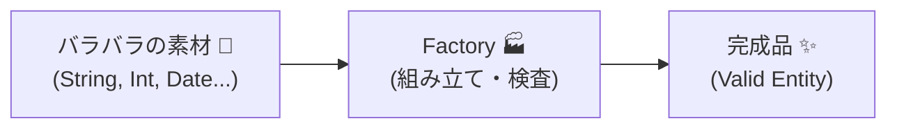

# 第49章：ファクトリ（Factory）—「作る」を賢く分けて、設計で迷わない✨🏭


この章では、DDDでよく出てくる **Factory（ファクトリ）** を、超やさしく「使いどころ」から理解していきます😊
結論から言うと…

> **「複雑なオブジェクトの組み立て」を、本人（エンティティ/集約）にやらせすぎないための仕組み**です🏗️✨

---

## 1. まずイメージ：コンストラクタ地獄が始まる😇💥


たとえば「ユーザー登録」のドメインを考えます。

* ユーザーIDは専用の型で持ちたい
* Emailは正しい形式だけ許したい
* パスワードはハッシュ化して保存したい（生パスは持ちたくない🙅‍♀️）
* 登録直後の状態（Activeなど）を自動でセットしたい
* 作成日時も自動で入れたい

ここで、全部をコンストラクタでやると…

* 引数が増えすぎる
* どの順番？何渡すの？が毎回迷う
* 「うっかり不正な状態」が作れちゃう

…ってなりがちです😵‍💫💦

---

## 2. Factoryの役割：**「正しい完成品だけ」作る🏭✅**


ファクトリがあると何が嬉しいの？

* ✅ **生成ルール（ビジネスルール）を1箇所に集められる**
* ✅ **不正な状態のオブジェクトを作れなくできる**
* ✅ **“作るための依存” をドメインに漏らさない**（ハッシュ化とか時計とか）
* ✅ **AIにコード生成させる時も指示が超ラク**🤖✨（入口が1つになる）


---

## 3. まずは一番カンタン：`static Create()` という“小さな工場”🏭🧸


「ファクトリ＝別クラス」じゃなくてもOKです！
最初は **エンティティの中に `Create` を用意**するだけでも十分DDDっぽいです😊

### ✨例：Email（値オブジェクト）とUser（エンティティ）

```csharp
public readonly record struct Email
{
    public string Value { get; }

    private Email(string value) => Value = value;

    public static Email Create(string value)
    {
        if (string.IsNullOrWhiteSpace(value))
            throw new ArgumentException("Email is required.");

        // ゆるめのチェック（本格的な正規表現は後でOK）
        if (!value.Contains('@'))
            throw new ArgumentException("Email must contain '@'.");

        return new Email(value.Trim());
    }

    public override string ToString() => Value;
}
```

```csharp
public readonly record struct UserId(Guid Value)
{
    public static UserId New() => new(Guid.NewGuid());
}
```

```csharp
public sealed class User
{
    public UserId Id { get; }
    public Email Email { get; }
    public string PasswordHash { get; }
    public DateTimeOffset CreatedAt { get; }
    public bool IsActive { get; }

    private User(UserId id, Email email, string passwordHash, DateTimeOffset createdAt, bool isActive)
    {
        Id = id;
        Email = email;
        PasswordHash = passwordHash;
        CreatedAt = createdAt;
        IsActive = isActive;
    }

    // ✅ “作り方”をここに固定できる
    public static User CreateNew(Email email, string passwordHash, DateTimeOffset now)
    {
        if (string.IsNullOrWhiteSpace(passwordHash))
            throw new ArgumentException("PasswordHash is required.");

        return new User(
            id: UserId.New(),
            email: email,
            passwordHash: passwordHash,
            createdAt: now,
            isActive: true
        );
    }
}
```

### ✅ これだけでも「Factoryっぽい」理由

* `new User(...)` を外に公開してない → 変なUserを作れない🙅‍♀️
* 生成ルールが `CreateNew` に集約される → 迷わない✨

---

## 4. でも本番はここから：**依存があるなら“別クラスのFactory”**が強い💪🔥

「パスワードをハッシュ化する」とか「現在時刻を取る」とかって、User本人がやると不自然になりがちです。

* Userがハッシュアルゴリズムを知ってる…🤔（ドメインの責務っぽくない）
* Userが `DateTimeOffset.Now` を呼ぶ…🤔（テストしづらい）

こういう時に、**UserFactory** の出番です🏭✨

---

## 5. “Factoryクラス”版：UserFactoryで全部組み立てる🧩✨


### ① 依存のインターフェースを用意

```csharp
public interface IPasswordHasher
{
    string Hash(string rawPassword);
}

public interface IClock
{
    DateTimeOffset Now { get; }
}
```

（実装は後でInfrastructure側に置くイメージです😊）

### ② Factory本体（ドメイン側）

```csharp
public sealed class UserFactory
{
    private readonly IPasswordHasher _hasher;
    private readonly IClock _clock;

    public UserFactory(IPasswordHasher hasher, IClock clock)
    {
        _hasher = hasher;
        _clock = clock;
    }

    public User CreateNew(string emailRaw, string rawPassword)
    {
        // ✅ 値オブジェクト生成もここでまとめてOK
        var email = Email.Create(emailRaw);

        if (string.IsNullOrWhiteSpace(rawPassword) || rawPassword.Length < 8)
            throw new ArgumentException("Password must be at least 8 characters.");

        var hash = _hasher.Hash(rawPassword);
        var now = _clock.Now;

        return User.CreateNew(email, hash, now);
    }
}
```

### ✅ ここが気持ちいいポイント😍

* 「ユーザーを作る」入口が **1個** になる → 迷わない🌟
* パスワードルール、Email生成、初期値セットが **一箇所** → 変更に強い🔧
* テストが超簡単（ClockもHasherも差し替えできる）🧪✨

---

## 6. どんな時にFactoryを使うべき？判断基準🎯


次のどれかに当てはまったら、Factoryを考えると勝ちやすいです😊

* ✅ **作る時にルールがある**（初期状態、必須条件、整合性）
* ✅ **引数が多くなりそう**（newが辛くなる前に止める）
* ✅ **外部サービスが必要**（ハッシュ、採番、日時、乱数、外部APIなど）
* ✅ **「組み立ての順番」が重要**（手順ミスで壊れるタイプ）

逆に、ただのDTOとか、ただのデータ箱なら不要です🙆‍♀️

---

## 7. 初心者がやりがちNG🙅‍♀️💦（ここ注意！）

### ❌ FactoryがDBやSQLを知り始める

それはFactoryじゃなくて「何でも屋」になりがちです😇
DBはリポジトリ側へ。

### ❌ “途中まで作った半完成品”を返す

「あとでセットしてね」系は、未来の自分が泣きます😭
Factoryは **完成品を返す** が基本です🏁✨

### ❌ 生成メソッドが増えすぎる

`CreateA`, `CreateB`, `CreateC` が増えてきたら、
「作りたい種類」自体を見直すサインかもです👀

---

## 8. AI（Copilot/Codex）に頼むときの“勝ちプロンプト”🤖✨


FactoryはAIに作らせやすい部品です😊
こう頼むとブレにくいよ〜というテンプレ👇

* 「UserFactoryを作って。責務は **Userの生成ルールの集約**。Emailは値オブジェクト。パスワードはハッシュ化。Clock/HasherはDI前提。」
* 「Userは `private constructor` にして、外部から `new` できないようにして」
* 「不正な入力は例外でOK（Resultにしたい場合は別案も）」
* 「簡単なユニットテストも一緒に作って（ClockとHasherはFakeで）」

---

## 9. ミニ演習（手を動かすやつ）✍️💪✨

### 演習A：パスワード強度ルールを追加🔒

* `rawPassword` に

  * 8文字以上
  * 数字を1つ以上
    を追加してみよう😊

### 演習B：採番をDIにする🔢

* `UserId.New()` をやめて
* `IUserIdGenerator` を作ってFactoryから注入してみよう！

（ID生成の方針が変わってもFactoryだけ直せるようになるよ✨）

---

## まとめ🌸

* Factoryは **「正しい完成品だけ作る工場」** 🏭✅
* 最初は `static Create()` でも十分！
* 依存（ハッシュ、時計、採番など）が出たら **Factoryクラス** にすると強い💪
* 「作る」を整えると、設計もAI活用も一気にラクになる🤖✨

---

次の章（第50章）は **ドメインイベント** だね📣✨
Factoryで「作る」が整うと、イベントもめちゃ気持ちよく繋がるよ〜😊🎉
