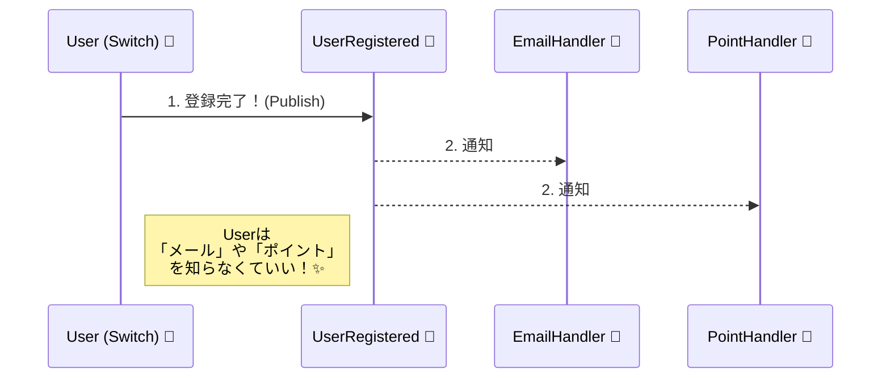

# 第50章：ドメインイベント 〜「起きたこと」をアプリ内に伝える🔔✨


## 今日のゴール🎯

この章が終わったら、こんな状態になれます💪😊

* 「ドメインイベントって何？」を説明できる📣
* “集約の中で起きたこと” を **疎結合で** 通知できる🔗➡️🔓
* C#で「最小のドメインイベント」を自力で組める🧩✨

---

## まずは超イメージ🍩📮

アプリって、だいたいこんなことしてますよね👇

* 会員登録した👤✨
* 注文が確定した🛒✅
* 支払いが完了した💳🎉

この「起きたこと」に合わせて、別の処理が動きます👇

* ウェルカムメールを送る📩
* ポイントを付与する🎁
* 通知ログを残す📝

ここでありがちな地獄がコレ😇👇
**会員登録のメソッドの中に、メール送信やポイント処理がベタ書きされていく問題**💥

> 「登録」なのに、いつの間にか
> メール・ポイント・通知・監査ログ…全部背負って巨人化🧟‍♂️

それを助けるのが **ドメインイベント** です🔔✨



---

## ドメインイベントってなに？🤔🔔

**ドメインの世界で “意味のある出来事” が起きたことを表すデータ**です✨

例：

* `UserRegistered`（ユーザーが登録された）👤✅
* `OrderPlaced`（注文が確定した）🛒✅
* `PaymentCompleted`（支払いが完了した）💳🎉

ポイントはここ👇

✅ **「やるべき追加処理」はイベントを受け取った側がやる**
✅ **「起きたこと」だけをドメイン側が宣言する**

つまり…

* ドメイン（集約）は「登録された！」って言うだけ📣
* メール送信は別の人（別クラス）がやる📮
* ポイント付与も別の人がやる🎁

これで **ごちゃ混ぜが止まる** んです🧯✨

---

## なんで必要？（1人開発ほど効く）🧠💡

1人開発って、未来の自分が別人になるじゃないですか😂（あるある）

ドメインイベントがあると👇

* **「何が起きたか」がコードに残る**📝✨
* 追加処理が増えても、登録処理が汚れにくい🧼
* AIに「このイベントのハンドラ作って」って頼みやすい🤖💬
  （イベント名が“仕様の見出し”になる！）

---

## いつ使う？ いつ使わない？🚦🙂

### 使うと気持ちいいケース😆✨

* 「起きたこと」に対して、**後から処理が増えそう**
  例：会員登録→メール、ログ、紹介コード処理…増えがち📈
* 「集約の責務」を太らせたくない🐷🚫
* 仕様の説明が「イベント名」でできるようにしたい📚

### 使わない方がラクなケース😌

* ただのCRUD（登録したら終わり）で、追加処理が増えなさそう
* “イベント” を乱発して、逆に追いづらくなってる（あるある）😇

---

## ドメインイベントとC#の `event` は別物だよ🙅‍♀️⚡

混ざりやすいので先に釘を刺します📌

* C#の `event`：UIのクリックとか、技術的な通知🖱️
* ドメインイベント：ビジネス的に意味のある出来事🔔

名前が似てるだけで別物です😂

---

## 最小構成：ドメインイベントの部品は3つ🧩✨

最低限これだけでOKです🙆‍♀️

1. `IDomainEvent`（イベントの共通インターフェース）
2. `Entity`（イベントをためておく箱）
3. `Dispatcher/Handler`（イベントを受け取って処理する側）

---

## サンプル：会員登録 → ウェルカムメール📩🎉

### 0. ざっくり登場人物👪

* `User`（集約ルートっぽい）👤
* `UserRegistered`（ドメインイベント）🔔
* `SendWelcomeEmailHandler`（イベントを受けてメール送る人）📮

（実装は .NET 10 / C# 14 の最新系でOKです。）([Microsoft][1])

---

### 1) イベントの共通インターフェース🔔

```csharp
public interface IDomainEvent
{
    DateTime OccurredOnUtc { get; }
}
```

---

### 2) エンティティ基底：イベントを“ためる”🫙✨

「起きたこと」を発行（Publish）するんじゃなくて、まず **溜めておく**のがミソです🧠

```csharp
public abstract class Entity
{
    private readonly List<IDomainEvent> _domainEvents = new();

    public IReadOnlyList<IDomainEvent> DomainEvents => _domainEvents;

    protected void AddDomainEvent(IDomainEvent domainEvent)
        => _domainEvents.Add(domainEvent);

    public void ClearDomainEvents()
        => _domainEvents.Clear();
}
```

---

### 3) ドメインイベント本体：`UserRegistered`👤✅

「何が起きたか」を表すデータです✨
`record` にするとサクッと書けて便利です😊

```csharp
public sealed record UserRegistered(Guid UserId, string Email) : IDomainEvent
{
    public DateTime OccurredOnUtc { get; init; } = DateTime.UtcNow;
}
```

---

### 4) 集約（ここでは User）：登録したらイベントを追加🔔✨

ここ大事ポイント👇
**Userはメールを送らない**🙅‍♀️📮
「登録された！」ってイベントを追加するだけです😊

```csharp
public sealed class User : Entity
{
    public Guid Id { get; }
    public string Email { get; }

    private User(Guid id, string email)
    {
        Id = id;
        Email = email;
    }

    public static User Register(string email)
    {
        // ここで本来は Email のバリデーションとかやる（第39章の話だね😉）
        var user = new User(Guid.NewGuid(), email);

        // 「起きたこと」を記録するだけ！
        user.AddDomainEvent(new UserRegistered(user.Id, user.Email));

        return user;
    }
}
```

---

### 5) ハンドラ側：イベントを受けて処理する📩✨

まずはインターフェース👇

```csharp
public interface IDomainEventHandler<in TEvent> where TEvent : IDomainEvent
{
    Task HandleAsync(TEvent domainEvent, CancellationToken ct);
}
```

ウェルカムメール担当さん👇📮

```csharp
public interface IEmailSender
{
    Task SendWelcomeAsync(string email, CancellationToken ct);
}

public sealed class SendWelcomeEmailHandler : IDomainEventHandler<UserRegistered>
{
    private readonly IEmailSender _emailSender;

    public SendWelcomeEmailHandler(IEmailSender emailSender)
        => _emailSender = emailSender;

    public Task HandleAsync(UserRegistered domainEvent, CancellationToken ct)
        => _emailSender.SendWelcomeAsync(domainEvent.Email, ct);
}
```

---

### 6) ディスパッチャ：溜まったイベントを順番に流す🚚🔔

最初は **超わかりやすい版**でいきます😊
（DIで自動収集する版は第60章あたりで本格的にやると気持ちいいです✨）

```csharp
public sealed class DomainEventDispatcher
{
    private readonly SendWelcomeEmailHandler _sendWelcomeEmailHandler;

    public DomainEventDispatcher(SendWelcomeEmailHandler sendWelcomeEmailHandler)
        => _sendWelcomeEmailHandler = sendWelcomeEmailHandler;

    public async Task DispatchAsync(IEnumerable<IDomainEvent> events, CancellationToken ct)
    {
        foreach (var ev in events)
        {
            switch (ev)
            {
                case UserRegistered e:
                    await _sendWelcomeEmailHandler.HandleAsync(e, ct);
                    break;
            }
        }
    }
}
```

---

### 7) アプリケーションサービス：保存 → コミット → イベント処理✅➡️🔔

「保存が成功した後にイベントを流す」のが基本です😊
（失敗したのにメールだけ飛んだ…は悲しい😭）

```csharp
public interface IUserRepository
{
    Task AddAsync(User user, CancellationToken ct);
}

public interface IUnitOfWork
{
    Task SaveChangesAsync(CancellationToken ct);
}

public sealed class RegisterUserService
{
    private readonly IUserRepository _repo;
    private readonly IUnitOfWork _uow;
    private readonly DomainEventDispatcher _dispatcher;

    public RegisterUserService(IUserRepository repo, IUnitOfWork uow, DomainEventDispatcher dispatcher)
    {
        _repo = repo;
        _uow = uow;
        _dispatcher = dispatcher;
    }

    public async Task<Guid> RegisterAsync(string email, CancellationToken ct)
    {
        var user = User.Register(email);

        await _repo.AddAsync(user, ct);
        await _uow.SaveChangesAsync(ct);

        await _dispatcher.DispatchAsync(user.DomainEvents, ct);
        user.ClearDomainEvents();

        return user.Id;
    }
}
```

これで完成です🎉🎉🎉
「登録ロジック」はスッキリしたまま、後から機能を足せます🧼✨

---

## よくある落とし穴⚠️😵

### 1) イベントに “何でも” 詰め込む📦💥

イベントが肥大化すると、逆に結合が強くなります😇
おすすめは👇

* イベントには **IDや必要最小限の値**だけ
* “エンティティ丸ごと” を持たせない（迷子になりがち）🧭💦

### 2) ドメイン層で外部IOしちゃう🌐🚫

* ドメイン層でメール送信、HTTP呼び出し、DB直接アクセス…は避けたい
* “起きたこと” だけをドメインで宣言して、外部は外側で✨

### 3) イベントの乱発🔔🔔🔔（そして誰も追えない）

「便利だから全部イベントにしよ！」は危険です😂
**“後から増える可能性が高いところ”**に絞ると幸せ😊

---

## AI（Copilot等）に頼むと爆速になるコツ🤖⚡

AIにお願いするときは、こう言うと安定します😊✨

* 「イベント名・意味・持たせたい最小データ」を先に渡す📌
* 「ドメイン層は外部IO禁止」も明記する🧱

例プロンプト👇
（そのままコピペでOKです💬）

```text
C#でドメインイベントを追加したいです。
イベント名: UserRegistered
意味: ユーザー登録が完了した
イベントが持つデータ: UserId(Guid), Email(string), OccurredOnUtc(DateTime)
制約: ドメイン層では外部IO禁止。イベントは「起きたこと」の記録だけ。
このイベントのrecord実装と、Entity基底クラスにイベントを溜める仕組みを作ってください。
```

さらに「ハンドラ側もお願い」するなら👇

```text
上のUserRegisteredイベントを受けてWelcomeメールを送るハンドラを作ってください。
IEmailSenderインターフェースを使い、Application層想定で実装してください。
```

---

## ミニ演習✍️🎮（10〜20分）

次のどっちか好きな方でやってみてください😊✨

### 演習A：注文確定イベント🛒✅

* イベント：`OrderPlaced(OrderId, TotalAmount)`
* ハンドラ：`ReserveInventoryHandler`（在庫引当 “っぽい” ログでもOK📝）

### 演習B：パスワード変更イベント🔐✨

* イベント：`PasswordChanged(UserId)`
* ハンドラ：`SendSecurityNoticeHandler`（注意メール📩）

**チェックポイント✅**

* 集約はイベントを `AddDomainEvent` してるだけ？
* 外部処理はハンドラ側に寄せられてる？
* 保存（コミット）後にイベントを流してる？

---

## まとめ🎀✨

ドメインイベントはひとことで言うと…

**「起きたこと」を名前付きで残して、あとから処理を増やせる仕組み**🔔✨

これができると、1人開発でも
「未来の自分が迷わない」コードにかなり近づきます😊🧭✨

次の章（第51章）は「副作用のない関数」なので、ドメインイベントと相性バツグンですよ〜！🥳🚀

[1]: https://dotnet.microsoft.com/en-us/download/dotnet?utm_source=chatgpt.com "Browse all .NET versions to download | .NET"
