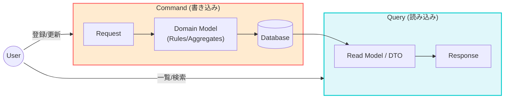

# 第66章：CQRS（コマンドクエリ責務分離）の超入門🚦✨


〜「読み込みはもっと自由でいい」ってどういうこと？〜📚💡

---

## 1. まず最初に：CQRSは“分けるだけ”です✂️🙂


CQRSは、難しい魔法じゃなくて…

* **Command（コマンド）**：データを“変える” 📥🛠️（登録・更新・削除）
* **Query（クエリ）**：データを“読むだけ” 👀📤（一覧・詳細・検索）

この2つを **分けて考える** だけの考え方です✨



---

## 2. なんで分けるの？（1人開発だと特に効く）💪👩‍💻

### ✅ よくある悩み


「一覧画面を速くしたいからSQLをいじったら、更新処理が壊れた…😇」
「読み込み用に便利な形にしたら、ドメインのルールがぐちゃぐちゃ…🌀」

### ✅ CQRSのうれしさ

* **書き込み（Command）は“ルール重視”でガチガチに守る🛡️**
* **読み込み（Query）は“画面に最適”で自由に作る🪽**
* AIに頼む時も、指示がブレにくくなる🤖✨
  （“更新ロジック”と“一覧取得”が混ざるとAIも事故りやすい💥）

---

## 3. CommandとQueryの違い（ここだけ覚えればOK）🧠🌟


### Command（変更する）🛠️

* 目的：状態を変える（登録・更新・削除）
* 成功/失敗が大事（バリデーション・ビジネスルール）
* できれば「集約」や「ドメインルール」を通す

### Query（読むだけ）👀

* 目的：画面に必要なデータを返す
* **副作用なし（読んだだけで何かが変わらない）**
* 速さ・見やすさ優先でOK
  JOINしてもいい、集計してもいい、DTO直でいい🙆‍♀️✨

---

## 4. “読み込みは自由でいい”の具体例🍱📌


たとえば「注文」の一覧画面で…

* ドメイン（書き込み側）は「注文(Order)」をちゃんと守って設計する🛡️
* 一覧表示は「注文日・合計金額・顧客名」が欲しいだけ👀

このとき Query は、
**Order集約を全部復元してから計算…** みたいなことしなくてOKです🙅‍♀️💦
DBから画面用DTOをズバッと取ってきてOK✨（軽い！速い！）

---

## 5. 最小CQRSをC#で作ってみよう（MediatRなし版）🧩✨

ここでは **Command/Queryを「クラスで分ける」だけ** の最小構成でいきます🙂
（MediatRの話は次章の楽しみに🎁）

想定：シンプルな「メモ」アプリ📝

* メモを追加する（Command）
* メモ一覧を表示する（Query）

---

## 6. ざっくり構成（イメージ）🗂️

* Application

  * Commands（書き込み）
  * Queries（読み込み）
* Infrastructure

  * DbContext / DBアクセス
* Web

  * APIエンドポイント

---

## 7. 実装例：Command（追加する）➕🛠️


### DTO（入力）

```csharp
public sealed record CreateNoteRequest(string Title, string Body);
```

### Command（意図を表す）

```csharp
public sealed record CreateNoteCommand(string Title, string Body);
```

### 結果（戻り値）

```csharp
public sealed record CreateNoteResult(Guid NoteId);
```

### Handler（書き込み処理）

```csharp
using Microsoft.EntityFrameworkCore;

public sealed class CreateNoteHandler
{
    private readonly AppDbContext _db;

    public CreateNoteHandler(AppDbContext db) => _db = db;

    public async Task<CreateNoteResult> HandleAsync(CreateNoteCommand command, CancellationToken ct)
    {
        // ⭐ここが「ルールを守る場所」：最低限のバリデーション
        if (string.IsNullOrWhiteSpace(command.Title))
            throw new ArgumentException("Title is required.");

        var note = new Note
        {
            Id = Guid.NewGuid(),
            Title = command.Title.Trim(),
            Body = command.Body ?? "",
            CreatedAtUtc = DateTime.UtcNow
        };

        _db.Notes.Add(note);
        await _db.SaveChangesAsync(ct);

        return new CreateNoteResult(note.Id);
    }
}
```

---

## 8. 実装例：Query（一覧を読む）📄👀

Query側は **画面に最適なDTO** を返すのがコツです✨

### 一覧用DTO

```csharp
public sealed record NoteListItemDto(Guid Id, string Title, DateTime CreatedAtUtc);
```

### Query（意図）

```csharp
public sealed record GetNoteListQuery(int Take = 50);
```

### Query Handler（読み込み処理：自由に最適化OK🪽）

```csharp
using Microsoft.EntityFrameworkCore;

public sealed class GetNoteListHandler
{
    private readonly AppDbContext _db;

    public GetNoteListHandler(AppDbContext db) => _db = db;

    public async Task<IReadOnlyList<NoteListItemDto>> HandleAsync(GetNoteListQuery query, CancellationToken ct)
    {
        // ⭐読み取り専用：AsNoTracking()で軽くする✨
        return await _db.Notes
            .AsNoTracking()
            .OrderByDescending(x => x.CreatedAtUtc)
            .Take(Math.Clamp(query.Take, 1, 200))
            .Select(x => new NoteListItemDto(x.Id, x.Title, x.CreatedAtUtc))
            .ToListAsync(ct);
    }
}
```

ポイント🎯

* Queryは「Note（ドメイン）」を返さなくてOK🙆‍♀️
* 画面に必要な形（DTO）に“直で”してOK✨
* AsNoTracking() は読み込み最適化の定番です🚀

---

## 9. Web側（最小APIのイメージ）🌐✨

```csharp
using Microsoft.AspNetCore.Mvc;

var builder = WebApplication.CreateBuilder(args);

builder.Services.AddDbContext<AppDbContext>();
builder.Services.AddScoped<CreateNoteHandler>();
builder.Services.AddScoped<GetNoteListHandler>();

var app = builder.Build();

app.MapPost("/notes", async (
    [FromBody] CreateNoteRequest req,
    CreateNoteHandler handler,
    CancellationToken ct) =>
{
    var result = await handler.HandleAsync(new CreateNoteCommand(req.Title, req.Body), ct);
    return Results.Created($"/notes/{result.NoteId}", result);
});

app.MapGet("/notes", async (
    [FromQuery] int take,
    GetNoteListHandler handler,
    CancellationToken ct) =>
{
    var items = await handler.HandleAsync(new GetNoteListQuery(take == 0 ? 50 : take), ct);
    return Results.Ok(items);
});

app.Run();
```

---

## 10. AIに頼むときの“事故らない”お願いの仕方🤖💬✨

### ✅ Commandを作らせたいとき（ルール重視🛡️）

* 「Titleは必須」
* 「CreatedAtUtcはサーバーで付与」
* 「保存後にIDを返す」
* 「例外 or Resultパターンどっちで返すか（ここでは例外）」

📝プロンプト例
「CreateNoteCommandとHandlerを作って。Title必須。Trimする。CreatedAtUtcはUTC。SaveChangesしてNoteIdを返す。テストも付けて」

### ✅ Queryを作らせたいとき（画面最適🪽）

* 「一覧はDTOで返す」
* 「AsNoTracking」
* 「並び順」
* 「Take上限」

📝プロンプト例
「GetNoteListQueryとHandlerを作って。AsNoTracking。CreatedAtUtc降順。Takeは1〜200に丸める。戻り値はNoteListItemDtoのList」

---

## 11. よくある落とし穴😵‍💫（ここだけ注意！）

### ❌ Queryで更新してしまう


「ついでに閲覧回数を増やす」とかやりがち😇
→ それ、QueryじゃなくてCommandに分けよう🛑

### ❌ Commandが“画面都合”に引っ張られる

「一覧で必要だから、ドメインにも表示用プロパティ増やそ！」
→ それ、Query側DTOで解決できること多いよ🙆‍♀️✨

---

## 12. ミニ演習🎮📝（30〜60分）

### 演習A：検索を追加しよう🔎✨

* GET /notes?keyword=xxx でタイトルに含むものだけ返す
* Query側だけでOK（Commandは触らない）

ヒント：Where(x => x.Title.Contains(keyword))

### 演習B：詳細画面用Queryを作ろう📌

* GET /notes/{id} で詳細DTOを返す
* DTOは「Title/Body/CreatedAtUtc」

### 演習C：Commandに“ルール”を1つ足そう🛡️

* Titleは最大50文字まで
  超えたら例外（or Result）にする

---

## 13. まとめ🎉

* CQRSは「更新と参照を分ける」だけ✂️✨
* **Commandは堅く（ルール最優先）🛡️**
* **Queryは自由に（画面・速度優先）🪽**
* 1人開発＋AI時代だと、分けるだけで事故率がグッと下がる🤖💖

ちなみに最新のC# 14は .NET 10 / Visual Studio 2026 で試せます（2025年11月ごろリリース）。([Microsoft Learn][1])

---

次の第67章では、いよいよ **MediatRを使うべき？使わないべき？** を「1人開発のデバッグしやすさ」でガチ判断していくよ〜😆🔧

[1]: https://learn.microsoft.com/ja-jp/dotnet/csharp/whats-new/csharp-14?utm_source=chatgpt.com "C# 14 の新機能"
