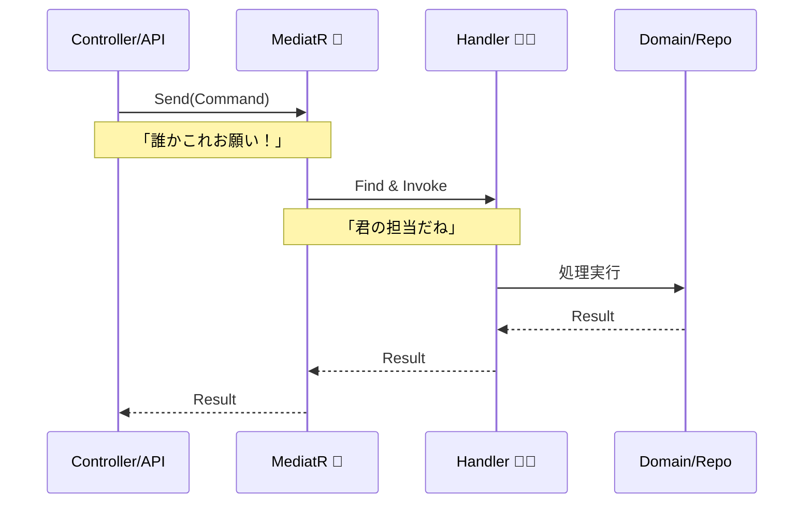

# 第67章：MediatR を使う？使わない？〜1人開発は「デバッグの迷子」にならない方を選ぼう🧭🧑‍💻✨

「ボタン押したら動いたけど、**どのクラスが処理してるのか分からん…😵‍💫**」
——1人開発でこれが起きると、心がポキッといきます（笑）🫠

この章は、**MediatR を採用するかどうかを「デバッグのしやすさ」で判断**できるようになるのがゴールです💪😊


---

## 1. MediatRってなに？超ざっくり🍩✨


MediatRは、処理の呼び出しを「受付」に集めるライブラリです📨

* 画面（Controller / Minimal API）から
* 「この依頼お願いしまーす！」って **Request** を投げる
* すると、該当する **Handler** が呼ばれる

つまり **“呼び先を直接知らなくていい”** 仕組みです😺
MediatR は request/response や notification（イベント通知）などの in-process メッセージングをサポートしています。([NuGet][1])



---

## 2. 使うと嬉しいこと🎁（でも“条件つき”）

### ✅ 嬉しいポイント

* **画面からユースケースを呼ぶのが統一される**（Send するだけ📮）
* **CQRS/縦スライス**と相性よし（機能ごとにまとまる🍱）
* ログ・バリデーション・トランザクションなどの共通処理を **パイプライン（Behavior）** に寄せやすい🧰
  （MediatRは DI 登録や Behavior 登録が用意されています）([GitHub][2])

### ⚠️ ただし…1人開発だとココが刺さる


* **呼び出しが間接的になる** → デバッグで「いまどこ？」になりやすい🌀
* Handler が増えると、**ファイルが散らかる**（命名と配置が弱いと地獄😇）
* 「Send した先が分からない」状態だと、未来の自分が泣く😭

---

## 3. 結論：1人開発の判断基準（迷わないチェックリスト✅🧭）


### ✅ MediatR を使うのが向いてるとき

* 画面/入口が増えてきて、ユースケース呼び出しを統一したい📦
* **CQRS（コマンド/クエリ分離）**をちゃんとやりたい🧠
* 共通処理（ログ、検証、計測、トランザクション）を **Behavior** に寄せたい🧩
* 「Handler単位でテストする」運用にしたい🧪

### ✅ 使わない方が幸せなとき

* まだ小さくて、ユースケース数も少ない（10〜20未満とか）🌱
* 今は速度重視で、**追跡しやすい直呼び**が正義🏎️
* “間接化”に慣れてなくて、まずは **ApplicationService 直呼び**で設計の基礎を固めたい📘

迷ったら：**「MediatRを入れることで、デバッグが楽になる設計ルールを自分が用意できるか？」**で決めるのがおすすめです😊✨

---

## 4. 最小サンプル：MediatRあり版（Send → Handler）📮➡️🧑‍🍳

### 4.1 DI登録（自動でHandler探索）

MediatRは `AddMediatR` でアセンブリから Handler を登録できます。([GitHub][2])

```csharp
using MediatR;

var builder = WebApplication.CreateBuilder(args);

builder.Services.AddMediatR(cfg =>
    cfg.RegisterServicesFromAssemblyContaining<Program>());

var app = builder.Build();
app.Run();
```

### 4.2 コマンドとHandler（例：Todo追加）

```csharp
using MediatR;

public sealed record CreateTodoCommand(string Title) : IRequest<Guid>;

public sealed class CreateTodoHandler : IRequestHandler<CreateTodoCommand, Guid>
{
    // 本当は Repository を注入するけど、ここでは省略してイメージ優先😊
    public Task<Guid> Handle(CreateTodoCommand request, CancellationToken ct)
    {
        if (string.IsNullOrWhiteSpace(request.Title))
            throw new ArgumentException("タイトルが空だよ😿");

        var id = Guid.NewGuid();
        // 保存処理など…
        return Task.FromResult(id);
    }
}
```

### 4.3 エンドポイントからSend

```csharp
using MediatR;

app.MapPost("/todos", async (CreateTodoRequest req, ISender sender) =>
{
    var id = await sender.Send(new CreateTodoCommand(req.Title));
    return Results.Created($"/todos/{id}", new { id });
});

public sealed record CreateTodoRequest(string Title);
```

---

## 5. 1人開発で「デバッグ迷子」を防ぐ最強セット🧰✨

### セットA：Logging Behavior（ここ超大事🔥）


MediatRにはリクエスト前後に割り込めるパイプライン（Behavior）があります。([GitHub][2])
これを入れるだけで「どのHandlerが動いたか」が一発で追えます👀✨

```csharp
using MediatR;
using Microsoft.Extensions.Logging;
using System.Diagnostics;

public sealed class LoggingBehavior<TRequest, TResponse>
    : IPipelineBehavior<TRequest, TResponse>
{
    private readonly ILogger<LoggingBehavior<TRequest, TResponse>> _logger;

    public LoggingBehavior(ILogger<LoggingBehavior<TRequest, TResponse>> logger)
        => _logger = logger;

    public async Task<TResponse> Handle(
        TRequest request,
        RequestHandlerDelegate<TResponse> next,
        CancellationToken ct)
    {
        var sw = Stopwatch.StartNew();
        var name = typeof(TRequest).Name;

        _logger.LogInformation("➡️ {Name} start: {@Request}", name, request);

        try
        {
            var response = await next();
            _logger.LogInformation("✅ {Name} ok ({Elapsed}ms)", name, sw.ElapsedMilliseconds);
            return response;
        }
        catch (Exception ex)
        {
            _logger.LogError(ex, "💥 {Name} failed ({Elapsed}ms)", name, sw.ElapsedMilliseconds);
            throw;
        }
    }
}
```

登録：

```csharp
builder.Services.AddMediatR(cfg =>
{
    cfg.RegisterServicesFromAssemblyContaining<Program>();
    cfg.AddOpenBehavior(typeof(LoggingBehavior<,>));
});
```

👉 これで **Send した瞬間にログで追跡できる**ので、ステップ実行しなくても迷子になりにくいです😺✨

---

### セットB：命名ルール（AIに守らせる🧠🤖）

おすすめはこれ固定👇（超効きます）

* コマンド：`CreateXxxCommand`
* ハンドラ：`CreateXxxHandler`
* クエリ：`GetXxxQuery`
* ハンドラ：`GetXxxHandler`

AI拡張にはこう指示すると安定します👇
「**次の命名規則を厳守：CreateXxxCommand / CreateXxxHandler。1ファイル1クラス。フォルダは Features/Todos/Create に置く**」🧾✨

---

### セットC：置き場所（フォルダが地図🗺️）


DDD/CQRSに寄せるなら、1人開発は **地図になる配置**が正義です😊

例：

* `Features/Todos/Create/`

  * `CreateTodoCommand.cs`
  * `CreateTodoHandler.cs`
* `Features/Todos/GetList/`

  * `GetTodoListQuery.cs`
  * `GetTodoListHandler.cs`

「Handlerどこ？」が消えます👏✨

---

## 6. MediatRなし版（直呼び）も、実はめっちゃ強い💪🌱


「迷わない」だけなら、最初はこれで十分なこと多いです😊

```csharp
public sealed class TodoAppService
{
    public Guid Create(string title)
    {
        if (string.IsNullOrWhiteSpace(title))
            throw new ArgumentException("タイトルが空だよ😿");

        return Guid.NewGuid();
    }
}

app.MapPost("/todos", (CreateTodoRequest req, TodoAppService appSvc) =>
{
    var id = appSvc.Create(req.Title);
    return Results.Created($"/todos/{id}", new { id });
});
```

### 直呼びの強み✨

* ブレークポイントが直線で追える🎯
* 間接がないので理解しやすい🧠
* 小規模では最速🏎️

### 直呼びの弱み💦

* 共通処理（ログ/検証/計測）を横断的に揃えるのが面倒になってくる🧹

---

## 7. この章のまとめ（迷わない結論）🧭✨

* MediatRは便利。けど **1人開発では「デバッグ迷子」コストが出やすい**😵‍💫
* 使うなら **Logging Behavior + 命名 + フォルダ** の3点セットで地図を作る🗺️✨
* 迷ったら、最初は直呼びでOK。育ってきたら MediatR を入れても遅くない🌱➡️🌳

ちなみに MediatR は現在 NuGet で 14.0.0 が出ていて、公式サイトでも機能（パイプライン等）や提供形態が案内されています。([NuGet][1])

---

## 8. ミニ演習（手を動かす🔥）🧪✨

### 演習1：Logging Behavior を入れて「Handler追跡ログ」を出す📜

* `CreateTodoCommand` を叩いたときに
  `➡️ start` → `✅ ok` がログに出るようにする😊

### 演習2：Queryも1本作る🔎

* `GetTodoListQuery : IRequest<TodoDto[]>`
* `GetTodoListHandler`
* エンドポイントから `sender.Send(query)` で呼ぶ

💡AIには「命名・配置・1ファイル1クラス」を厳守させると、爆速で整います🤖⚡

---

次の章（第68章）では、外部API連携で「相手が落ちても自分は落ちない」設計に入っていきます🌐🛟✨

[1]: https://www.nuget.org/packages/mediatr/ "
        NuGet Gallery
        \| MediatR 14.0.0
    "
[2]: https://github.com/LuckyPennySoftware/MediatR "GitHub - LuckyPennySoftware/MediatR: Simple, unambitious mediator implementation in .NET"
