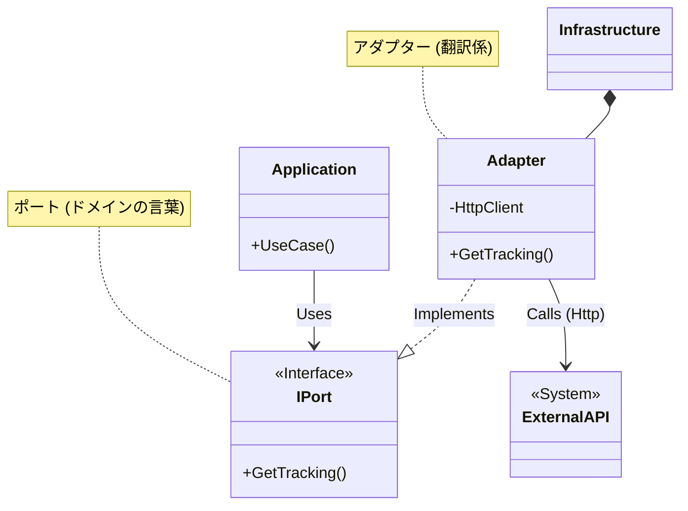

# 第68章：外部API連携の設計 🌐💥 〜相手が止まってても自分のアプリは止めない〜

外部APIって、めちゃくちゃ便利なんだけど…**機嫌が悪い日がある**んだよね🥲
*（遅い・落ちる・429で怒られる・たまに仕様が変わる…）*

この章では、そういう時でも **あなたのアプリが固まったり、全部エラーになったりしない** 設計を作ります💪✨

---

## 1. まず結論：外部APIは「いつか壊れるもの」😇🔧


外部APIはあなたの支配下にないので、

* 相手が落ちる💤
* 遅くなる🐢
* 返す内容が微妙に変わる🫠
* 429（混んでるから帰って！）って言われる🚫

…が普通に起きます。

だから大事なのは、

✅ **外部APIの不安定さを“アプリの外側で吸収”する**
✅ **失敗してもアプリ側は“動き続ける”状態にする**

です🛡️✨


---

## 2. 迷わないための「3つの守り」🛡️🛡️🛡️


外部API連携は、この3段構えにすると超安定します😊

### 守り①：ドメインに外部APIの型や言葉を入れない（ACL）🚧

外部の`ResponseDto`とか`StatusCode`とかを、ドメインに持ち込まない！

👉 **翻訳係（腐敗防止層 / ACL）** を置いて、
外部 → 自分の言葉（ドメインの型）に変換します🗣️✨

### 守り②：失敗前提の呼び出し（Timeout / Retry / Circuit Breaker）⏱️🔁⚡

「成功するはず」じゃなくて「失敗する日もある」前提で守る！

.NET では `Microsoft.Extensions.Http.Resilience` の **標準レジリエンス**が便利で、
レート制限・タイムアウト・リトライ・サーキットブレーカー等をまとめて入れられます。([Microsoft Learn][1])

### 守り③：同期で呼ばない（必要なら非同期化）📮

「今すぐ必要じゃない処理」まで外部APIに同期で依存すると、アプリが止まります😵

👉 **キュー / Outbox / バックグラウンド処理**に逃がすと勝ち🏆✨

---

## 3. まず決める：それ、同期で必要？🤔⏱️


外部API連携は、最初にこれを決めるだけで9割ラクになります😊

* **今この画面で絶対必要？**（例：ログイン認証、決済の最終確定）
* **あとで良い？**（例：配送状況の更新、外部サービスへの通知）

「あとで良い」なら、**非同期**に逃がした方が、ほぼ確実に幸せです📮✨

---

## 4. DDDでの置き場所：Port & Adapter（超かんたん版）🧩


外部API連携はこう置くとキレイです👇

* **Application層**：やりたいこと（ユースケース）

  * `IShippingApi` みたいな **インターフェース（Port）** を置く
* **Infrastructure層**：外部APIとしゃべる実装（Adapter）

  * `ShippingApiClient : IShippingApi` を置く
* **Domain層**：外部APIの存在を知らない👑

これで、外部が壊れても「影響が広がらない」設計になります😊✨



---

## 5. “止まらない”を作る：標準レジリエンスを入れる 💪🧯


`AddStandardResilienceHandler()` の標準セットは強いです🔥
デフォルトでだいたいこういう戦略が入ります👇（順番も大事）

* レート制限（同時リクエストを絞る）🚦
* 全体タイムアウト（全試行まとめて上限）⏱️
* リトライ（指数バックオフ＋ジッター）🔁
* サーキットブレーカー（壊れてたらしばらく遮断）⚡
* 試行ごとのタイムアウト（1回を長引かせない）⌛

…みたいな感じで、**“よくある事故”に強く**なります。([Microsoft Learn][1])

> ちなみに、昔よく使われた `Microsoft.Extensions.Http.Polly` は **非推奨**扱いで、今は `Microsoft.Extensions.Http.Resilience` などが推奨です。([NuGet][2])

---

## 6. 例：配送会社API（読み取り）で「落ちない」実装 📦😊

ここからミニ実装いきます✨
「配送状況を外部APIから取る」想定です。

### 6-1. Domain：自分の言葉（型）を作る 🧠✨

```csharp
namespace MyApp.Domain.Orders;

public readonly record struct TrackingNumber(string Value)
{
    public override string ToString() => Value;
}

public enum ShipmentStatus
{
    Unknown = 0,
    InTransit,
    Delivered,
    Delayed
}

public sealed record ShipmentTracking(
    TrackingNumber TrackingNumber,
    ShipmentStatus Status,
    DateTimeOffset LastUpdatedAt
);
```

---

### 6-2. Application：外部APIの“入口”をインターフェースにする 🚪

```csharp
namespace MyApp.Application.Shipping;

using MyApp.Domain.Orders;

public readonly record struct Result<T>(bool IsSuccess, T? Value, string? Error)
{
    public static Result<T> Ok(T value) => new(true, value, null);
    public static Result<T> Fail(string error) => new(false, default, error);
}

public interface IShippingApi
{
    Task<Result<ShipmentTracking>> GetTrackingAsync(
        TrackingNumber trackingNumber,
        CancellationToken ct);
}
```

---

### 6-3. Infrastructure：外部APIのDTOはここだけに閉じ込める 🔒

```csharp
namespace MyApp.Infrastructure.Shipping;

internal sealed record ShippingApiResponse(
    string trackingNumber,
    string status,
    DateTimeOffset updatedAt
);
```

---

### 6-4. Infrastructure：Adapter実装（翻訳して返す）🌉

```csharp
namespace MyApp.Infrastructure.Shipping;

using System.Net.Http.Json;
using MyApp.Application.Shipping;
using MyApp.Domain.Orders;

public sealed class ShippingApiClient(HttpClient client) : IShippingApi
{
    public async Task<Result<ShipmentTracking>> GetTrackingAsync(
        TrackingNumber trackingNumber,
        CancellationToken ct)
    {
        try
        {
            // 外部APIの言葉（DTO）で受ける
            var dto = await client.GetFromJsonAsync<ShippingApiResponse>(
                $"/api/tracking/{trackingNumber.Value}",
                cancellationToken: ct);

            if (dto is null)
                return Result<ShipmentTracking>.Fail("配送会社から空のレスポンスが返りました");

            // 自分の言葉（ドメインの型）に翻訳する（ACL）
            var status = dto.status switch
            {
                "in_transit" => ShipmentStatus.InTransit,
                "delivered"  => ShipmentStatus.Delivered,
                "delayed"    => ShipmentStatus.Delayed,
                _            => ShipmentStatus.Unknown
            };

            var tracking = new ShipmentTracking(
                new TrackingNumber(dto.trackingNumber),
                status,
                dto.updatedAt
            );

            return Result<ShipmentTracking>.Ok(tracking);
        }
        catch (OperationCanceledException)
        {
            // タイムアウトやキャンセルも「落とす」より「結果」で返す
            return Result<ShipmentTracking>.Fail("タイムアウトしました（混雑中かも）");
        }
        catch (HttpRequestException)
        {
            return Result<ShipmentTracking>.Fail("配送会社APIに接続できませんでした");
        }
        catch (Exception)
        {
            return Result<ShipmentTracking>.Fail("配送会社APIで予期しないエラーが起きました");
        }
    }
}
```

---

### 6-5. Program.cs：標準レジリエンスを付与する 🧯✨

```csharp
using MyApp.Application.Shipping;
using MyApp.Infrastructure.Shipping;

var builder = WebApplication.CreateBuilder(args);

builder.Services.AddHttpClient<ShippingApiClient>(client =>
{
    client.BaseAddress = new Uri(builder.Configuration["ShippingApi:BaseUrl"]!);
})
.AddStandardResilienceHandler(options =>
{
    // “危ないHTTPメソッド”はリトライしない（重複処理の事故防止）
    options.Retry.DisableForUnsafeHttpMethods();
});

// DI：アプリ側はインターフェースしか見ない
builder.Services.AddScoped<IShippingApi, ShippingApiClient>();

var app = builder.Build();
app.Run();
```

`AddStandardResilienceHandler` のデフォルト構成や、`POST/DELETE` 等のリトライ無効化の話は公式にもまとまってます。([Microsoft Learn][1])

---

## 7. 「失敗したらどうする？」をアプリ側で決める 🌈

レジリエンスを入れても、外部が落ちてたら結果は失敗になります。

そのときにおすすめなのは👇

* 画面：**「前回の結果」を表示して続行**📌
* 画面：**「ただいま取得できません、あとで更新してね」**🙏
* バッチ：**あとで再試行する**🔁

たとえば「前回キャッシュ」戦略だとこう😊

```csharp
namespace MyApp.Application.Orders;

using MyApp.Application.Shipping;
using MyApp.Domain.Orders;

public interface ITrackingCache
{
    Task<ShipmentTracking?> TryGetAsync(TrackingNumber trackingNumber, CancellationToken ct);
    Task SaveAsync(ShipmentTracking tracking, CancellationToken ct);
}

public sealed class TrackingQueryService(IShippingApi shippingApi, ITrackingCache cache)
{
    public async Task<(ShipmentTracking? tracking, string message)> GetTrackingSafeAsync(
        TrackingNumber trackingNumber,
        CancellationToken ct)
    {
        var result = await shippingApi.GetTrackingAsync(trackingNumber, ct);

        if (result.IsSuccess && result.Value is not null)
        {
            await cache.SaveAsync(result.Value, ct);
            return (result.Value, "最新です✨");
        }

        var cached = await cache.TryGetAsync(trackingNumber, ct);
        if (cached is not null)
            return (cached, "いま外部が不安定なので、前回の結果を表示中だよ😊");

        return (null, "配送状況を取得できませんでした🥲 少し時間をおいて再表示してね🙏");
    }
}
```

**アプリが止まらない**って、こういう「代替行動」を用意することなんだよね😊✨

---

## 8. 書き込み系（POST）で一番ハマる罠：リトライで二重登録 😱🔁


外部APIに「作成」「購入」「予約」みたいな **副作用あり** を送るとき、

* リトライで同じPOSTが2回飛ぶ
* 相手は1回目は成功してたのに、返事が返らず失敗扱い
* 2回目で「2件作られる」💥

が起きがちです😇

だから基本は👇

* **POST/PUT/DELETEは安易にリトライしない**（さっきの設定）([Microsoft Learn][1])
* どうしても必要なら **冪等キー（Idempotency-Key）** を付ける🔑
* さらに強くするなら **Outbox（あとで確実に送る）**📮

---

## 9. さらに強く：Outboxで「あとで送る」📮📦（考え方だけ）

「外部に送る通知」みたいに、多少遅れてもOKなら、

1. まず自分のDBに **送信予定** を保存（Outbox）🧾
2. バックグラウンドで外部APIへ送信🚚
3. 成功したらOutboxから消す or 送信済みにする✅

こうすると、外部が落ちてても **あなたのアプリの主要機能は動き続ける** ようになります💪✨

---

## 10. AIに頼ると爆速になるプロンプト例 🤖💬

コピペして使ってOKです😊

### ✅ Adapter実装を作らせる

* 「`IShippingApi` を実装して。外部DTOはInfrastructureだけ。ドメイン型へ変換（ACL）して返す。失敗は例外で落とさず `Result<T>` で返す。タイムアウト/HttpRequestException/その他を分けてメッセージも付けて」

### ✅ どの失敗をリトライすべきか相談する

* 「このAPIはGET/POSTがある。重複処理が怖い。どのメソッドをリトライ禁止にすべき？理由も。 `AddStandardResilienceHandler` の設定例も」

### ✅ テスト用のスタブAPIを作らせる

* 「配送会社APIのスタブを最小で。200/500/429/遅延（3秒/15秒）を切り替えられるようにして」

---

## まとめ 🌟（この章で持ち帰ること）

外部API連携は、これだけ覚えると一気に安定します😊✨

* ドメインに外部の型を入れない（ACL）🚧
* `HttpClient` に標準レジリエンスを付ける（Timeout/Retry/CircuitBreaker等）🧯([Microsoft Learn][1])
* 書き込み系はリトライ事故に注意（必要なら冪等キー / Outbox）😱🔑
* 失敗時の「代替行動」を決めて、アプリを止めない🌈

---

## ミニ演習 📝✨

1. `GetTrackingSafeAsync` に「キャッシュが何分古いか」を表示する機能を足してみよう⏳😊
2. `AddStandardResilienceHandler` に `DisableForUnsafeHttpMethods()` を入れて、POST事故を防ごう🔒([Microsoft Learn][1])
3. 「外部APIが落ちてる時は、画面に何を出すと親切？」を3案考えてみよう💡💕

---

次の章（第69章）は **「設定値(appsettings.json) とドメインの距離」** だから、外部APIのBaseUrlやAPIキーを「どこに置くのが気持ちいいか」も一気に整いますよ😊🔧

[1]: https://learn.microsoft.com/en-us/dotnet/core/resilience/http-resilience "Build resilient HTTP apps: Key development patterns - .NET | Microsoft Learn"
[2]: https://www.nuget.org/packages/microsoft.extensions.http.polly/?utm_source=chatgpt.com "Microsoft.Extensions.Http.Polly 10.0.1"
