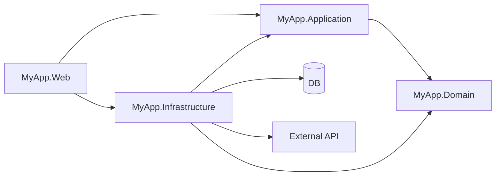
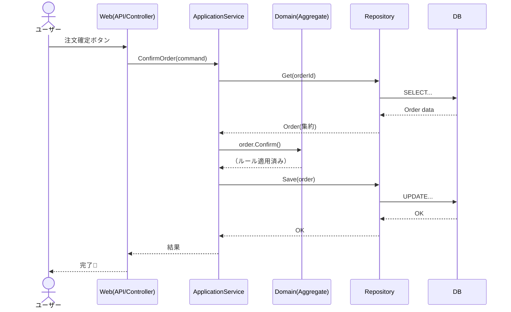

# 第70章：AIでアーキテクチャ図を自動生成しよう（PlantUML / Mermaid）🗺️✨

「コードはあるのに、全体像が頭に入らない…😵‍💫」って瞬間、ありません？
そんなとき **アーキテクチャ図が“脳のメモ帳”**になってくれます📒✨
しかも今は **AIにサクッと下書きさせて、あなたは“正しさチェック”だけ**でOKです✅🤝

---

## この章でできるようになること🎯


* PlantUML / Mermaid を使って **図をテキストで管理**できるようになる🧾
* AIに **「アーキテクチャ図」「依存関係図」「シーケンス図」**を作らせるコツがわかる🤖✨
* 図を **README に貼って、未来の自分を助ける**運用ができる🫶


---

## なんで今、図が大事なの？（AI時代あるある）🤖🧠


AIにコードを書かせるほど、こうなりがち👇

* 画面はできたのに、層が混ざる（DomainにSQLが混ざる😇）
* 似た処理が増殖する（ApplicationServiceが増えすぎる🐛）
* 「どこを直すと何が影響するか」が見えない（怖い😱）

だから **図が“境界線（ルール）”の証拠**になるんです🧱✨
AIに渡す指示も短くなります✍️💡（図＝仕様の要約！）

---

## PlantUML と Mermaid のざっくり使い分け🧰


### PlantUML 🌿

* 強い：**コンポーネント図 / クラス図 / シーケンス図**など何でもいける💪
* `.puml` で管理しやすい📁
* ちょい本格派（図の表現力が高い）✨

### Mermaid 🧜‍♀️

* 強い：**Markdown にそのまま埋め込める**（README向き）📄✨
* flowchart / sequence が特に便利🔁
* “軽く書けて見せやすい”のが魅力😄

迷ったら：

* **READMEに貼りたい→ Mermaid**
* **細かい図が欲しい→ PlantUML**
  でOKです👍✨

```mermaid
 mindmap
  root((図の使い分け 🗺️))
    Mermaid
      READMEに貼る 📄
      GitHubで直接見る 👀
      簡単なフロー 🌊
    PlantUML
      詳細設計 📐
      複雑なクラス図 🧩
      印刷/PDF化 🖨️
    図の種類
      依存関係図 (全体像)
      シーケンス図 (時系列)
      クラス図 (構造)
 ```

---

## AIで図を作る「基本手順」🪄


AIにいきなり「図作って」って言うと、だいたい盛られます🤣（架空の層や謎のDBが生える🌱）

なのでコツはこれ👇

### ① まず “事実だけメモ” を作る📝

テンプレ（これをAIに渡す）👇

* アプリの目的：〇〇
* 層（またはプロジェクト）：Domain / Application / Infrastructure / Web
* 依存ルール：Web→Application→Domain、Infrastructureは内側に依存してOK、Domainは外を知らない
* 主要ユースケース：例）商品登録、注文確定、ユーザー登録
* 外部：DB、外部API、メール送信など

### ② AIに「図の種類」と「粒度」を指定する📏

* 依存関係だけ？（高レベル）
* ユースケースの流れ？（シーケンス）
* クラス構造？（詳細）

### ③ 出てきた図を “境界線チェック” する✅🧱

* Domainが外部に依存してない？（InfrastructureやEFに依存してたらアウト😇）
* ApplicationがUIに引っ張られてない？
* 矢印の向きが合ってる？

---

## 例1：DDDの4層（Domain/Application/Infrastructure/Web）の依存関係図📦➡️📦

### PlantUML版（依存の矢印がキレイ✨）

```plantuml
@startuml
skinparam componentStyle rectangle

package "Web" {
  [MyApp.Web]
}

package "Application" {
  [MyApp.Application]
}

package "Domain" {
  [MyApp.Domain]
}

package "Infrastructure" {
  [MyApp.Infrastructure]
  database "DB" as DB
  [External API] as API
}

' 依存関係（参照の向き）
[MyApp.Web] --> [MyApp.Application]
[MyApp.Web] --> [MyApp.Infrastructure] : DI登録など

[MyApp.Application] --> [MyApp.Domain]

[MyApp.Infrastructure] --> [MyApp.Application]
[MyApp.Infrastructure] --> [MyApp.Domain]

[MyApp.Infrastructure] --> DB
[MyApp.Infrastructure] --> API

@enduml
```

ポイント👀✨

* **Domainに矢印が“入ってくる”だけ**なのが気持ちいいです😄
* Infrastructureは「実装」を持つので、内側（Domain/Application）を参照しがちです（それでOK）👌

---

### Mermaid版（READMEに貼るならこれ🧜‍♀️📄）



---

## 例2：ユースケースの流れをシーケンス図にする🔁✨（「注文確定」みたいなやつ）

### Mermaid（シーケンス図）🧜‍♀️



この図があると、AIにこう言えます👇
「ConfirmのビジネスルールはDomainのorder.Confirm()に置いてね。ApplicationServiceには手順だけね🙂✨」

---

## 図を“壊さない”コツ（初心者がハマりやすい）🪤

### ✅ コツ1：図は「正解」じゃなく「約束」🫶


図は芸術じゃなくて、**設計ルールのメモ**です✍️✨
ちょっと雑でも、矢印が正しければ勝ちです🏆

### ✅ コツ2：粒度を欲張らない🍰


* 1枚に全部入れる → 地獄😇
  おすすめは **1枚1テーマ**：
* 依存関係図（層）
* 重要ユースケースのシーケンス図
* 主要集約の関係図（必要なら）

### ✅ コツ3：AIの出力は「盛り」がちだから、チェック項目を固定する🔍

* DomainがDB/EF/HTTPを知らない ✅
* UI(Web)がDomainを直接触ってない ✅（Application経由）
* Infrastructureは“実装の置き場”になってる ✅

---

## そのまま使える！AIプロンプト集🤖🪄

### 1) 依存関係図を作らせる（Mermaid）

```text
以下の事実だけを使って、Mermaidのflowchartで依存関係図を作って。
- プロジェクト: MyApp.Domain / MyApp.Application / MyApp.Infrastructure / MyApp.Web
- 依存: Web→Application→Domain
- InfrastructureはApplication/Domainに依存して実装を持つ
- WebはDI登録のためInfrastructureにも依存する
- DBとExternal APIはInfrastructureの外側として描く
出力はMermaidコードだけ。
```

### 2) シーケンス図を作らせる（注文確定）

```text
「注文確定」の処理フローをシーケンス図（Mermaid）で。
登場人物は User, Web(Controller), ApplicationService, Domain(Aggregate), Repository, DB。
Domainでは order.Confirm() でルール適用。ApplicationServiceは手順のみ。
出力はMermaidコードだけ。
```

### 3) PlantUMLで“パッケージ＋矢印”にして（4層）

```text
次の層構造をPlantUMLのpackage図で表して。矢印は参照方向。
- Web -> Application
- Application -> Domain
- Infrastructure -> Application, Domain
- Web -> Infrastructure（DI登録のため）
DB/External APIはInfrastructureの外側に配置。
出力はPlantUMLコードだけ。
```

---

## 【演習】あなたのアプリで「図を1枚」作ろう🎒✨

### ステップ🍀

1. 自分のアプリのプロジェクト/フォルダ名を箇条書き（5行でOK）📝
2. 依存ルールを1行で書く（例：UI→App→Domain）🧱
3. 上のプロンプトをコピペしてAIに投げる🤖
4. 図をREADMEに貼る📄✨
5. 1つ質問：**「この図を見て、未来の自分は迷わない？」**🤔💡

### チェック問題（できたら最高🎉）

* README開いた瞬間に「どこに何があるか」わかる？👀
* DomainにDBの話が入ってない？😇
* “変更が起きそうな場所”が見えてる？🔧

---

## 次に繋がる話（次章への橋）🌉✨

図があると、次の章の **テスト戦略**がめっちゃ立てやすいです🧪
「どこをユニットテストするか」が図から見えるようになります👀✅

---

必要なら、あなたの今のソリューション構成（プロジェクト名のツリーだけでOK📁）を貼ってくれたら、**第70章のやり方で“あなた専用の図”**をサンプルとして作って見せるよ😄🗺️✨
