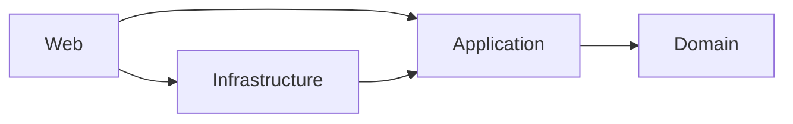

# 第75章【演習】ASP.NET Coreでクリーンアーキテクチャ最小構成を自作する 🧱✨

この章は「**4つのプロジェクトに分けて、ちゃんと動くWeb APIまで通す**」のがゴールだよ😊🎯
完成したら、**“変更に強い形” の土台**があなたの手元に残る✨

---

## 今日つくるもの（超ミニToDo API）📝🌱

* `POST /todos` … ToDoを作る
* `GET /todos` … 一覧
* `GET /todos/{id}` … 1件取得
* `POST /todos/{id}/done` … 完了にする

---

## まず全体図（ここが「迷わない」ポイント）🧭✨

* **Domain**：ルール（ビジネスの心臓）🫀
* **Application**：ユースケース（やりたいこと）🎮
* **Infrastructure**：保存や外部（DBとか）🧰
* **Web**：HTTPの入り口（API）🚪

依存（矢印）は **外→内** だけにするよ🙆‍♀️




※ この構成なら、DBを変えても Domain が揺れにくい✨（土台が強い！）

---

## 1) ソリューション＆プロジェクトを作る 🧱✨


### A. クリック派（Visual Studio）🖱️💕

1. **空のソリューション**を作る（例：`MyApp`）
2. 4つのプロジェクトを追加

   * `MyApp.Domain`（クラスライブラリ）
   * `MyApp.Application`（クラスライブラリ）
   * `MyApp.Infrastructure`（クラスライブラリ）
   * `MyApp.Web`（ASP.NET Core Web API）
3. ターゲットは **.NET 10（LTS）** にしてね（2025の最新ど真ん中）✨ ([Microsoft][1])

### B. コマンド派（VS CodeでもOK）⌨️✨

（フォルダ構成は `src` 配下にまとめるのが気持ちいい🥰）

```powershell
mkdir MyApp
cd MyApp
mkdir src

dotnet new sln -n MyApp

dotnet new classlib -n MyApp.Domain -o src/MyApp.Domain -f net10.0
dotnet new classlib -n MyApp.Application -o src/MyApp.Application -f net10.0
dotnet new classlib -n MyApp.Infrastructure -o src/MyApp.Infrastructure -f net10.0
dotnet new webapi -n MyApp.Web -o src/MyApp.Web -f net10.0

dotnet sln add src/MyApp.Domain
dotnet sln add src/MyApp.Application
dotnet sln add src/MyApp.Infrastructure
dotnet sln add src/MyApp.Web
```

---

## 2) 参照（依存）をつなぐ 🔗🧠

この順でOK✨

* Application → Domain
* Infrastructure → Application, Domain
* Web → Application, Infrastructure（Webは“組み立て係”なので両方参照してOK）

### コマンドでやるなら👇

```powershell
dotnet add src/MyApp.Application reference src/MyApp.Domain
dotnet add src/MyApp.Infrastructure reference src/MyApp.Application
dotnet add src/MyApp.Infrastructure reference src/MyApp.Domain
dotnet add src/MyApp.Web reference src/MyApp.Application
dotnet add src/MyApp.Web reference src/MyApp.Infrastructure
```

---

## 3) Domain（ルール）を作る 🫀✨


ここは「**string や Guid をそのまま信用しない**」がキモ😎
（＝“意味のある型”にする）

### `TodoId.cs`（Domain）

```csharp
namespace MyApp.Domain.Todos;

public readonly record struct TodoId(Guid Value)
{
    public static TodoId New() => new(Guid.NewGuid());
    public override string ToString() => Value.ToString("D");
}
```

### `TodoTitle.cs`（Domain）

```csharp
namespace MyApp.Domain.Todos;

public sealed record TodoTitle
{
    public string Value { get; }

    private TodoTitle(string value) => Value = value;

    public static bool TryCreate(string? value, out TodoTitle title, out string error)
    {
        title = default!;
        error = "";

        var v = (value ?? "").Trim();

        if (v.Length == 0)
        {
            error = "タイトルが空だよ🥺";
            return false;
        }

        if (v.Length > 50)
        {
            error = "タイトルは50文字以内にしてね🙏";
            return false;
        }

        title = new TodoTitle(v);
        return true;
    }

    public override string ToString() => Value;
}
```

### `TodoItem.cs`（Domain）

```csharp
namespace MyApp.Domain.Todos;

public sealed class TodoItem
{
    public TodoId Id { get; }
    public TodoTitle Title { get; private set; }
    public bool IsDone { get; private set; }
    public DateTimeOffset CreatedAt { get; }

    public TodoItem(TodoId id, TodoTitle title, DateTimeOffset createdAt)
    {
        Id = id;
        Title = title;
        CreatedAt = createdAt;
    }

    public void MarkDone() => IsDone = true;
}
```

---

## 4) Application（ユースケース）を作る 🎮✨

Web（HTTP）からの要求を、**「アプリでやりたいこと」**に翻訳する層だよ🙂

### `Result.cs`（Application）

```csharp
namespace MyApp.Application.Common;

public readonly record struct Result<T>(bool IsSuccess, T? Value, string? Error)
{
    public static Result<T> Success(T value) => new(true, value, null);
    public static Result<T> Fail(string error) => new(false, default, error);
}
```

### `TodoDto.cs`（Application）

```csharp
namespace MyApp.Application.Todos;

public sealed record TodoDto(
    string Id,
    string Title,
    bool IsDone,
    DateTimeOffset CreatedAt);
```

### `ITodoRepository.cs`（Application）

```csharp
using MyApp.Domain.Todos;

namespace MyApp.Application.Todos;

public interface ITodoRepository
{
    Task AddAsync(TodoItem item, CancellationToken ct);
    Task<TodoItem?> FindAsync(TodoId id, CancellationToken ct);
    Task<IReadOnlyList<TodoItem>> ListAsync(CancellationToken ct);
    Task SaveChangesAsync(CancellationToken ct);
}
```

### `TodoApplicationService.cs`（Application）

```csharp
using MyApp.Application.Common;
using MyApp.Domain.Todos;

namespace MyApp.Application.Todos;

public sealed class TodoApplicationService
{
    private readonly ITodoRepository _repo;

    public TodoApplicationService(ITodoRepository repo)
    {
        _repo = repo;
    }

    public async Task<Result<TodoDto>> CreateAsync(string? title, CancellationToken ct)
    {
        if (!TodoTitle.TryCreate(title, out var todoTitle, out var error))
            return Result<TodoDto>.Fail(error);

        var item = new TodoItem(TodoId.New(), todoTitle, DateTimeOffset.UtcNow);

        await _repo.AddAsync(item, ct);
        await _repo.SaveChangesAsync(ct);

        return Result<TodoDto>.Success(ToDto(item));
    }

    public async Task<Result<TodoDto>> GetAsync(string id, CancellationToken ct)
    {
        if (!Guid.TryParse(id, out var guid))
            return Result<TodoDto>.Fail("IDがGUIDじゃないよ🥺");

        var item = await _repo.FindAsync(new TodoId(guid), ct);
        if (item is null)
            return Result<TodoDto>.Fail("見つからないよ😢");

        return Result<TodoDto>.Success(ToDto(item));
    }

    public async Task<IReadOnlyList<TodoDto>> ListAsync(CancellationToken ct)
    {
        var items = await _repo.ListAsync(ct);
        return items.Select(ToDto).ToList();
    }

    public async Task<Result<TodoDto>> MarkDoneAsync(string id, CancellationToken ct)
    {
        if (!Guid.TryParse(id, out var guid))
            return Result<TodoDto>.Fail("IDがGUIDじゃないよ🥺");

        var item = await _repo.FindAsync(new TodoId(guid), ct);
        if (item is null)
            return Result<TodoDto>.Fail("見つからないよ😢");

        item.MarkDone();
        await _repo.SaveChangesAsync(ct);

        return Result<TodoDto>.Success(ToDto(item));
    }

    private static TodoDto ToDto(TodoItem item) =>
        new(item.Id.Value.ToString("D"), item.Title.Value, item.IsDone, item.CreatedAt);
}
```

---

## 5) Infrastructure（保存役）を作る 🧰✨


今回は最小構成なので **DBなし（インメモリ）**でいくよ🙆‍♀️
あとでEF Coreに差し替えるのがめっちゃ簡単になる✨

### `InMemoryTodoRepository.cs`（Infrastructure）

```csharp
using System.Collections.Concurrent;
using MyApp.Application.Todos;
using MyApp.Domain.Todos;

namespace MyApp.Infrastructure.Todos;

public sealed class InMemoryTodoRepository : ITodoRepository
{
    private readonly ConcurrentDictionary<Guid, TodoItem> _store = new();

    public Task AddAsync(TodoItem item, CancellationToken ct)
    {
        _store[item.Id.Value] = item;
        return Task.CompletedTask;
    }

    public Task<TodoItem?> FindAsync(TodoId id, CancellationToken ct)
    {
        _store.TryGetValue(id.Value, out var item);
        return Task.FromResult(item);
    }

    public Task<IReadOnlyList<TodoItem>> ListAsync(CancellationToken ct)
    {
        IReadOnlyList<TodoItem> list = _store.Values
            .OrderByDescending(x => x.CreatedAt)
            .ToList();

        return Task.FromResult(list);
    }

    public Task SaveChangesAsync(CancellationToken ct) => Task.CompletedTask;
}
```

---

## 6) Web（API入口）を作る 🚪🌐

`MyApp.Web` のテンプレにあるサンプル（WeatherForecast）は消してOK✂️✨
そして Minimal API でサクッといくよ（最小APIは学習にも相性いい🫶）([Microsoft Learn][2])

### `Program.cs`（Web）

```csharp
using MyApp.Application.Todos;
using MyApp.Infrastructure.Todos;

var builder = WebApplication.CreateBuilder(args);

builder.Services.AddEndpointsApiExplorer();
builder.Services.AddSwaggerGen();

// アプリ層
builder.Services.AddScoped<TodoApplicationService>();

// インフラ層（今はインメモリ）
builder.Services.AddSingleton<ITodoRepository, InMemoryTodoRepository>();

var app = builder.Build();

app.UseSwagger();
app.UseSwaggerUI();

app.MapPost("/todos", async (CreateTodoRequest req, TodoApplicationService svc, CancellationToken ct) =>
{
    var result = await svc.CreateAsync(req.Title, ct);

    return result.IsSuccess
        ? Results.Created($"/todos/{result.Value!.Id}", result.Value)
        : Results.BadRequest(new { message = result.Error });
});

app.MapGet("/todos", async (TodoApplicationService svc, CancellationToken ct) =>
{
    var list = await svc.ListAsync(ct);
    return Results.Ok(list);
});

app.MapGet("/todos/{id}", async (string id, TodoApplicationService svc, CancellationToken ct) =>
{
    var result = await svc.GetAsync(id, ct);

    return result.IsSuccess
        ? Results.Ok(result.Value)
        : Results.NotFound(new { message = result.Error });
});

app.MapPost("/todos/{id}/done", async (string id, TodoApplicationService svc, CancellationToken ct) =>
{
    var result = await svc.MarkDoneAsync(id, ct);

    return result.IsSuccess
        ? Results.Ok(result.Value)
        : Results.NotFound(new { message = result.Error });
});

app.Run();

public sealed record CreateTodoRequest(string Title);
```

---

## 7) 実行して動作確認しよ〜！🚀✨


 
 実際にAPIを叩いたときの動き（シーケンス）はこんな感じになります👇
 
 ```mermaid
 sequenceDiagram
     participant Client
     participant Web as Web (API)
     participant App as Application
     participant Dom as Domain
     participant Infra as Infrastructure (Store)
     
     Client->>Web: POST /todos (Title="Buy Milk")
     Web->>App: CreateAsync("Buy Milk")
     
     App->>Dom: TodoTitle.TryCreate("Buy Milk")
     Dom-->>App: Title OK
     
     App->>Dom: new TodoItem(...)
     Dom-->>App: TodoItem Created
     
     App->>Infra: AddAsync(item)
     Infra-->>App: Saved
     
     App-->>Web: Result.Success(Dto)
     Web-->>Client: 201 Created (JSON)
 ```
 
 ### コマンド派

```powershell
dotnet run --project src/MyApp.Web
```

起動したら Swagger UI が出るはず😍
`POST /todos` → `GET /todos` で増えてたら成功🎉

---

## AI（Copilot等）を“正しく”使うコツ 🤖💡

AIは超便利なんだけど、**レイヤー違反を平気でやる**ことがあるよ😂
だから、お願いの仕方をちょい工夫するのが勝ち✨

### 使えるお願いテンプレ（コピペOK）📌

* 「Domain は他の層に依存しないで。`MyApp.Domain` には外部ライブラリ持ち込まないで」
* 「Web から Domain を直接触らず、ApplicationService 経由にして」
* 「Infrastructure は Repository 実装だけ。ユースケースの判断は Application に置いて」

### AIに最後にこれ聞くと強い💪

* 「このコード、依存方向が Clean Architecture に違反してない？違反箇所があれば指摘して✨」

---

## よくある事故（ここで迷いがち）⚠️🥺


* **WebがDomainを直接いじる**（最初はやりがち！）
  → “ユースケース” を Application に寄せるとスッキリ😊
* **ApplicationにEF Coreの型が混ざる**
  → DBの都合は Infrastructure に隔離🧊
* **DomainにDTOを置く**
  → DTOは“画面や通信の都合”だから Domain じゃないよ🙅‍♀️

---

## 追加課題（できたら一気に強くなる🔥）🎯

1. ✅ `PUT /todos/{id}` でタイトル変更（ただし空文字は禁止）
2. ✅ `DELETE /todos/{id}` を追加
3. 🌟 **Infrastructure を EF Core + SQLite に差し替え**（Web側の変更は最小で済むはず！）
4. 🌟 テストを1本だけ書く：

   * `TodoTitle.TryCreate("")` が false になることを確認🧪✨

---

## ここまでできたら、あなたはもう「設計の型」を持ってる 🥰🧱

この章の勝ちポイントはこれ👇

* **4層に分けた**
* **依存方向を守った**
* **ユースケースを Application に置いた**
* **保存方法（Infrastructure）を差し替え可能にした**

次に進むなら、課題3の「EF Coreに差し替え」が一番伸びるよ🚀✨（“構造の強さ”を体感できる！）

[1]: https://dotnet.microsoft.com/en-us/platform/support/policy/dotnet-core?utm_source=chatgpt.com "NET and .NET Core official support policy"
[2]: https://learn.microsoft.com/ja-jp/aspnet/core/tutorials/min-web-api?view=aspnetcore-10.0&utm_source=chatgpt.com "ASP.NET Core を使用して最小限の API を作成する"
