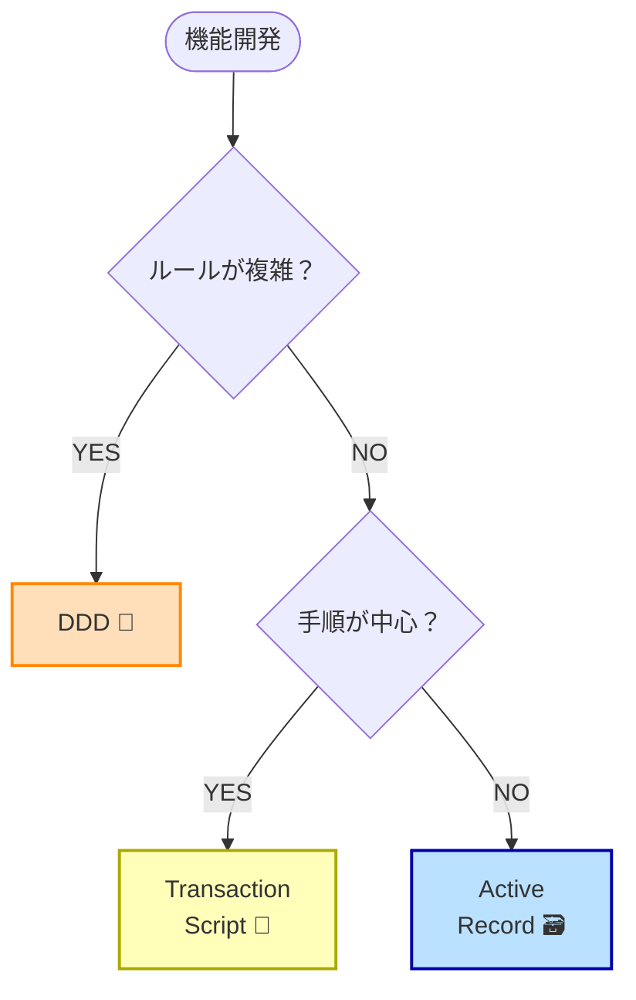

# 第78章：使い分けの基準✨ コンテキストごとに設計手法を変えてもいい😊🎛️

DDDって、ぜんぶをDDDで固めると「重い…😵‍💫」ってなりがちなんだよね。
でも安心してOK！✨ **アプリの場所（コンテキスト）ごとに、設計のやり方を変えていい**んだよ〜🙌🌸

---

## 1. まず結論：アプリは「全部同じ難しさ」じゃない😳🧩

たとえば、同じアプリでも…

* **支払い💳**：ルールが多い・ミスが許されない（複雑！）
* **お知らせ🔔**：やることは単純（送るだけ！）
* **管理画面🧑‍💻**：CRUD中心（一覧・追加・編集・削除）

こういうのって、同じ設計で戦う必要ないよね？😅
だから **場所に合わせて武器を変える⚔️** のが最強！✨


---

## 2. 使い分けの「3つの武器」🧰✨

このロードマップで出てきた3つを、ざっくり役割で整理するね😊

### ① DDD（ドメインモデル）🏰

* **複雑なルールがある場所**向け
* 変更が多い、例外が多い、言葉の定義が大事

✅向いてる：支払い、ポイント、在庫、予約、権限、ゲーム計算🎮 など

---

### ② トランザクションスクリプト（手順書スタイル）📜

* 「こうしたらこうする」の**手順が中心**の場所向け
* ロジックはあるけど、モデル化するほどじゃない

✅向いてる：登録フロー、メール送信、簡単な承認フロー、外部API呼び出し🌐 など

---

### ③ Active Record（DB直結でラク）🗃️

* **ほぼCRUD**で、ルールが薄い場所向け
* とにかく速く作りたい管理画面とかで強い

✅向いてる：管理画面、マスタ管理、ログ閲覧、設定画面⚙️ など

---

## 3. 迷わないための「5つの質問」✅🤔

機能（＝コンテキスト）ごとに、これを自分に聞くとブレなくなるよ😊🌸



1. **ビジネスルール、いっぱいある？**（例外だらけ？）📚
2. **仕様変更、よく来る？**🔁
3. **間違えるとヤバい？**（お金・権限・契約）💥
4. **言葉の意味が大事？**（同じ単語が場面で変わる）🗣️
5. **テストしたいロジック？**🧪

---

## 4. 超実用！スコアで決める🎯✨（1人開発向け）

各質問に「はい🙂」なら +1 で数えてみて👇

* **0〜1点**：Active Record 🗃️（爆速でOK！）
* **2〜3点**：トランザクションスクリプト 📜（手順で十分）
* **4〜5点**：DDD 🏰（モデル化する価値あり！）

「DDDに寄せるかどうか」を感覚じゃなくて、**点数で決める**のがコツだよ😆👍

---

## 5. 具体例：予約アプリの“場所ごとの設計”🏨📅

同じアプリでもこう分けられるよ👇

### ✅ 予約（重要・ルール多い）→ DDD 🏰

* 二重予約禁止
* キャンセル料
* 変更期限
* プランごとの条件

### ✅ 通知（手順中心）→ トランザクションスクリプト 📜

* 予約確定→メール送る
* リマインド送る
* 失敗したらリトライする

### ✅ 管理画面（CRUD中心）→ Active Record 🗃️

* プラン一覧、追加、編集、削除
* 文言テンプレ管理
* お知らせ管理

こうすると、**大事なところだけDDDで守れて**、他は軽く作れて速い🚀✨

---

## 6. ミニコードで違いを体感しよ🙂💻✨

題材：**クーポン適用**（やり方3パターン）

---

### A) DDD（ルールをモデルに閉じ込める）🏰✨

```csharp
public sealed record Money(decimal Amount, string Currency);

public sealed class Order
{
    public Guid Id { get; }
    public Money Total { get; private set; }
    public bool CouponApplied { get; private set; }

    public Order(Guid id, Money total)
    {
        Id = id;
        Total = total;
    }

    public void ApplyCoupon(string couponCode)
    {
        if (CouponApplied) throw new InvalidOperationException("クーポンは二重適用できません🙅‍♀️");
        if (string.IsNullOrWhiteSpace(couponCode)) throw new ArgumentException("クーポンコードが空です😢");

        // 例：固定 500円引き（本当は条件がもっとある想定）
        if (Total.Currency != "JPY") throw new InvalidOperationException("JPY以外は未対応です🙏");

        Total = new Money(Math.Max(0, Total.Amount - 500m), "JPY");
        CouponApplied = true;
    }
}
```

👉 **ルールが Order の中に集まる**から、「あちこちに if が散らばる地獄😱」を防げるよ✨

---

### B) トランザクションスクリプト（手順で実装）📜✨

```csharp
public sealed class OrderService
{
    private readonly IOrderRepository _orders;

    public OrderService(IOrderRepository orders)
    {
        _orders = orders;
    }

    public async Task ApplyCouponAsync(Guid orderId, string couponCode)
    {
        var order = await _orders.FindAsync(orderId)
            ?? throw new InvalidOperationException("注文が見つかりません😢");

        // 手順でチェックして処理する
        if (order.CouponApplied) throw new InvalidOperationException("二重適用NG🙅‍♀️");
        if (string.IsNullOrWhiteSpace(couponCode)) throw new ArgumentException("空だよ😢");

        order.TotalAmount = Math.Max(0, order.TotalAmount - 500m);
        order.CouponApplied = true;

        await _orders.SaveAsync(order);
    }
}
```

👉 **手順が見やすい**ので、軽めのロジックならこれで十分なことが多い😊

---

### C) Active Record（CRUD寄りで速い）🗃️⚡

```csharp
public sealed class OrderRow
{
    public Guid Id { get; set; }
    public decimal TotalAmount { get; set; }
    public bool CouponApplied { get; set; }
    public string Currency { get; set; } = "JPY";
}
```

👉 ここに複雑ロジックまで入れ始めると、だんだん事故りやすい😵‍💫
**「管理・CRUDが主役の場所だけ」**に使うのが安全だよ🧯

---

## 7. 1人開発でやりがちな失敗あるある😇💦

### ❌ 失敗1：全部DDDにして遅くなる🐢

「フォルダが増えた！クラスが増えた！でも機能進まない！」ってなりやすい😂

### ❌ 失敗2：全部Active Recordで突っ走って後で爆発💥

最初は速いけど、ルール増えると「どこ直せばいいの😱」になるやつ。

### ✅ 正解：大事なところだけDDD、他は軽量でOK🎯✨

これが一番、長期的にラク😊🌸

---

## 8. AI活用のコツ🤖🪄（使い分けを“自動化”しよう）

AIには「設計を決めるところ」から手伝わせると強いよ✨

### ✅ おすすめプロンプト（そのままコピペでOK）📋

* 「この機能を、DDD / トランザクションスクリプト / Active Record の3案で設計して、メリット・デメリットも比較して」
* 「この機能は変更頻度が高い。境界（コンテキスト）を切るならどこ？理由もつけて」
* 「今の実装が重すぎる。DDDを残すべき部分と、軽量化できる部分を分けて提案して」

AIに“候補”を出させて、あなたが最後に決める👑✨
これが一番ブレないよ😊👍

---

## 9. 【ミニワーク🎓】あなたのアプリで1つ分類してみよう🌸

次のどれか1つ、今作ってる（または作りたい）機能を選んでね👇

* ログイン
* 決済
* 管理画面の一覧
* 通知（メール/Push）
* データ集計

そして、さっきの「5つの質問」に答えて点数を出す🎯✨
最後にこう宣言！

* 「これは **○○点** だから **DDD / TS / AR** でいく！😆」


