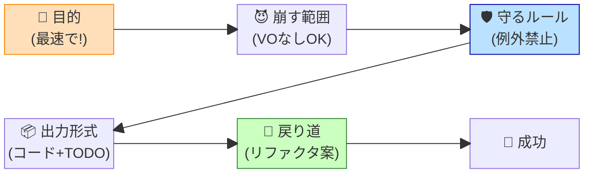

# 第82章：AIに「あえて設計を崩した実装」を指示するテクニック 😈🛠️✨

DDDを学び始めると、「正しい設計で作らなきゃ…！」って気持ちになりますよね😊
でも現実は…

* とりあえず動くものを見せたい！👀💨
* 仕様がまだフワフワで、作ってみないと分からない！🌫️
* 期限がヤバい！🔥
* 外部APIが不安定で、まず動作検証したい！🔌😵

こういう時、**わざと“設計を崩す”のはアリ**です。
ただし大事なのはここ👇

✅ **「無計画に崩す」じゃなくて、AIに“崩し方のルール”を渡して崩す** 🤝✨
✅ **あとで戻れるように“逃げ道”を用意した崩し方をする** 🚪🏃‍♀️

この章では、そのための **AIへの指示の出し方（プロンプト術）** を身につけます💡😺


---

## 1. 「崩す」ってどういう意味？😮


DDD的に“きれい”な実装って、だいたいこう👇

* ドメイン層にルールを書く 🧠
* 集約・値オブジェクト・リポジトリで守る 🏰
* Application層はユースケースだけ担当 🎯
* InfrastructureはDBや外部APIを担当 🔧

でも「崩す」は、例えばこういうことです👇

* 今回だけ **Application層にロジック寄せちゃう**（トランザクションスクリプト寄り）📜
* リポジトリ作らずに **DbContextを直で触る** 🥺
* 値オブジェクト作らず **string/intで突っ走る** 🏎️💨
* ドメインイベントやらない（後回し）📦

ただし！やりっぱなしは地獄なので😇
**“崩していい範囲”と“守るもの”をセットで決めます。**

---

## 2. まず決めるのは「守るもの」と「捨てるもの」🧺🛡️


AIにお願いする前に、これを先に決めると迷いません😊

### 守るもの（最低ライン）🛡️✨

* ✅ **データ整合性**（二重登録しない、残高マイナスにしない等）
* ✅ **セキュリティ**（認可、入力チェック、SQLインジェクション回避）
* ✅ **例外の握りつぶし禁止**（ログ or Resultで返す）
* ✅ **“あとで直す場所”が分かる目印**（TODO/コメント/フォルダ分け）

### 捨てるもの（今回だけ後回し）🧺💨

* ⛔ 値オブジェクト全部
* ⛔ 正式な集約設計
* ⛔ リポジトリ抽象化
* ⛔ イベント駆動・ドメインイベント
* ⛔ 完璧なレイヤー分離

ポイントはこれ👇
**「守るもの」を先に言語化してから、「捨てるもの」を宣言する** 😺📝

---

## 3. AIに“崩し実装”させるための黄金フレーム 🏆🤖


 
AIに投げる指示は、だいたいこの順番にすると強いです💪
 

 
1. **目的**：何を最速で達成したい？🎯
2. **崩してOKな範囲**：どこまで雑でいい？😈
3. **守るルール**：ここだけは絶対守って！🛡️
4. **リファクタの戻り道**：後でどう直す想定？🚪
5. **出力形式**：コード＋説明＋TODO＋次の改善案📦

---

## 4. そのままコピペで使えるプロンプト集 ✍️😺

### 4-1. 検証・スパイク用（最速で動かす）⚡

「今は正しさより“発見”が目的」タイプです🔍✨

```text
あなたはC#の実装アシスタントです。
目的：仕様が固まっていないので、まず動く最小実装を作りたいです。

今回あえて崩してOK：
- DDDの値オブジェクト/集約/リポジトリは作らない
- Application層で手続き的に書いてOK
- DbContextを直接触ってOK

ただし守ってほしい：
- 入力バリデーションは最低限やる
- 失敗は例外握りつぶし禁止（Resultかログ）
- “後でDDDに戻すためのTODOコメント”を要所に入れる
- 影響範囲が広がらないように、コードは1箇所（1クラス＋必要最小）に寄せる

出力：
1) 実装コード
2) なぜこの形にしたか（短く）
3) 後でDDDに戻す時の手順（箇条書き）
```

---

### 4-2. 期限がヤバい本番向け（被害を最小化）🔥

「とにかく今壊さない」タイプです🚒

```text
目的：本番に影響が出ているため、最小変更で修正したいです。

今回あえて崩してOK：
- 追加の抽象化や設計改善はしない（増やさない）
- 既存のスタイルに合わせて、手続き的でもOK

ただし守ってほしい：
- 変更範囲を最小にする（既存コードの周辺だけ）
- 既存のテストが壊れないこと
- 追加するなら最低1つのテスト（再発防止）
- 将来の改善点をTODOコメントで明記

出力：
1) 修正パッチ案（差分が分かる形が理想）
2) 追加テスト
3) リスクと確認観点（箇条書き）
```

---

### 4-3. “汚い箱”に隔離して崩す（後で置き換える）📦🧼


これ超おすすめです！
**「汚いのはここだけ！」** ができると精神が平和🕊️💕

```text
目的：短期で実装したいが、後でDDD/クリーン設計に戻せるようにしたいです。

方針：
- “Temporary” などの隔離フォルダ（または名前空間）に実装を閉じ込める
- 外から呼ぶ入口はインターフェース1つにする（後で差し替え用）
- 中身は手続き的でOK

守ってほしい：
- 入口のインターフェースは安定させる
- 内部は雑でも、外に漏れる型はシンプルにする（DTO）
- TODOで「置き換えポイント」を明記

出力：
1) インターフェース
2) Temporary実装
3) 呼び出し側の最小例
4) 後で置き換える手順
```

---

## 5. ミニ例：「クーポン適用」を“崩し実装”で作る 😈🧾

ここでは例として、**注文にクーポンを適用**する処理を
「本来ならドメインでやりたいけど、今は早く出す」想定で書きます💨

### やりたいこと（ざっくり）🎯

* クーポンコードが有効なら割引
* 0円未満にはしない
* 失敗理由は返す

### “崩し方”の作戦 😈

* 値オブジェクト：作らない
* 集約：作らない
* Applicationサービスに寄せる
* DbContext直叩き（ただし、後で直せるようTODO）

#### Resultだけは使って事故を減らす ✅


```csharp
public sealed record Result(bool IsSuccess, string? Error)
{
    public static Result Ok() => new(true, null);
    public static Result Fail(string error) => new(false, error);
}
```

#### 手続き的なユースケース（崩し版）🛠️

```csharp
public sealed class ApplyCouponService(AppDbContext db)
{
    // TODO: 後でDDD化するなら「Order集約 + Couponポリシー」をDomainに移す
    public async Task<Result> ApplyAsync(Guid orderId, string couponCode, CancellationToken ct)
    {
        if (orderId == Guid.Empty) return Result.Fail("orderIdが不正です");
        if (string.IsNullOrWhiteSpace(couponCode)) return Result.Fail("クーポンコードが空です");

        var order = await db.Orders.FindAsync([orderId], ct);
        if (order is null) return Result.Fail("注文が見つかりません");

        var coupon = await db.Coupons
            .Where(x => x.Code == couponCode)
            .Select(x => new { x.Code, x.DiscountAmount, x.IsActive, x.ExpireAt })
            .FirstOrDefaultAsync(ct);

        if (coupon is null) return Result.Fail("クーポンが存在しません");
        if (!coupon.IsActive) return Result.Fail("クーポンが無効です");
        if (coupon.ExpireAt < DateTimeOffset.UtcNow) return Result.Fail("クーポン期限切れです");

        // TODO: 本来は金額計算はDomainへ（0円未満防止などのルールもDomainに置く）
        var newTotal = order.TotalAmount - coupon.DiscountAmount;
        if (newTotal < 0) newTotal = 0;

        order.TotalAmount = newTotal;
        order.AppliedCouponCode = coupon.Code;

        try
        {
            await db.SaveChangesAsync(ct);
            return Result.Ok();
        }
        catch (DbUpdateException ex)
        {
            // TODO: ログ基盤があるならここで記録（例外握りつぶし禁止）
            return Result.Fail("保存に失敗しました（DB更新エラー）");
        }
    }
}
```

このコードはDDDとしては“雑”です😇
でも、**雑さを閉じ込めて**、**TODOで移設ポイントを書き**、**失敗をResultで返す**。
これだけで「後で直せる雑さ」になります✨

---

## 6. “崩し実装”の事故あるある＆対策 😱🧯

### 事故①：雑さが増殖して止まらない 🧟‍♂️

**対策**：隔離フォルダ・隔離名前空間を作る📦
例：`Temporary/`、`Spikes/`、`LegacyBridge/` など

### 事故②：どこを直せばDDDに戻るか分からない 😵‍💫


**対策**：TODOを“固定タグ”で統一する
例：`// TODO(DDD-MOVE): ...` みたいにして検索できる🔎✨

### 事故③：例外握りつぶしで、原因不明になる 👻

**対策**：Result or ログのどっちかは必須！✅

### 事故④：雑にしたせいでセキュリティ穴が開く 🚨

**対策**：認可・入力チェック・パラメータ化は絶対に手を抜かない🛡️

---

## 7. 今日のミニ演習 💪📘

次のどれか1つを選んで、AIに「崩し実装」を作らせるプロンプトを書いてみてね😊✨

1. 「ユーザーのメールアドレス変更」📧
2. 「在庫を1つ減らす」📦
3. 「予約をキャンセルする」📅❌

条件：

* 崩してOKな点を3つ
* 守る点を3つ
* TODOで戻り道を作る
  この3点をプロンプトに入れれば合格🎉😺

---

## まとめ 🎀✨

* “崩す”のは悪じゃない🙅‍♀️
* 悪いのは「崩し方が無計画」なこと😇
* AIには **崩してOKな範囲** と **守るルール** をセットで渡す🤖🛡️
* そして **戻り道（TODO/隔離/インターフェース）** を作る🚪✨

次の章（第83章）は、さらに攻めて
「正解が分からないとき、まず汚く書いてリサーチする」方向に進みますよ〜🔍💨😺
