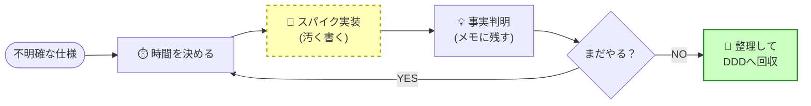

# 第83章：リサーチ駆動設計 🧪✨

**正解がわからない時は、まず汚く書いてみる（でも、ちゃんと“後で勝つ”）💪🙂**

---

## 今日は何をできるようになる？🎯

この章が終わると、こんなムーブができるようになるよ👇

* 「仕様ふわふわ😭」でも、**手が止まらずに前に進める**
* “汚いコード”を **実験コード（スパイク）として安全に扱う**
* AI（Copilot / Codex系）を使って、**不明点→仮説→検証→整理**を爆速で回す🚀
* 実験を終えたら、**DDDに戻れる形**に“学び”を回収できる📦✨


---

## リサーチ駆動設計ってなに？🧐


ざっくり言うと…

> **「よく分からないところは、先に“調べるためのコード”を書いて、事実を集めてから設計する」**

DDDって「最初にきれいに設計しよう」って思いがちなんだけど、現実はこういうのが多いよね👇

* ルールが複雑で、**本人も説明できない**（あるある😂）
* 外部APIがクセ強で、**動かさないと分からない**
* “例外”が多すぎて、**綺麗にモデル化する前に情報が足りない**

こういう時、最初から完璧DDDを目指すと、だいたい詰みます😇

---

## でも「汚く書く」って、設計放棄じゃないの？😅


違うよ〜！ここ超大事💡

### ✅ OKな「汚さ」＝実験のための汚さ 🧪

* 目的：**不明点を潰す**
* 期間：**短い（時間を決める）**
* 扱い：**捨ててもOK**（むしろ捨てる前提が強い）

### ❌ NGな「汚さ」＝そのまま本番に居座る汚さ 🧟‍♀️

* 目的がない（ただ急いだだけ）
* 期限がない（永遠に放置）
* “本番”に混ざって増殖する（最悪🥶）

---

## リサーチ駆動の「5つの約束」📝✨


迷子にならないために、これだけ守ってね👇



1. **時間を決める（タイムボックス）⏱️**
   例：90分で「送料ルールの全パターン」を見える化する、みたいに。

2. **実験場所を隔離する🧪**


   `Spike` フォルダ / `Spike` プロジェクト / `spike/xxx` ブランチなどに分ける。

3. **“学び”をメモする🗒️**
   「結局ルールこうだった」って文章にして残す。未来の自分が喜ぶ🥹

4. **出口条件を決める🚪**
   「この5ケースのテストが通ったら卒業！」みたいにゴールを作る。

5. **最後に“回収”する📦**
   実験コードは捨てる or 使うなら整理してドメインに戻す。

---

## AIをどう使う？🤖💡（超強い使い方）

リサーチ駆動は、AIと相性めっちゃいいよ！

### AIに投げると強いもの👇

* 不明点の洗い出し（質問リスト化）❓
* 仮ルールの提案（たたき台）🧱
* テストケースの大量生成（境界値！）🧨
* “汚い実装”からの抽出候補（値オブジェクト/サービス候補）🧠

#### そのまま使えるプロンプト例 🪄

* 「送料計算の仕様が曖昧。確認すべき質問を20個、優先度付きで出して」
* 「このルールでテストケースを10個、入力と期待値つきで作って」
* 「このメソッド、将来DDDに戻すなら、どんな概念を抽出すべき？」

---

# ハンズオン：送料計算を“スパイク”で片付けよう🚚💨

## お題（わざと曖昧😈）

ECの送料がこう決まるらしい：

* 基本送料：全国一律 600円
* ただし北海道は +400円、沖縄は +800円
* 商品合計が 10,000円以上なら送料無料
* 会員ランクが Gold なら いつでも送料無料
* 重量が 10kg超えると +500円
* クーポン `SHIPFREE` があれば送料無料（ただし沖縄は対象外…らしい？）

…はい、もうツッコミどころ満載🤣
だから今日は「先に動くもの」を作って、仕様を固めるよ！

---

## 1) 最速スパイク（1ファイルでOK）⚡

.NET 10 だと **C#ファイルをそのまま `dotnet run app.cs` で実行**できるよ。検証がめちゃ速い！ ([Microsoft for Developers][1])
（.NET 10 自体は 2025年11月にリリースのLTSだよ）([Microsoft][2])

PowerShellでフォルダ作って👇

```powershell
mkdir ShippingSpike
cd ShippingSpike
code .
```

`app.cs` を作って、まずは“汚く”いこう😎

---

## 2) 汚い実装（でも目的がある✨）

```csharp
using System;

enum Region { Honshu, Hokkaido, Okinawa }
enum Rank { Normal, Gold }

record Order(
    Region Region,
    Rank Rank,
    int TotalYen,
    double WeightKg,
    string? Coupon
);

static int CalcShipping(Order o)
{
    // まずは if まみれでOK！目的は「仕様を固める」🧪
    if (o.Rank == Rank.Gold) return 0;

    if (o.TotalYen >= 10_000) return 0;

    if (o.Coupon == "SHIPFREE" && o.Region != Region.Okinawa) return 0;

    var fee = 600;

    if (o.Region == Region.Hokkaido) fee += 400;
    if (o.Region == Region.Okinawa) fee += 800;

    if (o.WeightKg > 10) fee += 500;

    return fee;
}

var samples = new[]
{
    new Order(Region.Honshu,   Rank.Normal,  9000,  2,  null),
    new Order(Region.Hokkaido, Rank.Normal,  9000,  2,  null),
    new Order(Region.Okinawa,  Rank.Normal,  9000,  2,  null),
    new Order(Region.Honshu,   Rank.Normal, 12000,  2,  null),
    new Order(Region.Okinawa,  Rank.Normal, 12000,  2,  null),
    new Order(Region.Honshu,   Rank.Gold,     100, 20,  null),
    new Order(Region.Honshu,   Rank.Normal,  9000, 11,  null),
    new Order(Region.Okinawa,  Rank.Normal,  9000,  2,  "SHIPFREE"),
    new Order(Region.Honshu,   Rank.Normal,  9000,  2,  "SHIPFREE"),
};

foreach (var s in samples)
{
    Console.WriteLine($"{s} => {CalcShipping(s)} yen");
}
```

実行👇

```powershell
dotnet run app.cs
```

---

## 3) “学び”を回収するメモ 🗒️💎


ここがリサーチ駆動の勝ち筋！

例：`notes.md` にこう書く👇

* 送料無料条件の優先順位：Gold ＞ 合計1万円 ＞ クーポン（沖縄除外）
* 地域加算：北海道+400、沖縄+800
* 重量加算：10kg超 +500
* 「沖縄はクーポン対象外」が本当に正しいか要確認（仕様質問）

このメモがあるだけで、次にDDDへ戻す時に迷わない🙂✨

---

## 4) “卒業条件”を作る（テストで固定）🧷

リサーチが終わったら、挙動を固定するのが大事！
「どれが正しいか」をテストにしておくと、後で整理しても壊れないよ🧯

（ここは xUnit でもいいし、最初は雑に `Debug.Assert` でもOK👌）

```csharp
using System.Diagnostics;

// 例：固めたい期待値（今わかってる範囲だけでOK）
Debug.Assert(CalcShipping(new Order(Region.Honshu, Rank.Normal,  9000,  2, null)) == 600);
Debug.Assert(CalcShipping(new Order(Region.Hokkaido, Rank.Normal,9000,  2, null)) == 1000);
Debug.Assert(CalcShipping(new Order(Region.Okinawa, Rank.Normal, 9000,  2, null)) == 1400);
Debug.Assert(CalcShipping(new Order(Region.Honshu, Rank.Normal, 12000,  2, null)) == 0);
Debug.Assert(CalcShipping(new Order(Region.Okinawa, Rank.Normal, 9000,  2, "SHIPFREE")) == 1400);
Debug.Assert(CalcShipping(new Order(Region.Honshu, Rank.Normal, 9000,  2, "SHIPFREE")) == 0);
```

---

# ここからDDDへ戻すなら？🧅✨（最小でOK）

スパイクで分かったことを、少しだけ“形”にするよ。

たとえば次の抽出が自然👇

* `Money`（金額）
* `Region`（地域）
* `ShippingFeeCalculator`（ドメインサービス）
* 「送料無料条件」を `FreeShippingPolicy` みたいに分離

最初から完璧にしなくてOK！
**“分かったところから小さく整える”**のが強い🙂

---

## “スパイク卒業”のサイン ✅


これが揃ったら、リサーチは成功だよ🎉

* 仕様の質問がリスト化されてる❓
* 代表ケースの期待値が固定されてる🧷
* ルールの優先順位が文章で残ってる🗒️
* 「どこが未確定か」が分かる（ここ重要！）⚠️

---

## よくある事故（回避してね🥺）

* スパイクを本番にコピペして、そのまま放置 😇
* タイムボックスなしで延々いじる 🕳️
* AIの出した仕様を“正”として扱う（要検証！）🤖💥

---

# ミニ演習（ワーク）📝🎀

次のお題で、同じ流れをやってみて！

### お題：ポイント有効期限 🎟️

* 購入ごとにポイントが付く
* 有効期限が「最後の購入から180日」かもしれない
* ただしキャンペーン中は「365日」かもしれない
* 失効のタイミングが「日次バッチ」か「アクセス時」か未確定

👉 やること

1. AIに「確認質問リスト」を作らせる
2. スパイクで `ExpirePoints()` を雑に書く
3. 代表ケースを5つテストで固定する
4. 学びを `notes.md` に回収する

---

## まとめ 🌸

* 仕様が曖昧なら、**最初から綺麗に作ろうとしない**でOK🙂
* まずは **実験コード（スパイク）**で事実を集める🧪
* **タイムボックス・隔離・メモ・出口条件・回収**の5点セットで迷わない✨
* AIは「仕様の穴あけ」「テスト量産」「概念抽出」が得意🤖💪

次の章（第84章）は、このスパイクをどうやって“スモールスタート”で育てるかに繋がるよ🌱✨

[1]: https://devblogs.microsoft.com/dotnet/announcing-dotnet-run-app/?utm_source=chatgpt.com "Announcing dotnet run app.cs - A simpler way to start with ..."
[2]: https://dotnet.microsoft.com/en-us/platform/support/policy/dotnet-core?utm_source=chatgpt.com "NET and .NET Core official support policy"
