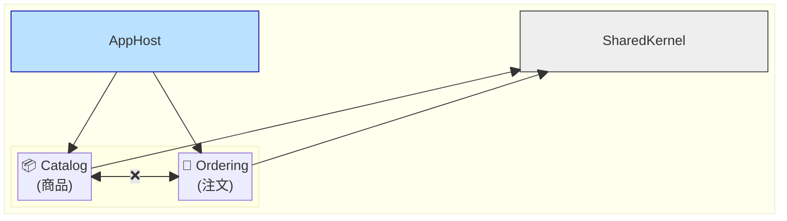

# 第85章：マイクロサービスは1人開発には毒か？🧪☠️ ——「モジュラーモノリス」という最強の逃げ道🧩✨

### この章でできるようになること🎯

* 「マイクロサービスっぽく分けたくなる病」を落ち着かせる🫖😌
* 1人開発で **やるべき分け方**（＝モジュラーモノリス）を説明できる📣
* C#（.NET 10 / C# 14 / EF Core 10）で、**境界が崩れにくい構造**を作れる🏗️✨ ([Microsoft][1])
* 将来「必要になったら」マイクロサービスへ移行できる“出口”を用意できる🚪➡️🚀


---

## 1人開発でマイクロサービスが“毒”になりがちな理由☠️🧠


マイクロサービスって、言葉だけ聞くとカッコいいんだよね…！😎✨
でも、1人開発だと **「作る前に抱える仕事」が増えすぎて**、開発が止まりがちです🫠

### マイクロサービスの“追加コスト”3点セット🧾💸

* **分散**：呼び出しが「メソッド呼び出し」じゃなく「ネットワーク」になる（遅い・失敗する）📡⚠️
* **整合性**：DBが分かれると「同時に正しい」を保つのが難しく、**結果整合性**の世界になる🌀
* **運用**：サービスが増えるほど、デプロイ・監視・障害対応が激増する🧯📈

これは有名な整理で、Martin Fowler も「分散・結果整合性・運用複雑性」をトレードオフとして挙げています。([martinfowler.com][2])

### 1人開発あるある😇

* ローカルで動かすだけで **Docker + 何個も起動** → 今日はここで終わり…😇
* ちょっと直したら **どのサービスを再デプロイ？** → 迷子🥲
* ログが散らばって **原因調査が地獄** → 未来の自分が泣く😭

---

## じゃあ結論：1人開発は何を選ぶ？✅

### 「モジュラーモノリス」＝“1個として動く”けど“中身は分ける”🧩💖


モジュラーモノリスは、ざっくり言うとこう👇

* **デプロイ単位は1つ**（アプリは1個）
* でも中身は **モジュール単位で独立**（境界・責務・依存を分ける）

「独立したモジュールを、明確な境界で分ける」アーキテクチャとして説明されます。([Milan Jovanović][3])
そして Microsoft のセッションでも「マイクロサービスは複雑性を増やすので、良いモノリスが実用的な選択になる」と話されています。([Microsoft Learn][4])

---
 
## モジュラーモノリスの“勝ち方”🏆✨（1人開発向けルール）
 

 
### ルール1：モジュール間は「直接参照しない」🚫🔗


* AモジュールがBモジュールの内部クラスを `new` し始めたら終わり🥲
* 代わりに、連携は **イベント**か **公開インターフェイス**だけにする✨

### ルール2：「公開する面」を薄くする🪞


* `public` を増やしすぎると、境界が溶けます🫠
* **公開は“入口だけ”**（例：`AddXxxModule()` と、外に見せるDTO/契約だけ）

### ルール3：DBを「雑に共有しない」🗃️⚠️


* “同じDB”はOK（1人なら現実的）👌
* ただし、理想は

  * **モジュールごとに DbContext を分ける**
  * テーブル（できればスキーマ）もモジュール単位で意識する
* そして「他モジュールのテーブルにJOINしない」🙅‍♀️（将来の分離が地獄になる）

---

## 形にしよう！C#で作る「モジュラーモノリス最小テンプレ」🧩🛠️

ここでは「ミニEC」を例にします🛒✨
モジュール：`Catalog`（商品） / `Ordering`（注文）

### まずはプロジェクト構成（おすすめ）📦


* `AppHost`（ASP.NET Core。起動・DI・API）
* `Modules.Catalog`
* `Modules.Ordering`
* `SharedKernel`（イベントや共通の小物だけ）

ポイント：**モジュール同士は参照しない**（参照していいのは `SharedKernel` だけ）💡

---

## コード例：モジュールの“入口”を作る🚪✨

#### `Modules.Ordering` 側：登録用の入口

```csharp
// Modules.Ordering/OrderingModule.cs
using Microsoft.Extensions.DependencyInjection;

namespace Modules.Ordering;

public static class OrderingModule
{
    public static IServiceCollection AddOrderingModule(this IServiceCollection services)
    {
        // ここで Ordering 内のDI登録を全部やる
        services.AddScoped<PlaceOrderHandler>();
        services.AddScoped<IOrderRepository, InMemoryOrderRepository>();

        return services;
    }
}
```

#### `AppHost` 側：入口だけ呼ぶ

```csharp
// AppHost/Program.cs
using Modules.Ordering;

var builder = WebApplication.CreateBuilder(args);

builder.Services.AddOrderingModule();

var app = builder.Build();

app.MapPost("/orders", async (PlaceOrderRequest req, PlaceOrderHandler handler) =>
{
    var result = await handler.Handle(req.CustomerId, req.Items);
    return result.IsSuccess ? Results.Ok(result.Value) : Results.BadRequest(result.Error);
});

app.Run();

public record PlaceOrderRequest(string CustomerId, List<OrderItemDto> Items);
public record OrderItemDto(string ProductId, int Quantity);
```

これで “Orderingの中身” は AppHost から見えません😊
**入口だけ**が見える。境界が守りやすい！🧱✨

---

## コード例：Orderingモジュール内部は「外に漏らさない」🫥🔒

```csharp
// Modules.Ordering/PlaceOrderHandler.cs
namespace Modules.Ordering;

internal sealed class PlaceOrderHandler
{
    private readonly IOrderRepository _repo;

    public PlaceOrderHandler(IOrderRepository repo) => _repo = repo;

    public async Task<Result<OrderPlacedResponse>> Handle(string customerId, List<OrderItemDto> items)
    {
        if (items.Count == 0) return Result.Fail<OrderPlacedResponse>("商品が空です🥲");

        var order = Order.Place(customerId, items);
        await _repo.Save(order);

        return Result.Ok(new OrderPlacedResponse(order.OrderId));
    }
}

internal interface IOrderRepository
{
    Task Save(Order order);
}

internal sealed class InMemoryOrderRepository : IOrderRepository
{
    private static readonly List<Order> _db = new();

    public Task Save(Order order)
    {
        _db.Add(order);
        return Task.CompletedTask;
    }
}

internal sealed class Order
{
    public string OrderId { get; }
    public string CustomerId { get; }

    private Order(string orderId, string customerId)
    {
        OrderId = orderId;
        CustomerId = customerId;
    }

    public static Order Place(string customerId, List<OrderItemDto> items)
        => new(orderId: Guid.NewGuid().ToString("N"), customerId: customerId);
}

public record OrderPlacedResponse(string OrderId);

// ありがちな Result パターン（超簡易）
public readonly record struct Result<T>(bool IsSuccess, T? Value, string? Error)
{
    public static Result<T> Ok(T value) => new(true, value, null);
    public static Result<T> Fail(string error) => new(false, default, error);
}
```

ポイント🎀

* `internal` を多用して「外へ漏れない」ようにする
* 外に見せるのは **入口（Module）** と **返すDTO（Response）** くらいに絞る

---

## AI（Copilot / Codex）を“設計の味方”にするプロンプト例🤝🤖✨

### 1) 「モジュール境界」をAIに提案させる🧭

* 「ECサイトを作りたい。Catalog/Ordering/Payment/Shipping…みたいに分けたい。
  依存関係の矢印（参照していい方向）も一緒に提案して。
  “将来マイクロサービスに切り出す前提”で、壊れにくい境界にして。」

### 2) 「public を減らすレビュー」をさせる🕵️‍♀️

* 「このモジュールで `public` にするべき型だけを列挙して。
  他は `internal` にして問題ないか、理由付きで指摘して。」

### 3) 「分散を想定した出口」を作らせる🚪

* 「Ordering → Payment 連携を“将来別サービス化できる形”で設計して。
  いまは同一プロセスでOK。イベント駆動（OrderPlaced）にしたい。」

---

## “マイクロサービスにするべきか”ミニ診断✅🩺

YESが多いほど、将来マイクロサービス候補です👇

* 同時に開発する人数が増え、**独立デプロイが必須**になる見込みがある👥
* 特定機能だけが異常に重く、**別スケールしたい**🔥
* 障害時に「この機能だけ落ちても他を生かしたい」強い理由がある🧯
* 監視・運用（ログ、メトリクス、トレース、デプロイ）が回せる体制がある🛠️

1人開発だと、ここまで揃うことが少ないので、まずはモジュラーモノリスが安定です😊💕

---

## よくある失敗集（ここだけ注意！）⚠️🥲

* **モジュール分けしたのに参照しまくる**（＝ただのフォルダ分け）📁💥
* **共有プロジェクト（Shared）に何でも入れる**（巨大ゴミ箱化）🗑️
* **DBで横断JOIN**し始める（分離不能になる）🧟‍♀️
* 「なんか不安」で早期にマイクロサービス化（運用で詰む）🫠

---

## 演習（この章のワーク）📝✨

### 演習1：あなたのアプリを“モジュール分け”してみよう🧩

1. 作りたいアプリを1つ選ぶ（小さくてOK）
2. 機能を5〜7個くらいに分ける（例：会員、課金、通知、検索…）
3. 依存関係の矢印を書く（できれば一方向）➡️

### 演習2：ルールを“コードで強制”してみよう🧱

* 「Modules.A が Modules.B を参照したらビルドで落とす」みたいなテスト（アーキテクチャテスト）を導入する方針を、AIに手順化させてみてね🤖✨
  （※導入ライブラリ候補も一緒に出させると楽です）

---

## まとめ🎀

* 1人開発でマイクロサービスは、**分散・整合性・運用**のコストが重くて“毒”になりがち☠️ ([martinfowler.com][2])
* 最初の正解はだいたい **モジュラーモノリス**：1個として動かしつつ、境界はガチガチに守る🧩✨ ([Milan Jovanović][3])
* AIは「コード生成」より **境界のレビュー**と**依存の監視**に使うと強い🤝🤖

次の章（86章）は「スクリプト言語的アプローチ」なので、Python/PHP/JS経験を“設計に活かす”方向に繋げていこうね😊✨

[1]: https://dotnet.microsoft.com/en-us/platform/support/policy/dotnet-core?utm_source=chatgpt.com "NET and .NET Core official support policy"
[2]: https://martinfowler.com/articles/microservice-trade-offs.html?utm_source=chatgpt.com "Microservice Trade-Offs"
[3]: https://www.milanjovanovic.tech/blog/what-is-a-modular-monolith?utm_source=chatgpt.com "What Is a Modular Monolith?"
[4]: https://learn.microsoft.com/en-us/shows/on-dotnet/on-dotnet-live-modular-monoliths-with-aspnet-core?utm_source=chatgpt.com "On .NET Live - Modular Monoliths with ASP.NET Core"
