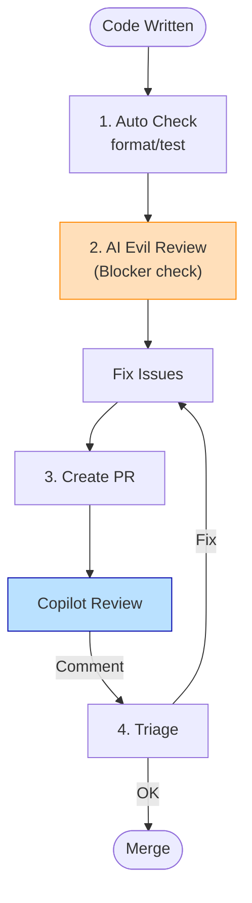

# 第88章：1人でのコードレビュー術 😈📝

## AIに「意地悪なレビュアー」を演じさせて、未来の自分を救う✨


---

## この章でできるようになること ✅

* **AIに“厳しめレビュー”をさせる型**を持てる😈
* **自分のPRを自分でレビューできる流れ**が作れる🔁
* 「動くけど不安…」を、**チェックリストと質問**で潰せる🧠✅
* DDD初学者でも、レビューで最低限見るべき「境界線」を意識できる🧩

---

## 1人開発のコードレビューって何のため？🤔💭

1人だと「レビューしてくれる人」がいないから、こうなりがち👇

* 書いた直後は全部“正しく見える”😇
* 2週間後、自分のコードが読めない😭
* 仕様変更が入った瞬間、どこを直せばいいか迷子🌀

そこで、AIに**“性格の悪い先輩”**になってもらいます😈
ポイントは、**褒めさせない**こと！
「なんとなくOK」じゃなくて、**穴を探させる**のが目的です🕳️🔍

---

## 今日から回せる！1人レビューの基本ループ 🔁✅
 
おすすめはこの順番です（超実戦向け）👇
 

 
1. **ローカルで最低限の自動チェック**🧪

* `dotnet test`
* 可能なら `dotnet format`（整形）
* 警告（Warnings）を潰す（できる範囲でOK）

2. **AI “意地悪レビュー”を先に当てる**😈

* いきなり修正せず、まず「危険箇所の洗い出し」

3. **自分用PRを作って、Copilotレビューをつける**🧑‍💻➡️🔍
   GitHub上のPRでCopilotをレビュアーに追加できます。([GitHub Docs][1])
   しかも自動レビュー設定もできます（自分のPRに自動でレビュー入れる、みたいな運用が可能）。([GitHub Docs][2])

4. **指摘を“仕分け”して直す**🗂️

* Blocker（即死）
* Major（今直すべき）
* Minor（後でOK）
* Question（確認したい）

5. **再レビューを依頼して終わり**🔁✅
   Copilotは、PRに変更をpushしても自動で再レビューしないので、必要なら再レビューを手動で依頼します。([GitHub Docs][1])

> ちなみにCopilotのPRレビューは「Approve」じゃなくて「Comment」扱いです（必須承認にはカウントされない）。([GitHub Docs][1])
> だからこそ、**“あなたの判断”の補助**として使うのがちょうど良いです🙂

---

## 大事なお金の話💸（でも超重要）

CopilotでPRレビュー（またはIDE内レビュー）をすると、**premium request が1回消費**されます。([GitHub Docs][3])
なのでコツは👇

* PRを**小さく**（差分200行以内とか）✂️
* “まとめてドカン”じゃなくて、**小分けレビュー**🍱
* チェックリストで「聞くこと」を固定して、無駄打ちを減らす🎯

---

## AIを“意地悪先輩”にする最強プロンプト 😈🧠

### まずはこれだけ覚えてOK（コピペ用）📋

```text
あなたは超厳しいコードレビュアーです（性格悪めでOK）。
目的は「将来のバグ・仕様変更・保守の地獄」を未然に潰すこと。

次の観点でレビューしてください：
1) 正しさ（バグの可能性、境界値、例外ケース）
2) 設計（責務が混ざってない？依存が逆流してない？）
3) 読みやすさ（意図が読み取れる？命名は嘘ついてない？）
4) テスト（どこが壊れやすい？何をテストすべき？）
5) セキュリティ/入力（不正入力・NULL・空文字・桁・範囲）

出力形式：
- Blocker: （理由＋修正案）
- Major:
- Minor:
- Question:
- テスト提案: （3つ以上）
```

このプロンプトの良いところは、**レビュー結果が“行動”に直結する**ことです✅

---

## DDD初心者がレビューで見るべき“最低ライン” 🧩✅

DDDをまだ知らなくても、これだけ見れば事故が減ります🚑✨

### ① ルール（業務ロジック）が散らばってない？🌀

* あちこちに `if` が増えてたら黄色信号🚥
* 「このルール、どこが本拠地？」って聞ける状態が理想🏠

### ② ドメインがDB/HTTPに引っ張られてない？🧲

* 例：ドメイン層で `HttpContext` とか `DbContext` とか触ってたら危険💥
* “中心（大事なルール）”が外側の都合で歪むのが一番つらい😭

### ③ 「1回の操作で守るべき約束（不変条件）」は守れてる？🧷

* 例：残高がマイナスにならない
* 例：メールは必ず正しい形式
  こういうのは**レビューで見つけやすい**です🔍

---

## GitHubでCopilotにPRレビューさせる（最短手順）🐙🔍

* PRを開く
* **Reviewers** から **Copilot** を選ぶ
* しばらく待つ（レビューコメントが付く）([GitHub Docs][1])

便利ポイント👇

* 提案がある場合、GitHub上で**提案を適用**できることがあります。([GitHub Docs][1])
* さらに、プレビュー機能では**Copilot coding agentに提案修正を“実装させる”**導線もあります。([GitHub Docs][1])

---

## “AIにレビューされる前提”のプロジェクトにするコツ 🧾✨

毎回プロンプトを書くの、だるいですよね😵‍💫
そこで「指示書」をリポジトリに置きます📁

### `.github/copilot-instructions.md` を置く 📝

GitHub Copilotは、リポジトリに **`.github/copilot-instructions.md`** を置いて指示を与えられます。([GitHub Docs][4])
Visual Studio側でも、このファイルを読み込んでチャット要求に自動で含める設定ができます。([Microsoft Learn][5])

例（超シンプルでOK）👇

```md
# プロジェクトのレビュー方針

- public APIは破壊的変更を避ける
- null/空文字/境界値の扱いを必ず確認する
- 例外は「期待されるエラー」には使わず、Result型を検討する
- 命名は「業務の言葉」を優先（略語禁止）
- ドメイン層はDB/HTTPに依存しない
```

---

## VS Code派なら：レビュー用“定型プロンプト”をファイル化できる 🧰✨

VS Codeでは、**プロンプトを `.prompt.md` として保存して再利用**できます。
ワークスペース内なら `.github/prompts` に置けます。([Visual Studio Code][6])

（「コードレビューを毎回同じ型で回す」ことができるやつです😈）

---

## ミニ実例：AIが刺しにくるコード vs 刺されにくいコード 😈⚔️

### ❌ レビューで燃えやすい例（ありがち）🔥

```csharp
public class PaymentService
{
    public decimal ApplyDiscount(decimal total, string couponCode)
    {
        if (couponCode == "A") return total * 0.9m;
        if (couponCode == "B") return total - 100;

        return total;
    }
}
```

AIに意地悪レビューさせると、だいたいこう刺されます😈

* 「totalがマイナスになったら？」（Blocker候補）
* 「couponCodeがnull/空/小文字だったら？」
* 「"A" と "B" って何？」（命名＆仕様の埋没）
* 「割引ルール増えたら地獄だよね？」（変更耐性）

### ✅ “刺されにくい”方向に寄せた例✨

```csharp
public sealed class PaymentService
{
    public decimal ApplyDiscount(decimal total, string? couponCode)
    {
        if (total < 0) throw new ArgumentOutOfRangeException(nameof(total));

        couponCode = couponCode?.Trim();

        return couponCode switch
        {
            "A" => RoundMoney(total * 0.9m),
            "B" => Math.Max(0, total - 100),
            _ => total
        };
    }

    private static decimal RoundMoney(decimal value)
        => decimal.Round(value, 0, MidpointRounding.AwayFromZero);
}
```

まだDDDっぽいパーツ（値オブジェクト等）を入れてなくても、
**“境界値・入力・増える未来”**をケアするだけで事故率が下がります📉✨

---

## 88章ワーク🎯：今日から使える「自分レビュー」セットを作ろう💪✨

### Step 1：レビュー用チェックリストを作る✅

`CODE_REVIEW_CHECKLIST.md` として保存してOK📄

* [ ] 仕様どおり？（境界値・例外ケース）
* [ ] 入力（null/空/範囲/桁）
* [ ] 依存の向きが変じゃない？（ドメインが外側に引っ張られてない？）
* [ ] 命名が嘘ついてない？
* [ ] テスト、最低1つ追加した？🧪

### Step 2：AIに投げる（意地悪先輩プロンプト）😈

* まずは **「Blockerだけ探して」** と頼む
* 次に **「テスト提案だけ出して」** と頼む
* 最後に **「設計の臭いだけ」** と頼む

（1回で全部聞くより、分けると精度が上がりやすいです🎯）

### Step 3：GitHubのPRにCopilotを付ける🐙

PRのReviewersからCopilotを選んでレビューさせる。([GitHub Docs][1])
必要なら、push後に再レビューも依頼。([GitHub Docs][1])

---

## よくある失敗あるある😂→対策✅

* **AIの指摘を全部直そうとして疲れる**😵‍💫
  → Blocker/Majorだけ先にやる。Minorは「メモ」でも勝ち✅

* **AIが自信満々に間違う**🤖💥
  → 「再現手順」「テスト案」「根拠」を必ず要求する📌
  （“意地悪レビュー”は、ここが強い✨）

* **差分がデカすぎてレビューが雑になる**🧱
  → PRを小さくする✂️（premium request節約にもなる）([GitHub Docs][3])

---

## 次章へのつながり🔜✨

次は「ドキュメントはAIに書かせる」📚🤖
今日作ったチェックリストや指示書が、そのままREADME生成の“材料”になります🧾✨

---

* [The Verge](https://www.theverge.com/news/669339/github-ai-coding-agent-fix-bugs?utm_source=chatgpt.com)
* [The Verge](https://www.theverge.com/news/808032/github-ai-agent-hq-coding-openai-anthropic?utm_source=chatgpt.com)
* [TechRadar](https://www.techradar.com/pro/angry-github-users-want-to-ditch-copilot-features-forced-upon-them?utm_source=chatgpt.com)

[1]: https://docs.github.com/copilot/using-github-copilot/code-review/using-copilot-code-review "Using GitHub Copilot code review - GitHub Docs"
[2]: https://docs.github.com/en/copilot/how-tos/use-copilot-agents/request-a-code-review/configure-automatic-review "Configuring automatic code review by GitHub Copilot - GitHub Docs"
[3]: https://docs.github.com/en/copilot/concepts/billing/copilot-requests "Requests in GitHub Copilot - GitHub Docs"
[4]: https://docs.github.com/ja/copilot/how-tos/configure-custom-instructions/add-repository-instructions "GitHub Copilot のリポジトリ カスタム命令を追加する - GitHub ドキュメント"
[5]: https://learn.microsoft.com/ja-jp/visualstudio/ide/copilot-chat-context?view=visualstudio "チャット応答をカスタマイズする - Visual Studio (Windows) | Microsoft Learn"
[6]: https://code.visualstudio.com/docs/copilot/customization/prompt-files "Use prompt files in VS Code"
