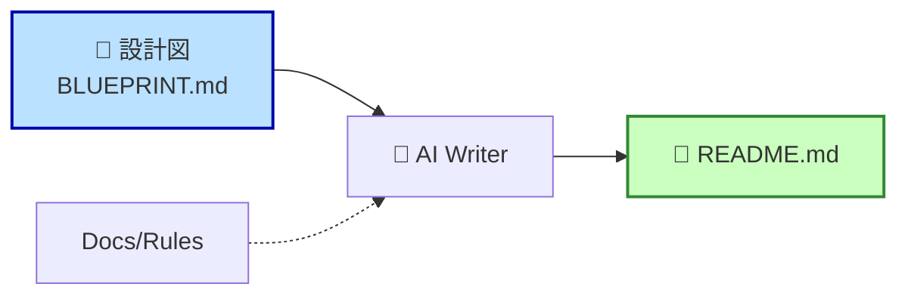
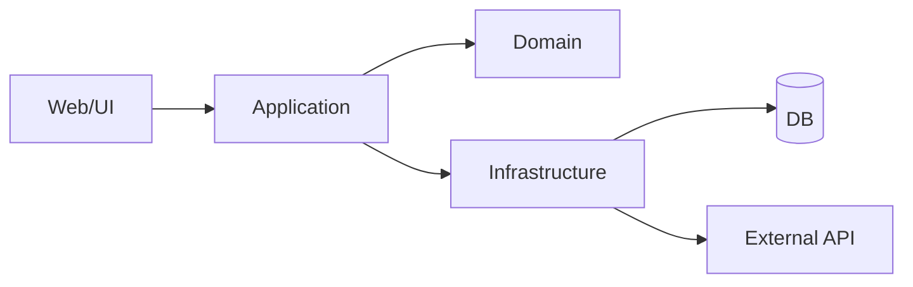

# 第89章：ドキュメントはAIに書かせる 🤖📄 README.md を設計図から生成する


この章のゴールはシンプルです✨
**「設計（＝あなたの意図）」を先に短くまとめて、それを材料にAIでREADMEを一気に書く**ようになります🚀

---

## 1. READMEは「未来の自分＆AIの取扱説明書」🧭

READMEって、他人のためだけじゃなくて
**未来の自分（＝すぐ忘れる）**と **AI（＝前提がないと盛大にズレる）** のための入口です😇

GitHub公式も、READMEは「なぜ役に立つか」「何ができるか」「どう使うか」を伝えるものだよ、と言ってます。([GitHub Docs][1])

なので1人開発だと README はこういう役割になります👇

* ✅ 新しい機能を足すとき、迷子にならない
* ✅ AIに「このアプリの前提」を一瞬で渡せる
* ✅ “いまの設計” と “実装” のズレを早めに発見できる

---

## 2. いきなりREADMEを書かない！先に「設計図1枚」を作る 🗺️

AIにREADMEを書かせるコツは、**先に材料を整える**ことです🍳



DDDでいう「ユビキタス言語」「境界」「主要なルール」を、**1枚の設計メモ**にします。

おすすめファイル名は例えば👇

* `docs/README_BLUEPRINT.md`（あなたの設計図）
* READMEはそこから生成していく

### 設計図テンプレ（コピペOK）📝

※教材内は表示の都合でコード枠をバッククォート4つで囲ってます。実ファイルに貼るときは一般的な囲みでもOKだよ🙆‍♀️

```md
# README_BLUEPRINT（設計図）

## 1. このアプリは何？
- 一言：◯◯を◯◯するアプリ
- 解決したい課題：◯◯
- 想定ユーザー：◯◯（例：店舗スタッフ / 一般ユーザー）

## 2. できること（ユースケース）
- [ ] ◯◯を登録できる
- [ ] ◯◯を更新できる
- [ ] ◯◯を検索できる
- [ ] ◯◯を確定できる

## 3. 用語（ユビキタス言語）
- 「予約」= ◯◯
- 「キャンセル」= ◯◯
- 「確定」= ◯◯（いつ誰ができる？）

## 4. 重要ルール（ビジネスルール）
- 例：確定後はキャンセル不可（ただし◯日以内は可）
- 例：金額は税抜/税込どっちが正？

## 5. 境界（ざっくりでOK）
- Context A：◯◯（例：予約管理）
- Context B：◯◯（例：決済）
- 外部サービス：◯◯（例：メール送信）

## 6. アーキテクチャ方針（超ざっくり）
- Domain / Application / Infrastructure / Web のどんな役割？
- 永続化：EF Core？ファイル？外部API？

## 7. 開発者向けの実行方法
- 起動コマンド：例）dotnet run --project src/Web
- テスト：例）dotnet test

## 8. やらないこと（超重要）
- 今回は◯◯はしない（例：管理画面は後回し）
```

ここまで作れば、もう勝ちです🏆
READMEは「文章力」じゃなくて「材料の質」で決まります✨

---

## 3. AIでREADMEを生成する方法（おすすめ3ルート）🤖

### ルートA：チャットに設計図を貼って「READMEを書いて」でOK ✨

一番早いです。
設計図（`README_BLUEPRINT.md`）を貼って、こう頼みます👇

```text
あなたはC#/.NETの技術ライターです。
以下の README_BLUEPRINT を元に、GitHub向けのREADME.mdを日本語で作成してください。

条件:
- 最初に「このプロジェクトは何？」が30秒で分かるように
- 使い方（起動/テスト）を必ず入れる
- 用語（ユビキタス言語）を短く載せる
- 詳細な設計は docs/ に逃がしてREADMEは短めに
- 相対リンクで docs/ を参照する
（ここに README_BLUEPRINT を貼る）
```

GitHubのREADMEは相対リンクや見出し構造が大事（自動TOCにも関係）という方針が、CopilotのREADME生成用プロンプト例にも明記されています。([GitHub Docs][2])

---

### ルートB：Copilotの「prompt file」でREADME生成をワンコマンド化 ⚡

GitHub Docsに、**README生成用のprompt file**（例：`create-readme.prompt.md`）が公開されていて、VS CodeのCopilot Chatで **`/create-readme`** みたいに呼べます。([GitHub Docs][2])

さらに、Copilotは `.github/prompts` に置いた `*.prompt.md` をprompt fileとして扱えます。([GitHub Docs][3])

おすすめ運用👇

* `.github/prompts/create-readme.prompt.md` を置く
* 中身は「設計図を読み、READMEを生成する」指示にする
* README更新が必要なときは Copilot Chat で実行

※Copilotのprompt fileは「プレビューで変更あり得る」旨の注記もあります。([GitHub Docs][2])

---

### ルートC：リポジトリに「カスタム指示」を入れて、AIのクセを矯正する 🧠

Copilotには、リポジトリ全体の指示として `.github/copilot-instructions.md` を置けます。([GitHub Docs][3])
さらに用途別に `.github/instructions/*.instructions.md` も使えます。([GitHub Docs][3])

例えば、こんな指示を入れると強いです👇

```md
# .github/copilot-instructions.md（例）

- 仕様の用語は docs/README_BLUEPRINT.md を最優先にする
- 重要なルール（ビジネスルール）をREADMEに必ず1セクション入れる
- READMEの「実行方法」「テスト方法」は、実際のプロジェクト構成に合わせる
- 変更を入れたら README も更新する（該当セクションを提案して）
```

---

## 4. READMEの「おすすめ構成」：1人開発×DDD版 🧩

READMEに全部を書くと重くなるので、**READMEは入口**、詳細は `docs/` に逃がすのが楽です☺️

READMEの構成案👇

* 🎯 これは何？（30秒で分かる説明）
* ✅ できること（ユースケース）
* 🧠 用語（ユビキタス言語）ミニ辞書
* 🧱 アーキテクチャ概要（1枚図＋層の説明）
* 🚀 使い方（起動／テスト）
* 📚 詳細ドキュメントへのリンク（`docs/`）
* 🧭 今後（ロードマップ／やらないこと）

GitHubはMarkdownの高度な表現（相対リンク、見出し、など）も強いので、READMEは「入口」としてかなり相性いいです。([GitHub Docs][1])

---

## 5. 1枚図を入れると理解が10倍速い 🧠➡️⚡（Mermaidおすすめ）

GitHubはMarkdown内の図（Mermaidなど）をレンダリングできます。([GitHub Docs][4])
READMEに「全体の流れ」を1枚入れるの、めちゃくちゃ効きます😊

例：注文〜確定の流れ（サンプル）



---

## 6. AI生成READMEの「事故」を防ぐチェックリスト ✅🧯

AIは文章をきれいに整えるのが得意だけど、**事実を勝手に補完**しがちです😇
なので、生成後はここだけ見てください👇

* [ ] 起動コマンドは本当に動く？（コピペで動く？）
* [ ] 重要ルールが“あなたの言葉”と一致してる？
* [ ] 用語がブレてない？（同じ意味で別単語使ってない？）
* [ ] READMEが長すぎない？（詳細は `docs/` へ）
* [ ] 「やらないこと」が入ってる？（将来の迷いを削る✨）

---

## 7. 【演習】READMEをAIに書かせて、未来の自分を救う 💪📝🤖

### 手順

1. `docs/README_BLUEPRINT.md` をテンプレで作る
2. Copilot/Chatに貼って READMEを生成させる
3. 生成された README を自分でチェックリストで修正
4. `docs/` に詳細を逃がす（READMEを軽くする）
5. `.github/copilot-instructions.md` に「用語は設計図優先」を書く（ブレ防止）([GitHub Docs][3])

### 最後にひとこと 🎀

DDD初心者ほど、READMEをAIに書かせる価値が大きいです。
だって、**READMEを作るために“自分の設計が言語化される”**からです🫶

次の章へ進む前に、まずはあなたのプロジェクトで「設計図1枚」だけ作ってみましょ〜！✨

[1]: https://docs.github.com/en/repositories/managing-your-repositorys-settings-and-features/customizing-your-repository/about-readmes?utm_source=chatgpt.com "About the repository README file"
[2]: https://docs.github.com/en/copilot/tutorials/customization-library/prompt-files/create-readme "Create README - GitHub Docs"
[3]: https://docs.github.com/ja/copilot/how-tos/configure-custom-instructions/add-repository-instructions "GitHub Copilot のリポジトリ カスタム命令を追加する - GitHub ドキュメント"
[4]: https://docs.github.com/en/get-started/writing-on-github/working-with-advanced-formatting/creating-diagrams?utm_source=chatgpt.com "Creating Mermaid diagrams"
