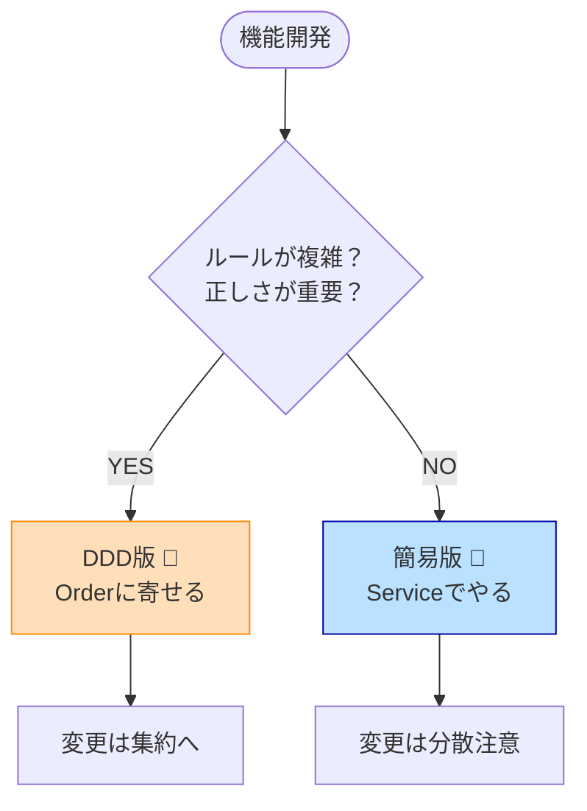

# 第90章【ワーク】複雑な機能を「DDD版」と「簡易版」でAIに書き比べさせる 🧪🤖✨


この章のゴールはシンプルです😊
**「同じ仕様」を、(A) DDDっぽく丁寧に作った版 と (B) 速さ優先の簡易版 で “AIに” 作らせて、差を体感する**こと！🎯

ちなみに今のC#は **C# 14（.NET 10）** が最新で、**Visual Studio 2026** で試せます。([Microsoft Learn][1])
GitHub Copilot Chat も Visual Studio 側で “統合体験” として入りやすくなっていて、**チャット/インラインチャット/差分プレビュー**を使って「AIの提案を安全に採用」できるのが強いです🛡️([Microsoft Learn][2])
（.NET 10 は **2025-11-11** リリースの LTS で、**2028-11-10 までサポート**です📌）([Microsoft for Developers][3])

---

## 今日のお題：ネットショップの「注文確定」機能 🛒🎟️💰

「ちょっと複雑」くらいが、DDDと簡易版の差が出て最高です😆✨
今回はこれ👇

### 仕様（これをAIに渡す）

* 注文には「明細（商品ID・単価・数量）」がある
* クーポンは **1枚だけ**使える（固定値引き）
* ポイントは **使える**（ただし使いすぎ禁止）
* 注文確定すると **以後変更不可**
* 合計金額は 0円未満にならない

### 追加ルール（あとで“変更要求”として投げる用😈）

あとで差を見るために、変更要求を3つ用意します👇

1. 「クーポンは **合計3,000円以上**のときだけ有効」
2. 「ポイントは **合計の30%まで**しか使えない」
3. 「クーポン割引後の金額に対して、**1%ポイント還元**を付けたい」

---

## Step 1：AIに渡す「仕様シート」を作る 📝✨（超重要！）

AIにいきなり「DDDで作って」って言うと、だいたい事故ります😂
先に **仕様を1枚に圧縮**して渡すのがコツ！

#### 仕様シート（テンプレ）

（このままコピペして使ってOK👌）

```text
あなたはC#で設計をする上級者です。
以下の仕様を実装してください。まず「不明点」を質問し、その後に実装案を出してください。

# 仕様: 注文確定
- Order: 注文（明細の集合、クーポン、使用ポイント、確定状態）
- 明細: (ProductId, UnitPrice, Quantity)
- クーポン: 固定値引き（例: 500円引き）1枚だけ
- ポイント: 任意のポイントを使用できる
- 合計金額は0未満にならない
- 注文確定後は変更不可

# 出力してほしいもの
- まず質問（不明点がなければ「質問なし」と書く）
- 次に設計（DDD版 / 簡易版の2案）
- 各案のファイル構成
- 各案の主要コード（省略しすぎない）
- xUnitのユニットテスト
```

💡ポイント：**「最初に質問させる」**と、AIの暴走が激減します😊

---

## Step 2：DDD版をAIに作らせる（“境界線が主役”）🏰✨

### 2-1：DDD版の狙い 🎯

* **ルール（ビジネスの正しさ）**が、コードの中心にいる
* 変更が来ても、直す場所が “だいたい決まる”
* AIにも「ここがドメインだよ！」って教えやすい

### 2-2：AIへの指示（DDD版）

```text
次の条件で「DDD版」を実装してください。

- レイヤ: Domain / Application / Infrastructure（最小でOK）
- Domainには:
  - 値オブジェクト: Money, Points, Coupon
  - 集約ルート: Order
  - ルールはOrderのメソッドで守る（確定後の変更禁止、合計0未満禁止）
- Applicationには:
  - PlaceOrder（注文作成〜確定までのユースケース）
- Infrastructureには:
  - インメモリRepository（DBなしでOK）

出力:
- ファイル構成
- 主要コード
- xUnitテスト（ルールが壊れないことを確認）
```

---

## Step 3：DDD版の“最低限の形”サンプル 🧱✨

ここからは「AIが出してきたもの」を人間が整えるイメージで見てね😊
（全部書くと長くなるので、要点だけ出します！）

### Domain：値オブジェクト

```csharp
public readonly record struct Money(decimal Amount)
{
    public static Money Zero => new(0);

    public static Money operator +(Money a, Money b) => new(a.Amount + b.Amount);
    public static Money operator -(Money a, Money b) => new(a.Amount - b.Amount);

    public Money ClampToZero() => Amount < 0 ? Zero : this;
}

public readonly record struct Points(int Value)
{
    public static Points Zero => new(0);

    public Points
    {
        if (Value < 0) throw new ArgumentOutOfRangeException(nameof(Value));
    }
}

public sealed record Coupon(string Code, Money DiscountAmount);
```

### Domain：集約ルート Order（ルールの本丸🏯）

```csharp
public sealed class Order
{
    private readonly List<OrderLine> _lines = new();
    private Coupon? _coupon;
    private Points _usedPoints = Points.Zero;

    public bool IsConfirmed { get; private set; }

    public IReadOnlyList<OrderLine> Lines => _lines;

    public void AddLine(string productId, Money unitPrice, int quantity)
    {
        EnsureNotConfirmed();
        _lines.Add(new OrderLine(productId, unitPrice, quantity));
    }

    public void ApplyCoupon(Coupon coupon)
    {
        EnsureNotConfirmed();
        _coupon = coupon;
    }

    public void UsePoints(Points points)
    {
        EnsureNotConfirmed();
        _usedPoints = points;
    }

    public Money Total()
    {
        var subtotal = _lines.Aggregate(Money.Zero, (acc, x) => acc + x.LineTotal());
        var afterCoupon = _coupon is null ? subtotal : subtotal - _coupon.DiscountAmount;
        var afterPoints = afterCoupon - new Money(_usedPoints.Value);
        return afterPoints.ClampToZero();
    }

    public void Confirm()
    {
        EnsureNotConfirmed();
        if (_lines.Count == 0) throw new InvalidOperationException("明細がありません");
        IsConfirmed = true;
    }

    private void EnsureNotConfirmed()
    {
        if (IsConfirmed) throw new InvalidOperationException("確定後は変更できません");
    }
}

public sealed record OrderLine(string ProductId, Money UnitPrice, int Quantity)
{
    public OrderLine
    {
        if (string.IsNullOrWhiteSpace(ProductId)) throw new ArgumentException("ProductId必須");
        if (Quantity <= 0) throw new ArgumentOutOfRangeException(nameof(Quantity));
    }

    public Money LineTotal() => new(UnitPrice.Amount * Quantity);
}
```

### xUnit：ルールテスト（DDD版の強み✨）

```csharp
public class OrderTests
{
    [Fact]
    public void Confirmed_Order_Cannot_Be_Changed()
    {
        var order = new Order();
        order.AddLine("P001", new Money(1000), 1);
        order.Confirm();

        Assert.Throws<InvalidOperationException>(() =>
            order.AddLine("P002", new Money(500), 1));
    }

    [Fact]
    public void Total_Never_Goes_Below_Zero()
    {
        var order = new Order();
        order.AddLine("P001", new Money(1000), 1);
        order.ApplyCoupon(new Coupon("C5000", new Money(5000)));
        order.UsePoints(new Points(9999));

        order.Total().Amount.Should().Be(0);
    }
}
```

💡ここでのポイントは、**「仕様＝Orderのメソッド」**になってること😊
つまり、AIが他の場所で変なことしても、**最後はOrderが守る**のがDDDの気持ちよさです🛡️✨

---

## Step 4：簡易版をAIに作らせる（“速さが主役”）🏃‍♀️💨

### 4-1：簡易版の狙い 🎯

* とにかく速く作って出す
* ルールはサービス手続きに寄る（Transaction Script）
* 後で増えたら、DDDへ移行もアリ（そのために比較する！）

### 4-2：AIへの指示（簡易版）

```text
次の条件で「簡易版（Transaction Script）」を実装してください。

- クラスは OrderService 1つ中心でOK
- データはDTO（OrderDto, LineDto）でOK
- ルール（確定後変更禁止、合計0未満禁止）は service 側で if で守る
- インメモリ保存でOK
- xUnitテストも付ける
```

### 4-3：簡易版のイメージ（要点）

* `OrderDto { Lines, CouponDiscount, UsedPoints, IsConfirmed }`
* `OrderService` が `if` 祭りで全部やる感じ😂
* 早いけど、変更要求が来たときに “散らばりやすい” かを後で確認するよ！

---

## Step 5：変更要求を投げて「差」を見る 😈🔁✨（この章のメイン！）

ここが一番おもしろいところ！😆
DDD版と簡易版、それぞれに **同じ変更要求**をAIに投げます。

### 変更要求プロンプト（共通）

```text
今ある実装に、次のルール変更を入れてください。

1) クーポンは合計3,000円以上のときだけ有効
2) ポイントは合計の30%までしか使えない
3) クーポン適用後の金額に対して1%ポイント還元を付けたい

出力:
- 変更したファイル一覧
- 変更理由
- 追加/修正したテスト
- 仕様が壊れていないことの説明
```

### 見るべき観察ポイント👀✨

* DDD版：**Order（集約）に変更が集まる？**
* 簡易版：**Serviceのifが肥大化して読みにくくなる？**
* テスト：**どっちが追加しやすい？**（ここ超重要！🧪）

---

## Step 6：判断チェックリスト ✅💡（1人開発で迷わない！）

DDDが必要かどうか、ここで判定しちゃお😊



### DDD寄りが向くサイン🏰

* ルールが増える（割引、上限、状態遷移、例外条件…）📈
* “正しさ” が売り（お金、在庫、契約、権限）💰🔒
* AIに書かせる量が増えて、境界がないと壊れる🤖💥

### 簡易版が向くサイン🏃‍♀️

* 仕様が薄い（CRUD中心、記録帳タイプ）🗒️
* とりあえず出して反応見たい（仮説検証）🚀
* 近いうちに捨てる/作り直す予定がある🧹

---

## Step 7：Copilot Chatで“安全に”AIを使うコツ 🛡️💬

Visual Studio だと Copilot Chat で、
**チャット**と**インラインチャット**を使い分けられて、提案は**差分プレビュー**で入れられます😊([Microsoft Learn][2])

おすすめ運用👇✨

* まずチャットで「設計案」「ファイル構成」だけ出させる🧠
* 次にインラインで「このメソッドだけ修正して」って細かく頼む✂️
* 変更は必ず **テスト追加→実装**の順に誘導する🧪➡️🔧

---

## まとめ 🎁✨

この章で一番持ち帰ってほしいのはこれ👇
**「DDDかどうか」より、AIに“壊させない境界”を作れてるか**が超大事😊🤖🛡️

---

## 宿題（15分）📚⏱️

1. 今日の「注文確定」を、**自分の作りたいアプリの機能**に置き換えてみる✨
2. 同じ手順で **DDD版/簡易版**をAIに作らせる🤖
3. 変更要求を1つ投げて、直す場所が散らばるか観察👀

---

* [The Verge](https://www.theverge.com/news/669339/github-ai-coding-agent-fix-bugs?utm_source=chatgpt.com)
* [itpro.com](https://www.itpro.com/software/development/github-just-launched-a-new-mission-control-center-for-developers-to-delegate-tasks-to-ai-coding-agents?utm_source=chatgpt.com)
* [windowscentral.com](https://www.windowscentral.com/artificial-intelligence/microsoft-adds-googles-gemini-2-5-pro-to-github-copilot-but-only-if-you-pay?utm_source=chatgpt.com)

[1]: https://learn.microsoft.com/en-us/dotnet/csharp/whats-new/csharp-14 "What's new in C# 14 | Microsoft Learn"
[2]: https://learn.microsoft.com/en-us/visualstudio/ide/visual-studio-github-copilot-chat?view=visualstudio "About GitHub Copilot Chat in Visual Studio - Visual Studio (Windows) | Microsoft Learn"
[3]: https://devblogs.microsoft.com/dotnet/announcing-dotnet-10/ "Announcing .NET 10 - .NET Blog"
