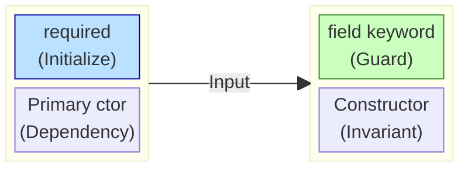

# 第91章：C#の進化とDDD 🌱✨ `Primary constructor` と `required` で「迷わない実装」にする！


DDDって、いちばん苦しいのがここなんだよね👇
**「ドメインのルールを守りたいのに、ボイラープレート（儀式コード）が増えて、だんだん守れなくなる問題」**😭💦

でも最近のC#は、そこをかなり助けてくれます✨
この章では、特に効く3つをDDD目線で使い分けできるようにします🧠💕

* `Primary constructor`（C# 12）➡️「宣言をスッキリ」＋「意図を前に出す」 ([Microsoft Learn][1])
* `required`（C# 11）➡️「初期化漏れをコンパイルで止める」 ([Microsoft Learn][2])
* `field` キーワード（C# 14）➡️「プロパティに最小ガードを足しても汚れない」 ([Microsoft Learn][3])

---

## 1) まず結論：DDDでの “おすすめ配置” 🌸🧭

DDDは「どこにルールを置くか」が命！なので、C#新機能も置き場所で使い分けます😊



### ✅ Primary constructor を使いやすい場所

* **依存注入されるクラス**（Controller / Handler / ApplicationService）
* **ルールが Value Object 側に閉じていて、コンストラクタで複雑な検証をしない Entity / Aggregate**
* **“ただ代入するだけ” の薄い型**（例：インフラ境界のアダプタ）

> Primary constructor は「型の宣言行＝必要なもの一覧」になるのが強い💪 ([Microsoft Learn][1])

### ✅ required を使いやすい場所

* **DTO / Command / Query**（入力データの受け口）
* **設定クラス**（Options系）
* **“データだけ” を運ぶクラス**

> `required` は「object initializer で必ずセットしてね」という機能です ([Microsoft Learn][2])

### ✅ field を使いやすい場所（C#14）

* **プロパティに “1行だけガード/正規化” を足したいとき**（null禁止、trim、範囲丸めなど）
* **「DDDの不変条件（軽め）」をプロパティで支えたいとき**

> `field` は auto-property のまま最小ロジックを入れられます ([Microsoft Learn][3])

---

## 2) Primary constructor（C# 12）をDDDっぽく理解する 🧩✨

### 2-1. Primary constructor って何？（超ざっくり）

クラス名の後ろに `(…)` を書いて、**「この型を作るのに必要なもの」**を先に宣言できる機能です😊
しかも、そのパラメータは **型の本体の中で使えます** ([Microsoft Learn][1])

```csharp
public sealed class User(UserId id, Email email)
{
    public UserId Id { get; } = id;
    public Email Email { get; } = email;
}
```

**DDD的に嬉しいポイント**✨

* 「Userを作るのに必要なもの」が宣言から一発でわかる👀💡
* 余計な `this.id = id;` の儀式が減る
* AIに読ませた時も、意図がブレにくい（プロンプト短くなる）🤖💕

---

### 2-2. 注意：Primary constructor のパラメータは “フィールドじゃない” 🧠⚠️

重要！Primary constructor の `id` や `email` は **メンバーではなくパラメータ**です。
だから `this.id` とは書けません ([Microsoft Learn][1])

```csharp
public sealed class User(UserId id)
{
    // this.id は存在しない（idはパラメータ）
    public UserId Id { get; } = id;
}
```

---

### 2-3. さらに注意：使い方によって “隠しフィールド” が生える 🌿😳

パラメータをメソッド内で参照すると、コンパイラが **保存領域（隠しフィールド）を作ることがあります** ([Microsoft Learn][1])

> 「初期化にしか使わない」なら保存されないこともある
> 「メソッド内でも使う」なら保存されることがある
> …という感じです ([Microsoft Learn][1])

DDD的には、ここが地味に大事で👇
**“うっかり状態を増やす” 感覚**になりやすいので、迷ったらこうするのが安全です👇

✅ **Primary constructor は「代入まで」**
✅ **振る舞いで必要なら、明示的な private readonly フィールドを持つ**（読みやすさ優先）✨

---

## 3) required（C# 11）で「初期化漏れ」をコンパイルで止める 🧯✅

### 3-1. required の本質

`required` は「このプロパティ（またはフィールド）は**必ず初期化してね**」をコンパイルエラーにできます ([Microsoft Learn][2])
ただし重要なのが👇

* **object initializer で必ず入れろ**が基本ルール ([Microsoft Learn][2])
* **null は入れられてしまう**（＝値の妥当性は別問題） ([Microsoft Learn][2])

```csharp
public sealed class CreateUserCommand
{
    public required string Email { get; init; }
    public required string DisplayName { get; init; }
}
```

```csharp
// ✅ OK
var cmd = new CreateUserCommand
{
    Email = "a@example.com",
    DisplayName = "Alice"
};

// ❌ コンパイルエラー（required未設定）
var bad = new CreateUserCommand
{
    Email = "a@example.com"
};
```

DDD的に最高な使いどころは **Application層の入力**です💖
「ユースケースに必要な情報が揃ってないのに処理が始まる」を潰せます🧹✨

---

### 3-2. required を “ドメイン中心” に使うときの注意 ⚠️💭

`required` は便利すぎて、ドメインモデルにも付けたくなるんだけど…
やり方を間違えると **“プロパティにデータを詰めるだけのモデル”** に寄っていきやすいです😵‍💫（DDDの旨味が減るやつ）

なのでおすすめは👇

* **ドメイン（Entity/Aggregate）はコンストラクタ or ファクトリで不変条件を守る**
* `required` は **DTO/Command/設定**など「データを運ぶもの」に寄せる

---

### 3-3. `SetsRequiredMembers` は “解除ボタン” なので慎重に 🧨

required がある型で「コンストラクタで全部セットしてるのに怒られる！」って時、`[SetsRequiredMembers]` があります。
ただしこれは **requiredのチェックを弱める**ので慎重に…！ ([Microsoft Learn][2])

> この属性を付けても「本当に全部セットしてるか」はコンパイラが検証しません ([Microsoft Learn][2])

---

## 4) field（C# 14）で “プロパティの軽い不変条件” を守る 🛡️✨

C# 14 の `field` は、auto-property の裏にある backing field を、アクセサ内で参照できる仕組みです ([Microsoft Learn][3])

つまり👇
**「プロパティに1行ガードを足したいだけなのに、private フィールドを増やしてクラスが汚れる問題」**が消えます🎉

```csharp
public sealed class Profile
{
    public string DisplayName
    {
        get;
        init => field = string.IsNullOrWhiteSpace(value)
            ? throw new ArgumentException("表示名は必須だよ🥺")
            : value.Trim();
    }
}
```

* auto-propertyの見た目は維持✨
* でも `null` / 空白 / trim みたいな **軽いルール**は守れる💖 ([Microsoft Learn][3])

---

## 5) 3つを組み合わせた「DDDの流れ」ミニ例 🌟

題材：ユーザー登録（超ミニ）👩‍💻💕

### 5-1. 入力（Command）に required ✅

```csharp
public sealed class RegisterUserCommand
{
    public required string Email { get; init; }
    public required string DisplayName { get; init; }
}
```

### 5-2. ドメイン側は Value Object にルールを閉じ込める 🔒

（Value Object は前の章の流れで `record`/`record struct` でOK✨）

```csharp
public readonly record struct Email
{
    public string Value { get; }

    public Email(string value)
    {
        if (string.IsNullOrWhiteSpace(value)) throw new ArgumentException("メールが空だよ🥺");
        Value = value.Trim().ToLowerInvariant();
        // 本当は正規表現などを追加でもOK
    }

    public override string ToString() => Value;
}
```

### 5-3. Entity は Primary constructor で “必要なもの宣言” を前に出す ✨

```csharp
public sealed class User(UserId id, Email email)
{
    public UserId Id { get; } = id;
    public Email Email { get; } = email;

    public string DisplayName
    {
        get;
        private set => field = string.IsNullOrWhiteSpace(value)
            ? throw new ArgumentException("表示名が空だよ🥺")
            : value.Trim();
    }

    public static User Register(RegisterUserCommand cmd)
    {
        var user = new User(UserId.New(), new Email(cmd.Email));
        user.DisplayName = cmd.DisplayName; // field でガードされる✨
        return user;
    }
}
```

> Primary constructor で「Userに必要なもの」をスッキリ出して、
> ルールは Value Object とガード（field）で守る、ってイメージです😊

---

## 6) AI（Copilot/Codex）に頼るときの “良い指示” テンプレ 🤖💡

### 6-1. Primary constructor 化してもらう指示

* 「**このクラスを Primary constructor にして、DDD的に違和感が出るところはコメントして**」
* 「**Primary constructor にすると隠しフィールドが増えそうな箇所がある？あれば通常コンストラクタ案も出して**」 ([Microsoft Learn][1])

### 6-2. required の使いどころ判定

* 「**この型は required を付けるべき？それともコンストラクタ/ファクトリで閉じるべき？理由付きで**」 ([Microsoft Learn][2])

### 6-3. field でガードを薄く入れる

* 「**このプロパティの null/空白/trim を field-backed property で最小実装にして**」 ([Microsoft Learn][3])

---

## 7) 演習（この章のゴール確認）✍️💕

### 演習A（required）

`CreateOrderCommand` を作って、必須項目（例：CustomerId, Amount）を `required` にしてみよう💪 ([Microsoft Learn][2])

### 演習B（Primary constructor）

`Order(OrderId id, Money total)` を Primary constructor で書いて、プロパティ初期化だけで成立させよう✨ ([Microsoft Learn][1])

### 演習C（field）

`Name` を `field` で「空白禁止＋trim」して、クラスを汚さずに守ろう🛡️ ([Microsoft Learn][3])

### 演習D（判断問題🧠）

次の型に `required` を使う？使わない？理由もセットで🎀

* Entity（例：User）
* Command（例：RegisterUserCommand）
* EF Coreの永続化モデル
* 外部APIレスポンスのDTO

---

## 8) この章のまとめ 🎁✨（ここだけ覚えればOK！）

* Primary constructor：**宣言を「必要なもの一覧」にして、儀式を減らす** ([Microsoft Learn][1])
* required：**入力DTOなどで “初期化漏れ” をコンパイルで潰す** ([Microsoft Learn][2])
* field（C#14）：**プロパティに1行ガードを入れてもクラスを汚さない** ([Microsoft Learn][3])
* そしてDDD的には…
  **「中心はコンストラクタ/VOで不変条件、周辺は required で事故防止」**が迷いにくいです😊💕

---

次の第92章は「AI開発環境にドメインルールを覚えさせる」なので、もし良ければこの章のミニ例（ユーザー登録）を土台にして、**“AIに読ませる用のドメイン説明テンプレ”**まで一緒に作っちゃいましょ〜！🤖📘✨

[1]: https://learn.microsoft.com/en-us/dotnet/csharp/whats-new/tutorials/primary-constructors "Declare C# primary constructors – classes, structs | Microsoft Learn"
[2]: https://learn.microsoft.com/en-us/dotnet/csharp/language-reference/keywords/required "required modifier - C# reference | Microsoft Learn"
[3]: https://learn.microsoft.com/en-us/dotnet/csharp/whats-new/csharp-14 "What's new in C# 14 | Microsoft Learn"
