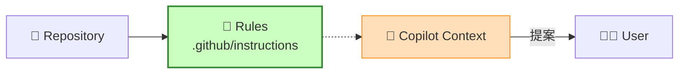

# 第92章：AIツールの活用 🤖✨ 〜AI開発環境に「ドメインルール」を覚えさせよう！〜


AIって便利だけど、そのまま使うと**“それっぽいけど、ドメイン的に間違ってるコード”**を平気で出してきます😇💥
だからこの章では、AIに **「このアプリの世界のルール（ドメインルール）」**を**毎回ちゃんと守らせる仕組み**を作ります💪🌸

---

## この章のゴール 🎯✨

読み終わったら、こんな状態になれます👇😊

* AIが **あなたのアプリの用語（ユビキタス言語）**で話すようになる📘🗣️
* AIが **DDDっぽい境界線**を勝手に壊しにくくなる🧱✨
* 「いつものお願い」を **テンプレ化**して爆速になる⚡🧰
* AIに作業させても、**カオスにならない**（←超大事）🧯🔥

---

## AIに「覚えさせる」ってどういうこと？🧠📌

AIは、あなたの頭の中の仕様を勝手に読めません🥺
なので、**AIが参照できる場所に “ルール” を置く**のがコツです💡✨



つまりこう👇

* ✅ **人間の脳内仕様** → ❌ AIは読めない
* ✅ **リポジリ内のルール文書** → ✅ AIが読める＆繰り返し使える

そして今どきは、GitHub Copilot などが **リポジトリの“指示ファイル”を自動で参照**できます✨
（Visual Studio / VS Code 両方で使える話です） ([GitHub Docs][1])

---

## まずはこれ！Copilotに効く「3点セット」🧰✨

GitHub Copilotには、ざっくりこの3種類の“覚えさせ方”があります👇
（公式に整理されてます） ([GitHub Docs][1])

### ① リポジトリ全体のルール：`.github/copilot-instructions.md` 📜

「このプロジェクトではこうしてね！」を**全体に効かせる**やつです。 ([GitHub Docs][1])

### ② 場所ごとのルール：`.github/instructions/*.instructions.md` 🗂️

「Domainフォルダだけ厳しめで！」みたいに、**適用範囲を指定**できます（glob指定）。 ([Microsoft Learn][2])
※ルール同士が矛盾すると挙動が不安定になるので注意⚠️ ([GitHub Docs][1])

### ③ よく使うお願いのテンプレ：`.github/prompts/*.prompt.md` 🪄

「値オブジェクト作って」「ユースケース作って」みたいなお願いを**ワンクリック化**できます✨
Visual Studio だと `#prompt:` で呼べます。 ([Microsoft Learn][2])
VS Codeでもプロンプトファイルが使えます。 ([Visual Studio Code][3])

---

## 実装していこう！✍️✨（最小で効く構成）

おすすめの配置はこんな感じです👇😊

* `.github/copilot-instructions.md`（全体ルール）
* `.github/instructions/domain.instructions.md`（Domain専用ルール）
* `.github/prompts/create-value-object.prompt.md`（お願いテンプレ）
* `docs/domain-glossary.md`（単語帳）
* `docs/domain-rules.md`（業務ルール集）

---

## ① `.github/copilot-instructions.md`（プロジェクト憲法）📜✨

ここは**長文にしすぎない**のがコツです😌
“AIが迷うポイント”だけ書くのが正解💯

例（テンプレ）👇

```md
# このリポジトリの設計ルール（Copilot用）

## 1) 目的
- このアプリは「〇〇」を正しく扱うことが最優先
- “動けばOK”より「ルールが崩れない」を重視する

## 2) 用語（ユビキタス言語）
- User = アプリ利用者
- Order = 注文（確定後は金額が変わらない）
- Money = 金額（通貨とセット）

## 3) DDDのざっくりルール
- Domain層は Infrastructure に依存しない（DB/HTTP/EF Core の参照禁止）
- ビジネスルールは Domain に置く（Application で if 地獄にしない）
- 値は Value Object 化を優先（string/int の生値をばら撒かない）

## 4) 実装ルール
- 例外で制御しない。失敗は Result パターンで返す
- null はできるだけ作らない（nullable を意識）
- public API は分かりやすい命名（日本語コメントOK）

## 5) 生成物の出し方
- いきなりコードを書き始めず、最初に「設計案→確認質問→実装」の順に出す
- 変更点は箇条書きでまとめる
```

これを置くだけで、Copilotが**会話や生成時に参照**できるようになります✨ ([GitHub Docs][1])

---

## ② Domain専用ルール：`.github/instructions/domain.instructions.md` 🧱✨

「Domainだけは絶対に汚したくない！」ってとき、ここが効きます🔥
`applyTo` で対象を絞れます。 ([Microsoft Learn][2])

```md
---
description: "Domain層の絶対ルール"
applyTo: "**/Domain/**/*.cs"
---

- Domain は永続化やHTTPを知らない（EF Core / HttpClient / IConfiguration 禁止）
- Entity/VO は不変寄りに設計する（勝手に set させない）
- ルール違反は Domain 内で防ぐ（不正な状態を作らせない）
- “手続きの羅列”になりそうなら、まずメソッド名で意図を表現する
```

⚠️注意：全体ルールとDomainルールが**矛盾**すると、AIがどっちを採用するか不安定になります😵‍💫 ([GitHub Docs][1])

---

## ③ “お願いテンプレ”を作る：`.github/prompts/*.prompt.md` 🪄✨

たとえば「値オブジェクトを作るお願い」を固定化すると超ラクです💕

```md
# create-value-object.prompt.md

あなたはDDDを守るC#開発者です。

次の値オブジェクトを実装してください：
- 名前：
- 表現したい意味：
- 不正な値の条件：

制約：
- 不変にする
- バリデーションは生成時に行い、不正なインスタンスを作らない
- 失敗は Result パターン（例：Success/Failure）で返す
- 使い方例も添える
```

Visual Studio ならチャット入力で `#prompt:` から呼べます。 ([Microsoft Learn][2])
（VS Codeでもプロンプトファイルを使って同じことができます） ([Visual Studio Code][3])

---

## Visual Studio / VS Code 側の“小ワザ” 🧩✨

### ✅ Visual Studio：指示ファイルを有効化

Visual Studio では Copilot Chat の設定で、`.github/copilot-instructions.md` や `.instructions.md` を読み込む設定があります。 ([Microsoft Learn][2])
さらに、Copilotの返答に **References（参照）** が出るので、そこで「今どのルールが読まれたか」確認できます👀✨ ([Microsoft Learn][2])

### ✅ VS Code：指示ファイルを自動生成できる

VS Code はワークスペースを解析して `.github/copilot-instructions.md` を生成する導線があります🧠✨ ([Visual Studio Code][4])

---

## “AIにドメインを覚えさせる”ためのコツ5つ 🌟😺

1. **単語帳（Glossary）を置く**📘
   「User」「会員」「顧客」みたいな揺れを潰すだけで精度が跳ねます✨
2. **禁止事項はハッキリ書く**🛑
   「DomainでEF Core禁止」みたいに一発で分かる形が強い💪
3. **例を1つ入れる**🧪
   良い例があると、AIはそれに寄せてきます🎯
4. **短く、更新しやすく**✂️
   1万文字の憲法より、500〜1500文字の実務メモが勝ちやすいです😊
5. **ルールは“コードレビュー対象”にする**👩‍⚖️
   仕様が変わったら docs も更新！AIが古いルールで暴走しなくなります🧯

---

## ちょい上級：エージェント系（Copilot / Codex / Antigravity）🤖🚀

### ✅ Copilotの「エージェント」系にも効くファイル

GitHub Copilot では、エージェント向けの指示として `AGENTS.md` を置く仕組みも整理されています（近い階層のものが優先）。 ([GitHub Docs][1])
「大きめ作業を任せる」なら、この手のルールが特に効きます💡

### ✅ OpenAI Codex（VS Code拡張）

CodexのIDE拡張は、IDE上で**読み取り・編集・実行**までやれるタイプのコーディングエージェントです。 ([OpenAI Developers][5])
Windowsは“実験的サポート”扱いなので、必要ならWSLワークスペース運用も視野に入れる感じになります。 ([OpenAI Developers][5])
でも考え方は同じで、**リポジトリにルール文書を置く**のが最短ルートです😊

### ✅ Google Antigravity

Antigravityは、エディタだけじゃなくて**エージェントが計画→実行→検証**まで進める“エージェント中心”の開発プラットフォーム、という位置づけです。 ([Google Developers Blog][6])
こういうツールほど、最初に「ドメインルール文書」を渡しておくと暴走しにくいです🧯✨

---

## 章末ミニ演習 📝💖（30〜45分でOK）

### 演習テーマ：「キャンセルできる条件」をAIに守らせる

1. `docs/domain-rules.md` に次を書く✍️

* 注文は「確定後10分以内」だけキャンセル可能
* キャンセルしたらステータスは Cancelled
* Cancelled の注文は再確定できない

2. `.github/copilot-instructions.md` に
   「ドメインルールは docs/domain-rules.md を参照して守ってね」って1行追加✨

3. Copilot Chat にこう頼む👇😊

* 「注文キャンセルのユースケースを作って。先に確認質問して」

4. 返答の **References** にルールファイルが出てるか確認👀✨ ([Microsoft Learn][2])
   出てなかったら、プロンプトに `docs/domain-rules.md を参照して` を足す！

---

## よくある失敗あるある 😂🧯

* **ルールを書いたのに守らない**
  → References に入ってない可能性大！「参照して」って明示しよ😊
* **ルールが長すぎて読まれてる気がしない**
  → “禁止事項＋例＋単語”に削る✂️✨
* **Domainルールと全体ルールが矛盾**
  → AIが迷って挙動がブレます⚠️（公式にも注意あり） ([GitHub Docs][1])

---


[1]: https://docs.github.com/ja/copilot/how-tos/configure-custom-instructions/add-repository-instructions "GitHub Copilot のリポジトリ カスタム命令を追加する - GitHub ドキュメント"
[2]: https://learn.microsoft.com/en-us/visualstudio/ide/copilot-chat-context?view=visualstudio "Customize chat responses - Visual Studio (Windows) | Microsoft Learn"
[3]: https://code.visualstudio.com/docs/copilot/customization/prompt-files?utm_source=chatgpt.com "Use prompt files in VS Code"
[4]: https://code.visualstudio.com/docs/copilot/customization/custom-instructions?utm_source=chatgpt.com "Use custom instructions in VS Code"
[5]: https://developers.openai.com/codex/ide/ "Codex IDE extension"
[6]: https://developers.googleblog.com/build-with-google-antigravity-our-new-agentic-development-platform/ "
