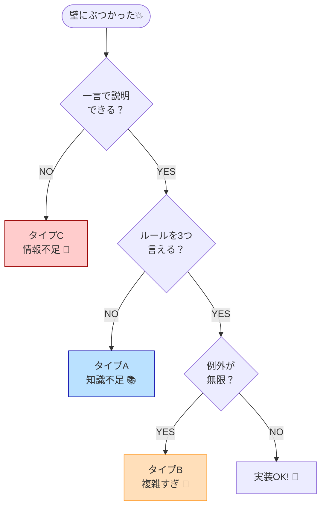

# 第93章：「設計の壁」を感じた時の対処法🧱✨

> 知識不足なの？それとも業務（ドメイン）が複雑すぎるの？を見分けて、迷いから抜け出す方法😉

---

## この章でできるようになること🎯

* 「今つまずいてる理由」を **分類** できるようになる🗂️
* **知識不足** と **ドメインが複雑すぎる問題** を見分けられる👀
* その場でできる **リカバリ手順**（最短ルート）を持てる🏃‍♀️💨
* AI（Copilot / Codex など）を「壁越えの相棒」にできる🤝✨ ([GitHub Docs][1])

---

## まず「設計の壁」ってどんな症状？😵‍💫

こんな感覚が出たら、それは壁です👇

* どこにロジックを書けばいいか分からない🌀
* クラス名が決まらなくて止まる😇
* ちょっと変更しただけで、別のところが壊れる💥
* 「正しいDDDっぽさ」を探して迷子になる🧭
* AIに聞いても、提案が毎回バラバラで余計混乱する🤖💬

この壁、**努力不足じゃなくて“診断不足”** なだけのことが多いです😊✨

---

## 壁の正体はだいたいこの3種類🧩

「知識不足 vs 業務が複雑すぎる」の2択に見えがちだけど、実際は3つに分けるとラクです👇

### A. 設計の知識不足（型を知らない）📚

* ルールの置き場所（集約？サービス？）が分からない
* 「良い/悪い」の基準がまだ頭にない
* 例：集約・不変条件・ユースケースの分け方で詰まる

### B. ドメインが複雑すぎる（業務が難しい）🏢

* ルールが多い、例外が多い、状態遷移がやばい
* 「正しく作ろう」とすると設計が爆発する💣
* 例：会計、予約、在庫、権限、ワークフロー

### C. 仕様・理解が足りない（情報不足）❓

* 実は“設計”じゃなくて“要件が曖昧”で止まってる
* 「正解が存在しない」状態で悩んでいる
* 例：「キャンセル料っていつ発生？誰が決める？」が未確定

---

## 30秒でできる！壁の診断フロー🔎✨

 
止まったらこれを上から順にチェック✅（超大事！）
 

 
### ① その機能を「一言」で説明できる？🗣️

* できない → **C（情報不足）** の可能性大❗
* できる → 次へ

### ② ルールを「3つ」言える？（例外じゃなく基本ルール）📏

* 言えない → **C（情報不足）** か **A（知識不足）**
* 言える → 次へ

### ③ 例外が「1〜2個」じゃなく「無限に増えそう」？♾️

* はい → **B（複雑すぎ）** の可能性大
* いいえ → 次へ

### ④ AIに説明しても、AIの提案がブレまくる？🤖🌀

* ブレる理由が「用語が曖昧」なら → **C**
* ブレる理由が「構造が決まってない」なら → **A**
* ブレる理由が「ルールが多すぎ」なら → **B**

---

## A：知識不足だった時の対処法📚✨（最短で伸びる）

### ゴールはこれ👇

**“正解を暗記”じゃなくて「判断の軸」を持つこと**😊

### 1) いきなり全部DDDしない🙅‍♀️ → 「1つだけ型」を足す

おすすめの順番（軽い順）🪶

* 値オブジェクト（VO）を1つ入れる💎
* 次に Result パターン（例外地獄を止める）🧯
* 次に 集約ルートを1つだけ決める🧱

「全部やる」じゃなくて「1つ効くやつ」を入れるのが勝ちです🏆

### 2) “置き場所迷子”を一発で減らす3点セット🧰

* **ドメイン層**：ルール（不変条件）
* **アプリ層**：手順（ユースケース）
* **インフラ層**：DB・APIなど外界🌍

迷ったらこう考えるといいです👇

* 「このルール、DBがなくても成立する？」→ Yesならドメイン寄り✨
* 「これは手順？それとも性質？」→ 手順ならアプリ層🚶‍♀️

### 3) AIの使い方（知識不足向け）🤝

Copilot Chat は「説明・テスト生成・修正提案」などをIDE内で頼めます([GitHub Docs][1])
ここでのコツは **“正解を聞く”じゃなく“比較させる”** こと😊

**おすすめプロンプト🍰（そのまま使ってOK）**

* 「この処理は “集約のメソッド” と “ドメインサービス” どっちが自然？理由も」
* 「将来の変更が起きそうな点を3つ挙げて、責務の分け方を提案して」
* 「この設計の弱点（破綻ポイント）を意地悪にレビューして」

---

## B：業務が複雑すぎた時の対処法🏢💥（DDDの出番）

### ここでの大事な真実🧠

**複雑な業務は、頑張っても“簡単な設計”にはならない**です😇
だからやることは「気合い」じゃなくて **分割と可視化**✨

### 1) まず「複雑さの種類」を当てる🎯

* 状態が多い（状態遷移）🔁
* 時間が絡む（締め日、期限、履歴）⏰
* 例外が多い（例外ルールが本体）🌀
* 権限が絡む（誰が何できる）🔐
* 外部連携が多い（決済、配送、認証）🌐

### 2) “分ける”だけで8割ラクになる✂️

* **境界づけられたコンテキスト**で「国境」を引く🗺️
* コアだけDDD、周辺は軽量設計でもOK✨（現実的！）

「全部を美しく」より、**コアを守って、周辺でスピード**が強いです🚀

### 3) AIは「複雑さの棚卸し係」にする📦🤖

Copilot にはIDE内で質問できるし([GitHub Docs][1])、
“自走タスク”寄りなら Copilot coding agent にバグ修正・機能追加などを任せてPRを出させる運用もできます([GitHub Docs][2])

**おすすめプロンプト（複雑すぎ向け）🧠✨**

* 「この業務の例外ルールを“カテゴリ分け”して（時間/権限/状態/外部）整理して」
* 「このルール群を2〜3のコンテキストに分割する案を出して。境界の理由も」
* 「“絶対に守るべき不変条件”を箇条書きにして」

---

## C：情報不足だった時の対処法❓（設計じゃなく要件が未確定）

ここが一番ハマりやすいです😂
やることはシンプル👇

### 1) 「質問リスト」を作る📝

例：予約キャンセルなら

* キャンセル料はいつ確定？（予約時？確定時？当日？）
* 返金は即時？締め日まとめ？
* 例外（悪天候、店舗都合）は？
* ステータスは何種類必要？（仮予約/確定/来店/キャンセル…）

### 2) “例”で仕様を固める（Example Driven）🍀

文章で揉める時は、**具体例**が最強です💪

* 「3日前にキャンセル→どうなる？」
* 「当日ドタキャン→どうなる？」
* 「店側都合→どうなる？」

AIに“ドメイン担当役”をやらせて質問を増やすのもアリです😉

---

## 実践：壁を越える「5ステップ」テンプレ🧱➡️🌈

止まったらこれで復帰できます✨

1. **壁ログを書く（1分）**📝

   * 何が決められない？（命名/責務/境界/保存…）
2. **診断（A/B/C）**🔎
3. **スコープを1段下げる（10分スパイク）**🧪

   * 最小のケースだけ動かす
4. **AIに“比較”をさせる**🤖⚖️

   * 案A/案Bのメリデメを出させる
5. **決めた理由を1行残す（未来の自分用）**📌

---

## ミニ演習🧸💡（今日やると効くやつ）

### 演習1：壁ログを作る📝✨

次のフォーマットでメモ（ノートでもOK）

* 詰まってる点：
* 迷ってる選択肢：
* 変更が起きそうな場所：
* “絶対守りたいルール”：

### 演習2：AIに「境界」を提案させる🗺️

* いま作ってる機能を説明して
* 「2〜3のコンテキスト分割案」を出させて
* “なぜそこが境界か” を言語化してもらう

---

## ちょい最新：C# / .NETの今どきトピック（設計と関係ある所だけ）✨

* .NET 10 は LTS で、長期サポート枠として提供されています([Microsoft for Developers][3])
* C# 14 は Visual Studio 2026 / .NET 10 で使える新機能が整理されています([Microsoft Learn][4])
* Visual Studio 2026 はGAになり、AI支援まわりも強化されています([Microsoft for Developers][5])

ポイントはひとつだけ👇
**言語が便利になっても、迷う原因（境界/責務/ルール）は自分で決める必要がある**ってことです😊🧠

---

## 自己チェッククイズ✅🎓

1. 「一言で説明できない壁」はA/B/Cどれが多い？
2. 例外が増え続ける時、最初にやるべきは「実装」or「分割/可視化」？
3. 迷った時、AIには「正解」を聞くより何をさせると良い？
4. コアだけDDDにして、周辺を軽量化するのはアリ？
5. 決めた理由を1行残す目的は？

（全部答えられたらかなり強いです💪✨）

---

## まとめ🌸

* 壁は **A:知識不足 / B:複雑すぎ / C:情報不足** に分けると一気にラク😊
* Aは「型を1個ずつ」入れる、Bは「分割と可視化」、Cは「質問と具体例」
* AIは **正解製造機じゃなく、比較・棚卸し・レビュー役** にする🤖⚖️

次の第94章は「他人（OSSやAI）のコードを設計の目で読む」なので、
この章の“診断力”がそのまま武器になりますよ😉✨

---

* [Microsoft brings GPT-5 to Copilot with new smart mode](https://www.theverge.com/news/753984/microsoft-copilot-gpt-5-model-update?utm_source=chatgpt.com)
* [GitHub’s new AI coding agent can fix bugs for you](https://www.theverge.com/news/669339/github-ai-coding-agent-fix-bugs?utm_source=chatgpt.com)

[1]: https://docs.github.com/ja/copilot/how-tos/chat-with-copilot/chat-in-ide?utm_source=chatgpt.com "IDE で GitHub Copilot に質問する"
[2]: https://docs.github.com/copilot/concepts/agents/coding-agent/about-coding-agent?utm_source=chatgpt.com "About GitHub Copilot coding agent"
[3]: https://devblogs.microsoft.com/dotnet/announcing-dotnet-10/?utm_source=chatgpt.com "Announcing .NET 10"
[4]: https://learn.microsoft.com/ja-jp/dotnet/csharp/whats-new/csharp-14?utm_source=chatgpt.com "C# 14 の新機能"
[5]: https://devblogs.microsoft.com/visualstudio/visual-studio-november-update-visual-studio-2026-cloud-agent-preview-and-more/?utm_source=chatgpt.com "Visual Studio 2026 November 2025 Update"
