# 第96章：ポスピタリティとしての設計 💝

**未来の自分**と、いつか引き継ぐ**誰か**が「迷わない」ための思いやり設計✨


---

## 0. 今日のゴール 🎯

この章を読み終わったら、あなたはこうなります👇

* 仕様変更のときに「どこ触ればいい…？😵‍💫」が減る
* AI（Copilot/ChatGPT）に頼んでも「全体が崩れない」指示が出せる
* “引き継ぎゼロでも回る” 優しいコードベースの型を持てる💪

---

## 1. ポスピタリティってなに？☕

設計のポスピタリティ＝**「読む人の脳みそにやさしい」**ことです🧠💤

### ✅ 未来の自分は“初見の他人”


3ヶ月後に開いた自分のコードにこう言ったことありません？
「え、これ何…？私が書いたの…？😇」

だから設計は、**未来の自分をお客さま扱い**してあげるのが正解です🫶

---

## 2. 優しい設計の “5つのサービス” 🛎️✨


コードベースをホテルに例えるとわかりやすいです🏨💕

```mermaid
block-beta
  block:L4["Level 4: Guide"]
    README["README<br/>(Map)"]
    ADR["ADR<br/>(Why)"]
  end
  
  space
  
  block:L3["Level 3: Readability"]
    Naming["Consistent Naming"]
    NoMagic["No Magic Numbers"]
  end
  
  space
  
  block:L2["Level 2: Safety"]
    VO["Value Object"]
    Result["Result Pattern"]
  end
  
  space
  
  block:L1["Level 1: Structure"]
    Layers["Layers & Dependency"]
  end
  
  style README fill:#ffdfba,stroke:#f80
  style L1 fill:#eee,stroke:#333
```



### ① 迷わない：道案内がある 🗺️

* フォルダ構成が一貫してる
* 名前が「役割」を説明してる
* 入口（ユースケース）がすぐ見つかる

### ② いきなり壊れない：安全柵がある 🧱

* 不正な値が入らない（Value Object / バリデーション）
* 例外を乱発しない（Resultパターンなど）
* ルールが“散らばらない”（集約・ユースケースに寄せる）

### ③ まず読める：優しい文章になってる 📖

* 長いメソッドがない
* ifの森がない🌳
* “なぜそうするか” が残ってる（コメントじゃなく決定の記録）

### ④ すぐ試せる：チェックインが簡単 🧳

* READMEに「起動方法・テスト方法」がある
* デバッグの入り口がある
* サンプルデータがある

### ⑤ AIが迷子にならない：案内係がいる 🤖

* Copilotに “このプロジェクトの作法” を渡してある
* ドメイン用語が統一されている（ユビキタス言語）

---

## 3. “優しさ”はコードより先に「名前」で決まる 🏷️✨


DDD初心者が最初に伸びるのはここです💡

### ✅ 悪い例（やさしくない）

* `DataService`, `Process`, `Handle`, `Manager`
  → 便利そうで、**意味がゼロ**😵‍💫

### ✅ 良い例（やさしい）

* `OrderPlaceService`（注文を確定するユースケース）
* `OrderId`（注文IDの型）
* `Money`（金額のルールを持つ値）

“役割と言葉”が見えます👀✨

---

## 4. 「AI時代のポスピタリティ」＝AIにルールを渡すこと 🤝🤖

AIは賢いけど、**プロジェクトの作法**は知らないです💦
だから先に“しおり”を渡します📎

### 4.1 Copilotにプロジェクトのルールを覚えさせる 📘


GitHub Copilotは、リポジトリに **`.github/copilot-instructions.md`** を置くと、プロジェクト共通の指示を読んでくれます。([GitHub Docs][1])

たとえばこんな感じ👇（テンプレとして使ってOK）

```md
# copilot-instructions.md

## ドメイン用語
- Customer = 顧客（=課金主体）
- User = 利用者（=実際に操作する人）
- Order = 注文（確定前は Cart）

## 設計ルール
- Domain層は Infrastructure に依存しない
- 例外で制御しない。Result型で返す
- 値は可能な限り ValueObject (record) にする

## 変更時の手順
- 変更前にテスト追加
- dotnet test を必ず通す
- Public API変更は README に反映
```

これだけで、AIが“勝手に流儀を変える事故”が激減します🫶✨

> ちなみに Visual Studio では Copilot Chat を開いて相談できます（メニューから開ける）。([Microsoft Learn][2])
> そしてCopilotはVisual Studio側にも統合が進んでいます。([Visual Studio][3])

---

## 5. “優しさ”を自動化する：アナライザー＆.editorconfig 🧹✨


人は疲れるとブレる😪
だからブレないために **機械に見張らせる**のが優しさです👮‍♀️

.NET のコード解析（Roslynアナライザー）はSDKに含まれ、スタイル/品質チェックができます。([Microsoft Learn][4])
`.editorconfig` で「このプロジェクトの作法」を固定できます。([Microsoft Learn][5])

例：最低限の “揉めない” 設定（超ミニ）👇

```ini
# .editorconfig
root = true

[*.cs]
indent_style = space
indent_size = 4

# var を強制しない（初心者が読みやすい方向）
csharp_style_var_for_built_in_types = false:suggestion
csharp_style_var_when_type_is_apparent = false:suggestion

# using の整理
dotnet_sort_system_directives_first = true
```

ポイントは「完璧を目指さない」ことです🙂
まずは **読みやすさが落ちないライン**だけ固定すればOK💕

---

## 6. “未来の自分”が最短で理解できる3点セット 📦✨


ドキュメントは長文じゃなくていいです！
むしろ短くていいから「置く」ことが勝ち🏁

### ① README（30秒でわかる）

最低これだけ👇

* このアプリは何？
* 起動方法
* テスト方法
* 主要なフォルダの意味

### ② ADR（Decision log：なぜそうした？）

設計で一番大事なのは **Why（理由）**。
コードは見ればわかるけど、理由は消えます🫠

テンプレ（1枚でOK）👇

```md
# ADR-0001: 注文は Order 集約で管理する

## 状況
カート→注文確定→支払いの流れがあり、ルールが増えそう。

## 決定
注文は Order 集約で整合性を守る。支払いは別コンテキストに寄せる。

## 理由
- 変更が Order 周辺に閉じる
- テストが書きやすい

## 代替案
- 1テーブルで全部管理（短期は速いが、変更で破綻しやすい）
```

### ③ “入口”のコード（UseCaseが見える）

初見の人は「どこから読めばいいの？」で止まります🚧
だから “入口” を分かりやすくするのが超親切です✨

---

## 7. ミニ実演：やさしくないコード → やさしいコードへ 🛠️💗


題材：**注文の合計金額を計算して、上限チェックする**

### 7.1 やさしくない例 😵‍💫

```csharp
public class OrderService
{
    public decimal Calc(List<(decimal price, int qty)> items)
    {
        decimal total = 0;
        foreach (var x in items)
        {
            total += x.price * x.qty;
        }

        if (total > 1000000)
            throw new Exception("too much");

        return total;
    }
}
```

**困るポイント**👇

* 何の金額？税は？通貨は？🤔
* `1000000` の意味が不明（魔法の数字🪄）
* 例外が突然飛ぶ（呼び出し側がつらい😢）

---

### 7.2 やさしい例 😊✨（DDDっぽさも軽く）

```csharp
public readonly record struct Money(decimal Amount)
{
    public static Money Of(decimal amount)
    {
        if (amount < 0) throw new ArgumentOutOfRangeException(nameof(amount));
        return new Money(decimal.Round(amount, 0)); // 例：円なので小数なし
    }

    public static Money operator +(Money a, Money b) => Of(a.Amount + b.Amount);
    public static Money operator *(Money a, int n) => Of(a.Amount * n);
}

public readonly record struct OrderLimit(Money Max)
{
    public bool IsExceededBy(Money total) => total.Amount > Max.Amount;
}

public sealed record OrderLine(Money UnitPrice, int Quantity)
{
    public Money Subtotal => UnitPrice * Quantity;
}

public sealed class Order
{
    private readonly List<OrderLine> _lines = new();
    public IReadOnlyList<OrderLine> Lines => _lines;

    public void AddLine(OrderLine line) => _lines.Add(line);

    public Money Total => _lines.Aggregate(Money.Of(0), (acc, x) => acc + x.Subtotal);
}

public readonly record struct Result<T>(bool IsSuccess, T? Value, string? Error)
{
    public static Result<T> Ok(T value) => new(true, value, null);
    public static Result<T> Fail(string error) => new(false, default, error);
}

public static class OrderPricing
{
    public static Result<Money> CalculateTotal(Order order, OrderLimit limit)
    {
        var total = order.Total;
        return limit.IsExceededBy(total)
            ? Result<Money>.Fail("注文金額が上限を超えています")
            : Result<Money>.Ok(total);
    }
}
```

**やさしくなったポイント**👇

* `Money` が「円の丸め」などのルールを内包💰
* 上限は `OrderLimit` で意味が見える🚦
* 失敗は `Result` で返る（呼び出し側が制御しやすい）✨
* 入口が `OrderPricing.CalculateTotal` で読みやすい📌

※ 例外をゼロにするかはチーム方針だけど、少なくとも **“突然死”を減らす**のが優しさです🫶

---

## 8. “最新C#”をポスピタリティに使うコツ 🧁

2025以降のC#は「短く書く」より、**読みやすく安全にする**方向の機能が増えています。

* **C# 13** は .NET 9 SDK と一緒に使える新機能が整理されています。([Microsoft Learn][6])
* **.NET 10** では **C# 14** が案内されていて、最新の言語機能の流れが追えます。([Microsoft for Developers][7])
* Visual Studio 2026 のリリースノートでも .NET 10 / C# 14 サポートが明記されています。([Microsoft Learn][8])

ここで大事なのは、最新機能を「ドヤる」ことじゃなくて👇
**“意図が伝わる形”にするために使う**ことです😊✨

---

## 9. 【ワーク】今日からできる “思いやり3手” 💪💗

所要：30〜60分くらい（気楽にね☕）

### ✅ ワーク1：READMEを “4行” だけ書く 📝

* 何のアプリ？
* 起動方法
* テスト方法
* 入口（UseCase）の場所

### ✅ ワーク2：ADRを1枚だけ作る 📄

「このアプリの最重要の決定」を1つだけ残す（例：境界線、DB方針、集約方針）

### ✅ ワーク3：Copilotに“作法”を渡す 🤖

`.github/copilot-instructions.md` を置いて、用語と設計ルールを3つ書く
（将来AIエージェントを使うほど効いてきます🧠✨）([GitHub Docs][1])

---

## 10. まとめ：設計は「親切の貯金」💝

ポスピタリティとしての設計は、派手じゃないけど最強です🔥

* 迷わせない（構造・名前）
* 壊さない（安全柵・テスト）
* AIを迷子にしない（指示書・用語統一）

未来の自分に「ありがとう🥹」って言われるコード、作っていきましょ🫶✨

---

必要なら、この第96章に合わせて

* READMEテンプレ（DDD/クリーン構成向け）
* ADRテンプレ一式
* `.github/copilot-instructions.md` の“あなたのロードマップ用”テンプレ
  も、すぐ使える形で丸ごと用意します😊💞

[1]: https://docs.github.com/copilot/customizing-copilot/adding-custom-instructions-for-github-copilot?utm_source=chatgpt.com "Adding repository custom instructions for GitHub Copilot"
[2]: https://learn.microsoft.com/en-us/visualstudio/ide/visual-studio-github-copilot-chat?view=visualstudio&utm_source=chatgpt.com "About GitHub Copilot Chat in Visual Studio"
[3]: https://visualstudio.microsoft.com/github-copilot/?utm_source=chatgpt.com "Visual Studio With GitHub Copilot - AI Pair Programming"
[4]: https://learn.microsoft.com/en-us/dotnet/fundamentals/code-analysis/overview?utm_source=chatgpt.com "Code analysis in .NET"
[5]: https://learn.microsoft.com/en-us/dotnet/fundamentals/code-analysis/code-style-rule-options?utm_source=chatgpt.com "NET code style rule options"
[6]: https://learn.microsoft.com/en-us/dotnet/csharp/whats-new/csharp-13?utm_source=chatgpt.com "What's new in C# 13"
[7]: https://devblogs.microsoft.com/dotnet/announcing-dotnet-10/?utm_source=chatgpt.com "Announcing .NET 10"
[8]: https://learn.microsoft.com/ja-jp/visualstudio/releases/2026/release-notes?utm_source=chatgpt.com "Visual Studio 2026 リリース ノート"
