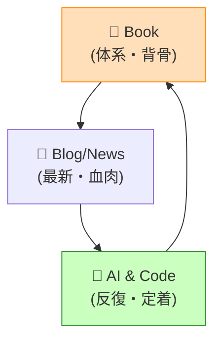

# 第97章：学び続けるためのリソース📚✨（書籍・ブログ・そしてAIとの対話🤖💬）


DDDって、**一回理解して終わり**じゃなくて、むしろここからが本番なんだよね…！😵‍💫
でも大丈夫！この章では「迷わず続けられる」ように、**リソースの選び方と、AIを使った学び方**を“型”にして渡すよ〜😊🫶

---

### この章でできるようになること🎯

* 何を読めばいいか、**迷わない読書ルート**が作れる📚🧭
* ブログやニュースに流されず、**必要な情報だけ拾える**ようになる📰✨
* AI（Copilot / ChatGPT系）を「答え係」じゃなくて、**学習コーチ**として使える🤖🏋️‍♀️
* 1人開発でも続く、**学習ループ（習慣）**を作れる🔁🌱

---

## 1) 迷わない学び方は「3レイヤー構造」🧱✨


学び続けるには、リソースをこう分けると超ラク！😆



### 🥇レイヤーA：背骨（書籍）＝体系を作る

* まずは「道」を作る📚🛣️
* 体系がないと、ブログ読んでも点の知識で終わりがち…😢

### 🥈レイヤーB：流れ（ブログ・ニュース）＝最新を補給

* .NET は **毎年11月にメジャーリリース**が基本だから、ここを追うだけでOKだよ🗓️✨ ([Microsoft][1])
* しかも LTS/STS の考え方で「追う量」を減らせる😊 ([Microsoft][1])

### 🥉レイヤーC：反復（AI対話＋実装）＝定着させる

* 読んだら、AIと会話して**理解を固める**💬✨
* さらに小さく実装して**身体で覚える**🧠➡️💪

---

## 2) まずはこの「読書ルート」だけでOK📚💞


ここ、欲張ると沼るから「ルート化」が正解！😇

### ① 最初の1冊（DDD初見の人向け）🌸

**『ドメイン駆動設計をはじめよう』**（Learning Domain-Driven Design の邦訳）

* 「DDDって結局なに？」が、戦略〜実装のつながりで理解しやすい✨
* 邦訳ありは継続しやすさが段違い😊📘 ([オライリー・ジャパン][2])

### ② 次の1冊（実装のイメージを固める）🧩

**『Domain Modeling Made Functional』**

* “ドメインをちゃんと表現する”感覚が育つ✨
* DDD初心者にも向く、って明言されてるのが安心😊 ([pragprog.com][3])

### ③ 深掘り（辞書枠：困ったら戻る）📖

* **Eric Evans『Domain-Driven Design』**：元祖。困ったら参照する「聖典」🧙‍♂️ ([ACM Digital Library][4])
* **Vaughn Vernon『Implementing Domain-Driven Design』**：実装面の分厚い本📚💥 ([ptgmedia.pearsoncmg.com][5])
* **『DDD Distilled』**：短めで復習に便利（合う人には超助かる）🧃 ([ptgmedia.pearsoncmg.com][6])

> コツ：最初から“聖典”に挑まないでOK！😆
> まず「はじめよう」→「実装感覚」→「辞書」って順が挫折しにくいよ🫶

---

## 3) ブログ・ニュースは「公式＋定番」だけ拾おう📰✨


ここは“読む場所”を固定すると勝ち！🥳

### ✅（A）公式：C#/.NETの変化はここだけ追えばOK

* .NET は毎年11月に出る＆LTS/STSの方針あり🗓️ ([Microsoft][1])
* 現時点の最新は **.NET 10（LTS）**（2025-11-11に発表）📣 ([Microsoft for Developers][7])
* **C# 14** の新機能は公式の “What’s new” が確実✨ ([Microsoft Learn][8])
* C# のバージョンの流れを追うなら「Version history」📚 ([Microsoft Learn][9])

### ✅（B）DDDの定番ブログ（“概念がブレない”やつ）

* Martin Fowler（DDDの要点まとめ・用語）

  * DDDの説明 ([martinfowler.com][10])
  * Bounded Context の解説 ([martinfowler.com][11])

### ✅（C）「まとめリスト」を1個だけ持つ（最強）

* **Awesome Domain-Driven Design**（厳選リンク集）
  → 迷ったらここから選べばOK！📌 ([GitHub][12])

### ✅（D）ニュースレター：週1で十分💌

* **DDD Weekly**（タイトル眺めるだけでも強い）📮 ([DDD Weekly][13])

---

## 4) 動画・カンファレンスは「講演者で選ぶ」🎥✨

動画は当たり外れあるから、「イベントと人」で選ぶのが安全☺️

* **DDD Europe（2026も開催予定あり）** 🏛️ ([DDD Europe][14])
* **Explore DDD（2026）** 🇺🇸 ([Explore DDD][15])
* EventStorming（発明者 Brandolini の動画）オススメ🍊

  * YouTube例 ([YouTube][16])

---

## 5) コードで学ぶなら「テンプレ」を教材にする🧪✨


DDDは“読んで分かった気”が一番危険😂
なので、良い土台のコードを**観察→真似→改造**が最短だよ！

### ✅おすすめテンプレ（実務でよく使われる系）

* Jason Taylor の Clean Architecture テンプレ（GitHub） ([GitHub][17])
* Ardalis の Clean Architecture（GitHub） ([GitHub][18])
* Ardalis の `dotnet new` テンプレ（NuGet） ([NuGet][19])

### 観察ポイント（ここだけ見ればOK）👀✨

* `Domain` に **EF Core** や `DbContext` が混ざってない？
* Entity/ValueObject が **プリミティブ地獄**になってない？（string/int直刺し）
* UseCase（Application）が「やりたいこと」を表現できてる？
* `Infrastructure` は差し替え可能な感じ？（外部依存の隔離）

---

## 6) AIを「学習コーチ」にするテンプレ🤖💬✨


AI導入済み前提なら、ここが一番おいしい🍰
ポイントは、AIに **“答え”** を求めるより、**“理解の補助”** をさせることだよ😊

### ✨AI対話の黄金レシピ（超大事）

1. 自分の理解を先に書く（たとえ間違っててもOK）✍️
2. AIに「どこが曖昧？」を指摘させる🔍
3. 具体例（自分のアプリ想定）に落とさせる🧩
4. 最後に「チェック問題」を作らせる📝

---

### そのまま使える！AIプロンプト集（コピペOK）📋💞

#### 🧠 概念理解用

```text
あなたはDDDの家庭教師です。
私はDDD初学者で、C#は初級〜中級です。

【私の理解】
（ここに自分の言葉で説明を書く）

お願い：
1) この説明の「曖昧な点」を3つ指摘して
2) 誤解してそうな点があればやさしく修正して
3) 具体例（予約・課金・在庫など）で短く例えて
4) 最後に確認クイズを5問（解答付き）作って
```

#### 🔧 コードレビュー用（DDD観点）

```text
あなたはDDDのレビュアーです。以下のコードを見て、
「境界」「集約」「不変条件」「依存の向き」の観点でレビューしてください。

条件：
- 直すべき優先順位（高→低）で
- “なぜダメか”を初心者向けに
- 修正版の例も（最小限）提示して
```

#### 🗺️ ユビキタス言語（用語帳）づくり

```text
このアプリの仕様を貼ります。
DDDの「ユビキタス言語」用に、用語集を作ってください。

出力形式：
- 用語
- 意味（1〜2文）
- 似てる用語との違い
- 禁止ワード（誤解しやすい言い方）
最後に、境界づけられたコンテキスト候補も提案して。
```

#### 📚 読書の定着（要約→演習化）

```text
以下は私の読書メモです。
1) 重要ポイントを箇条書き10個に整理
2) それぞれに「よくある失敗例」を1つ付ける
3) 最後に“30分でできるミニ演習”を3つ作って
```

---

## 7) 1人開発者向け：学習が続く「週の回し方」🔁🗓️✨


おすすめはこれ！やりすぎないのがコツ🥺💞

* 平日：**15分だけ**📚（読書 or 記事1本）
* 週1：**60分だけ**🧪（テンプレを観察して1点だけ改造）
* 週1：**15分だけ**🤖（AIに「今週の理解の穴」を掘らせる）

> これで十分強いよ！継続はチート✨😆

---

## 8) 【ワーク】今日やること（30〜45分）🏃‍♀️💨

やることはシンプルに3つだけ！

1. **本を1冊決める**（まずは『ドメイン駆動設計をはじめよう』が無難）📘 ([オライリー・ジャパン][2])
2. いま作りたいアプリを題材に、AIで「用語集」を作る🗂️🤖
3. Clean Architecture テンプレを1つ触って、`Domain` を眺める👀✨ ([GitHub][17])

---

## 9) よくある沼（先に潰しとこ！）🕳️😂

* ❌ 本を10冊買って満足する（読んでない）
* ❌ ブログを毎日追って疲れる（体系がない）
* ❌ いきなりイベントソーシングやマイクロサービスに飛ぶ
* ✅ まず「自分のアプリの1機能」をDDDっぽく整える（これが最強）💪✨

---

### まとめ🎀

学び続けるために必要なのは「根性」じゃなくて、**迷わない仕組み**だよ😊🫶

* 背骨＝本📚
* 流れ＝公式＋定番📰
* 定着＝AI対話＋小さな実装🤖🧪

次の章（第98章）は、ここで作った学習ループを「10年後も効くスキル」に昇華させる話に繋がるよ〜✨🥳

[1]: https://dotnet.microsoft.com/en-us/platform/support/policy?utm_source=chatgpt.com "The official .NET support policy"
[2]: https://www.oreilly.co.jp//books/9784814400737/?utm_source=chatgpt.com "ドメイン駆動設計をはじめよう"
[3]: https://pragprog.com/titles/swdddf/domain-modeling-made-functional/?utm_source=chatgpt.com "Domain Modeling Made Functional"
[4]: https://dl.acm.org/doi/10.5555/861502?utm_source=chatgpt.com "Domain-Driven Design: Tacking Complexity In the Heart of ..."
[5]: https://ptgmedia.pearsoncmg.com/images/9780321834577/samplepages/0321834577.pdf?utm_source=chatgpt.com "Implementing Domain-Driven Design"
[6]: https://ptgmedia.pearsoncmg.com/images/9780134434421/samplepages/9780134434421.pdf?utm_source=chatgpt.com "Domain-Driven Design Distilled"
[7]: https://devblogs.microsoft.com/dotnet/announcing-dotnet-10/?utm_source=chatgpt.com "Announcing .NET 10"
[8]: https://learn.microsoft.com/en-us/dotnet/csharp/whats-new/csharp-14?utm_source=chatgpt.com "What's new in C# 14"
[9]: https://learn.microsoft.com/en-us/dotnet/csharp/whats-new/csharp-version-history?utm_source=chatgpt.com "The history of C# | Microsoft Learn"
[10]: https://martinfowler.com/bliki/DomainDrivenDesign.html?utm_source=chatgpt.com "Domain Driven Design"
[11]: https://www.martinfowler.com/bliki/BoundedContext.html?utm_source=chatgpt.com "Bounded Context"
[12]: https://github.com/heynickc/awesome-ddd?utm_source=chatgpt.com "Awesome Domain-Driven Design ..."
[13]: https://dddweekly.com/?utm_source=chatgpt.com "DDD Weekly"
[14]: https://dddeurope.com/?utm_source=chatgpt.com "Domain-Driven Design Europe"
[15]: https://exploreddd.com/about/?utm_source=chatgpt.com "Explore DDD Conference - 2026"
[16]: https://www.youtube.com/watch?v=PEZGOLHGqM8&utm_source=chatgpt.com "Event Storming with Alberto Brandolini (Alberto Brandolini)"
[17]: https://github.com/jasontaylordev/CleanArchitecture?utm_source=chatgpt.com "Clean Architecture Solution Template for ASP.NET Core"
[18]: https://github.com/ardalis/CleanArchitecture?utm_source=chatgpt.com "ardalis/CleanArchitecture: Clean Architecture Solution ..."
[19]: https://www.nuget.org/packages/Ardalis.CleanArchitecture.Template/?utm_source=chatgpt.com "Ardalis.CleanArchitecture.Template 11.0.0"
