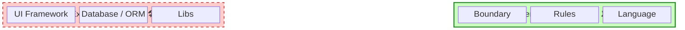

# 第98章：10年後も生き残るスキル 💪✨

### 〜「コードを書く人」じゃなくて「構造を作る人」になる〜 🏗️🧠


ねえねえ、ちょっとだけ残酷な話するね…🥺
**これからの時代、「コードを書く」だけならAIがどんどん強くなる**の。
でも逆にいうと、あなたが伸ばすべきなのはココ👇

✅ **「どう分ける？」（境界線）**
✅ **「何て呼ぶ？」（言葉）**
✅ **「何を守る？」（ルール）**
✅ **「変化をどこに閉じ込める？」（構造）**

これができる人は、言語もフレームワークも変わっても生き残るよ🔥

---

## この章でできるようになること 🎯✨

* 「構造」って何かを、超やさしく説明できる 📦
* 1人開発で迷わない「設計の型（テンプレ）」を持てる 🗺️
* AI（Copilot等）に**壊されにくい指示**が出せる 🧑‍💻🤝🤖
* 10年後の自分に「ありがとう」って言われるコードになる 🥹💕

---

## そもそも「構造」ってなに？🏗️（超入門）


**構造 = “部屋の間取り” みたいなもの**だよ🏠✨
家具（コード）をどれだけ高級にしても、間取りがダメだと住みにくい…😭

### 構造の中身は、だいたいこの4つ🧩

1. **境界線**：どこからどこまでが同じ責任？（例：予約と決済は別）
2. **依存の向き**：どっちがどっちを知っていい？（内側は外側を知らない）
3. **言葉（モデル）**：同じ言葉を、同じ意味で使ってる？
4. **守るルール（不変条件）**：絶対に破っちゃダメな約束は何？

DDDって結局、この「構造づくり」を助ける道具なんだよね😊✨

---

## 「コード書き」より「構造作り」が強い理由 🔥

### 1) 技術は変わる。でも“分け方”は残る🧠


フレームワークは流行り廃りがあるけど、
**責務分離・境界・依存・命名**はずっと使える武器💪



### 2) AIは“部分最適”が得意。構造は人間の仕事🤖🧩

AIは「この関数書いて」みたいな局所作業は超得意。
でも「アプリ全体の境界線どこ？」は、まだ人間が強い✨

### 3) 今のC#/.NETも“構造で勝つ人”を助けてる🧑‍💻✨

たとえば **.NET 10 はLTSで3年サポート**、長く運用する前提が強いのね（安定して育てるアプリ向き）💡 ([Microsoft for Developers][1])
そして **C# 14（.NET 10）**は、ボイラープレートを減らして「意図」を書きやすくする方向が強いよ✨ ([Microsoft Learn][2])

---

## 1人開発で“迷わない”ための「構造づくり7スキル」🧠🧰

### スキル①：問題を「言い換える」力 🗣️✨


仕様がふわっとしてると、設計は100%迷うよ〜😭
まずはAIにこう聞くのが強い👇

**AIプロンプト例💬**

* 「この機能の“目的”を1文で言い換えて」
* 「ユーザーが困ってることを3つに分解して」
* 「成功条件/失敗条件を箇条書きにして」

---

### スキル②：用語を揃える（ユビキタス言語）📘✨

同じ「ユーザー」でも、文脈で意味が違うのが事故の元💥
だから**単語帳（用語集）**を作る！

**最低これだけでOK📝**

* 用語
* 意味（1行）
* 例
* 似てるけど違う言葉（注意）

---

### スキル③：境界線を引く ✂️🧱


境界線は「責任の壁」だよ🧱
**変更が起きる場所が違うなら、分ける**が基本✨

例：

* 予約：席が空いてるか
* 決済：お金を払ったか
  → ルールも失敗の仕方も違うから別が自然👍

---

### スキル④：ルールを“置き場所”で守る 🔒✨

初心者がやりがちなのが「画面側でifまみれ」😵‍💫
でもDDDは逆で、**ルールはドメイン側に寄せる**と強い！

* ルール：キャンセルは開始24時間前まで
  → それを知ってるのは「予約（ドメイン）」だよね？って発想😊

---

### スキル⑤：依存の向きを決める ➡️🧅


**「大事なもの（ドメイン）」が「どうでもいいもの（DBやUI）」を知らない**
これだけで、変更耐性が爆上がりする✨

---

### スキル⑥：AIに“構造の制約”を渡す 🤝🤖


AIは賢いけど、**制約がないと盛り盛りで壊す**🤣💥
だから先に「守る壁」を渡してから書かせるのがコツ！

**AIに渡す“構造制約”テンプレ🧱**

* 依存方向（DomainはInfrastructureを参照しない）
* 集約境界（Reservation集約はPayment集約を直接触らない）
* 例外方針（例外乱発しない。Resultで返す等）
* 命名ルール（予約=Reservation、申込=Application、など）

---

### スキル⑦：変更の記録（小さなADR）を残す 📝✨

ADRっていうとかっこいいけど、要は**「なぜそうしたか」メモ**だよ😊
1人開発だとこれが未来の自分の命綱🥹

**最小ADR（3行でOK）**

* 何を決めた？
* なぜ？
* 代替案は？（雑でOK）

---

## ミニ題材でやってみよ🎀：学食の「席予約」アプリ


### まず“境界線”を決める🧱

* Reservation（予約）
* Payment（支払い）
* Notification（通知）

この時点で、AIへの指示がめっちゃクリアになる✨

### “守るルール”を1つだけ決める🔒

* 予約は「開始時刻より前」しか作れない
* キャンセルは「開始24時間前」まで

この「絶対ルール」が、ドメインの中心になるよ😊

---

## AIと一緒に“構造”を作る手順（そのまま使ってOK）🧑‍💻🤝🤖

### ステップ1：用語集をAIに作らせる📘

「予約・席・利用開始・キャンセル」など

### ステップ2：イベントの流れをAIに書かせる🌀

「予約した → 支払った → 確定した → 通知した」みたいに時系列で

### ステップ3：境界線をAIに提案させる✂️

「どこで変更が起きそう？」を聞く

### ステップ4：集約（チーム）とルールを確定する🧩

「予約集約が守るルールは何？」ってAIに詰めさせる😈✨

### ステップ5：コード生成は“差分レビュー前提”で🧾

Copilotの**Edit/Agent**系は便利だけど、**最後は必ずdiffで確認**が鉄則だよ👍 ([Visual Studio Marketplace][3])
それと、提案コードが公開コードと一致する可能性をIDE内で通知する仕組み（コード参照）もあるから、使う時はちゃんと確認ね🔎 ([Microsoft Learn][4])

---

## ちょい最新C#の小ネタ：構造づくりがラクになるポイント✨

C# 14（.NET 10）には、読みやすさ・保守性に効く機能がいくつか入ってるよ😊 ([Microsoft Learn][2])
特に初心者が嬉しいのは「意図が伝わる」系✨

* **field backed properties**：プロパティ周りの“余計な記述”を減らしやすい ([Microsoft Learn][2])
* **null-conditional assignment**：nullチェックの儀式を減らせる ([Microsoft Learn][2])
* **extension members**：拡張の表現力が上がる（ただし乱用注意⚠️） ([Microsoft Learn][2])

ポイントはね、ここ👇
**新機能を追うこと自体より、「構造が伝わる書き方」に使う**のが強いよ✨

---

## 演習（この章のメイン！）✍️💖

### 演習1：あなたのプロジェクトを“1枚設計シート”にする📄

これだけ埋めて！

* アプリの目的（1文）
* コアな用語5つ
* 絶対守るルール3つ
* 境界線（コンテキスト）2〜3個
* 変更が起きそうな場所TOP3（将来の地雷💣）

### 演習2：AIに“意地悪レビュー”させる😈

**AIプロンプト例💬**

* 「この境界線、将来どこで破綻しそう？」
* 「命名があいまいな用語を指摘して」
* 「ドメインルールがUI側に漏れそうな点を探して」

### 演習3：図を1枚だけ作る（Mermaid）🗺️

（AIに生成させてもOKだよ✨）

```text
flowchart LR
  User[ユーザー] --> Web[Web/UI]
  Web --> App[Application]
  App --> Domain[Domain]
  App --> Infra[Infrastructure]
  Infra --> DB[(DB)]
```

---

## ありがちな落とし穴（先に潰そ🥺）⚠️

* ❌ 「共通化しすぎ」：未来の自分が読めなくなる
* ❌ 「境界線がないのにAIで爆速」：あとで爆発する💥
* ❌ 「ルールが画面に散らばる」：仕様変更で地獄😇

✅ 対策はシンプル：
**境界線 → 用語 → ルール**の順で固めるだけ✨

---

## 今日のまとめ 🎁✨

10年後も強い人は、こういう人👇

* コード量じゃなくて、**境界線と依存の向き**を作れる
* 仕様を**言葉とルール**に落とせる
* AIに「自由に書いて」じゃなく、**制約つきで任せられる**

つまり、あなたはこれから
**“コード職人”じゃなくて“構造デザイナー”**になれば勝ち🏆💖

---

* [The Verge](https://www.theverge.com/news/669339/github-ai-coding-agent-fix-bugs?utm_source=chatgpt.com)
* [The Verge](https://www.theverge.com/news/753984/microsoft-copilot-gpt-5-model-update?utm_source=chatgpt.com)
* [Windows Central](https://www.windowscentral.com/artificial-intelligence/microsoft-copilot/copilot-mico-avatar-groups-announcement-2025?utm_source=chatgpt.com)

[1]: https://devblogs.microsoft.com/dotnet/announcing-dotnet-10/ "Announcing .NET 10 - .NET Blog"
[2]: https://learn.microsoft.com/en-us/dotnet/csharp/whats-new/csharp-14 "What's new in C# 14 | Microsoft Learn"
[3]: https://marketplace.visualstudio.com/items?itemName=GitHub.copilot "
        GitHub Copilot - Visual Studio Marketplace
    "
[4]: https://learn.microsoft.com/ja-jp/visualstudio/ide/visual-studio-github-copilot-chat?view=vs-2022&utm_source=chatgpt.com "Visual Studio での GitHub Copilot チャットについて"
