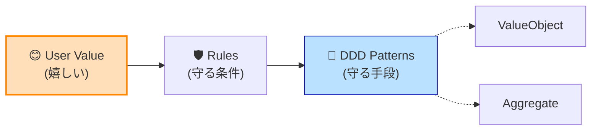

# 第99章：DDDは目的地じゃない💡 最終ゴールは「ユーザーが喜ぶソフト」✨


> DDD（ドメイン駆動設計）は“勝つための武器”だけど、武器を磨くこと自体がゴールじゃないよ⚔️
> ゴールはいつも **ユーザーの「助かった！」「好き！」「また使う！」** だよ😊💕

---

## 0. この章でできるようになること🎯

* 「DDDを頑張りすぎて迷子」になったとき、**戻るべき北極星🧭**がわかる
* 「今はDDDフルセット？ミニマムでOK？」を**判断できる**ようになる
* AI（Copilot/Agent）に仕事を頼むとき、**設計が“指示書”になる**感覚がつかめる🤝✨

---

## 1. まず結論：ユーザーは“DDD”にお金を払わない💸😇

ユーザーが欲しいのはこれ👇

* すぐ終わる（速い）⚡
* 失敗しない（安心）🛡️
* 迷わない（わかりやすい）🧭
* ちゃんと便利（欲しい機能がある）🎁
* そして…変わっても壊れない（アップデートで地獄にならない）🔥➡️🌱

DDDは **「変わっても壊れない」を作りやすくする道具**。
だから、DDDは“目的地”じゃなくて **「目的地に早く安全に行くための乗り物🚃」** だよ。

---

## 2. “DDDが目的化”すると起きがちな事故あるある😵‍💫

### あるある①：クラスが増えすぎて、変更が遅くなる🐢

「Entity」「Aggregate」「Factory」「Repository」…を全部盛りした結果、
**ちょっとした仕様変更にファイル10個修正**みたいなやつ💥

### あるある②：モデルが現実じゃなく“設計用語”っぽくなる📚

ユーザーが言わない言葉（例：`CustomerAggregateRootFactory`）が中心になると危険⚠️
ユビキタス言語（共通言語）が崩れて、AIへの指示もブレるよ🌀

### あるある③：正しさの証明に時間を溶かす⏳

「この集約境界が正しいか？」で数日悩む…
でもユーザーは「予約できないんだけど？」って困ってる😇

---

## 3. DDDを“ユーザー価値”に直結させる合言葉🧠✨

### ✅ 合言葉：**「誰が、何で困ってて、何ができたら嬉しい？」**

これが最強のスタート地点💪😊



DDDの各パーツは、ぜんぶこの質問に紐づけられるよ👇

* 値オブジェクト：**ユーザーの入力ミスを減らす**（壊れない）🧩
* 集約：**同時操作でもルールが破れない**（安心）🛡️
* ドメインイベント：**通知・履歴・連携が自然に増やせる**（伸びる）📈
* リポジトリ：**保存先を変えても機能が生きる**（変化耐性）🔁

---

## 4. 1人開発のDDDは「全部やらない」が正解になりやすい🍱✨

### 🎯 まず“どこが勝負所（コア）か”だけ決める

* コア（勝負所）：DDD強めでOK💪
* 支援（補助）：ほどほどでOK🙂
* 汎用（外部任せ）：シンプルでOK😌

この考え方をすると、悩みが激減するよ✨
（ロードマップの第26章あたりの話が、ここで効いてくるやつ！）

---

## 5. 判断チェックリスト✅「今この機能、DDDガチる？」🤔

次のうち **3つ以上** 当てはまったら、DDDを厚めにする価値あり💎

* ルールがややこしい（例：割引、在庫、予約、課金、権限）🧮
* 仕様変更が多い／これから増える予定📅
* “間違うと痛い”処理（お金・権利・信頼）💳🛡️
* 同時操作が起きる（取り合い、二重予約）⚔️
* AIに手伝わせたいけど、境界が無いと暴走しそう🐎💨

逆に、当てはまらないなら **トランザクションスクリプト寄りでもOK**（第76章〜の“割り切り”が正義✨）

---

## 6. AI時代こそ「DDDは地図」🗺️✨（AIが強いほど大事）

最近の開発環境は、AIがかなり“作業”をやってくれる方向に進んでるよね🤖✨
たとえば .NET 10 / C# 14 が最新で、Visual Studio 2026 も公開されてる。([Microsoft for Developers][1])

さらに、Visual Studio では Copilot の **エージェントモード**が「計画→編集→コマンド実行→反復」まで進めるタイプになってるよ。([Microsoft Learn][2])
Visual Studio 2026 では Copilot の **Cloud Agent（プレビュー）**も案内されていて、反復作業を任せやすくなってる。([Microsoft Learn][3])

> つまり：AIが強くなるほど、人間は
> **「どこを変えていいか」「何を守るべきか」** を先に渡さないと、カオスになりやすい😇💥

DDDは、AIに渡す“地図”としてめちゃくちゃ相性いいんだよ🗺️🤝✨

---

## 7. “ユーザーが喜ぶ”に直結する、超実践ワークフロー🔁💕

ここからは、1人開発でそのまま使える手順だよ👇
（Copilot Chat/Agentに貼る前提で書いてるよ✌️）

---

### Step 1：ユーザーの「嬉しい」を1行で書く📝✨

例（予約アプリなら）

* 「3タップ以内で予約できて、二重予約が起きない」😊
* 「キャンセル待ちが自動で繰り上がる」🎟️

**コツ**：機能じゃなくて“体験”で書くと強い💪💕

---

### Step 2：壊れると困る“ルール”を3つだけ挙げる🧱

例：

* 過去の時間には予約できない⏰❌
* 同じ枠に予約は上限N件まで👥
* 支払い済みならキャンセル料が発生💳

ここが **DDDのコア（守るべき不変条件）** になるよ🛡️✨

---

### Step 3：ドメインモデルを「最小」で作る🧩

ここで大事なのは **“最小”** だよ！
「守るべきルール」を守れるサイズならOK🙆‍♀️

---

### Step 4：AIに“コード生成”を頼む前に、AIに“設計の確認”を頼む🤝

いきなり実装させると、盛りすぎ料理になる🍲💥

---

## 8. ミニケーススタディ：予約の“最小DDD”サンプル📦✨

### 🎯 ユーザーが喜ぶゴール

「二重予約が起きない」＋「過去予約ができない」😊🛡️

### 🧩 最小モデルの考え方

* 予約枠（TimeSlot）＝値オブジェクト
* 予約（Reservation）＝エンティティ
* 枠の上限を守る責任＝集約（Schedule）に寄せる

#### 値オブジェクト例（TimeSlot）

```csharp
public readonly record struct TimeSlot(DateTime Start, DateTime End)
{
    public static TimeSlot Create(DateTime start, DateTime end)
    {
        if (end <= start) throw new ArgumentException("End must be after Start.");
        if (start < DateTime.Now) throw new ArgumentException("Past timeslot is not allowed.");
        return new TimeSlot(start, end);
    }
}
```

#### 集約ルート例（Schedule）

```csharp
public sealed class Schedule
{
    private readonly Dictionary<TimeSlot, List<Reservation>> _reservations = new();
    private readonly int _capacityPerSlot;

    public Schedule(int capacityPerSlot)
        => _capacityPerSlot = capacityPerSlot;

    public Result Reserve(TimeSlot slot, Reservation reservation)
    {
        if (!_reservations.TryGetValue(slot, out var list))
        {
            list = new List<Reservation>();
            _reservations[slot] = list;
        }

        if (list.Count >= _capacityPerSlot)
            return Result.Fail("この時間帯は満席です🙇‍♀️");

        // 二重予約など、追加ルールが出たらここに寄せていける✨
        list.Add(reservation);
        return Result.Ok();
    }
}

public sealed record Reservation(Guid Id, Guid UserId);

public sealed record Result(bool IsSuccess, string? Error)
{
    public static Result Ok() => new(true, null);
    public static Result Fail(string error) => new(false, error);
}
```

💡ポイント

* まだRepositoryもFactoryも出してない。**今は最小**でOK😊
* でも「満席」「過去は不可」というユーザー価値は守れてる🛡️✨
* 追加ルールが出たら、**Scheduleの責務として増やせる**（変更に強い）🔁

---

## 9. AI（Copilot/Agent）に渡す“迷わない指示テンプレ”📣🤖✨

### 9.1 まずは設計レビュー用（実装はさせない）

```text
あなたはDDDに詳しい設計レビュアーです。
目的は「ユーザーが喜ぶ体験」を最短で実現すること。DDDは手段で、過剰設計は避けます。

【ユーザーが喜ぶゴール】
- （ここに1行）

【守るべきドメインルール（最大3つ）】
- 1)
- 2)
- 3)

質問：
1) このゴールに対して最小のドメインモデル案を提案して
2) そのモデルで将来の変更が来たとき痛くなりそうな点を指摘して
3) 逆に「今は要らないDDD要素」を列挙して（例：Factory不要、など）
```

---

### 9.2 実装させるとき（テスト先行がオススメ🧪✨）

```text
次のドメインルールを壊さないため、まずユニットテストを先に作ってください。
その後、最小実装でテストが通るコードを書いてください。

ルール：
- （ここに最大3つ）

制約：
- 不変条件はドメイン層で守る
- 依存（DB/HTTP/日時）は差し替え可能に
- 過剰な抽象化は禁止（インターフェイス乱立しない）
```

---

## 10. リポジトリに「設計の憲法」を置く👑📜（AI暴走防止）

Copilot はリポジトリに **カスタム指示ファイル**を置けるよ。
たとえば `.github/copilot-instructions.md` で、ビルド方法や規約、テスト方針を共有できる。([GitHub Docs][4])

例：最小テンプレ（コピペOK）

```md
# Project rules (short)

- Goal: maximize user value; avoid over-engineering.
- Domain rules live in Domain layer. UI/DB must not contain business rules.
- Prefer small aggregates. Add patterns only when pain appears.
- Always add/adjust tests when changing domain rules.
- If unsure, ask clarifying questions before generating lots of code.
```

これ置いとくと、AIが「毎回ちがう流派の設計」を持ち込む事故が減るよ😊✨

---

## 11. この章のワーク（やると一気に“設計者”になるやつ💪💕）

### ワークA：あなたのアプリの「ユーザーが喜ぶ」を3つ書く📝

* 😊 1)
* 😊 2)
* 😊 3)

### ワークB：そのうち1つだけ選んで、“守るべきルール”を3つに絞る🧱

* 🛡️ 1)
* 🛡️ 2)
* 🛡️ 3)

### ワークC：AIに「最小モデル案」を出させる（9.1のテンプレを使う）🤖✨

出てきた案に対して、最後にこれだけ聞いてみて👇

* 「それ、ユーザーの喜びに直結してる？それとも“設計の趣味”？」😇

---

## 12. まとめ：DDDの勝ち方は「ユーザー価値に繋げた人」が勝つ🏆✨

* DDDはカッコよさのためじゃない😌
* **変更に強くして、ユーザーの“嬉しい”を積み上げるため**💖
* AIが強い今ほど、境界とルール（設計）が“指示書”になる🗺️🤝
* だから迷ったら、いつでもここに戻ってきてOK🧭✨

---

## 次（第100章）へのつなぎ🌱

次は「今日からできる小さな設計」だよ😊✨
第99章で作った **“ユーザーが喜ぶ1行”** を、そのまま最初の一歩に変換していこうね🚶‍♀️💕

---

* [theverge.com](https://www.theverge.com/news/808032/github-ai-agent-hq-coding-openai-anthropic?utm_source=chatgpt.com)
* [theverge.com](https://www.theverge.com/news/669339/github-ai-coding-agent-fix-bugs?utm_source=chatgpt.com)
* [itpro.com](https://www.itpro.com/software/development/github-just-launched-a-new-mission-control-center-for-developers-to-delegate-tasks-to-ai-coding-agents?utm_source=chatgpt.com)

[1]: https://devblogs.microsoft.com/dotnet/announcing-dotnet-10/ "Announcing .NET 10 - .NET Blog"
[2]: https://learn.microsoft.com/en-us/visualstudio/ide/copilot-agent-mode?view=visualstudio&utm_source=chatgpt.com "Use Agent Mode - Visual Studio (Windows)"
[3]: https://learn.microsoft.com/en-us/visualstudio/releases/2026/release-notes?utm_source=chatgpt.com "Visual Studio 2026 Release Notes"
[4]: https://docs.github.com/ja/copilot/how-tos/configure-custom-instructions/add-repository-instructions?utm_source=chatgpt.com "GitHub Copilot のリポジトリ カスタム命令を追加する"
