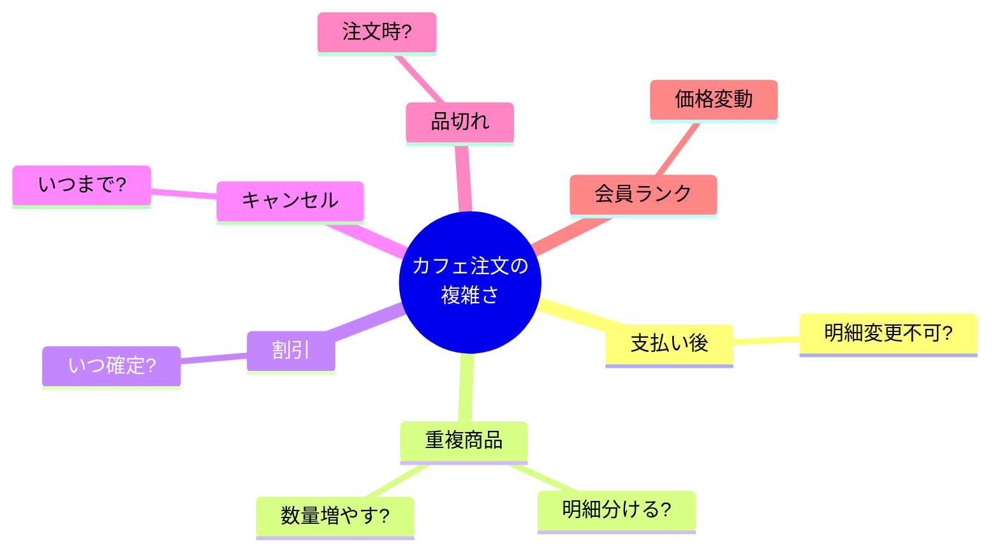

# 第01章：DDDってなに？（一言でいうと）💡


## 1) まず“一言で”いこう！✨

DDD（ドメイン駆動設計）はね、

**「複雑な“業務ルール”を、チーム共通の“言葉”でモデル化して、コードの中心に置く設計」**だよ〜！🧁🫶
ポイントは「画面」でも「DB」でもなく、**“業務のルール（ドメイン）”が主役**ってこと！📚✨ ([martinfowler.com][1])

---

## 2) なんでDDDが必要なの？（＝敵は“複雑さ”😵‍💫）


アプリ開発って、最初は簡単でも…
だんだんこうなる👇

* 仕様が増える🧩（割引・キャンセル・在庫・会員ランク…）
* 例外が増える🧯（支払い失敗・品切れ・期限切れ…）
* “なんとなく動く”コードが積み重なる🏚️（ifだらけ・命名ぐちゃぐちゃ）

結果、**変更が怖い**→**バグ増える**→**開発が遅くなる**の負のループ💥

DDDはここに効く道具で、
**「複雑さを“整理されたモデル”にして、変更に強くする」**のが狙いだよ🛡️✨ ([martinfowler.com][1])

---

## 3) ミニ例題：カフェ注文☕🧾（“どこが複雑？”を見つける）


今日の題材は「カフェ注文アプリ」🍰
パッと見は簡単そうだけど、すぐ複雑になるやつ！

### ✅ まず“普通に考える”と…

* 注文を作る
* 商品を追加する
* 合計を出す
* 支払う
* 提供する

### 😵‍💫 でも現実はこうなる

* **支払い後に明細を変更していい？**（ダメそう…）🔒
* **同じ商品を2回追加したら？**（明細が分かれる？数量が増える？）🧾
* **割引はいつ確定？**（支払い前？注文確定時？）🏷️
* **キャンセルできるのはいつまで？**（提供後は無理？）🚫
* **品切れだったら？**（注文時？確定時？）🥲
* **会員ランクで価格が変わる？**（地獄の香り…）🔥

こういう「判断が必要なところ」＝**ドメインの複雑さ**だよ🧠✨


DDDはここをちゃんと扱うのが得意！([ウィキペディア][2])

---

## 4) DDDで“最初に”大事にする考え方 3つ🌸


### ① ルール（業務）を真ん中に置く🧠

UIやDBは後で変わりやすいけど、
**“業務ルール”は残り続ける**ことが多いんだよね。

だから、**業務ルールが住む場所（ドメイン）を強くする**💪✨
これがDDDの基本！ ([martinfowler.com][1])

### ② “同じ言葉を、同じ意味で”使う🗣️✨

「注文」「オーダー」「購入」「リクエスト」…
人によって呼び方がブレると、設計もブレる😵‍💫

DDDでは、**チームで言葉を揃える**（ユビキタス言語）を超大事にするよ📘✨ ([ウィキペディア][2])

### ③ “DDDは流行じゃなく道具”🧰

DDDは“かっこいいからやる”じゃなくて、
**複雑さに勝つための道具**なんだ〜！🛠️✨
（この考え方は Martin Fowler の解説でも中心にあるよ）([martinfowler.com][1])

---

## 5) ここでちょい最新：2026のTypeScript事情🧡⚡

この教材はTypeScriptで進めるけど、最近のTypeScriptは **5.9系**が提供されていて、GitHubのリリースでも **TypeScript 5.9（5.9.2 Stable）**が確認できるよ〜！🧡 ([GitHub][3])
5.9のリリースノートには、例えば「import defer」みたいな新構文サポートも入ってる（必要なときに動かす系の仕組み）🧠⚡ ([typescriptlang.org][4])

それと2025〜2026は、TypeScript周辺が大きく動いてて（コンパイラの刷新や、実行環境側の動きなど）、「型の価値」がますます上がってる流れだよ📈✨ ([effectivetypescript.com][5])

> でも安心してね☺️
> この章では“最新機能を暗記”じゃなく、DDDの核（複雑さに勝つ）を掴むのが目的だよ🌸

---

## 6) 体験：DDDがない世界（ありがちコード）→ 何が困る？😇💥


### 🍩 “とりあえず動く”書き方（例）

* 文字列や数値をそのまま渡す
* どこでも計算できちゃう
* ルールが散らばる

（雰囲気だけコードで見せるね👇）

```ts
// “なんでもプリミティブ”で渡してしまう例（ありがち🥺）
function placeOrder(customerId: string, itemId: string, qty: number, priceYen: number) {
  const total = qty * priceYen;

  // あちこちにルールが散る未来…
  // if (qty <= 0) throw...
  // if (priceYen < 0) throw...
  // if (paid) throw...
  return { customerId, itemId, qty, total };
}
```

#### この形の“怖さ”😱

* customerId と itemId を入れ間違えても気づきにくい🌀
* qty や priceYen のルールが、どこにあるか分からなくなる🧩
* 「支払い後は変更不可」みたいな大事ルールが漏れがち🔓

DDDは、こういう事故を減らす方向に進むよ🛡️✨

---

## 7) 🤖AIに手伝ってもらう（この章の“正しい使い方”🚲）

この章は「例題の困りごと」を増やすのがAIの得意技！🎯
コピペで使えるプロンプト置いとくね👇

### ✅ プロンプト1：困りごとを洗い出す（まずこれ）

```text
カフェ注文アプリを作っています。
「注文→確定→支払い→提供」という流れです。
現実の運用で起きがちな “困りごと / 例外 / ルール” を20個、箇条書きで出してください。
それぞれ「なぜ困るか」も一言で添えてください。
```

### ✅ プロンプト2：複雑さの“種類分け”

```text
次の困りごと一覧を
(1) 業務ルール（ドメイン）
(2) UIの都合
(3) DB/保存の都合
(4) 外部連携の都合
に分類してください。分類理由も一言で。
（一覧はこの後に貼ります）
```

### ✅ AIの答えを採用するときのチェック✅👀

* 「それ、本当に業務ルール？」（UI都合を混ぜてない？）
* “誰が困るか”が具体的？（店員？客？運用？）
* ルールが曖昧じゃない？（いつ・どの状態で・何が禁止/許可）

---

## 8) 今日のミニ演習🎒✨（15〜25分）

紙でもメモでもOKだよ〜📝💕

### 🧩 演習A：困りごとトップ5を選ぶ

1. AIで困りごと20個出す
2. 「これは絶対揉める…」を5個選ぶ
3. それぞれに **“いつ起きる？”（注文中？支払い後？提供後？）** を書く⏰

### 🧩 演習B：ルールを1行にする（DDDの入口！）

選んだ5個のうち1つだけでいいから、こういう形にしてみて👇

* 「（状態）では（操作）してよい／してはいけない」🚦
  例：
* 「支払い済みの注文は、明細を変更してはいけない」🔒
* 「提供済みの注文は、キャンセルしてはいけない」🚫

この“一行ルール”が、あとでコードの中心に育つよ🌱✨

---

## 9) よくある誤解コーナー😂⚠️（最初に潰す！）

* ❌ DDD = DB設計が上手くなるやつ？
  → ちがうよ！主役は **業務ルール**🧠
* ❌ DDD = マイクロサービス前提？
  → ちがうよ！まずは1つのアプリでも効く🧩
* ❌ DDD = 難しいクラスをいっぱい作る？
  → ちがうよ！**複雑さがある所だけ**丁寧にやる道具🧰

DDDは「必要な場所にだけ効かせる」のが上手い使い方だよ〜🫶✨ ([Microsoft Learn][6])

---

## 10) この章のゴール✅✨（できたら勝ち！）

この章が終わったら、次が言えたらOK🎉

* DDDは「複雑さに勝つための道具」だと説明できる🧰✨
* カフェ注文の“複雑ポイント”を5つ挙げられる☕🧠
* ルールを「状態×操作」で1行にできる🚦📝

---

## 11) ふりかえり質問（理解チェック）🎓💖

* 「複雑さ」って具体的に何のこと？
* その複雑さは UI/DB/外部連携 じゃなくて “業務ルール” 由来？
* “一行ルール”にするなら、いつ・何が・禁止/許可 が入ってる？
* 「同じ言葉を揃える」って、なぜ効くの？🗣️
* DDDを“やらない方がいい”のはどんな時だと思う？🤔

---

### 次回予告📌

次の第02章では、**戦術DDD（コードの現場）**と**戦略DDD（地図）**の距離感を、迷子にならないように整理するよ〜🧭🗺️✨

（参考：DDDの元になった本は Domain-Driven Design: Tackling Complexity in the Heart of Software だよ📚）([martinfowler.com][1])

[1]: https://martinfowler.com/bliki/DomainDrivenDesign.html?utm_source=chatgpt.com "Domain Driven Design"
[2]: https://en.wikipedia.org/wiki/Domain-driven_design?utm_source=chatgpt.com "Domain-driven design"
[3]: https://github.com/microsoft/typescript/releases "Releases · microsoft/TypeScript · GitHub"
[4]: https://www.typescriptlang.org/docs/handbook/release-notes/typescript-5-9.html "TypeScript: Documentation - TypeScript 5.9"
[5]: https://effectivetypescript.com/2025/12/19/ts-2025/?utm_source=chatgpt.com "A Small Year for tsc, a Giant Year for TypeScript"
[6]: https://learn.microsoft.com/en-us/azure/architecture/microservices/model/tactical-ddd?utm_source=chatgpt.com "Using tactical DDD to design microservices"
