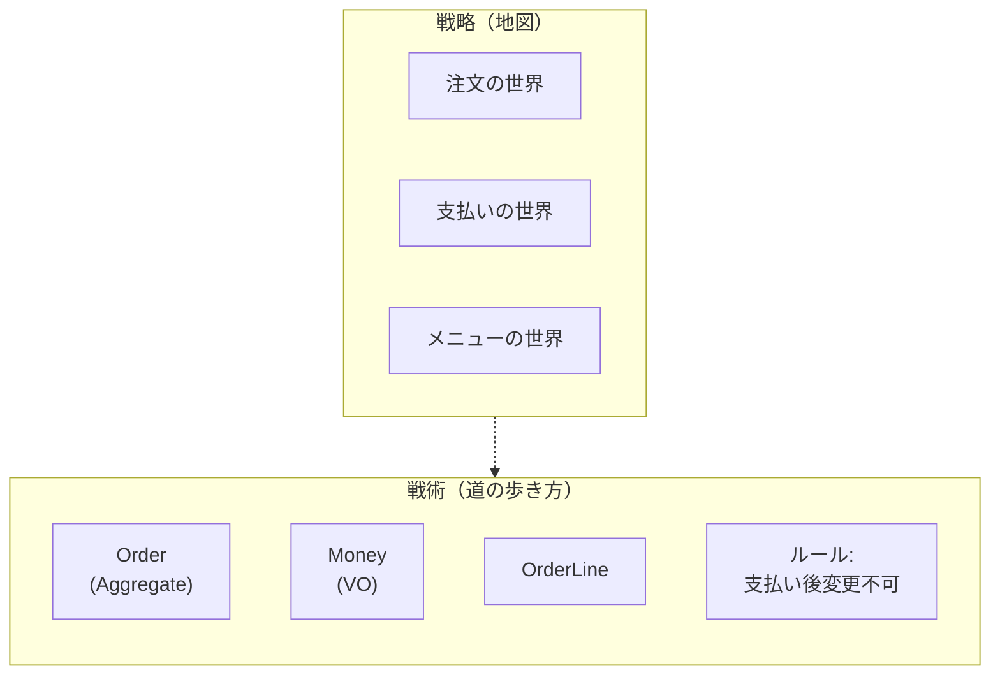

# 第02章：部：ドメイン理解と言葉づくり（第11〜20章）🗣️📘


この章は「DDDって何から手を付ければいいの？🥺」って迷子にならないための、**地図づくり**の回だよ〜！
DDDには大きく **戦略（ストラテジック）** と **戦術（タクティカル）** があって、今回のカリキュラムは **戦術DDD（＝コードに落とす設計）** が主役です🧁💻

---

## 1) まず一言で：戦略と戦術の違いって？🧠✨

### 🗺️ 戦略DDD（ストラテジック）

* 「このシステム、**どんな“境界”で分けると安全？**」を決める話だよ🧩
* 特に有名なのが **Bounded Context（境界づけられたコンテキスト）**。これはDDDの“戦略設計”の中心だよ、と説明されてるよ📌。([martinfowler.com][1])
* 例：カフェでいうと「注文」「支払い」「メニュー管理」って、**別の世界（別の用語・別のルール）**として切ったほうが混ざらなくて楽、みたいな話☕🧾💳

### 🛠️ 戦術DDD（タクティカル）

* 「境界の“中”で、**ルールを守れるコード**をどう書く？」って話だよ🔒✨
* 具体的な道具は、Entity / Value Object / Aggregate / Repository…など（ここが本教材のメイン！）🏗️
* 戦術パターンは **単一のBounded Contextの中で適用する**もの、と説明されてるよ（＝まず境界の中で強くなる感じ）📦💪。([Microsoft Learn][2])
* ざっくり言うと「**クラスとモジュールの設計**に近い」＝コードに近い、って整理が分かりやすいよ🧩💻。([vaadin.com][3])

---

## 2) 超重要：この教材の“立ち位置”を固定しよ🧭✨

### ✅ この教材は「戦術DDDが主役」だよ〜！🛠️💖

やることはシンプル👇

* **ルール（不変条件）を、ドメインの型・メソッドに閉じ込める**🔒
* **「勝手に壊せない設計」**を作る🏯
* **テストで守れる形**にする🧪✨

### 🧂 戦略DDDは「少しだけ先取り」するよ

戦略DDDをガッツリやると、初学者さんは高確率で迷子になるの🥺🌀
なのでこの教材では、戦略は“最小限”だけ使うよ👇

* 「境界がある」って感覚（＝混ぜない）🌿
* 「境界の中で言葉をそろえる」って感覚（＝用語がブレない）🗣️
* 「外の都合を中に入れない」って感覚（＝守りの設計）🛡️

---

## 3) カフェ注文で例えると…☕🧾（戦略→戦術のつながり）

### 🗺️ 戦略っぽい見方（境界を切る）

「いま扱ってる“世界”はどれ？」を分けるイメージだよ✨

* 注文の世界：注文作成、明細追加、確定、キャンセル…🧾
* 支払いの世界：決済、返金、支払い期限…💳
* メニューの世界：商品、価格変更、販売停止…📋

ここで大事なのは **境界を跨ぐときに雑に混ぜない**こと。
混ぜると、用語もルールもごちゃごちゃになって死にます💀（ほんとに）

### 🛠️ 戦術っぽい見方（境界の中で強いモデルを作る）

たとえば「注文の世界」だけを見て…👇

* Value Object：Money / Quantity / OrderId 💎
* Entity：Order（同一性＝ID）🪪
* Aggregate：Order（外から触る入口を1つに）🏯
* 不変条件：支払い後は明細変更不可、など🔒

**戦略が「地図」なら、戦術は「道の歩き方」**って感じだよ🚶‍♀️🗺️💕



---

## 4) 迷子になりがちなポイント3つ（ここで回避！）😵‍💫🧯

### ①「戦略を完璧にしてからコード書くべき？」問題

→ **しなくてOK！**🙆‍♀️✨
最初から完璧な境界は当てられないことが多いよ。まずは小さめの境界で、戦術DDDを回して「壊れない」体験が先🎉

### ②「戦術だけやれば戦略いらない？」問題

→ これも **NO**🙅‍♀️
戦術は強いけど、境界が崩れてると結局スパゲッティになりがち。
だから **最低限の“境界意識”だけ持って戦術に集中**がバランス◎🧁✨

### ③「Entity/VO/Aggregate覚えたのに、設計できない」問題

→ 道具を覚えるだけだと起きるあるある😂
解決策はこれ👇

* 「このルールはどこが守るべき？」🔒
* 「外からどこまで触らせる？」🚪
* 「“変更の単位”って何？」📦

この3つの質問で、戦術DDDは急に動き出すよ💡✨

---

## 5) “この教材で使う”戦略DDDの最小セット🧭📌

この章で覚えるのは、ほんとにこれだけでOK👇（やさしくいくよ〜☺️）

* **Bounded Context（境界）**：ルールと言葉が安定する範囲🧩

  * 戦略設計の中心だよ、って整理されてるよ📌。([martinfowler.com][1])
* **境界の外と中を混ぜない**：外部API/DB/UIの都合は中に入れない🛡️
* **戦術は境界の中でやる**：戦術パターンは1つの境界内で使うもの、という説明があるよ📦。([Microsoft Learn][2])

---

## 6) ミニ演習：これは戦略？戦術？クイズ🎮✨

次の文を「戦略っぽい🗺️」「戦術っぽい🛠️」に分けてみてね👇

1. 「注文と支払いは別チームが管理してる」
2. 「Orderはpay()したらstatusがPaidになる」
3. 「注文の世界では“確定”の意味をこう定義する」
4. 「OrderIdは文字列じゃなく専用型にする」
5. 「メニューの世界の“価格”は注文の世界に直接入れない」

<details>
<summary>答え（ひらく）👀</summary>

* 戦略🗺️：1, 3, 5
* 戦術🛠️：2, 4

</details>

---

## 7) AIの使いどころ（この章バージョン）🤖🧠💕

この章のAIは「答えをもらう」より **言い換え・整理・比較**が超強いよ✨

### ✅ おすすめプロンプト（そのままコピペOK）📎

```text
あなたはDDDを初めて学ぶ大学生向けの先生です。
「戦略DDD」と「戦術DDD」の違いを、
(1) 地図と徒歩の例え
(2) カフェ注文ドメインの例
で、短く説明してください。
最後に「この教材ではどっちを優先するべきか」も一言で。
```

```text
次の用語を「中学生向け」に言い換えて：
- Bounded Context
- Tactical Design
- Strategic Design
それぞれ「やりたいこと」「やらないこと」も1行ずつ付けて。
```

### ⚠️ AIに任せすぎ防止のコツ🛡️

* **“境界”と“ルールの置き場所”**だけは、自分の言葉で言えるようにする✨
* AIの説明がフワッとしてたら、こう聞く👇

  * 「それ、カフェ注文の例で具体化して」☕
  * 「その説明だと、どのクラスに何を書くの？」💻

---

## 8) 2026っぽい補足：TypeScript周辺の“いま”🧡🧰

DDD自体は流行り廃りより「考え方」なんだけど、**TypeScript周りは進化が速い**から、軽く空気だけ入れとくね🌬️✨

* TypeScript公式のリリースノートでは、Node向けのモジュール指定（例：`node20`）みたいに、Node環境を意識したオプションが整理されてきてるよ📦。([TypeScript][4])
* Node.jsは「型を剥がすだけ（type stripping）」の形で **TypeScriptをそのまま実行**できる説明を公式に出してるよ（※型チェックは別、という世界観）🚀。([nodejs.org][5])
* さらにMicrosoftは、TypeScriptツールチェーンをネイティブ化するプレビュー（`@typescript/native-preview`）を案内してるよ🧪。([Microsoft for Developers][6])
* その延長として「TypeScript 7」に向けた進捗アップデートも公開されてるよ（Project Corsa）🏎️💨。([Microsoft for Developers][7])

👉 ただし！この教材のゴールは「最新ツール追い」じゃなくて、**不変条件を守れるモデル**を作れるようになること🔒✨
ツールはあとから乗り換えられるけど、設計の筋肉は一生モノだよ💪💕

---

## 9) この章のまとめ（3行で）🌸✅

* 戦略DDD＝**境界を切る地図**🗺️
* 戦術DDD＝**境界の中でルールを守るコード**🛠️
* この教材はまず戦術に集中！ただし**境界意識**は最小限キープ🧭✨

---

## 次章へのつながり☕🧾

次は「カフェ注文ドメイン」を固定して、ずーっと積み上げやすくするよ🎉
「何作ってるんだっけ？」が起きない土台を作ろ〜！💖

[1]: https://www.martinfowler.com/bliki/BoundedContext.html?utm_source=chatgpt.com "Bounded Context"
[2]: https://learn.microsoft.com/en-us/azure/architecture/microservices/model/tactical-ddd?utm_source=chatgpt.com "Using tactical DDD to design microservices"
[3]: https://vaadin.com/blog/ddd-part-2-tactical-domain-driven-design?utm_source=chatgpt.com "DDD Part 2: Tactical Domain-Driven Design"
[4]: https://www.typescriptlang.org/docs/handbook/release-notes/typescript-5-9.html?utm_source=chatgpt.com "Documentation - TypeScript 5.9"
[5]: https://nodejs.org/en/learn/typescript/run-natively?utm_source=chatgpt.com "Running TypeScript Natively"
[6]: https://devblogs.microsoft.com/typescript/announcing-typescript-native-previews/?utm_source=chatgpt.com "Announcing TypeScript Native Previews"
[7]: https://devblogs.microsoft.com/typescript/progress-on-typescript-7-december-2025/?utm_source=chatgpt.com "Progress on TypeScript 7 - December 2025"
