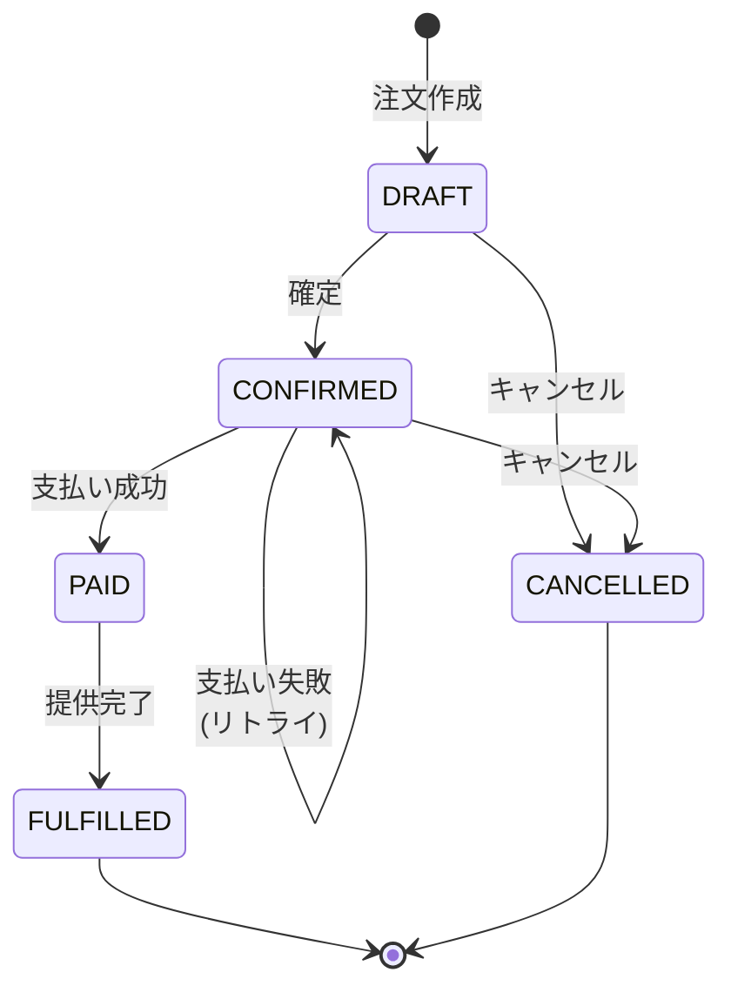

# 第03章：部：TypeScriptでDDDしやすい基礎体力（第21〜30章）🏋️‍♀️🧡


この章は「これから100章かけて育てる“物語の舞台”を固定する回」だよ〜！🌸
題材がブレないと、DDDの用語が全部ふわっとして迷子になるので…ここで**カフェ注文の世界観**をしっかり握ります🤝✨

---

## 1) この章のゴール🎯✨

* 「カフェ注文って、具体的にどんな流れ？」を**スラスラ説明できる**📣
* 重要な言葉（注文・明細・支払い・提供…）を**自分の言葉で定義できる**🗣️
* 「アプリでやりたいこと（ユースケース）」を**10個くらい挙げられる**📝
* **やらないこと（スコープ外）**も決めて、学習が爆発しないようにできる✂️💕

---

## 2) まずは1分ストーリー📖☕（世界観固定）


あなたはカフェに行きます☕
店員さんに「カフェラテとスコーンください！」って言う🍪
店員さんは注文を作って、合計を出して、お会計して、バリスタさんが作って、受け取って完了🎉

この「当たり前の流れ」の中に、**ルール**がいっぱい住んでるのがポイントだよ🏠🔒
（たとえば「支払い後は明細を変えちゃダメ」とか！）

---

## 3) 登場人物（アクター）を決めよう👤👥


DDDって、いきなりクラス設計に行きがちなんだけど…
まずは「誰が何をする？」を固定すると超ラク☺️✨

* **客（Customer）**：注文する・キャンセルしたい・受け取りたい🙋‍♀️
* **店員（Cashier）**：注文を作る・確定する・会計する🧾
* **バリスタ（Barista）**：提供（作って渡す）する☕👩‍🍳
* **支払い（Payment Service）**：支払いOK/NGを返す💳⚡（学習ではダミーでOK）

---

## 4) 基本フロー（いちばん普通にうまくいく道）✅☕✨

いわゆる“ハッピーパス”ってやつだよ🌈

1. 注文を作る（まだ仮）📝
2. 明細を追加する（商品×個数）➕
3. 合計が出る💴
4. 注文を確定する（ここから大事！）🔒
5. 支払う💳
6. 提供する（作って渡す）☕📦
7. 完了🎉

---

## 5) 「言葉のミニ辞書」作ろう📘🗣️✨（ユビキタス言語の前準備）

この章では“ざっくり定義”でOK🙆‍♀️
あとで章が進むほど、ここがピシッと締まっていくよ✨

* **注文（Order）**：客が買いたいもののまとまり🧾
* **明細（Line Item / Order Line）**：注文の中の1行（商品＋数量）📄
* **メニュー（Menu Item）**：売ってる商品（ラテ、スコーン…）📋
* **価格（Price）**：商品1つの値段💴
* **合計（Total）**：明細の合計金額🧮
* **支払い（Payment）**：支払い情報（成功/失敗も含む）💳
* **提供（Fulfillment）**：作って渡す行為☕📦
* **状態（Status）**：いま注文がどの段階か（下書き/確定/支払い済み…）🚦

ここで大事なのは、「注文＝DBのテーブル名」じゃなくて、
**現実の業務の言葉**をそのままコードに持ち込む感覚だよ🧠✨

---

## 6) ざっくり“イベント”を並べる⚡🗒️（「何が起きる？」）

DDDではあとで「ドメインイベント」も出てくるけど、ここでは軽く“出来事の候補”を並べるだけでOK🙆‍♀️

* 注文が作られた（OrderCreated）🆕
* 明細が追加された（ItemAdded）➕
* 注文が確定した（OrderConfirmed）🔒
* 支払いが成功した（PaymentCompleted）✅💳
* 支払いが失敗した（PaymentFailed）❌💳
* 注文が提供された（OrderFulfilled）☕🎁
* 注文がキャンセルされた（OrderCancelled）🛑

**コツ：動詞は過去形っぽく**すると「起きた事実」っぽくなるよ📌✨

---

## 7) 状態（ステート）の下書き🚦🧾


ここも後で磨くけど、「状態がある」ってだけで設計が一気に安定するよ🛡️✨

```text
[DRAFT] --確定--> [CONFIRMED] --支払い成功--> [PAID] --提供--> [FULFILLED]
   |                    |
   └--キャンセル--> [CANCELLED]     └--支払い失敗--> [CONFIRMED] (そのまま / 再試行)
```

* **DRAFT（下書き）**：明細をいじってOK📝
* **CONFIRMED（確定）**：基本は「内容固定」にしたくなる🔒
* **PAID（支払い済み）**：ここから先は戻したくない…！🧨（設計で守る）
* **FULFILLED（提供済み）**：完了🎉
* **CANCELLED（キャンセル）**：終わり🛑

この「いつ何ができる？」が曖昧だと、後で **if地獄** になるよ😂⚠️



---

## 8) ユースケース候補を10個出す📝✨（この章のメイン！）


「ユースケース」＝アプリが提供する“やりたいこと”だよ🎬
今回は学習用に、よくあるやつを10個並べるね👇

1. 注文を作成する（PlaceOrder / CreateOrder）🆕
2. 注文に商品を追加する（AddItem）➕
3. 注文から商品を削除する（RemoveItem）➖
4. 数量を変更する（ChangeQuantity）🔁
5. 注文内容を確認して確定する（ConfirmOrder）🔒
6. 支払いを行う（PayOrder）💳
7. 支払いを再試行する（RetryPayment）🔁💳
8. 注文をキャンセルする（CancelOrder）🛑
9. 注文の詳細を表示する（GetOrder）🔎
10. 注文を提供済みにする（FulfillOrder）☕📦

ポイントは「更新系（Add/Confirm/Pay…）」と「参照系（GetOrder）」が混ざってること。
これ、後の章でキレイに整理していくよ🧹✨

※ちなみに最近のTypeScriptでは、モジュール設定なども“安定オプション”が増えてきて、周辺事情がちょい変化してるよ〜（例：`--module node20` の安定オプションなど）([TypeScript][1])

---

## 9) 学習スコープを決めよう✂️🧡（やらないこと、大事！）

学習で一番つらいのは「全部やろうとして完成しない」😵‍💫
ここで割り切っちゃおう✨

### ✅ 今回（例題）でやること

* 注文＋明細＋状態（DRAFT→…）を扱う🧾🚦
* 支払いは「成功/失敗が返る」くらいでOK（ダミー）💳
* 提供までの流れを通す☕🎉

### ❌ 今回はやらない（スコープ外）

* 本物の決済API連携（Stripe等）🌍❌
* 在庫管理（売り切れ）📦❌
* 会員/ポイント/クーポン/複雑な割引🏷️❌
* レシートのPDF生成🧾🖨️❌

「完成体験が最優先」だよ〜！🎉✨

---

## 10) AIに“ユースケース10個”を出させる🤖🪄（おすすめプロンプト）

そのままコピペで使える形にしておくね💕

```text
あなたは業務アナリストです。
題材：カフェ注文アプリ（店頭注文）
登場人物：客、店員、バリスタ、支払いサービス
スコープ：在庫・会員・クーポンは除外。支払いは成功/失敗が返るだけでOK。

やってほしいこと：
ユースケース候補を10個、1行ずつで列挙してください。
各行に「(主語=誰が) / (何をする) / (結果どうなる)」を入れてください。
また、更新系と参照系が混ざらないように、最後に分類してください（Command / Query）。
```

### AIの出力を“採点”するコツ✅📝

* 「誰が？」が抜けてたら戻す🙅‍♀️
* “実装の話（DB設計とか）”が混ざったら止める🛑
* 状態が絡む操作（確定、支払い、キャンセル）が入ってるか見る🚦

---

## 11) ちょいだけ「型」で言葉を固定する例🧡（気分だけ）

この章では実装しないけど、
「状態ってこういう“言葉の集合”だよね」って固定するとDDDが気持ちよくなる✨

```ts
export type OrderStatus =
  | "DRAFT"
  | "CONFIRMED"
  | "PAID"
  | "FULFILLED"
  | "CANCELLED";
```

こういう“小さな固定”が積み重なると、あとで爆発的に効いてくるよ💥🛡️

---

## 12) 理解チェック✅🌸（これ言えたら勝ち！）

* 注文の基本フローを7ステップで説明できる？☕🧾
* 「注文」「明細」「提供」を自分の言葉で言える？🗣️
* 状態（DRAFT/CONFIRMED/PAID…）をざっくり説明できる？🚦
* ユースケースを10個言える？（最低でも5個は即答）📝✨
* 今回“やらないこと”を3つ言える？✂️❌

---

## おまけ：2026年っぽい最新小ネタ🔭✨

* TypeScriptは5.9系の情報が公式でまとまってて、`import defer` やモジュール周りの安定オプションが増えてるよ([Microsoft for Developers][2])
* Node.js は v24 が Active LTS、v25 が Current みたいにライフサイクルで整理されてる（最新状況は公式表がいちばん確実）([nodejs.org][3])
* テストは後半でやるけど、Vitest は4.0が出て、4.1 beta の話も出てきてるよ（後で選定するとき安心）([vitest.dev][4])
* TypeScript自体も「ネイティブ実装（TypeScript 7）」に向けて進捗が出てる（将来的にビルド体験が変わるかも）([Microsoft for Developers][5])

---

## 次章につながるよ〜🔁📖

次の章では「毎章の学び方の型」を固定して、
このカフェ例題を**毎回同じ手順で育てる**ようにしていくよ🌱✨

必要なら、この章の内容をベースに
「用語辞書（ミニ版）」を一緒に作って、章12のユビキタス言語にスムーズに繋げる形にもできるよ〜！🗣️📘💖

[1]: https://www.typescriptlang.org/docs/handbook/release-notes/typescript-5-9.html?utm_source=chatgpt.com "Documentation - TypeScript 5.9"
[2]: https://devblogs.microsoft.com/typescript/announcing-typescript-5-9/?utm_source=chatgpt.com "Announcing TypeScript 5.9"
[3]: https://nodejs.org/en/about/previous-releases?utm_source=chatgpt.com "Node.js Releases"
[4]: https://vitest.dev/blog/vitest-4?utm_source=chatgpt.com "Vitest 4.0 is out!"
[5]: https://devblogs.microsoft.com/typescript/progress-on-typescript-7-december-2025/?utm_source=chatgpt.com "Progress on TypeScript 7 - December 2025"
