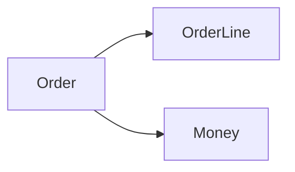
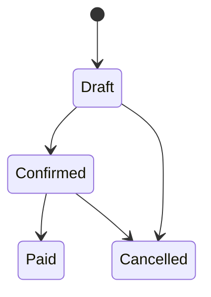

# 第04章：部：Value Object（第31〜40章）💎🧊


## この章のゴール 🎯

* 毎章の進め方を「固定手順」にして、迷子ゼロにする🧭✨
* **概念 → 図 → TypeScript → テスト → 振り返り**を“自動で回る習慣”にする🔁🧠
* AIは「答え役」じゃなくて、**壁打ち＆チェック役**として使えるようにする🤖🛟

---

## 1) なぜ「学び方の型」が必要なの？🤔🌸

DDDって、知識の量も多いし「分かってるつもり」になりやすいんだよね😵‍💫
だから最初に **“学び方の手順を固定”** しておくと、

* 毎回「何からやる？」で消耗しない😮‍💨
* 理解が「言葉→構造→コード→テスト」まで必ず到達する🧩🧪
* 章が進んでも品質（読みやすさ・壊れにくさ）が落ちない🛡️✨

になるよ〜！🎉

---

## 2) 1章を回す「基本ループ」🔁✨（この順番を固定！）

DDD学習は、**順番が命**です🫶

1. **概念（ことば）**：まず“何の話？”を3行で言えるようにする🗣️
2. **図（構造）**：関係や境界を「線で」見える化する🖊️
3. **TypeScript（最小実装）**：小さく差分を書いて、動く状態にする💻
4. **テスト（守り）**：壊れない証拠を残す🧪🔒
5. **振り返り（定着）**：理解チェック→次章の地ならし🌱

これ、1回覚えると後半が本当に楽になるよ〜🥹✨

---

## 3) 「章テンプレ」：毎回この成果物を残すよ📦✅

章ごとに残すものを決めちゃうと、学習が“作業化”して進む💨

### ✅ 章ごとの固定成果物（ミニマム版）

* 📝 **ノート**：`notes/chap-04.md`（この章で学んだ要点＆自分の言葉）
* 🖼️ **図**：`notes/chap-04-diagram.md`（文章でもOK、MermaidでもOK）
* 💻 **コード差分**：小さく1つ（例：VOを1個追加、メソッド1個追加）
* 🧪 **テスト**：最低1本（成功or失敗どっちか）
* ✅ **チェック質問の回答**：最後に3問だけ（定着用）
* 🧾 **コミット**：章ごとに1コミット（後で探しやすい）

---

## 4) ノートの「型」📓✨（コピペして使ってOK）

毎章これを埋めるだけで、理解が積み上がるよ〜🧠💕

```md
## 第XX章：タイトル

## 1) 3行まとめ（自分の言葉で）
- 
- 
- 

## 2) 今日のキーワード（ユビキタス言語候補）
- 用語：一言定義
- 用語：一言定義

## 3) 図（関係 / 状態 / 境界 どれか1つ）
- 図の説明（なぜこう分けた？）

## 4) 実装したこと（差分は小さく）
- 追加したクラス/関数：
- 変更したルール：

## 5) テスト（AAAで書いた？）
- 何を守るテスト？
- 成功/失敗どっち？

## 6) よく分からなかった所（次に潰す）
- 

## 7) 理解チェック（3問だけ）
1. 
2. 
3. 
```

> コツ：**3行まとめ**は「未来の自分へのメモ」だよ🫶（ここが一番効く✨）

---

## 5) 図は“最小”でOK！🖼️✨（豪華にしない）


初心者が詰まりやすいのが「図を綺麗に描こうとして止まる」やつ😵‍💫
図は、**1枚・1目的**で十分だよ！

### 図の種類（章に合わせて1つだけ選ぶ）🎯

* 🧩 **ドメイン図（関係）**：登場人物（Order, Payment…）と関連
* 🚦 **状態遷移図**：Draft→Confirmed→Paid…みたいな流れ
* 📦 **境界図**：domain/app/infra の責務の線引き

Mermaidを使うなら、こんな超ミニでOK👇



（「線が引けた＝頭の整理ができた」ってことだよ🫶）

---

## 6) TypeScript実装は「最小差分」主義でいこう✂️💻


DDD学習で大事なのは、毎回 **“小さく追加して、壊さず前に進む”** こと✨

### ✅ 1章1差分の目安

* 新しいクラス1つ（例：Money VO）
* 既存にメソッド1つ（例：order.confirm()）
* ルール（不変条件）1つ（例：支払い後は変更不可）

### ✅ “動く状態”の基準

* 型が通る（tscが落ちない）
* テストが通る
* 章の意図が説明できる（3行まとめが書ける）

ちなみに最近のTypeScriptでは `tsc --init` がかなり“スッキリ＆実用寄り”になっていて、`module: nodenext` や `target: esnext`、`strict: true` などが最初から入りやすい設計になってるよ🧡（設定の学習コストが下がってる！）([TypeScript][1])

---

## 7) テストは「最小で強く」🧪💎


DDD学習のテストは、**バグ探し**というより
「ルール（不変条件）を守ってる証拠」なのがポイント🔒✨

### ✅ テストの型（AAA）

* Arrange：準備
* Act：実行
* Assert：確認

テストツールは、いまは **Vitest** が導入しやすくて人気だよ🧁✨（Nodeの要件などは公式の“Requirements”に合わせればOK）([TypeScript][1])

---

## 8) AIの使いどころ 🤖🛟（丸投げ禁止だけど最強）

AI拡張（例：GitHub Copilot や OpenAI Codex）を使うときは、**「自分の案 → AIでチェック」** が鉄板だよ✅✨

### 🧠 AIに頼むと強いこと（この章の範囲）

* 🔎 **理解チェック質問**を作る（章末クイズ）
* 🧯 **抜けやすい異常系**を提案してもらう
* 🏷️ **命名案**を複数出してもらう（ユビキタス言語の候補）
* 🧩 図を説明する文章（「なぜこう分けた？」）を整えてもらう

### ✍️ 使えるプロンプト（コピペOK）

```txt
あなたはDDDの家庭教師です。
題材は「カフェ注文」。
いま第XX章で学んだ概念は「（ここに概念）」です。

1) 初心者が誤解しやすい点を3つ
2) 理解チェック質問を5つ（答えも）
3) 例外ケース（失敗パターン）を5つ
4) 命名の候補を5つ（日本語→英語も）
```

> 重要：AIの出力は、**そのまま採用じゃなくて“候補”**として使うと伸びるよ🫶✨

---

## 9) 章の「Done条件」✅🎉（ここまで行ったら勝ち）

この章を終えたら、次から毎章これでOK！

* ✅ 「概念→図→TS→テスト→振り返り」が手順として言える
* ✅ ノートテンプレで1章分を埋められる
* ✅ 図を“最小”で描いて説明できる
* ✅ テストを最低1本つける習慣ができた
* ✅ AIに「チェック質問」を作らせて、自分で答えられる

---

## 10) ミニ演習：第3章（カフェ注文）をこの型で回してみよ☕🧾✨

時間は20分くらいでOK〜！🕒💕

### ① 3行まとめ（例）

* 注文には「状態」がある（下書き→確定→支払い…）
* ルールは状態で変わる（支払い後は変更できない等）
* だから状態遷移を整理すると設計が安定する

### ② 図（状態遷移を1枚）



### ③ 理解チェック（3問）

1. 状態遷移図を描くと何が嬉しい？
2. 「支払い後は変更不可」はどこで守るのがDDDっぽい？
3. 例外ケースを先に出すと何が減る？

---

## 11) よくあるつまずきポイント 😂⚠️（先に潰す）

* 😵‍💫 **図を作り込みすぎる** → 「1目的1枚」だけでOK！
* 🧠 **AIに全部書かせる** → 先に自分の案を1つ出してから！
* 🧪 **テストが重い** → 1本でいい、ルール1個守れば勝ち！
* 📦 **差分がでかい** → “1章1差分”に戻す✂️✨

---

## 12) 次章（環境づくり）へ向けた宿題🪟🧰✨

* ノートテンプレのファイルを `notes/` に作る📁
* 章コミットのルールを決める（例：`ch04: add learning template`）🧾
* 「理解チェック質問」をAIに5つ作らせて、自分で答える🤖✅

---

### おまけ：ツール更新の気持ちの持ち方🧡

TypeScriptは基本 **だいたい3か月周期でリリース**される想定だから（多少ズレるよ）、「3か月に1回だけ更新デー」を作ると、学習も開発もラクになるよ📅✨([GitHub][2])
（安定版が何か迷ったら、公式リリース一覧を見るのが一番確実！）([GitHub][3])

---

次は第5章で、VS Code周りを「迷わない最小セット」に整えて、**“保存したら整う＆テスト回る”**状態を作っていこうね🪄✨

[1]: https://www.typescriptlang.org/docs/handbook/release-notes/typescript-5-9.html "TypeScript: Documentation - TypeScript 5.9"
[2]: https://github.com/microsoft/TypeScript/wiki/TypeScript%27s-Release-Process "TypeScript's Release Process · microsoft/TypeScript Wiki · GitHub"
[3]: https://github.com/microsoft/typescript/releases "Releases · microsoft/TypeScript · GitHub"
