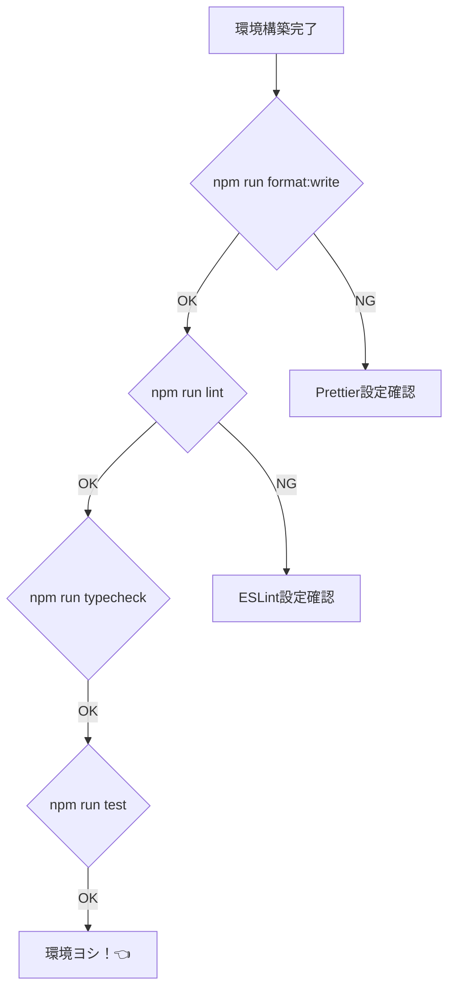

# 第05章：部：Entity（第41〜50章）🪪🧍


* 保存したら自動で整形される（見た目が揃う）🪄
* 変なコードはすぐ赤線で気づける（Lint）🚨
* テストがワンコマンドで回る（安心）🧪
* “設定で迷子”にならない（学習が進む）🧭

---

## 0) 最小セット（最新版の前提）📦✨

この章では、いまの主流＆安定ルートで組むよ💡

* Node.js：本番向けは **LTS（偶数メジャー）** が推奨だよ✅（例：24系がLTS入り） ([Node.js][1])
* TypeScript：npmの最新は **5.9.3**（2026時点の安定版として参照） ([npm][2])
* ESLint：新しい標準は **flat config（eslint.config.*）** ✨ ([TypeScript ESLint][3])
* テスト：Vitest（公式でVS Code拡張もある）🧪 ([Vitest][4])

---

## 1) Node.js（LTS）だけ入れる🟢


まずは Node がないと何も始まらない😂
ポイントは **LTS** にすること！（奇数メジャーは短命になりがち） ([Node.js][1])

PowerShellで確認👇

```powershell
node -v
npm -v
```

> v24.x みたいな “偶数” が出てたら、まずOK👌
> （Node 24はLTSへ移行した、って公式リリースでも明言されてるよ） ([Node.js][5])

---

## 2) プロジェクトを作る📁✨

作業用フォルダを作って、そこを開くよ〜🪄

```powershell
mkdir ddd-cafe
cd ddd-cafe
code .
```

---

## 3) パッケージ初期化＆必要ツールを入れる📦🧰


まずは npm で最小構成にするね（あとでpnpm派に移ってもOK👌）

```powershell
npm init -y
```

次に、学習に必要な「型チェック・Lint・整形・テスト」を入れるよ✨
（typescript-eslint 公式の推奨セットに合わせてるよ） ([TypeScript ESLint][3])

```powershell
npm install --save-dev eslint @eslint/js typescript typescript-eslint prettier vitest tsx
```

* `tsx` は TypeScript をサクッと実行したい時に便利（後でデモ動作に使うよ） ([Visual Studio Marketplace][6])

---

## 4) TypeScript設定（tsconfig）を置く🧡


ルートに `tsconfig.json` を作ってね📄✨

```json
{
  "compilerOptions": {
    "target": "ES2022",
    "module": "NodeNext",
    "moduleResolution": "NodeNext",

    "strict": true,
    "noUncheckedIndexedAccess": true,

    "esModuleInterop": true,
    "skipLibCheck": true,

    "outDir": "dist"
  },
  "include": ["src", "test"]
}
```

* `strict: true` はDDDと相性よすぎ💘（ルールを型で守れる！）
* `noUncheckedIndexedAccess` は “配列/Mapの取り出し事故” を減らすよ🧯

---

## 5) ESLint（赤線先生）を“公式の形”で入れる🚨✨


ルートに `eslint.config.mjs` を作るよ〜📄
この形は typescript-eslint 公式のQuickstartそのまま✨ ([TypeScript ESLint][3])

```js
// @ts-check
import eslint from "@eslint/js";
import { defineConfig } from "eslint/config";
import tseslint from "typescript-eslint";

export default defineConfig(
  eslint.configs.recommended,
  tseslint.configs.recommended
);
```

✅ これで「明らかなミス」と「TypeScriptっぽい事故」を早めに見つけられる！

もうちょい厳しめにしたい人は、あとでこれを足すだけでOK（任意）👇 ([TypeScript ESLint][3])

* `tseslint.configs.strict`
* `tseslint.configs.stylistic`

（ただし `stylistic` は Prettier と役割かぶりやすいから、最初は無しがラクだよ〜🧸）

---

## 6) Prettier（見た目統一）を入れる🪄💅

Prettierは「コードの見た目」を全部同じにしてくれる天才✨
ルートに `prettier.config.cjs` を作るよ📄

```js
/** @type {import("prettier").Config} */
module.exports = {
  semi: true,
  singleQuote: false,
  trailingComma: "all",
  printWidth: 100
};
```

---

## 7) VS Codeを“保存したら整う”状態にする🧰✨


ここがこの章の核心だよ〜！！💥

## 7-1) 入れる拡張（最小）🧩

VS Codeの拡張は、まずこれだけでOK✅

* ESLint（拡張ID: `dbaeumer.vscode-eslint`） ([Visual Studio Marketplace][7])
* Prettier（拡張ID: `esbenp.prettier-vscode`） ([ESLint][8])
* Vitest（公式の拡張ID: `vitest.explorer`） ([Vitest][4])

> ⚠️ Vitest拡張は「似た名前の別物（deprecated）」もあるから、**公式の `vitest.explorer`** を選ぶのが安全だよ〜！ ([Visual Studio Marketplace][9])

拡張の探し方/入れ方はVS Code公式の説明もあるよ🧭 ([Visual Studio Code][10])

## 7-2) ワークスペース設定（プロジェクトに固定）📌

プロジェクト直下に `.vscode/settings.json` を作るよ📄✨

```json
{
  "editor.formatOnSave": true,
  "editor.defaultFormatter": "esbenp.prettier-vscode",

  "editor.codeActionsOnSave": {
    "source.fixAll.eslint": true
  },

  "eslint.validate": ["javascript", "typescript"]
}
```

* Format on Save は VS Code の基本機能として説明されてるよ🪄 ([Visual Studio Code][11])
* `source.fixAll.eslint` を使う流れは、VS Code側でも案内されてる（古い設定がdeprecatedになった流れ） ([GitHub][12])

---

## 8) Vitest（テスト）を最短で動かす🧪✨

`src` と `test` フォルダを作るよ📁

```powershell
mkdir src
mkdir test
```

## 8-1) まず動くサンプルを置く🧸

`src/sum.ts`

```ts
export function sum(a: number, b: number): number {
  return a + b;
}
```

`test/sum.test.ts`

```ts
import { describe, it, expect } from "vitest";
import { sum } from "../src/sum";

describe("sum", () => {
  it("adds numbers", () => {
    expect(sum(1, 2)).toBe(3);
  });
});
```

Vitestは公式ガイドで導入手順がまとまってるよ📘 ([Vitest][4])

---

## 9) package.json にコマンドを揃える🏃‍♀️💨

`package.json` の `"scripts"` をこうするのがおすすめ✨

```json
{
  "scripts": {
    "dev": "tsx watch src/sum.ts",
    "typecheck": "tsc -p tsconfig.json --noEmit",
    "lint": "eslint .",
    "format": "prettier . --check",
    "format:write": "prettier . --write",
    "test": "vitest run",
    "test:watch": "vitest"
  }
}
```

---

## 10) 動作チェック（これが通れば勝ち🎉）


```powershell
npm run format:write
npm run lint
npm run typecheck
npm run test
```

全部通ったら、もう「保存したら整う」＋「壊れてたら即わかる」状態できてるよ〜🎊🎊🎊



---

## 11) AIの使いどころ（この章だと超使える🤖✨）

AIは “全部作らせる” より、**差分レビュー係** にすると最強だよ💪💕

おすすめプロンプト例👇

* 「この `eslint.config.mjs` を、学習用に“厳しすぎず/優しすぎず”にしたい。追加すべき設定だけ提案して。理由も短く」
* 「`.vscode/settings.json` で、保存時に Prettier と ESLint の競合が起きない形に直して」
* 「この scripts 構成で、Windowsでハマりやすい点をチェックして」

✅ で、AIの提案は **そのまま採用しないで**
「何が増えた？なぜ必要？」を1回だけ確認するのがコツだよ🧠🔍

---

## よくある詰まりポイント集😵‍💫🧯

* **保存しても整形されない**
  → Prettierが「既定フォーマッタ」になってるか確認！ ([Visual Studio Code][11])
* **ESLintが保存時に走らない**
  → `.vscode/settings.json` の `editor.codeActionsOnSave` を確認（古い設定はdeprecated） ([GitHub][12])
* **Vitest拡張入れたのに動きが変**
  → deprecatedの方を入れてないかチェック（公式は `vitest.explorer`） ([Visual Studio Marketplace][9])

---

## この章の卒業チェック✅🎓✨

* [ ] 保存したらコードが勝手に整う🪄
* [ ] 変なコードに赤線が出る🚨
* [ ] `npm run test` が通る🧪
* [ ] `npm run lint` が通る🧹
* [ ] “環境が原因の迷子” がほぼ起きない🧭✨

---

次の章（第6章）は「TypeScriptの設計で大事な所」だよ🧡
ここまで整ってたら、型と不変性の話がめっちゃ気持ちよく入ってくるはず〜🥰✨

[1]: https://nodejs.org/en/about/previous-releases?utm_source=chatgpt.com "Node.js Releases"
[2]: https://www.npmjs.com/package/typescript?utm_source=chatgpt.com "typescript"
[3]: https://typescript-eslint.io/getting-started/ "Getting Started | typescript-eslint"
[4]: https://vitest.dev/guide/?utm_source=chatgpt.com "Getting Started | Guide"
[5]: https://nodejs.org/en/blog/release/v24.11.0?utm_source=chatgpt.com "Node.js 24.11.0 (LTS)"
[6]: https://marketplace.visualstudio.com/items?itemName=esbenp.prettier-vscode&utm_source=chatgpt.com "Prettier - Code formatter"
[7]: https://marketplace.visualstudio.com/items?itemName=dbaeumer.vscode-eslint&utm_source=chatgpt.com "VS Code ESLint extension"
[8]: https://eslint.org/docs/latest/use/configure/configuration-files?utm_source=chatgpt.com "Configuration Files - ESLint - Pluggable JavaScript Linter"
[9]: https://marketplace.visualstudio.com/items?itemName=ZixuanChen.vitest-explorer&utm_source=chatgpt.com "Vitest (DEPRECATED)"
[10]: https://code.visualstudio.com/docs/configure/extensions/extension-marketplace?utm_source=chatgpt.com "Extension Marketplace"
[11]: https://code.visualstudio.com/docs/editing/codebasics?utm_source=chatgpt.com "Basic editing"
[12]: https://github.com/microsoft/vscode/issues/87227?utm_source=chatgpt.com "The setting is deprecated. Use editor.codeActionsOnSave ..."
