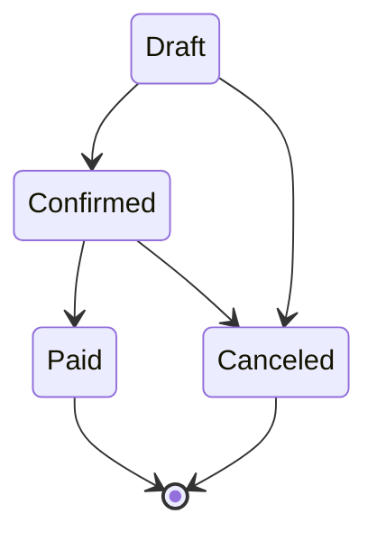

# 第06章：部：Aggregate（第51〜60章）🏯🛡️


DDD（戦術DDD）って「ドメインのルールを守る」ための設計なんだけど、TypeScriptはそのルールを **型で先に止められる** のがめっちゃ強いの🥹🛡️
つまり…

* 型で「ありえない状態」を作れなくする🚫
* `readonly`で「勝手に書き換え」を減らす🧊
* union（合併型）で「状態の分岐」を安全にする🚦
* 型ガードで「今この状態ならOK」をコードにする🔎
* `satisfies`で「設定やマップのタイポ」を即死させる💥

これを今日、カフェ注文☕🧾のミニ例で体に入れるよ〜！

---

## 1. “型が弱い世界”で起きる事故を先に見る😵‍💫💣

たとえば、こんな「文字列と数値だらけ」だと…事故りやすい😭

```ts
// ありがちな“なんでもプリミティブ”💥
type Order = {
  id: string;
  status: string;           // ← 何でも入っちゃう
  total: number;            // ← 通貨/丸め/負数とか無法地帯
  items: { menuId: string; qty: number; price: number }[]; // ← 配列も外から弄れる
};

const order: Order = {
  id: "o-1",
  status: "PAIDDD", // typoでも通る😇
  total: -100,      // えっ…マイナス…？
  items: [],
};

order.items.push({ menuId: "coffee", qty: 0, price: 500 }); // qty 0…？😇
```

**DDD的に痛いポイント**😢

* 「ステータスのタイポ」がコンパイルで止まらない
* 「負の金額」や「0個注文」が入り放題
* `items`が外部から勝手に書き換えられて、不変条件が守れない

ここから「型＝ルール」にしていくよ！🧡

---

## 2. まずは union で“状態”を固定する🚦✨（超効果あり）


`status: string` を卒業して、**許可した状態だけ**にする！

```ts
type OrderStatus = "Draft" | "Confirmed" | "Paid" | "Canceled";

type Order = {
  id: string;
  status: OrderStatus;
};

const ok: Order = { id: "o-1", status: "Paid" };     // ✅
const ng: Order = { id: "o-2", status: "PAIDDD" };   // ❌ コンパイルで止まる🎉
```

これだけで「ありえない値」が激減するよ🥹🛡️
（DDDの“状態遷移”にそのままつながるやつ！）

---

## 3. “分岐し忘れ”を `never` で潰す🧨（DDDと相性よすぎ）


状態で処理が変わるとき、`switch` の書き忘れって地味に事故るよね…😵‍💫
そこで **網羅チェック（exhaustive check）** ✨

```ts
function assertNever(x: never): never {
  throw new Error("Unexpected value: " + x);
}

function canEditItems(status: OrderStatus): boolean {
  switch (status) {
    case "Draft":
      return true;
    case "Confirmed":
      return true;
    case "Paid":
      return false;
    case "Canceled":
      return false;
    default:
      return assertNever(status); // ← ここが守ってくれる🛡️
  }
}
```

もし将来 `OrderStatus` に `"Refunded"` を追加したら、**ここでコンパイルエラー**になって
「分岐足りないよ！」って教えてくれる🥳✨

---

## 4. `readonly` は「勝手に書き換え禁止の空気」を作る🧊🫧


DDDで大事なのは **不変条件（絶対守るルール）** 🔒
その敵は「外から配列が弄れること」だったりする…！

## 4-1. まずは“外から見える不変”にする（初心者に超おすすめ）🌱

外に `items` の配列そのものを渡さない・返さない！🙅‍♀️

```ts
type OrderLine = Readonly<{
  menuId: string;
  qty: number;
  price: number;
}>;

class OrderEntity {
  private readonly _items: OrderLine[] = [];
  private _status: OrderStatus = "Draft";

  get status(): OrderStatus {
    return this._status;
  }

  get items(): readonly OrderLine[] {
    return this._items; // readonlyで外からpushできない🧊
  }

  addItem(line: OrderLine) {
    if (this._status !== "Draft") {
      throw new Error("Draftのときだけ明細を追加できるよ🥲");
    }
    if (line.qty <= 0) {
      throw new Error("数量は1以上だよ🥲");
    }
    this._items.push(line); // 内部だけが変更できる✅
  }
}
```

ポイント🧡

* 外側は `readonly` で触れない
* 内側は「ルールを守るメソッド」だけで変更できる
  → これがDDDの“守る設計”の入口だよ🏯🛡️

---

## 5. union + 型ガードで「今この状態ならOK」をコードにする🔎✨


「支払い済みなら編集禁止」みたいな条件、コードで安全に書きたいよね？🥹

## 5-1. 型ガード（type guard）を作る

```ts
type PaidOrder = { status: "Paid"; paidAt: Date };
type DraftOrder = { status: "Draft" };
type AnyOrder = PaidOrder | DraftOrder;

function isPaid(order: AnyOrder): order is PaidOrder {
  return order.status === "Paid";
}

function showReceipt(order: AnyOrder) {
  if (isPaid(order)) {
    // ここでは order は PaidOrder として扱える🎉
    console.log(order.paidAt.toISOString());
  } else {
    console.log("まだ支払い前だよ〜☕");
  }
}
```

この「状態の分岐が型で安全になる」感じ、戦術DDDの**状態遷移**と相性よすぎる🥰🚦

---

## 6. `satisfies` は「マップ/設定のタイポ検知」に最強💥🗺️


DDDでよくあるのが「状態→許可される操作」みたいな表を作るやつ。
ここでタイポると悲惨…😇

`satisfies` は **“型に合ってるか検査しつつ、推論はそのまま”** をやってくれる便利機能だよ✨ ([typescriptlang.org][1])

```ts
type OrderStatus = "Draft" | "Confirmed" | "Paid" | "Canceled";

const allowedTransitions = {
  Draft: ["Confirmed", "Canceled"],
  Confirmed: ["Paid", "Canceled"],
  Paid: [],
  Canceled: [],
} satisfies Record<OrderStatus, readonly OrderStatus[]>;

// もし "Canceld" とか書いたら、ここで即エラー！🎉

```




**DDD的な嬉しさ**🧡

* 「仕様表」をコードに持ち込める
* 表のミスがコンパイルで止まる
* 後から状態追加しても、抜け漏れが見つかる

---

## 7. tsconfig で “ルールが漏れにくい” 空気を作る🧪🧱

ここ、地味だけど効くよ〜！🥹✨
とくにDDDは「境界条件」「未定義」「オプショナル」が事故ポイントなので、厳しめ設定が味方。

* `strict`: まとめて型チェック強化💪 ([typescriptlang.org][2])
* `exactOptionalPropertyTypes`: `?` の扱いを厳密に（「ある/ない」を曖昧にしない） ([Microsoft for Developers][3])
* `noUncheckedIndexedAccess`: `map[key]` が `undefined` かも、を強制して事故減らす ([Microsoft for Developers][3])

例（必要なとこだけ抜粋）👇

```ts
// tsconfig.json（抜粋イメージ）
{
  "compilerOptions": {
    "strict": true,
    "exactOptionalPropertyTypes": true,
    "noUncheckedIndexedAccess": true
  }
}
```

---

## 8. 2026のTypeScriptまわり最新メモ（超短く）🗞️✨

今のTypeScriptの最新動向としては、TypeScript 5.9 が公開され、Node.js v20 を意識した `node20` などの安定オプションが入ってるよ〜。 ([Microsoft for Developers][3])
そして TypeScript 6.0 は「次のネイティブ版（7.0）へ向けた橋渡し」として位置づけられてるよ。 ([Microsoft for Developers][4])

※この章の本題は「型・不変性・union」なので、まずはそこをしっかり使えればOK！🧡

---

## 9. ミニ演習（手を動かすと一気に入る）🧁✍️

## 演習A：status を string → union にして事故を止める🚦

1. `status: string` を `OrderStatus` にする
2. `switch` に `assertNever` を入れる
3. `"Refunded"` を追加して「どこが壊れるか」見る👀

## 演習B：`satisfies` で仕様表を安全にする🗺️

1. `allowedTransitions` を作る
2. わざとキーを `"Canceld"` にして、エラーになるのを確認😂
3. 状態を追加して「表の更新漏れ」が見つかるのを確認✅

## 演習C：`noUncheckedIndexedAccess` で「存在しないキー」を潰す🔑

`prices[menuId]` が `undefined` かも…を必ず扱うようにしてみてね🧯

---

## 10. AI（Copilot/Codex）に頼むと捗る“良いお願い”テンプレ🤖✨

そのままコピペでOKだよ〜🧡

* 「このドメインの状態一覧から、`OrderStatus` の union を作って。候補も提案して！🚦」
* 「状態追加に強い `switch`（`never` で網羅チェック）を書いて！🛡️」
* 「この“状態遷移表”を `satisfies` を使って型安全にして！🗺️」
* 「外から配列を弄れない `readonly` 設計にリファクタして！ただしルールはメソッド内に閉じ込めてね🔒」

コツ：AIに“完成コード全部”を頼むより、**型・骨格・チェック観点**を出してもらうと学習が深くなるよ🧠✨

---

## 11. 今日のゴール確認（チェックリスト）✅💖

* [ ] `status: string` を union にできた🚦
* [ ] `switch` に `never` を入れて「分岐漏れ」を止められた🛡️
* [ ] `readonly` で「外から勝手に変えられない」形にできた🧊
* [ ] 型ガードで「この状態ならOK」を書けた🔎
* [ ] `satisfies` で「仕様表のタイポ」を潰せた💥

---

次の章（第7章）で、domain/app/infra/test の骨組みを作るときに、今日の「型＝ルール」感覚がそのまま効いてくるよ〜📦✨
続けていこっ☕🧡

[1]: https://www.typescriptlang.org/docs/handbook/release-notes/typescript-4-9.html?utm_source=chatgpt.com "Documentation - TypeScript 4.9"
[2]: https://www.typescriptlang.org/tsconfig/?utm_source=chatgpt.com "TSConfig Reference - Docs on every TSConfig option"
[3]: https://devblogs.microsoft.com/typescript/announcing-typescript-5-9/?utm_source=chatgpt.com "Announcing TypeScript 5.9"
[4]: https://devblogs.microsoft.com/typescript/progress-on-typescript-7-december-2025/?utm_source=chatgpt.com "Progress on TypeScript 7 - December 2025"
